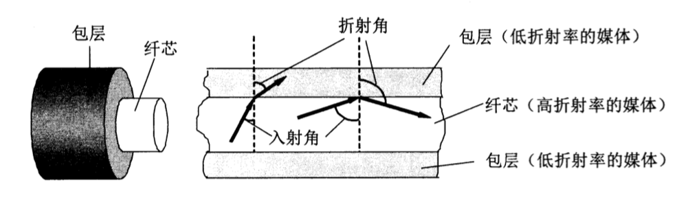

### 物理层

物理层考虑的是怎样才能在连接各种计算机的传输媒体上传输数据比特流，而不是指具体的传输媒体。物理层的作用主要是尽可能的屏蔽掉传输媒体和硬件设备之间的差异，使物理层上面的数据链路层感觉不到这些差异，这样就可以使数据链路层只需要考虑如何完成本层的协议和服务，而不必考虑网络具体的传输媒体和通信手段。

物理层的主要任务描述为确定与传输媒体的接口有关的一些特性：

* 机械特性：指明接口所用接线器的形状和尺寸、引脚数目和排列、固定和锁定和锁定装置等。平常常见的各种规格的接插件都有严格的标准化的规定。
* 电气特性：指明在接口电缆的各条线上出现的电压范围。
* 功能特性：指明某条线上出现的某一电平的电压的意义。
* 过程特性：指明对于不同功能的各种可能事件的出现顺序。

#### 基本术语

一个数据通信系统可划分为三大部分，即源系统(发送端)、传输系统(传输网络)和目的系统(接收端)。

**源系统**一般包括以下两个部分：

* 源点(信源)：源点设备产生要传输的数据。例如，从计算机的键盘输入汉字、计算机产生产生输出的数字比特流。
* 发送器：通常源点生成的数字比特流要通过发送器编码后才能够在传输系统中传输。典型的发送器就是**调制器**。现在很多计算机使用内置的调制解调器(包含调制器和解调器)。

**目的系统**一般也包括以下两个部分：

* 接收器：接收传输系统传送过来的信号，并把它转换成为能够被目的的设备处理的信息。典型的接收器就是**解调器**，它把传输线上的信号进行调解，还原成发送端产生的数字比特流。
* 终点：终点设备接收从接收器传送来的数字比特流，然后把信息输出(例如，把汉字在计算机屏幕显示出来)。

#### 常用术语

* 数据：运送消息的实体(消息指话音、文字、图像、视频等)。
* 信号：指数据的电气或者电磁的表现。

根据信号中代表消息的参数的取值不同，信号可分为以下两大类：

* 模拟信息(连续信号)：代表消息的参数的取值是连续的。
* 数字信号(离散信号)：代表消息的参数的取值是离散的。

信道，信道与电路并不相等，信道一般都是用来表示某一个方向传送信息的媒体。因此一条通信电路往往包含一条发送信道和一条接收信道。

* 单向通信(单工通信)：即只能有一个方向的通信而没有反方向的交互。无线电广播或有线电广播就属于这种类型。
* 双向交替通信(半双工通信)：通信的双方都可以发送信息，但不能双方同时发送。
* 双向同时通信(全双工通信)：即通信的双方可以同时发送和接收信息。
* 基带信号：来自信源的信息通常被称为基带信号。像计算机输出的代表各种文字或者图像文件的数据信号都属于基带信号。
* 调制：基带信号通常往往包含较多的低频成分，甚至有直流成分，而许多信道并不能传输这种低频分量或直流分量。为了解决这一问题，就必须对基带信号进行调制。

调制分为两大类：

* 基带调制：仅仅对基带信号的波形进行变换，使它能够与信道特性相适应。变形后的信号仍然是基带信号。由于这种调制是把数字信号转换为另一种形式的数字信号，因此也把这种过程称为**编码**。

* 带通调制：这一类调制需要使用载波进行调制，把基带信号的频率范围搬移到较高的频段，并转换为模拟信号，这样就能够更好地在模拟信道中传输。经过载波调制后的信号称为带通信号，而使用载波的调制称为带通调制。

常见编码方式：

- 不归零制：正电代表1，负电代表0。
- 归零制：正脉冲代表1，负脉冲代表0。
- 曼彻斯特编码：每个字节位周期中心的向上跳变代表0，位周期中心的向下跳变代表1。
- 差分曼彻斯特编码：在每一位的中心处始终都有跳变。位开始边界有跳变代表0，而位开始边界没有跳变代表1。

基本带通调制方法：

* 调幅(AM)：即载波的振幅随基带数字信号而变化。例如，0或者1分别对应于无载波或有载波输出。
* 调频(FM)：即载波的频率随基带数字信号而变化。
* 调相(PM)：即载波的初始相位随基带数字信号而变化。

#### 传输媒体

传输媒体也称为传输介质或传输媒介，它就是数据传输系统中在发送器和接收器之间的物理通路。传输媒体可以分为两大类，即**导引型传输媒体**和**非导引型传输媒体**。在导引型传输媒体中，电磁波被导引沿着固体媒体(铜线或光纤)传播，而非导引型传输媒体中电磁波的传输常称为无线传输。

##### 导引型传输媒体 

1. 双绞线

双绞线又称为双扭线。把两根互相绝缘的铜导线并排放在一起，然后用规则的方法**绞合**起来就构成了双绞线。绞合可以减少对相邻导线的电磁干扰。双绞线通信距离一般为 几到十几公里，距离太长要放大器以便将衰减的信号放大到适合的数值。主要用于电话系统。

2. 同轴电缆

同轴电缆由导体铜质芯线（单股实心线或多股绞合线）、结缘层、网状编织的外导体屏蔽层以及保护塑料外层所组成。由于外导体屏蔽层的作用，同轴电缆具有很好的抗干扰特性，被广泛用于传输较高速率的数据。目前同轴电缆主要用在有线电视网的居民小区，同轴电缆的带宽取决于电缆的质量，目前高质量的同轴电缆的带宽已接近1GHz。

3. 光缆

光纤通信就是利用光导纤维传递光脉冲来进行通信。有光脉冲相当于1，没有光脉冲相当于0。

光纤是光纤通信的传输媒体。在发送端有光源，可以采用发光二极管或半导体激光器，它们在电脉冲的作用下能产出光脉冲，在接收端利用光电二极管做成光检测器，在检测到光脉冲时可以还原出电脉冲。

光纤通常由非常透明的石英玻璃拉成细丝，主要由纤芯和包层构成双层通信圆柱体。光波通过纤芯进行传导的，包层较纤芯有较低的折射率。当光线从高折射率的媒体射向低折射率的媒体时，其折射角将大于入射角，因此如果入射角足够大，就会出现全反射，即光线碰到包层时就会折射回纤芯。这个过程不断重复，光也就沿着光纤传输下去。

4. 非导引型传输媒体

利用无线电波在自由空间可以较快的实现多种通信，这种方式不使用导引型传输媒体，因此就将空间称为“非导引型传输媒体”。