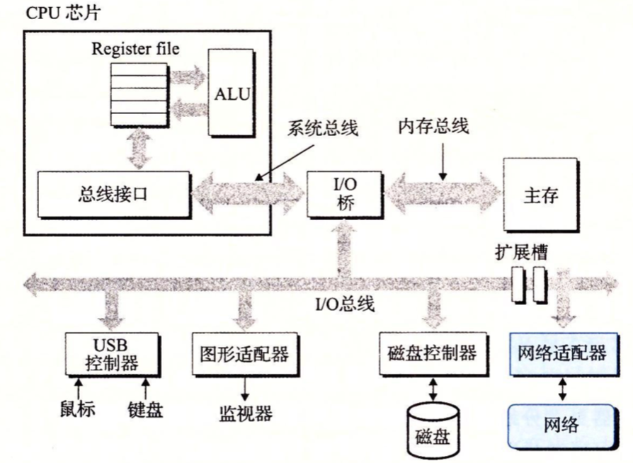

网络可以看作是一种I/O设备，通过I/O总线扩展槽上的网络适配器(网卡)，将网上接收到的数据通过I/O总线和内存总线复制到内存中。相似的，数据也能从内存复制到网络(通常通过DMA传送)。



#### 阻塞模式

很长一段时间内，大多数网络通信模式都是阻塞模式，即：

* 客户端向服务端发出请求后，客户端会一直处于等待状态，直到服务端返回结果或者网络出现问题。
* 服务端同样如此，当某个客户端A发来的请求时，另一个客户端B发来的请求会等待，直到服务端的线程处理完成上一个请求。

　Java对阻塞模式的支持就是Socket，它是TCP/UDP等传输层在高级编程语言中的具体体现。如下例子，20个客户端同时发送请求给服务端，服务端只能一个一个请求：

  客户端：

```java
public class SocketClientDaemon {
	
	public static void main(String[] args)throws Exception {
		Integer clientNumer = 20;
        //栅栏，同时开启20个线程
		CountDownLatch countDownLatch = new CountDownLatch(clientNumer);
		for(int index = 0; index < clientNumer; index ++,countDownLatch.countDown()){
			SocketClientRequestThread client = new SocketClientRequestThread(countDownLatch, index);
			new Thread(client).start();	
		}	
	}	
}

public class SocketClientRequestThread implements Runnable{
	private CountDownLatch countDownLatch;
	//线程编号
	private Integer clientIndex;
	public SocketClientRequestThread(CountDownLatch countDownLatch,Integer clientIndex) {
		this.countDownLatch = countDownLatch;
		this.clientIndex = clientIndex;
	}
	
	@Override
	public void run() {
		Socket socket = null;
		OutputStream clientRequest = null;
		InputStream clientResponse = null;
		try{
			socket = new Socket("localhost",83);
			clientRequest = socket.getOutputStream();
			clientResponse = socket.getInputStream();
			this.countDownLatch.await();
			clientRequest.write(("这是第"+this.clientIndex+"个客户端的请求").getBytes());
			clientRequest.flush();
			int maxLen = 1024;
			byte[] contextBytes = new byte[maxLen];
			int realLen;
			String message = "";
			while((realLen = clientResponse.read(contextBytes,0,maxLen)) != -1){
				message += new String(contextBytes,0,realLen,"utf-8");
				System.out.println(("这是第"+this.clientIndex+"个客户端收到的请求响应:"+message));
			}
		}catch(Exception e){
			
		}finally {
			
		}
		
	}

}
```

服务端：

```java
public class SocketServer2 {

	public static void main(String[] args)throws Exception{
		
		@SuppressWarnings("resource")
		ServerSocket serverSocket = new ServerSocket(83);
		
		try{
			InputStream in = null;
			OutputStream out = null;
			
			while(true){
				Socket socket = serverSocket.accept();
                //睡眠3秒，便于观察
				Thread.sleep(3000);
				//SocketServerThread serverThread = new SocketServerThread(socket);
				//new Thread(serverThread).start();
				
				in = socket.getInputStream();
				out = socket.getOutputStream();
				Integer sourcePort = socket.getPort();
				int maxLen = 1024;
				byte[] contextBytes = new byte[maxLen];
				Thread.sleep(3000);
				int realLen = in.read(contextBytes,0,maxLen);
				
				String message = new String(contextBytes,0,realLen);
				System.out.println("服务端收到来自端口"+sourcePort+"的信息："+message);
				out.write("回发响应信息".getBytes("utf-8"));
			}
			
		}catch(Exception e){
			
		}finally {
			
		}	
	}
}
```

执行代码后，我们可以从打印结果看出，服务端只能一次接收一个客户端的请求，并且只有处理完请求后，才会继续接收其他客户端的请求。同样客户端也会一直在等待服务的响应。

#### Socket为什么会阻塞


