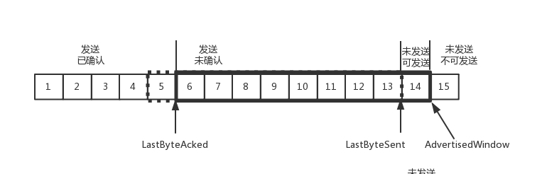
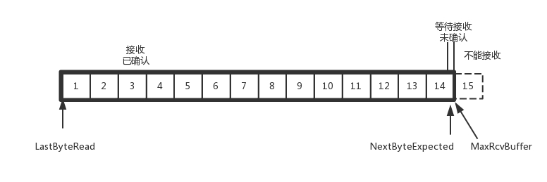

### 网络模型

OSI就是我们常说的7层网络协议，它把网络分成了7层，每层都有自己的功能，并且逐层叠加。

| 数据单元        | 分层              | 介绍                                                         |
| --------------- | ----------------- | ------------------------------------------------------------ |
| 数据层(Data)    | 第7层：应用层     | 为上层应用，提供为应用软件而设的接口口，以设置与另一应用软件之间的通信。例如：HTTP、电子邮件、远程登录、文件传输等协议。 |
| 数据层(Data)    | 第6层：表示层     | 表示层的作用就是对数据格式进行编译，对收到或者发出的数据根据应用层的特征进行处理，如处理为文字、图片、音频、文档等。还可以对压缩文件进行解压缩、对加密文件进行解秘。 |
| 数据层(Data)    | 第5层：会话层     | 通信管理。负责建立和断开通信连接 (何时建立连接，何时断开连接以及保持多久的连接) |
| 数据段(Segment) | 第4层：传输层     | 管理两个节点之间的数据传输，负责可靠传输，判定是否有数据丢失（TCP协议）。 |
| 数据包(Packet)  | 第3层：网络层     | 地址管理和路由管理(IP协议)。                                 |
| 数据帧(Frame)   | 第2层：数据链路层 | 互联设备之间传送和识别数据帧（数据帧和比特流之间的转换）     |
| 比特(Bit)       | 第1层：物理层     | 以"0"、"1"代表电压的高低、灯光的闪灭。界定连接器和网线的规格（比特流和电子信号之间的切换）。 |

以上7层都有自己要提供的功能并解决一个相应的问题。但是第5、6、7层在实践中没有严格的定义和边界。

* 应用层：为应用程序提供服务并规定程序中通信相关的细节。包括文件传输、电子邮件、远程登录等协议。
* 表示层：将应用处理的信息转换为适合网络传输的格式，或将来自下一层的数据转换成上层能够处理的格式。因此它主要负责数据格式的转换。
* 会话层：负责建立和断开通信连接，以及数据的分割等数据传输相关的管理。
* 网络层：将数据传输到目标地址。目标地址可以是多个网络通过路由器连接而成的某一个地址。因此这一层主要负责寻址和路由选择。
* 数据链路层：负责物理层面上互连、节点之间的通信传输。

#### 层间的数据包装

在OSI中，每一层都使用下一层的协议和服务，具体表现为每一层的数据都包含自己的一个包头，这个包头包含本层定义的典型信息。

从数据链路层到TCP层，每一层都在下一层的数据上增加了一个包头，进而形成最终的数据。


一个TCP/UDP的数据包在数据上分别加了TCP/UDP自己的头(TCP/UDP Header)，IP头(IPHeader)、数据链路层的Frame头(FrameHeader)及Frame尾(FrameFooter)。而一个Frame包的长度一般固定在1500Byte或稍小，我们称之为MTU。

#### 物理层

物理层的作用就是通过物理手段把电脑连接起来，它主要规定了网络的一些电气特性，作用就是负责传送0和1的电信号。物理手段就是电缆、光缆、双绞线、WiFi等

#### 数据链路层

物理层就是传输电路的0和1信号，但是单纯的0和1没有意义，必须规定解读方式：多少个0和1算一组，每个信息有什么意义。

1. 以太网协议

早些时候，每个公司都有自己的电信分组方式，后来出现了以太网这种协议逐渐占据了主导的地位。以太网规定，一组电信号构成一个数据包，叫做帧，每一帧分成两部分：表头和数据。表头包含数据包的一些说明，比如：发送者、接受者、数据类型等。

2. MAC地址

以太网规定，连入网络的所有设备都必须具有网卡接口，数据包必须从一块网卡传送到另一块网卡，网卡的地址就是数据包发送地址和接受地址，也叫做MAC地址。

每块网卡出厂的时候，都有全世界独一无二的MAC地址，长度是48位的二进制，通常用12个十六进制数表示。

3. 广播

以太网数据包必须知道接收方的MAC地址才能发送，通过ARP协议来获取对方的MAC地址。

就算知道了对方的MAC地址，也不是准确的送到接收方，而是向本网络（局域网）内所有计算机发送，让每台计算机自己判断是否是接收方。每台计算机读取数据包的表头，找到其中接收方的MAC地址，然后与自身的MAC地址进行对比，如果两者相同，说明就是要发送给自己的。

### UDP与IP头

1. UDP的头

UDP的头一共有64位，由4个16位的参数组成，包括源端口、目标端口、数据长度和校验位。

| 长度         | 名称             | 说明                                  |
| ------------ | ---------------- | ------------------------------------- |
| 2byte(16bit) | Source port      | 来源端口、支持最大2^16即65535个端口号 |
| 2byte(16bit) | Destination port | 目标端口，支持最大2^16即65535个端口号 |
| 2byte(16bit) | Length           | 是整个UDP头和UDP数据的长度            |
| 2byte(16bit) | ECNChcksum       | 校验(checksum),在IPV4中可选           |

UDP非常简单，只是对ip扩展了目标端口和来源端口，能区分应该将数据给哪个程序，并增加了一个校验的功能。

现在使用UDP的典型协议是DNS、DHCP等老牌的互联网协议。而DNS协议的请求不需要建立长连接，因此可以使用这种比较简单有效的协议。

2. IP的头


IP头的标准长度是20Byte(160bit)，如果有额外的字段，则会更长一些。

| 长度    | 名称                                     | 说明                                                         |
| ------- | ---------------------------------------- | ------------------------------------------------------------ |
| 4bit    | Version                                  | 指IP的版本，目前值为4                                        |
| 4bit    | IHL(Internet Header Length)              | 指IP头的长度，最小的有效值是5，字段的最大值是2^4，即16，其每加1代表增加32bit,若值为5，则是5*32bit=160bit，刚好指向数据头的大小 |
| 6bit    | DSCP(Differentiated Services Code Point) | 区分服务                                                     |
| 2bit    | ECN(Explicit Congestion Notification)    | 显示拥塞通告                                                 |
| 16bit   | Total Length                             | 整个IP包的长度，包括头和数据                                 |
| 16bit   | Identication                             | 旧的定义，现在应该为废弃状态                                 |
| 8bit    | Flags                                    | 状态位，目前只有IP是否分片的定义                             |
| 8bit    | Fragment Offset                          | 分片偏移，为IP出现分片时使用的分片偏移                       |
| 8bit    | TTL(Time To Live)                        | 防止IP包在路由间形成死循环，设置被路由转发的最大次数，这里最大是2^8，即255 |
| 4bit    | Protocol                                 | 上层使用的协议，例如1是ICMP，6是TCP，17是UDP                 |
| 16bit   | Header Chcksum                           | Ip头的头部校验和，这里是一个简单的摘要算法，验证ip头的头部是否正确 |
| 32bit   | Source IP Address                        | IP源地址                                                     |
| 32bit   | Destination IP Address                   | IP的目标地址，路由通过其转发ip包                             |
| n*32bit | 可选参数                                 | 当IHL为5时，这里是数据的开始                                 |

IPv4的头包含13个字段，并可通过IHL指针在20个字节后再扩展，注意这些字段是大端序(Big-Endian)的。

Ipv6的头的定义更偏向使用可选字段以及动态的头长度，因此其默认的字段更少一些，其目标和源IP地址变成64bit。

3. IP未解决的问题

IP用于控制传输的字段非常简单，而且没有在UDP中的数据校验数据校验和保证基本传输的字段。因此如果只依赖ip，会有以下问题：

* 损坏数据：在传输中数据被改变或部分丢失，Ipv4只校验自己的IP包头是否正确，而IPv6连默认的包头校验的字段都没有了。
* 丢失数据包：整个IP包没有到达，很可能是在传输中因为各种原因丢失了，比如网络拥塞被路由器丢掉。
* 重复到来：IP包在路由传输的过程中很可能被重复发送。
* 数据包乱序：因为各个IP包独自经过路由，所以很可能出现4个IP包的发送顺序是A、B、C、D，到达顺序却是C、B、A、D。

通过对IP的分析，我们就可以较好的理解UDP所做的事情，UDP比IP主要增加了如下两个功能：

* 增加了一个源端口号和目标端口号，通过它们可以解决将IP包传给哪个程序的问题。
* 增加一个校验和，可以发现这个包的数据在传输的过程中是否损坏，但是不能解决上面所说的丢失数据包、重复到来、数据包乱序等问题。


#### TCP 详解

1. TCP头


| 长度         | 名称                  | 说明                                                         |
| ------------ | --------------------- | ------------------------------------------------------------ |
| 2Byte(16bit) | Source Port           | 来源端口，这里支持最大2^16即65535个端口号，同UDP             |
| 2Byte(16bit) | Destination Port      | 目标端口，这里支持最大2^16即65535个端口号，同UDP             |
| 4Byte(32bit) | Sequence Number       | 发送序列号码，这里支持最大2^32即4G大小的序列号               |
| 4Byte(32bit) | Acknowledgment Number | 确认序列号码，这里支持最大2^32即4G大小的序列号，在这里是flag中ACK为1时有效 |
| 4bit         | Data Offset           | 数据偏移量，这里指向数据的开始，也是TCP头的长度，其最小的有效值是5，如果有可选的字段，则其值会大于5，小于2^4，即最大为15；其每加1代表头的长度增加32bit。若值为5，则是5*32bit=160bit，刚好指向数据头的范围 |
| 3bit         | Reserved              | 保留字段，暂时保留，其值为000                                |
| 9bit         | Flags                 | 标志位                                                       |
| 16bit        | Window Size           | 活动窗口的大小                                               |
| 16bit        | Checksum              | 校验和，为TCP头和后面数据的整体校验和                        |
| 16bit        | Urgent pointer        | 紧急指针，指向需要紧急处理的数据位置                         |
| n*32bit      | 可选参数              | 若Data offset为5，则这里是数据的开始                         |

其中TCP包头中的flags如下：


这里9个标志及其意义如下：


Sequence Number：发送序列号，为了解决乱序的问题。

Acknowledgment Numbe：确认序号，发送出去的包应该有确认，确保知道对方有没有收到，如果没有收到就应该重新发送，直到到达。这个可以解决不丢包的问题。

活动窗口大小，TCP要做流量控制，通信双方各声明一个窗口，标识自己当前能够处理能力，防止发送数据太快或者发送太慢。除了做流量控制外，TCP还会做拥塞控制，控制发送的速度。

TCP头中不像在UDP头中有个16bit的定义包长度的字段Lengh，在这里，TCP可以通过如下方式得到数据的开始位置：

```
IP的协议里的总长度 - IP头长度(IHL) -TCP头的长度(Data Offset)
```

2. TCP的传输流程

* TCP 的三次握手：

TCP的连接建立，我们常常称为三次握手：

```
A：您好，我是A。
B：您好，我是B。
A：您好B。
```

首先，为什么要三次，而不是两次？

假设A与B之间进行通信，并且这个通道不可靠，A要发起一个连接，当发了第一个请求杳无音信的时候，会有很多种情况，比如：请求包丢了、包没有丢但是绕了弯路超时了，或者B拒绝连接。

对于A而言，它不能确定结果，即使有请求包到了B，但是请求包到了B这个事情，目前A还是不知道，A有可能会再发送请求包。

对于B来说，如果收到了请求包，就知道了A的存在，并且知道A要和它建立连接。如果B不想建立连接，则A会重试一阵后放弃，建立连接失败。如果B乐意建立连接，则会发送应答包给A。但是B的应答包不知道能不能到达A，这个时候自然不能认为连接已经建立好了，因为应答包仍然可能会丢、会绕弯路，或者A已经挂了。

还有一个现象就是如果A和B原来已经建立了连接，做了简单通信后结束了连接。但是在A建立连接的时候，重复发了几次请求包，有的请求包绕了一大圈又回来了，B认为这是一个正常的请求包，因此建立连接，可以想象这个连接不会进行下去，也没有终结的时候。因此两次握手肯定不行。

B发送的应答可能会发送多次，但只要一次到达A，A就认为连接已经建立了，因此对于A来说，它的消息有去有回。A会给B发送消息应答之应答，而B也在等这个消息，才能确认连接的建立，只有等到了这个消息，对于B来讲，才算它的消息有去有回。按道理来说，A发给B的应答之应答也可能丢失，还应该有个应答之应答值应答，但是这样下去就没底了，而且多次的握手页不能保证双方的传输就靠谱，所以基本只要双方的消息有去有回就可以了。


* TCP序号的问题：

我们将TCP中的角色分为发送端和接收端，发送端和接收端需要先通过握手确认建立对方的连接，在建立连接后，双方可以通过SEQ序号和ACK序号来交流数据的发送和接收。

每个连接都要有不同的序号，是为了防止tcp包错乱。例如：A连上B后，发送了1,2,3三个包，但是发送3的时候，中间丢了或者绕路了，于是重新发送，后来A掉线了，重新连上B后，序号又从1开始，然后发送2，但是压根没想发送3，但是上次绕路的3又回来了，发给了B，B自然认为这就是下一个包，于是发生了错误。


如上建立连接的状态时序图：一开始客户端和服务端处于CLOSED状态，显示服务端主动监听某个端口，处于LISTEN的状态。然后客户端主动发起连接SYN，之后处于SYN-SENT状态。服务端收到发起的连接，返回SYN，并且ACK客户端的SYN，之后处于SYN-RCVD状态。客户端收到服务端发送的SYN和ACK之后，发送ACK的ACK，之后处于ESTABLISHED状态。服务端收到ACK的ACK后，处于ESTABLISHED状态。

我们可以将发送数据和接收数据的过程理解为如下：发送端发送一条SEQ=1的数据，然后等待接收端返回，它期望返回SEQ+1的ACK，即ACK=2；当收到ACK=2时，发送端再发送SEQ=2，之后再等待接收端返回，它期望返回SEQ+1的ACK，即ACK=3；当收到ACK=3时，发送端再发送SEQ=3的数据。


如果发送端没有收到接收端的确认消息，会触发超时重发，重发上条消息，即当发送端期望返回ACK3但未收到时，在超时后又重发了SEQ=2的消息。


3. 滑动窗口下的TCP传输流程

上面的接收、确认消息以及超时重发的模式，是有性能延迟的。比如两个人打电话，你一句，我一句，效率比较底，如果一方在电话那头处理的时间比较长，这一头就要干等着，双方都没办法干其它事情。滑动窗的引入良好地解决了TCP的性能问题，TCP这时可以同时发送窗口内的多个数据，并动态地等待这一批数据的确认反馈。

TCP可以一次发送SEQ=2、SEQ=3、SEQ4的消息，当发送端接收到ACK=5时，再发送SEQ=5、SEQ=6、SEQ=7的消息。


在批量发送的数据中有丢失时会要求重传，如：发送端在发送完SEQ=5、SEQ=6、SEQ=7的消息后，应该收到连续的SEQ+1的ACK，即ACK=8；但是发送端只收到了ACK=6，即接收端按顺序只收到了SEQ=5的数据，后续需要先补发一条SEQ=6的数据；接收端在收到SEQ6的数据后会返回ACK=8。


我们可以认为ACK在滑动窗口下的返回规则是：只返回收到的连续的SEQ的最大值对应的ACK，比如：对于批量数据，发送端发送了SEQ：1,2,3,4,5,6,7,8,9,10，而接收端只收到了1,2,3,4,5,,7,8,9,10，缺少6，所以接收端只能返回SEQ为5的ACK。这时如果发送端仅需要补发SEQ=6这条数据，之后接收端可以发送ACK=11的响应。

#### 如何实现一个靠谱的协议

TCP协议为了保证顺序性，每一个包都有一个ID，然后按照ID一个个发送，为了保证不丢包，对于发送的包都要进行应答，这种模式称为累计确认或者累计应答。

为了记录所有发送的包和接收的包，TCP需要发送端和接收端分别缓存这些记录，根据处理的情况分为四个部分：

对于发送端来说：

第一部分：发送了并且已经确认的。

第二部分：发送了并且尚未确认的。

第三部分：没有发送，但是已经等待发送的。

第四部分：没有发送，并且暂时还不会发送的。

上面发送端区分第三部分和第四部分，主要是考虑到接收端处理任务能力有限，需要进行流量控制，一步一步将数据包发送完。

在TCP里，接收端会给发送端报一个窗口的大小，叫做Advertised window，这个窗口的大小应该等于上面第二部分加上第三部分。


* LastByteAcked：第一部分和第二部分的分界线。
* LastByteSent：第二部分和第三部分的分界线。
* LastByteAcked+AdvertisedWindow:第三部分和第四部分的分界线

对于接收端来讲，它的缓存里记录内容简单一些：

第一部分：接受并且确认过的。

第二部分：还没有接收，但是马上能接收的。即能够接受的最大工作量。

第三部分：还没接收，也没法接收的。即超过工作量的部分。


* MaxRcvBuffer：最大缓存的量。
* LastByByteRead 之后是已经接收了但是还没被应用层读取的。
* NextByteExpected 是第一部分和第二部分的分界线。

接收端的窗口大小等于：MaxRcvBuffer减去接收已确认的部分

#### 顺序问题和丢包问题

还是上面的图，假设发送端，1、2、3已经发送；4、5、6、7、8、9都是发送还没有确认；10、11、12是还没有发出的；13、14、15是接收方没有空间不准备发的。

在接收端来看，1、2、3、4、5是已经完成ACK，但是还没有读取的；6、7是等待接收的；8、9(实线)是已经接收，但是还没有ACK的。

发送端和接收端当前的状态如下：

* 1、2、3没有问题，双方达成了一致。
* 4、5接收方说ACK了，但是发送方还没有收到，有可能丢了，有可能在路上。
* 6、7、8、9肯定都发了，8、9已经到了，但是6、7没到，出现了乱序，缓存着但是没办法ACK。

假设4确认到了，不幸的是5的ACK丢了，6、7的数据包丢了：

一种方法是**超时重试**，即对每一个发送了，但是还没有ACK的包，都有一个定时器，超过了一定的时间，就重新尝试。这个超时时间不能太短，必须大于往返时间RTT，否则会引起不必要的重试。也不宜过长，这样超时时间变长，访问就变慢了。

估计往返时间需要采样RTT时间，然后进行加权平均，算出一个值。这个值是不断变化的，因为网络状况不断的变化。

在超时重试过程中，如果又有包超时，TCP采用的策略是：超时间隔加倍，每当遇到一次超时重传的时候，都将下一次超时时间间隔设置为先前的两倍。两次超时，就说明网络环境差，不宜频繁发送。

还有一种快速重传的机制，当接收方收到一个序号大于下一个期望的报文段时，就检测到了数据流中的一个间隔，于是发送三个冗余的ACK，客户端收到后，就在定时器过期之前，重传丢失的报文段。

例如：接收方发现6、8、9都已经接收了，就是7没来那肯定是丢了，于是发送三个6的ACK，要求下一个是7.客户端收到3个6，就会发现7的确又丢了，不等超时，马上重发。

#### 流量控制问题

我们先假设窗口不变的情况，窗口始终为9,。4的确认来的时候，会右移动一个，这个时候第13个包也可以发送了。


这个时候，假设发送端发送过猛，会将第三部分的10、11、12、13全部发送完毕，之后停止发送，未发送可发送部分为0。


当对于5的确认到达的时候，在客户端相当于窗口再滑动了一格，这个时候，才可以有更多的包可以发送了，例如第14个包可以发送。



如果接收方处理太慢，导致缓存中没有空间了，可以通过确认信息修改窗口的大小，甚至可以设置为0，则发送方将暂时停止发送。我们可以假设一个极端情况，接收端的应用一直不读取缓存中的数据，当数据包6确认后，窗口大小就不能是9了，就要缩小一个变成8。


如果接收端还是一直不处理数据，则随着确认的包越来越多，窗口越来越小，直到为0。



当这个窗口通过包14的确认到达发送端的时候，发送端的窗口也调整为0，停止发送。

如果这样的话，发送方会定时发送窗口探测数据包，看是否有机会调整窗口的大小。当接收方比较慢的时候，要防止低能窗口综合症，别空出一个字节来就赶快高速发送方，然后又马上填满了，可以当窗口太小的时候，不更新窗口，直到达到一定大小，或者缓冲区一半为空，才更新窗口。

#### 拥塞控制问题

前面的滑动窗口rwnd是怕发送方把接收方缓存塞满，而拥塞窗口cwnd，是怕把网络塞满。

这里有一个公式LastByteSent - LastByteAcked <= min(cwnd,rwnd)，是拥塞窗口和滑动窗口共同控制发送的速度。

TCP发送包常被比喻为往一个水管里面灌水，而TCP的拥塞控制就是在不堵塞、不丢包的情况下，尽量发挥带宽。在理想情况下，水管里面水的量=水管粗细*水管长度，对于网络，通道的容量 = 宽带*往返延迟。


如上图所示：假设往返时间为8s，去4s，回4s，每秒发送一个包。假设已经过去8秒，则8个包已经都发出去了，其中前4个包已经到达接收端，但是ACK还没有返回，不能算发送成功。5~8后四个包还在路上，还没有被接收。这个时候，整个管道正好撑满，在发送端，已发送未确认的为8个包，正好等于带宽，也即每秒发送1个包，乘以来回时候8s。

TCP的拥塞控制主要来避免两种现象：包丢失和超时重传。我们假设原来发送一个包，从一端到达另一端共经过四个设备，每个设备处理一个包时间耗费1s，所以到达另一端需要耗费4s，如果发送的更加快速，则单位时间内，就会有更多的包到达这些中间设备，如果这些设备还是只能每秒处理一个包的话，多出来的包就会被丢弃。这个时候，我们可以想其它的办法，例如在这些设备上加缓存，处理不过来的队列里面排着，这样包就不会丢失，但是缺点是会增加延时。如果延时达到一定程度，就会超时重传。

如果我们通过漏斗往瓶子里灌水，我们就知道不能一桶水一下子倒进去，肯定会溅出来，要一开始慢慢的倒，然后发现总能够倒进去，就可以越倒越快。这个就叫做慢启动。

一条TCP连接开始，cwnd设置为一个报文段，一次能发送一个；当收到这一个确认的时候，cwnd加一，于是一次能够发送两个；当这两个确认到来的时候，每个确认cwnd加一，于是一次能够发送四个。可以看出来这个是指数性增长的。

涨到什么时候是个头呢？有一个值ssthresh为65535个字节，当超过这个值的时候，就要小心一点了，不能这么快。每收到一个确认后，cwnd增加1/cwnd，如果我们一次发送了八个，当八个确认到来的时候，每个确认增加1/8，八个确认一共增加1，于是下一次就能够发送九个，变成了线性增长。

但是线性增长还是会越来越多，直到有一天，水满则溢，出现了拥塞，这个时候一般会降低倒水的速度，等待溢出的水慢慢渗下去。

拥塞的一种表现形式就是丢包，需要超时重传，这个时候，将sshresh设为cwnd/2，将cwnd设为1，重新开始慢启动。这种方式太激进，将一个高速的传输速度一下子停了下来，会造成网络卡顿。

前面讲过快速重传算法。当接收端发现丢了一个中间包的时候，发送三次前一个包的ACK，于是发送端就会快速的重传，不必等待超时再重传。TCP认为这种情况不严重，因为大部分没丢，只丢了一小部分，cwnd减半为cwnd/2，然后sshthresh=cwnd，当三个包返回的时候，cwnd = sshthresh+3.


TCP的拥塞控制主要来避免的两个现象都是有问题：

第一个问题是丢包并不是代表通道满了，也可能是管子本来就漏水。例如公网上带宽不满也会丢包，这个时候认为拥塞了，其实是不对的。

第二个问题是TCP的拥塞控制要等到将中间设备填满了，才发生丢包，从而降低速度，这个时候已经晚了，其实TCP只要填满管道就可以了，不应该接着填，直到连缓存也填满。

为了优化这两个问题，后来有了TCP BBR拥塞算法。它企图找到一个平衡点，就是通过不断的加快发送速度，将管道填满，但是不要填满中间设备的缓存，因为这样增加延时，在这个平衡点可以很好的达到高宽带和低延时的平衡。

4. TCP四次挥手


如上：假设A与B之间进行通信，然后A发送断开连接FIN，就进入FIN_WAIT_1的状态，B收到A的消息后，就进入CLOSE_WAIT的状态。

接着B返回一个ACK给A，A收到响应就进入FIN_WAIT_2状态，如果这个时候B直接“跑路了”，则A将永远在这个状态。TCP协议里面并没有对这个状态的处理，但是在Linux有，可以调整tcp_fin_timeout这个参数，设置一个超时时间。

如果B没有"跑路",并且发送断开连接FIN的数据包到A时，A发送ACK后，从FIN_WAIT_2状态结束。按说A可以“跑路”了，但是最后一个ACK万一B没有收到呢，则B会重新发一个FIN请求，这个时候A已经“跑路”了，B就再也收不到ACK了，因而TCP协议要求A最后等待一段时间TIME_WAIT，这个时间足够长，长到如果B没收到ACK的话，B会重新发一个FIN请求，然后A会重新发一个ACK并且足够时间到达B。

A直接“跑路”还有一个问题，A的端口就直接空出来了，但是B不知道，B不知道，B原来发过的很多包很可能还在路上，如果A的端口被一个新的应用占用了，这个新的应用会收到上个连接中B发过来的包，虽然序列号是重新生成的，但是为了防止混乱，因此也需要等待足够长的时间，等原来B发送的所有的包都过期了，再空出端口来。

等待的时间设为2MSL，MSL是Maximum Segment Lifetime，报文最大生存时间，它是任何报文在网络上存在的最长时间，超过这个时间报文将被丢弃。因为TCP报文基于IP协议的，而IP头中有一个TTL域，是IP数据报可以经过的最大路由数，没经过一个处理它的路由器此值就减1，当此值为0则数据报将被丢弃，同时发ICMP报文通知源主机。协议规定MSL为2分钟，实际应用中常用是30秒。1分钟和2分钟等。

还有一个异常情况，B超过了2MSL的时间，依然没有收到它发的FIN的ACK，按照TCP原理，B当然还会重发FIN，这个时候A再收到这个包后，就直接发送RST。

5. 通过TCP解决传输问题

* 数据损坏：通过Checksum，接收端发现校验和不一致后通过返回ACK序号告知发送端重发数据。
* 丢失数据包：接收端在发现缺少序号后，会通过ACK序号来告知发送端没有收到哪个包，然后发送端重发这个数据。
* 重复到来：因为发送序号，所以接收端可以直接判断当前的数据是重复数据并丢弃。
* 数据包乱序：在使用窗口/滑动窗口时出现，接收方会根据发送端的SEQ序号正确的缓存数据，所以乱序不会影响传输。而TCP让上层协议看见的都是有序的数据

