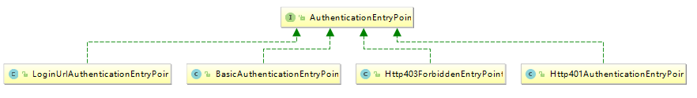

#### Spring Security 核心过滤器

Spring Security使用了springSecurityFilterChian作为安全过滤的入口，我们接下来分析一下这个过滤器包含了哪些关键的过滤器和用处。

```
Creating filter chain: o.s.s.web.util.matcher.AnyRequestMatcher@1, 
[o.s.s.web.context.SecurityContextPersistenceFilter@8851ce1, 
o.s.s.web.header.HeaderWriterFilter@6a472566, o.s.s.web.csrf.CsrfFilter@61cd1c71, 
o.s.s.web.authentication.logout.LogoutFilter@5e1d03d7, 
o.s.s.web.authentication.UsernamePasswordAuthenticationFilter@122d6c22, 
o.s.s.web.savedrequest.RequestCacheAwareFilter@5ef6fd7f, 
o.s.s.web.servletapi.SecurityContextHolderAwareRequestFilter@4beaf6bd, 
o.s.s.web.authentication.AnonymousAuthenticationFilter@6edcad64, 
o.s.s.web.session.SessionManagementFilter@5e65afb6, 
o.s.s.web.access.ExceptionTranslationFilter@5b9396d3, 
o.s.s.web.access.intercept.FilterSecurityInterceptor@3c5dbdf8
]
```

上述log信息是我们从springboot启动日志中获得，log打印顺序与实际配置顺序符合，也意味着SecurityContextPersistenceFilter是整个过滤链的第一个过滤器，而FilterSecurityInterceptor是末置的过滤器。

* SecurityContextPersistenceFilter主要有两个作用：请求来临时，创建SecurityContext安全上下文信息，请求结束时清空SecurityContextHolder。
* HeaderWriterFilter：用来给http响应添加一些Header,如：X-Frame-Options, X-XSS-Protection*，X-Content-Type-Options。
* CsrfFilter：用于防止crsf攻击。
* LogoutFilter：处理注销的过滤器。
* UsernamePasswordAuthenticationFilter：表单提交username和password，被封装成token进行一系列的认证，便是主要通过这个过滤器完成的。在表单认证的方法中，这是最关键的过滤器。
* RequestCacheAwareFilter：内部维护了一个RequestCache，用于缓存request请求。
* SecurityContextHolderAwareRequestFilter：对ServletRequest进行一次包装，使得request具有更加丰富的API。
* AnonymousAuthenticationFilter匿名身份过滤器，spring security为了兼容未登陆的访问，也走了一套认证流程，只不过是一个匿名的身份。
* SessionManagementFilter：和session相关的过滤器，内部维护了一个SessionAuthenticationStrategy，两者组合使用，常用来防止session-fixation protection attack，以及限制同一个用户开启多个会话的数量。
* ExceptionTranslationFilter：将认证过程中出现的异常交给内部维护的一些类去处理。
* FilterSecurityInterceptor：这个过滤器决定了访问特定路径应该具备的权限，访问的用户的角色，权限是什么？访问的路径需要什么样的角色和权限？这些判断和处理都是由这个过滤器来处理的。


1. SecurityContextPersistenceFilter

如果我们不使用Spring Security，大多情况下都会用Servlet Session来保存用户信息，在Spring Security中也是如此，用户在登陆过一次之后，后续的访问便是通过sessionId来识别用户是否已经认证过。在Spring Security中，具体的用户信息保存在SecurityContextHolder，而如何被保存在其中的，便是通过SecurityContextPersistenceFilter过滤器。

```java
public void doFilter(ServletRequest req, ServletResponse res, FilterChain chain)throws IOException, ServletException {
	HttpServletRequest request = (HttpServletRequest) req;
	HttpServletResponse response = (HttpServletResponse) res;
	if (request.getAttribute(FILTER_APPLIED) != null) {
		// ensure that filter is only applied once per request
		chain.doFilter(request, response);
		return;
	}
	final boolean debug = logger.isDebugEnabled();
	//标志该http请求已经请求过了
	request.setAttribute(FILTER_APPLIED, Boolean.TRUE);
	if (forceEagerSessionCreation) {
		HttpSession session = request.getSession();
		if (debug && session.isNew()) {
			logger.debug("Eagerly created session: " + session.getId());
		}
	}
	//包装request、response
	HttpRequestResponseHolder holder = new 	HttpRequestResponseHolder(request,response);
    //获取下文信息
	SecurityContext contextBeforeChainExecution = repo.loadContext(holder);
	try {
        //将上下问信息保存到SecurityContextHolder中
SecurityContextHolder.setContext(contextBeforeChainExecution);
		chain.doFilter(holder.getRequest(), holder.getResponse());
	}
	finally {
		SecurityContext contextAfterChainExecution = SecurityContextHolder
					.getContext();
		//请求结束后清空安全上下问信息
		SecurityContextHolder.clearContext();
        //将Security保存到HttpSession中，下次请求的时候就可以利用保存好的SecurityContext
		repo.saveContext(contextAfterChainExecution, holder.getRequest(),
					holder.getResponse());
        //移除filter_applied
		request.removeAttribute(FILTER_APPLIED);
	}
	}
}
```

* loadContext()方法：从session中获取上下文信息

```java
public SecurityContext loadContext(HttpRequestResponseHolder requestResponseHolder) {
	HttpServletRequest request = requestResponseHolder.getRequest();
	HttpServletResponse response = requestResponseHolder.getResponse();
    //获取session
	HttpSession httpSession = request.getSession(false);
    //从HttpSession中获取SecurityContext
	SecurityContext context = readSecurityContextFromSession(httpSession);
	//如果context为null，则创建一个新的SecurityContext
	if (context == null) {
		context = generateNewContext();
	}
	...
	return context;
}
```

* readSecurityContextFromSession(HttpSession httpSession)：从HttpSession中获取SecurityContext，如果HttpSession中不存在，直接返回null。

```java
private SecurityContext readSecurityContextFromSession(HttpSession httpSession) {
	final boolean debug = logger.isDebugEnabled();
	if (httpSession == null) {
		return null;
	}
	Object contextFromSession = httpSession.getAttribute(springSecurityContextKey);
	if (contextFromSession == null) {
		return null;
	}
	return (SecurityContext) contextFromSession;
}
```

2. UsernamePasswordAuthenticationFilter过滤器

表单认证是最常用的一个认证方式，一个最直观的业务场景是允许用户在表单中输入用户名和密码进行登陆。


```java
public Authentication attemptAuthentication(HttpServletRequest request,
			HttpServletResponse response) throws AuthenticationException {
	if (postOnly && !request.getMethod().equals("POST")) {
		throw new AuthenticationServiceException(
			"Authentication method not supported: " + request.getMethod());
	}
    //获取表单中的用户名称和密码
	String username = obtainUsername(request);
	String password = obtainPassword(request);
	if (username == null) {
		username = "";
	}
	if (password == null) {
		password = "";
	}
	username = username.trim();
    //组装成username+password行成token
	UsernamePasswordAuthenticationToken authRequest = new UsernamePasswordAuthenticationToken(
				username, password);
	setDetails(request, authRequest);
    //交给内部的AuthenticationManager去认证，并返回认证信息
	return this.getAuthenticationManager().authenticate(authRequest);
}
```

UsernamePasswordAuthenticationFilter本身并没有处理逻辑处理，主要在其父类```AbstractAuthenticationProcessingFilter```中有大量细节

```java
//包含了一个身份认证器
private AuthenticationManager authenticationManager;

//用于实现remeberMe
private RememberMeServices rememberMeServices = new NullRememberMeServices();
private RequestMatcher requiresAuthenticationRequestMatcher;

//这两个Handler很关键，分别代表了认证成功和失败相应的处理器
private AuthenticationSuccessHandler successHandler = new SavedRequestAwareAuthenticationSuccessHandler();
private AuthenticationFailureHandler failureHandler = new SimpleUrlAuthenticationFailureHandler();


public void doFilter(ServletRequest req, ServletResponse res, FilterChain chain)throws IOException, ServletException {
	HttpServletRequest request = (HttpServletRequest) req;
	HttpServletResponse response = (HttpServletResponse) res;
	if (!requiresAuthentication(request, response)) {
		chain.doFilter(request, response);
		return;
	}

	if (logger.isDebugEnabled()) {
		logger.debug("Request is to process authentication");
	}

	Authentication authResult;

	try {
        //调用UsernamePasswordAuthenticationFilter的attemptAuthentication
		authResult = attemptAuthentication(request, response);
        //如果认证失败，直接返回
		if (authResult == null) {
			return;
		}
		sessionStrategy.onAuthentication(authResult, request, response);
	}
    //捕捉异常
	catch (InternalAuthenticationServiceException failed) {
			//内部服务异常
			unsuccessfulAuthentication(request, response, failed);
			return;
	}
	catch (AuthenticationException failed) {
			// 认证失败
			unsuccessfulAuthentication(request, response, failed);
			return;
	}

	// 认证成功
	if (continueChainBeforeSuccessfulAuthentication) {
		chain.doFilter(request, response);
	}
	//认证成功后，过滤器把结果传递给成功处理器
	successfulAuthentication(request, response, chain, authResult);
}
```

3. AnonymousAuthenticationFilter：匿名认证过滤器。Spring Security 为了整体逻辑的统一性，即使是未通过认证的用户，也给予一个匿名身份。```AnonymousAuthenticationFilter```位```UsernamePasswordAuthenticationFilter、BasicAuthenticationFilter、RememberMeAuthenticationFilter```之后，意味着只有在上述身份过滤器执行完后，SecurityContext依旧没有用户信息，会给用户一个匿名身份。

 ```java
//自动创建一个anonymousUser的匿名用户，让其具有ROLE_ANONYMOUS角色
public AnonymousAuthenticationFilter(String key) {
	this(key, "anonymousUser", AuthorityUtils.createAuthorityList("ROLE_ANONYMOUS"));
	}

public AnonymousAuthenticationFilter(String key, Object principal,
	List<GrantedAuthority> authorities) {	
	this.key = key;//用来识别该过滤器创建的身份
	this.principal = principal;//代表匿名用户的身份
	this.authorities = authorities;//代表匿名用户的权限集合
}

public void doFilter(ServletRequest req, ServletResponse res, FilterChain chain)throws IOException, ServletException {
	//过滤器链到匿名认证还没有身份信息，创建一个匿名身份
	if (SecurityContextHolder.getContext().getAuthentication() == null) {
			SecurityContextHolder.getContext().setAuthentication(
					createAuthentication((HttpServletRequest) req));

			
		}
		chain.doFilter(req, res);
	}
 ```

4. ExceptionTranslationFilter

ExceptionTranslationFilter异常转换过滤器位于整个springSecurityFilterChain的后方，用来转换整个链路中出现的异常，将其转化。一般只处理两大类的异常：AccessDeniedException(登陆了但是权限不足)访问异常和AuthenticationException(未登陆状态下访问受保护资源)认证异常。

如果该过滤器检测到AuthenticationException，则将会交给内部的AuthenticationEntryPoint去处理，如果检测到AccessDeniedException，需要先判断当前用户是不是匿名用户，如果是匿名访问，则和前面一样运行AuthenticationEntryPoint，否则会委托给AccessDeniedHandler去处理。

```java
private void handleSpringSecurityException(HttpServletRequest request,
	HttpServletResponse response, FilterChain chain, RuntimeException exception)throws IOException, ServletException {
   if (exception instanceof AuthenticationException) {
       //如果未登录访问受保护的资源，重定向到登录端点
		sendStartAuthentication(request, response, chain,
		(AuthenticationException) exception);
	}
    
	else if (exception instanceof AccessDeniedException) {
        Authentication authentication =  	SecurityContextHolder.getContext().getAuthentication();
		if (authenticationTrustResolver.isAnonymous(authentication) || authenticationTrustResolver.isRememberMe(authentication)) {
            //匿名用户，重新定向登陆端点
			sendStartAuthentication(request,
						response,
						chain,
						new InsufficientAuthenticationException(
							messages.getMessage(
								"ExceptionTranslationFilter.insufficientAuthentication",
"Full authentication is required to access this resource")));
			}
			else {
                //如果登录了，但是未授权的交给accessDeniedHandler处理
				accessDeniedHandler.handle(request, response,
						(AccessDeniedException) exception);
			}
		}
	}
```



如果是未登录访问受保护的资源，会重定向到登录端口：

```java
protected void sendStartAuthentication(HttpServletRequest request,HttpServletResponse response, FilterChain chain,
AuthenticationException reason) throws ServletException, IOException {		SecurityContextHolder.getContext().setAuthentication(null);                                                                 requestCache.saveRequest(request, response);
//将请求重定向到登录界面 LoginUrlAuthenticationEntryPoint
authenticationEntryPoint.commence(request, response, reason);
	}
```

如果登录了，但是没有访问权限，则返回403错误：

```java
public void handle(HttpServletRequest request, HttpServletResponse response,AccessDeniedException accessDeniedException) throws IOException,
			ServletException {
		if (!response.isCommitted()) {
			if (errorPage != null) {
				// Put exception into request scope (perhaps of use to a view)
				request.setAttribute(WebAttributes.ACCESS_DENIED_403,
						accessDeniedException);

				// Set the 403 status code.
				response.setStatus(HttpStatus.FORBIDDEN.value());

				// forward to error page.
				RequestDispatcher dispatcher = request.getRequestDispatcher(errorPage);
				dispatcher.forward(request, response);
			}
			else {
				response.sendError(HttpStatus.FORBIDDEN.value(),
					HttpStatus.FORBIDDEN.getReasonPhrase());
			}
		}
	}
```


5. FilterSecurityInterceptor

用来控制哪些资源是受限的，受限的资源需要什么权限。FileterSecurityInterceptor从SecurityContextHolder中获取Authentication对象，然后对比用户拥有的权限和资源所需的权限。

