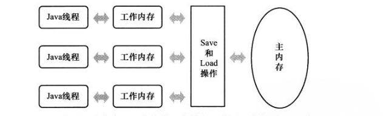

### 并发

#### 内存模型相关概念

计算机的的大多数运算任务不可能只靠处理器计算完成，它至少要与内存交互，如读取运算数据、存储运算结果等。由于计算机的存储设备与处理器的运算速度有几个数量级的差距，所以在计算机系统中加入一层读写速度尽可能接近处理器运算速度的高速缓存来作为内存与处理器之间的缓冲：计算机在运算时，将使用到的数据复制到缓存中，让运算能快速进行，当运算结束后，再从缓存同步到内存中，这样处理器就不用等待缓慢的内存读写了。

基于高速缓存的存储交互解决了处理器与内存的速度矛盾，但是引入了一个新的问题：缓存一致性。在多处理器系统中，每个系统都有自己的高速缓存，当多个处理器的运算任务都涉及到同一块主内存时，可能导致数据不一致。

例如：```i = i+1```,当线程执行这个语句时，会先从内存中读取i的值，然后复制一份到cup高速缓存中，然后cpu执行指令对i进行加1操作，然后再将数据写入高速缓存，最后高速缓存中的i最新数据刷新到主内存中。现在假如有2条线程同时执行这段代码，并且i的初始值为0，两条线程分别读取i的值到各自的高速缓存中，然后线程1进行加1操作，然后把i的值刷新到主内存中去，此时线程2的高速缓存中的i的值还是0，进行加1后，i的值为1，然后线程2把i的值提交到主内存中去。最终两条线程执行的结果是1而不是2。

因此为了解决缓存一致性问题，需要各个处理器访问资源时都遵循一些协议


#### JAVA 内存模型

**主内存与工作内存**

Java内存模型主要目标是定义程序中各个变量的访问规则，即虚拟机将变量存储到内存和从内存汇总取出变量这样的底层细节。变量包括实例字段、静态字段和构成数组对象的元素。但是不包括局部变量和方法参数，因为局部变量是线程私有的。

Java内存模型规定了所有的变量都存储在主内存中（可以与前面提到的主内存类比），每条线程还有自己的工作线程（可以与前面讲的处理器高速缓存类比）。线程在工作时也会将使用到的变量的副本从主内存拷贝到工作线程，然后在工作线程中对变量进行读取、赋值等操作，最后再将新的值刷新到主内存中。




**并发编程中的原子性、可见性、有序性**

1. 原子性

原子性是指一个操作不可中断，即使是多个线程一起执行，一个操作一旦开始，就不会被其他线程干扰。

比如：

```x=10```这就是一个原子操作，它会直接将数值1写入到工作内存中去。

```y = x```这就不是一个原子操作，因为工作线程首先要先去主内存中x的值，然后将x写入工作内存，虽然读取x的值以及将x的值写入到工作内存这2个操作都是原子性操作，但是合起来就不是原子操作了。

还有一点需要注意，在32位平台下，对64位数据的读取和赋值需要通过两个操作来完成，不能保证其原子性

CPU 实现原子指令有2种方式：

1. 通过总线锁定来保证原子性。总线锁定其实就是处理器使用了总线锁，所谓总线锁就是使用处理器提供的一个 LOCK# 信号，当一个处理器咋总线上输出此信号时，其他处理器的请求将被阻塞住，那么该处理器可以独占共享内存。但是该方法成本太大。因此有了下面的方式。
2. 通过缓存锁定来保证原子性。所谓缓存锁定 是指内存区域如果被缓存在处理器的缓存行中，并且在#Lock 操作期间被锁定，那么当他执行锁操作写回到内存时，会修改内部的内存地址，并允许他的缓存一致性机制来保证操作的原子性，因为缓存一致性机制(MESI)会阻止同时修改两个以上处理器缓存的内存区域数据（这里和 volatile 的可见性原理相同），当其他处理器回写已被锁定的缓存行的数据时，会使缓存行无效。

注意：有两种情况下处理器不会使用缓存锁定。

1. 当操作的数据不能被缓存在处理器内部，或操作的数据跨多个缓存行时，则处理器会调用**总线锁定**。
2. 有些处理器不支持缓存锁定，对于 Intel 486 和 Pentium 处理器，就是锁定的内存区域在处理器的缓存行也会调用总线锁定。

2. 可见性

可见性是指当一个线程修改了某一个共享变量的值，其它线程是否能够立即知道这个修改。

在java中通常使用volatile来修饰变量，使得变量被修改后会立即刷新到主内存中，当其他线程需要读取它时，不会使用自己工作线程中的拷贝，而是直接从主内存中读取新的变量值。

3. 有序性

程序执行时，并不一定会按照先后顺序执行，因为程序执行时，可能会进行指令重排，重排后的指令与原指令顺序未必一致。

**Happen-Before规则**

先行发生是Java内存模型中定义的两项操作之间的偏序关系，如果说操作A先行发生于操作B，其实就是说发生操作B之前，操作A产生的影响能被操作B观察到，“影响”包括内存中共享变量的值、发送了消息、调用了方法等

下面是Java内存模型下一些天然的先行发生关系，这些先行发生关系无需任何同步器协助就已经存在，可以在编码中直接使用：

* 程序顺序原则：在一个线程内，按照程序代码顺序，书写在前面的操作先行发生于书写在后面的操作。准确地说，应该是控制流程顺序而不是程序代码顺序，因为要考虑分支、循环等结构。
* 管程锁定规则：一个unlock操作先行发生于后面对同一个锁的lock操作。这里必须强调的是同一个锁。“后面”指时间上的先后顺序。
* volatile规则：volatile变量的写，先发于后面对这个变量的读，这保证了volatile变量的可见性。“后面”也是指时间上的先后顺序。
* 传递性：A先于B，B先于C，那么A必然先于C。
* 线程的start()方法先于它的每一个动作。
* 线程的所有操作先于线程的终结（Thread.join()）。
* 对线程interrupt方法的调用先行发生于被中断线程的代码检测到中断事件的发生（可以通过Thread.interrupted()方法检测到）。
* 一个对象的初始化完成（构造函数的执行结束）先于finalize()方法。


#### 关于volatitle关键字

一旦一个共享变量被volatitle修饰后，就具备了两层语义：

* 保证了不同线程对这个变量进行操作时的可见性，即一个线程修改了某个变量的值，这个新值对其他线程是立即可见的。
* 禁止进行指令重排序

下面是一个volatitle的例子：

```java
public class Demo2 {

    public static volatile int race = 0;

    public static void increase(){
        race ++;
    }

    private static final int THREADS_COOUNT = 20;


    public static void main(String[] args){

        Thread[] threads = new Thread[THREADS_COOUNT];
        for(int i = 0;i<THREADS_COOUNT;i++){

            threads[i] = new Thread(new Runnable() {
                @Override
                public void run() {
                    for(int i = 0;i<10000;i++){
                        increase();
                    }
                }
            });
            threads[i].start();
        }
		//在idea环境中Thread.activeCount要改成 大于2
        while (Thread.activeCount() > 1)
            Thread.yield();

        System.out.print(race);

    }

}
```

上面代码中的race加了关键字volatile关键字，它的改变对其它线程是可见的，因此上面代码的运行结果应该是10000*20，但是在实际的运行结果往往小于200000。

利用Javap反编译这段代码，可以看到insceasc()方法在Class 文件中由4条指令构成

> javap -v  class文件路径

```java
 public static void increase();
    descriptor: ()V
    flags: ACC_PUBLIC, ACC_STATIC
    Code:
      stack=2, locals=0, args_size=0
         0: getstatic     #2                  // Field race:I
         3: iconst_1
         4: iadd
         5: putstatic     #2                  // Field race:I

```

getstatic 将race的值取到操作栈顶，volatitle关键字保证了此时取的race值是正确的，但是在执行iconst_1和iadd这些指令时，其它线程可能已经把race值加大了，而操作栈顶的值就变成了过期的数据，所以putstatic可能会把娇小的值同步到内存中。

因此在我们使用volatitle关键字时，仍然需要加锁来保证原子性，或者volatitle修饰的变量不依赖变量的当前值或变量不需要与其它状态变量共同参与不变约束。如boolean变量，它就不需要依赖当前变量值：

```
volatitle boolean shutdown;
public void setShowdown(){
    showdown = true;
}
public void doWork(){
    while(!showdown){
        //do something
    }
}
```

如上，当setShowdown方法被调用时，能保证所有线程中执行的doWork()都立即停下来。

**volatitle保证有序性**

* 当程序执行到volatitle变量的读操作或者写操作，在其前面的更改肯定全部已经执行，且结果已经对后面的操作可见。
* 在进行指令优化时，不能将volatitle变量后面的语句放到它前面执行，也不能将它前面的语句放在它后面执行。


#### Volatitle实现机制（具体参见cas算法介绍）

当字段被volatile关键字修饰时，对应的指令会多出一个lock前缀，lock前缀指令实际上相当于一个内存屏障（也成内存栅栏），内存屏障会提供3个功能：

（1）它确保指令重排序时不会把其后面的指令排到内存屏障之前的位置，也不会把前面的指令排到内存屏障的后面；即在执行到内存屏障这句指令时，在它前面的操作已经全部完成；

（2）它会强制将对缓存的修改操作立即写入主内存；

（3）如果是写操作，它会导致其他CPU中对应的缓存行无效。


####Volatitle实现原理

1. 可见性

处理器为了提高处理速度，不直接和内存进行通讯，而是将系统内存的数据独到内部缓存后再进行操作，但操作完后不知什么时候会写到内存。

如果对声明了volatile变量进行写操作时，JVM会向处理器发送一条Lock前缀的指令，将这个变量所在缓存行的数据写会到系统内存。这一步确保了如果有其他线程对声明了volatile变量进行修改，则立即更新主内存中数据。

但这时候其他处理器的缓存还是旧的，所以在多处理器环境下，为了保证各个处理器缓存一致，每个处理会通过嗅探在总线上传播的数据来检查 自己的缓存是否过期，当处理器发现自己缓存行对应的内存地址被修改了，就会将当前处理器的缓存行设置成无效状态，当处理器要对这个数据进行修改操作时，会强制重新从系统内存把数据读到处理器缓存里。 这一步确保了其他线程获得的声明了volatile变量都是从主内存中获取最新的。

2. 有序性

Lock前缀指令实际上相当于一个内存屏障（也成内存栅栏），它确保指令重排序时不会把其后面的指令排到内存屏障之前的位置，也不会把前面的指令排到内存屏障的后面；即在执行到内存屏障这句指令时，在它前面的操作已经全部完成。

#### 使用volatitle关键字的场景

因为volatile关键字无法保证操作的原子性。通常来说，使用volatile必须具备以下2个条件：

（1）对变量的写操作不依赖于当前值 

（2）该变量没有包含在具有其他变量的不变式中