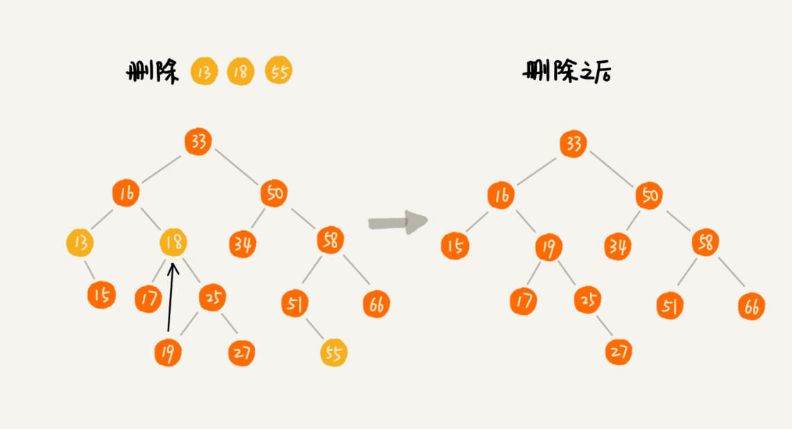

### 树

如下图：A节点是B节点的**父节点**，B节点是A节点的**子节点**。B、C、D这三个节点的父节点是同一个节点，所以它们是**兄弟节点**。我们把没有父节点的节点叫做**根节点**,也就是图中的节点E。我们把没有子节点的节点叫做**叶子节点**或者**叶节点**，比如图中的G、H、I、J、K、L都是叶子节点。


树还有三个比价相似的概念：高度(Height)、深度(Depth)、层(Level)。


高度就是从下往上度量，并且计数的起点是0。

深度是从上往下度量，并且计数起点也是0。

层次跟深度的计算类似，不过计数起点是1，也就是说根节点位于第一层。

### 二叉树

二叉树，顾名思义，每个节点最多有两个“叉”，也就是两个子节点，分别是**左子节点**和**右子节点**。不过，二叉树并不要求每个节点都有两个子节点，有的节点只有左子节点，有的节点只有右子节点。


**满二叉树**：编号2的二叉树中，叶子节点全都在最底层，除了叶子节点外，每个节点都有左右两个子节点，这种二叉树就叫作**满二叉树**。

**完全二叉树**：编号3中的二叉树，叶子节点都在最底下两层，最后一层的叶子节点都靠左排列，并且除了最后一层，其它层的节点个数都要达到最大，这种二叉树叫作**完全二叉树**。


### 二叉树存储方式

1. 链式存储法：每个节点有三个字段，其中一个存储数据，另外两个是指向左右子节点的指针。


2. 顺序存储法

我们来看基于数组的顺序存储法，我们把根节点存储在下标i=1的位置，那左子节点存储在下标2*i=2的位置，右子节点存储在2*i+1=3的位置。依次类推，B节点的左子节点存储在2*i=2*2=4的位置，右子节点存储在2*i+1=2*2+1=5的位置。


如果X存储在数组下标为i的位置，下标为2*i的位置存储的就是左字节点，下标 2＊i+1的位置就是右子节点。反过来，下标为i/2的位置存储就是它的父节点。

上面的二叉树是一棵完全二叉树，所以仅仅浪费了一个下标为0的存储位置。如果是非完全二叉树，会浪费比较多的数组存储空间。


所以，如果某棵二叉树是完全二叉树，那用数组存储是最节省内存的一种方式，因为数组不需要像链式存储法那样，要额外存储左右子节点的指针。

### 二叉树的遍历

* 前序遍历：对于树中的任意节点来说，先打印这个节点，然后再打印它的左子树，然后打印它的右子树。
* 中序遍历：对于树中的任意节点来说，先打印它的左子树，然后再打印它本身，最后打印它的右子树。
* 后序遍历：对于树中的任意节点来说，先打印它的左子树，然后打印它的右子树，最后打印这个节点本身。


前序遍历(递归)

```java
public void preOrder(Node root){
        if (root == null) return;
        System.out.println(root.getData());
        preOrder(root.getLeft());
        preOrder(root.getRight());

    }
```

前序遍历（非递归）

```java
//非递归前序遍历
    public List<Integer> preOrder(Node root){

        List<Integer> resultList = new ArrayList<>();

        Stack<Node> stack = new Stack<>();//栈的特点是

        if (root == null) return resultList;

        stack.add(root);

        while (!stack.isEmpty()){

            Node tempNode = stack.pop();

            if (tempNode != null){
                resultList.add(tempNode.getData());//访问根节点
                stack.push(tempNode.getRight());//将右子节点压入栈
                stack.push(tempNode.getLeft());//将左子节点压入栈
            }

        }
        return resultList;
    }
```

中序遍历(递归)

```java
public void inOrder(Node node){

        if (node == null) return;

        inOrder(node.getLeft());
        System.out.println(node.getData());
        inOrder(node.getRight());

    }
```

中序遍历(非递归)

```java
public List<Integer> inOrder(Node root){


        List<Integer> list = new ArrayList<>();

        Stack<Node> stack = new Stack<>();

        Node cur = root;

        while (cur != null || !stack.isEmpty()){

           while (cur != null){

               stack.add(cur);
               cur = cur.getLeft();
           }

           cur = stack.pop();
           list.add(cur.getData());
           cur = cur.getRight();

        }
        return list;
    }
```

后序遍历(递归)

```
public void postOrder(Node root){

        if (root == null) return;

        postOrder(root.getLeft());
        postOrder(root.getRight());
        System.out.print(root.getData());

    }
```

后序遍历(非递归)

```java
public List<Integer> postOrder(Node root){


        Deque<Node> stack = new LinkedList<>();
        stack.push(root);

        List<Integer> list = new ArrayList<>();

        while (!stack.isEmpty()){

            Node node = stack.pop();

            if (node != null){
                list.add(node.getData());
                stack.push(node.getLeft());
                stack.push(node.getRight());
            }

        }
        Collections.reverse(list);
        return list;
    }
```

宽度优先搜索

```java
public List<Integer> levelOrder(Node root){

        List<Integer> list = new ArrayList<>();
        Queue<Node> stack = new LinkedList<>();
        int levelNum = 0;
        stack.add(root);
        while (!stack.isEmpty()){

            List<Integer> tempList = new ArrayList<>();
            levelNum = stack.size();

            while (levelNum > 0){

                Node  node = stack.poll();
                if (node != null){
                    tempList.add(node.getData());
                    stack.add(node.getLeft());
                    stack.add(node.getRight());
                }
                levelNum --;
            }

            if (tempList.size() > 0){
                list.addAll(tempList);
            }

        }
```

#### 二叉查找树

二叉查找树也叫作二叉搜索树。顾名思义，二叉查找树是为了实现快速查找而生的。不过它不仅仅支持快速查找一个数据，还支持快速插入、删除一个数据。

二叉查找树要求，在树中的任意一个节点，其左子树中的每个节点的值，都要小于这个节点的值，而右子树节点的值都大于这个节点的值。


1. 二叉查找树的查找操作

在二叉查找树中查找一个节点，我们首先获取根节点，如果它等于我们要查找的数据，就返回；如果查找的数据比根节点的值小，那就在左子树中递归查找；如果要查找的数据比根节点的值大，那就在右子树中递归查找。


实现代码：


2. 二叉树的插入操作

如果插入的数据比节点的数据大，并且节点的右子树为空，就将新数据直接插到右子节点的位置；如果不为空，就再递归遍历右子树，查找插入位置。同理，如果要插入的数据比节点数值小，并且节点的左子树为空，就将新数据插入到左子节点的位置；如果不为空，就再递归左子树，查找插入位置。

 


3. 二叉树删除操作

第一种情况：如果要删除的节点没有子节点，我们只需要直接将父节点指向要删除节点的指针置为null。

第二种情况：如果要删除的节点只有一个子节点，我们只需要更新父节点中指向要删除节点的指针，让它指向要删除节点的子节点就可以了。

第三种情况：如果要删除的节点有两个子节点，我们需要找到这个节点的右子树的最小节点，把它替换到要删除的节点上，然后再删除掉这个最小节点，因为最小节点肯定没有左子节点。




#### 时间复杂度

二叉树的形态各式各样，极端情况下，根节点的左右子树极度不平衡，已经退化成链表了，所以它的时间复杂度是O(n)。

在理想情况下，如二叉查找树是一棵完全二叉树(或者满二叉树)，它的时间复杂度是O(logn)。不管是插入、删除还是查找，它的时间复杂度其实跟树的高度成正比，也就是O(height)。假设包含n个节点的完全二叉树，第一层包含1个节点，第二层包含2个节点，第三层包含4个节点，依次类推，下面一层节点个数是上一层的2倍，第K层包含的节点数是2^(K-1)。

```
n>=1+2+4+8...2^(k-2)+1
n<=1+2+4+8...2^(k-2)+2^(k-1)

```

我们根据等比数列求和公式，可以计数出K的范围是[log2(n+1),log2n+1]，完全二叉树的层数小于等于log2n+1，也就是说，完全二叉树的高度小于等于log2n。

> 等比数列求和公式：Sn=a1*(1-q^n)/(1-q)
>
> Sn > = 1(1 - 2^k-2)/(1-2)+1=2^(k-2)
>
> k-2 <= log2Sn
>
> k<= log2(Sn+1)
>
> --------------------------
>
> Sn <= 1(1-2^k-1)/(1-2)
>
> Sn <= 2^(k-1) -1
>
> Sn+1 < 2^(k-1)
>
> log2Sn+1<=k


