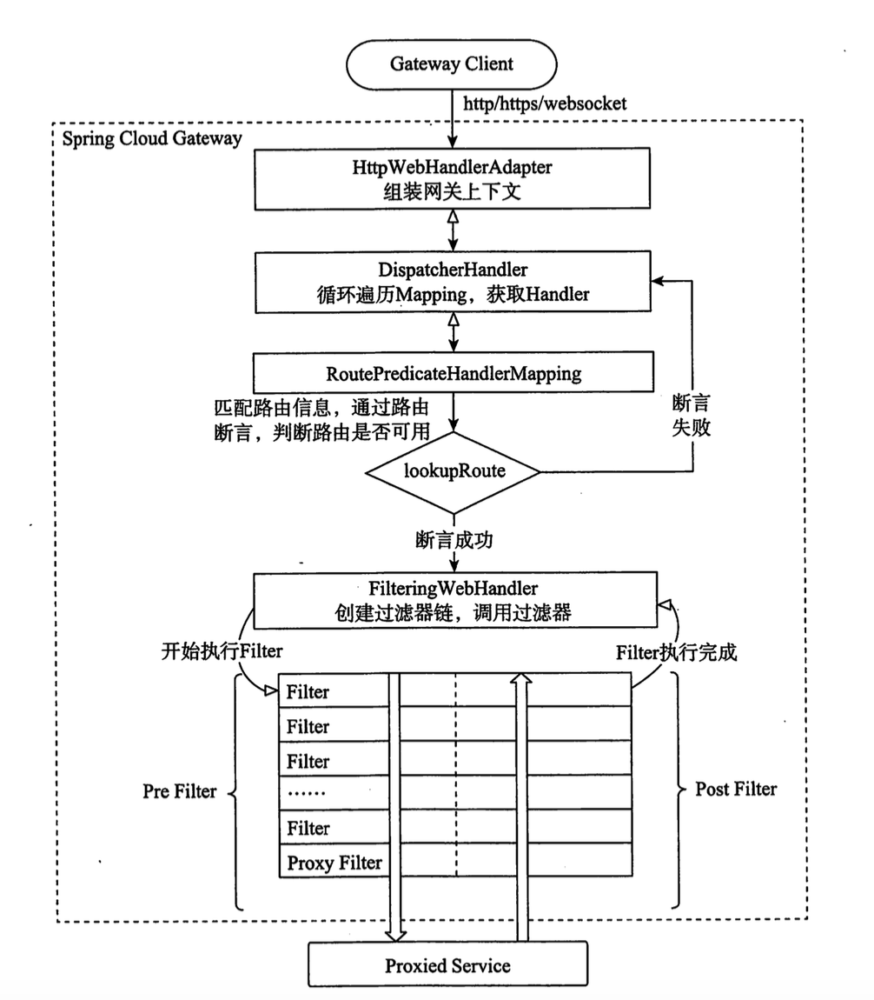
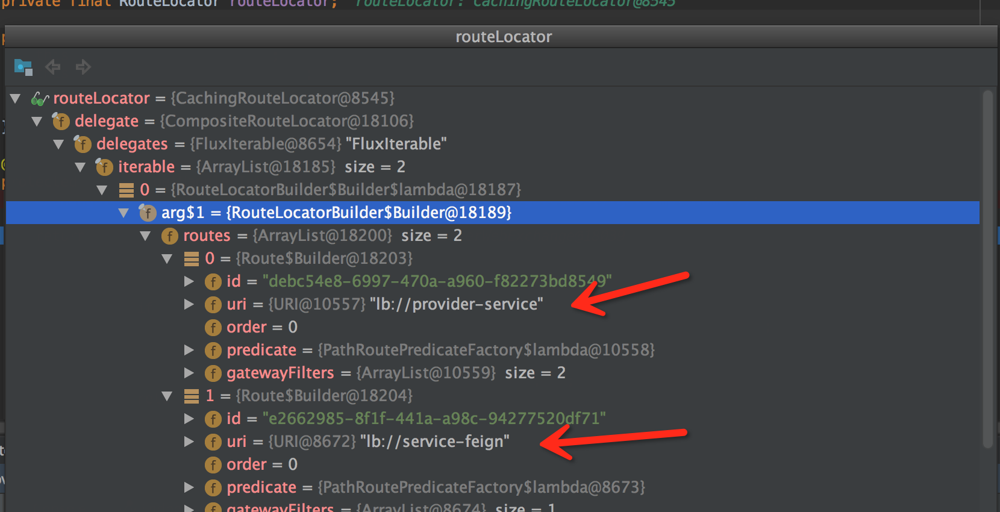
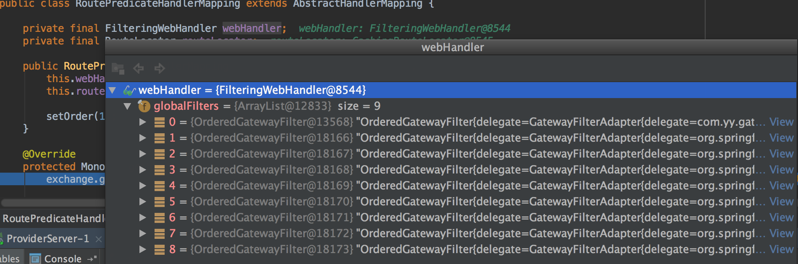
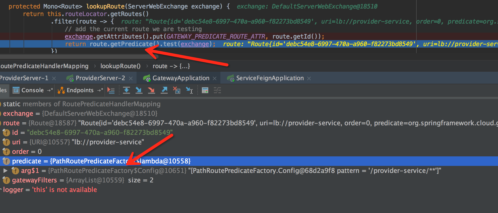
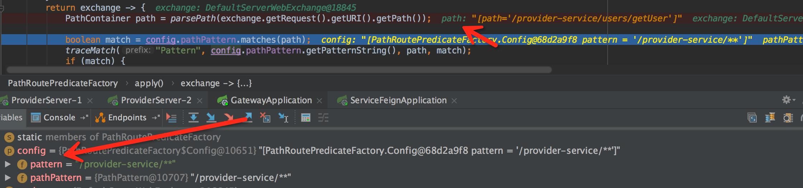
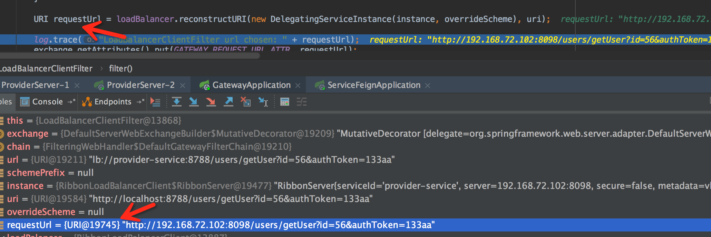

####  Spring Cloud GateWay 执行流程



#### 构建上下文

Spring Cloud Gateway会对请求进来的Reuest或者返回的Resonse进行包装，转换成网关运行的上下文，在Spring Cloud Gateway中网关的上下文是ServerWebExchange。

1. 请求入口

Spring Cloud Gateway的请求入口在ReatorHttpHandlerAdapter的apply方法中：

```java
public Mono<Void> apply(HttpServerRequest request, HttpServerResponse response) {
	NettyDataBufferFactory bufferFactory = new NettyDataBufferFactory(response.alloc());
	ServerHttpRequest adaptedRequest;
	ServerHttpResponse adaptedResponse;
	try {
        //对请求进行包装
		adaptedRequest = new ReactorServerHttpRequest(request, bufferFactory);
		adaptedResponse = new ReactorServerHttpResponse(response, bufferFactory);
		}
		catch (URISyntaxException ex) {
			
		}
    ...
```

2. 构建上下文

Spring Cloud Gateway的上下文在HttpWebHandlerAdapter中构建：

```java
public Mono<Void> handle(ServerHttpRequest request, ServerHttpResponse response) {
    //创建上下文对象ServerWebExchange
		ServerWebExchange exchange = createExchange(request, response);
		return getDelegate().handle(exchange)
				.onErrorResume(ex -> handleFailure(request, response, ex))
				.then(Mono.defer(response::setComplete));
	}
```


#### 分发请求

在Spring Cloud Gateway 中使用DispatcherHandler 分发请求给已经注册的处理程序处理：

```java
public Mono<Void> handle(ServerWebExchange exchange) {
	//如果存放handlerMapping集合为空，返回空
	if (this.handlerMappings == null) {
		return Mono.error(HANDLER_NOT_FOUND_EXCEPTION);
	}
    //遍历handlerMapping集合为空,获取合适的mapping
	return Flux.fromIterable(this.handlerMappings)
     //通过handlerMapping获取handler   
	.concatMap(mapping -> mapping.getHandler(exchange))
	.next()	.switchIfEmpty(Mono.error(HANDLER_NOT_FOUND_EXCEPTION))
     //执行hanler   
	.flatMap(handler -> invokeHandler(exchange, handler))
	.flatMap(result -> handleResult(exchange, result));
}
```

DispatcherHandler 的handler执行顺序如下：

1）首先要校验DispatcherHandler中存放handlerMappings集合是否为空，因为我们需要通过handlerMapping来获取响应的handler，然后通过handler来执行过滤器链，从而往后执行。

2）循环handlerMappings集合，获取合适的mapping，在SpringCloud Gateway中，使用RoutePredicateHandlerMapping来获取handler。

3）通过RoutePredicateHandlerMapping来获取Handler，这里返回是FilteringWebHandler。

4）执行FilteringWebHandler，在该类中有一个List集合存放着全局过滤器，然后执行handler方法时会生成一个过滤器链来依次执行过滤器。


#### RoutePredicateHandlerMapping

routePredicateHandlerMapping的执行顺序是通过路由定位器获取全部的路由信息，找到匹配的路由信息后设置到上下文中，然后返回固定的webhandler即FilteringWebHandler。

我们在DispatcherHandler中执行getHandler()方法时，会先进入AbstractHandlerMapping方法中,然后再调用getHandlerInternal()方法，然后在它的子类中根据实际情况来分别实现getHandlerInternal方法：

```java
public Mono<Object> getHandler(ServerWebExchange exchange) {
	return getHandlerInternal(exchange).map(handler -> {
		...
		return handler;
	});
}
```

如下是RoutePredicateHandlerMapping中getHandlerInternal()的实现：

```java
protected Mono<?> getHandlerInternal(ServerWebExchange exchange) {
	exchange.getAttributes().put(GATEWAY_HANDLER_MAPPER_ATTR, getClass().getSimpleName());
    //查询匹配路由，并设置到ServerWebExchange中，然后返回FilteringWebHandler
	return lookupRoute(exchange)
	// .log("route-predicate-handler-mapping", Level.FINER) //name this
	.flatMap((Function<Route, Mono<?>>) r -> {
		exchange.getAttributes().remove(GATEWAY_PREDICATE_ROUTE_ATTR);
        //将符合要求的路由设置到上下文中
		exchange.getAttributes().put(GATEWAY_ROUTE_ATTR, r);
        //返回handler
		return Mono.just(webHandler);
	}).switchIfEmpty(Mono.empty().then(Mono.fromRunnable(() -> {
		exchange.getAttributes().remove(GATEWAY_PREDICATE_ROUTE_ATTR);
	})));
}
```

lookupRoute()方法会根据用户访问的path来匹配正确的路由：

```java
protected Mono<Route> lookupRoute(ServerWebExchange exchange) {
    //循环我们在配置文件中配置的路由信息,routeLocator存放着路由信息
	return this.routeLocator.getRoutes()
	.filter(route -> {		
		exchange.getAttributes().put(GATEWAY_PREDICATE_ROUTE_ATTR, route.getId());
        //校验路由是否匹配
		return route.getPredicate().test(exchange);
	})			
	.next()			
	.map(route -> {		
		validateRoute(route, exchange);
		return route;
	});	
}
```

```route.getPredicate()```会返回一个PathRoutePredicateFactory对象，然后再执行test方法时回调用PathRoutePredicateFactory的apply方法：

```java
public Predicate<ServerWebExchange> apply(Config config) {
	synchronized (this.pathPatternParser) {
		config.pathPattern = this.pathPatternParser.parse(config.pattern);
	}
	return exchange -> {
         //解析请求路径
		PathContainer path = parsePath(exchange.getRequest().getURI().getPath());
		boolean match = config.pathPattern.matches(path);
		if (match) {
            //对比路径是否匹配
			PathMatchInfo uriTemplateVariables = config.pathPattern.matchAndExtract(path);
			exchange.getAttributes().put(URI_TEMPLATE_VARIABLES_ATTRIBUTE, uriTemplateVariables);
				return true;
		} else {
				return false;
			}
		};
	}
```

在getHandlerInternal方法中，当把匹配的路由设置到上下文中后就把FilteringWebHandler返回到DispatcherHandler中，然后再执行FilteringWebHandler的handler方法：

```java
public class FilteringWebHandler implements WebHandler {
	//存放全局过滤器
	private final List<GatewayFilter> globalFilters;
 
    public Mono<Void> handle(ServerWebExchange exchange) {
		Route route = exchange.getRequiredAttribute(GATEWAY_ROUTE_ATTR);
        //局部过滤器
		List<GatewayFilter> gatewayFilters = route.getFilters();
		//与全局过滤器混合在一起
		List<GatewayFilter> combined = new ArrayList<>(this.globalFilters);
		combined.addAll(gatewayFilters);
		//排序
		AnnotationAwareOrderComparator.sort(combined);
		//创建一个过滤链来执行
		return new DefaultGatewayFilterChain(combined).filter(exchange);
	}
}

private static class DefaultGatewayFilterChain implements GatewayFilterChain {

		private final int index;
		private final List<GatewayFilter> filters;

		public DefaultGatewayFilterChain(List<GatewayFilter> filters) {
			this.filters = filters;
			this.index = 0;
		}

		private DefaultGatewayFilterChain(DefaultGatewayFilterChain parent, int index) {
			this.filters = parent.getFilters();
			this.index = index;
		}

		public List<GatewayFilter> getFilters() {
			return filters;
		}

		@Override
		public Mono<Void> filter(ServerWebExchange exchange) {
			return Mono.defer(() -> {
				if (this.index < filters.size()) {
                    //获取第一个过滤器
					GatewayFilter filter = filters.get(this.index);
                    //生成调用链
					DefaultGatewayFilterChain chain = new DefaultGatewayFilterChain(this, this.index + 1);	//继续往后执行过滤器
					return filter.filter(exchange, chain);
				} else {
					return Mono.empty(); // complete
				}
			});
		}
	}

```

这里介绍几种过滤器第一个是LoadBalancerClientFilter过滤器，当我们在配置路由时采用从注册中心读取uri时如：```lb://xxxx-service```，那么就执行进入该过滤器，然后在filter方法中通过Ribbon从注册中心获取具体的请求路径。

还有一个NettyRoutingFilter过滤器，当我们以http或者https格式来请求服务时，就会进入该过滤器，然后通过Netty Client发送亲求到服务提供者。

下面举一个例子：

```
请求url:
http://localhost:8788/provider-service/users/getUser?id=56&authToken=133aa
```

我在项目中配置了两个路由信息，当我们启动项目后，会加载到RouteLocator对象中：

```java
  public RouteLocator customerRouteLocator(RouteLocatorBuilder builder){
  	return builder.routes()
   	.route(r -> r.path("/provider-service/**")
    .filters(f -> f.filter(new GatewayRateLimitFilterByIp(10,1,Duration.ofSeconds(60)))
    .rewritePath("/provider-service/(?<segment>.*)","/${segment}"))
    .uri("lb://provider-service"))
   	.route(r -> r.path("/service-feign/**")
    .filters(f -> f.rewritePath("/service-feign/(?<segment>.*)","/${segment}"))
    .uri("lb://service-feign"))
    .build();
   }
```

如下项目启动后，在RoutePredicateHandlerMapping中发现路由信息已经被加载进来了，并赋值给了 它的成员变量RouteLocator。



同时在RoutePredicateHandlerMapping还有一个成员变量webHandler，它保存了SpringCloud Gateway加载进来的全局过滤器，并且作为结果返回。



前面知道RoutePredicateHandlerMapping主要用来过滤路由，根据用户的请求路径找到合适的路由：



查找路由是在lookupRoute方法中执行的，并且通过```route.getRredicate.test```来触发筛选，如上可以看到redicate实际上是PathRoutePredicateFactory对象，路由的比较会在PathRoutePredicateFactory的apply方法中执行，如果匹配就返回true:



最后我在看一看我们的请求是否会进LoadBalancerClientFilter过滤器，因为我们的uri配置是“lb”开头的：



如上我们的请求进入了LoadBalancerClientFilter，并且从注册中心获取到了具体的请求url，并且该url是以http开头的，所有它还会进入NettyRoutingFilter过滤器，然后真正的发送请求到具体的服务方。

注意：

spring cloud gateway 会根据注册中心的实例id生成一套默认的的路由规则（/service_id/**），并且它的order是0，所以如果我们在配置文件中配置的路由刚好跟默认路由一样，如果优先级比默认路由的优先级大，则不会执行自定义的路由规则。

