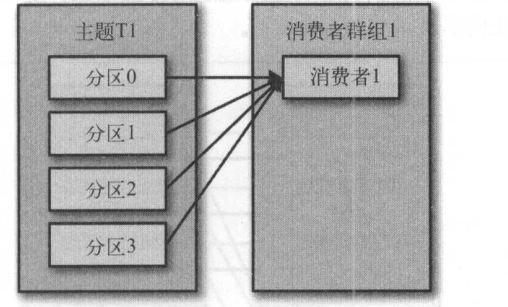
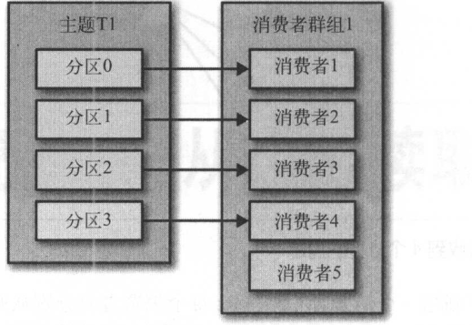

#### Kafka消费者

Kafka消费者从属于消费这群组，一个群组里面的消费者订阅的是同一个主题，每个消费者接收主题一部分分区的消息。

假设主题T1有四个分区，我们创建一个了消费者C1，它是群组G1里唯一的消费者，则消费者C1将收到主题T1全部4个分区的消息。



往群组中添加消费者后，它能够分单负载，但是如果消费者的数量超过了分区数量，将导致多余的消费者空闲




在实际的应用场景中，如果想让每个应用程序可以获取到所有的消息，而不是其中的一部分，只要保证每个应用程序都有自己的消费者群组，让它们获取到所有的消息。

#### 创建消费者

```java
 Properties properties = new Properties();
        properties.put("bootstrap.servers","127.0.0.1:9092");
        properties.put("group.id","consumerGroup");
        properties.put("key.deserializer","org.apache.kafka.common.serialization.StringDeserializer");
        properties.put("value.deserializer","org.apache.kafka.common.serialization.StringDeserializer");

        KafkaConsumer<String,String> consumer = new KafkaConsumer<String,String>(properties);
        //订阅主题,subscribe也支持正则表达式 "*_state"
        consumer.subscribe(Collections.singletonList("ext_state"));
        try {
            //轮询
            while (true) {
				//消费者必须持续对kafka进行轮询，否则会被认为已经死亡
                ConsumerRecords<String, String> records = consumer.poll(1000);
				//ConsumerRecord包含了分区的信息、记录在分区里的偏移量、以及记录的键值对
                for (ConsumerRecord<String, String> record : records) {

                    System.out.println("key:" + record.key() + "value:" + record.value());
                }

            }
        }finally {
            //退出应用之前调用close()方法关闭消费者，网络连接和socket也会随之关闭，并立即触发一次再均衡。
            consumer.close();
        }

    }
```

消费者的轮询不只是获取数据那么简单，在第一次调用新消费者的poll()方法时，它会负责查找GroupCoordinator，然后加入到群组，接受分配的分区。如果发生了再均衡，整个过程也是在轮询期间进行的，同时心跳也是从轮询里发出去的。所以我们要确保在轮询期间所做的任何工作都应该尽快完成。

#### 消费者配置

1. fetch.min.bytes

指定消费者从服务器获取记录的最小字节数。broker在收到消费者的数据请求时，如果可用的数据量小于fetch.min.bytes指定的大小，那么它会等到有足够的可用数据时才返回给消费者。

2. fetch.max.wait.ms

fetch.min.bytes告诉kafka等到有足够的数据才把它返回给消费者。而fetch.max.wait.ms则用于指定broker的等待时间，默认是500ms。broker返回数据给消费者取决于fetch.min.bytes和fetch.max.wait.ms两者的条件哪一个先满足。

3. max.partition.fetch.bytes

指定了服务器从每个分区返回给消费者的最大字节数，它的默认值是1MB。也就是说KafkaConsumer.poll方法从摩尔个分区里返回的记录最多不超过max.partition.fetch.bytes指定的字节。在为消费者分配内存时，可以给它们多分配一些因为如果群组里有消费者发生崩溃，剩下的消费者需要处理更多的分区。

max.partition.fetch.bytes的值必须比broker能够接收的最大消息的字节数（max.message.size）大，否则消费者可能无法读取这些消息，导致消费者一直挂起重试。

还需要注意消费者需要频繁的调用poll()方法来避免会话过期和发生分区再均衡，所以如果单次调用poll()返回的数据太多，消费者需要更多的时间来处理，可能无法及时进行下一次轮询来避免会话过期。

4. session.timeout.ms

该属性指定了消费者在被认为死亡之前可以与服务器断开连接的时间，默认是3S。如果消费者没有在session.timeout.ms指定的时间内发送心跳给群组协调器，就被认为已经死亡，协调器就会触发再均衡。

heartbeat.interval.ms指定了poll()方法向协调器发送心跳的频率，heartbeat.interval.ms必须比session.timeout.ms小，一般是session.timeout.ms的三分之一。

5. auto.offset.reset

该属性指定了消费者在读取一个没有偏移量的分区或者偏移量无效的情况下（消费者长期失效，包含偏移量的记录已经过期并被删除）该如何处理。它的默认值是latest，在偏移量无效的情况下，消费者将从最新的记录开始读取数据。另一个就是earliest，消费者将从起始位置读取分区的记录。

6. partition.assignment.strategy

分区会被分配给群组里的消费者，PartitionAssignor根据给定的消费者和主题，决定哪些分区应该被分配给哪个消费者。kafka默认有两个分配策略：

* Range

把主题的若干个连续的分区分配给消费者。如：假设主题T1有三个分区，消费者C1和消费者C2同时订阅了T1主题，那么C1有可能分配到这个主题的0和1分区，C2分配到主题的2分区。如果分区数量不能被消费者数量整除，那么第一个消费者最后分配到比第二个消费者更多的分区。

* RoundRonin

该策略是把主题的所有分区逐个分配给消费者。那么消费者C1可能分到主题T1的0、2分区，消费者C2分配到主题T1的1分区。默认是使用```org.apache.kafka.clients.consumer.RangeAssignor```策略，也可以指定```org.apache.kafka.clients.consumer.RoundRobinAssignor```。

7. client.id

可以是任意的字符串，broker用来标志从客户端发送过来的消息，通常被用在日志、度量指标和陪额里。

8. max.poll.records

用来控制单次调用call()方法能够返回的记录数量。

9. receive.buffer.bytes和send.buffer.bytes

socket在读写数据时用到的TCP缓冲区也可以设置大小。如果它们被设置为-1，就使用操作系统的默认值，如果生产者或消费者与broker处于不同的数据中心，可以适当的增大这些值，数据中心网络一般都有比较高的延迟。

10. enable.auto.commit

指定消费者是否自动提交偏移量，默认是true。为了防止数据重复和丢失，可以把它设置为false,由自己控制何时提交偏移量。可以通过auto.commit.interval.ms属性来控制提交的频率.

#### 提交与偏移量

消费者通过偏移量来标志生产者写入kafka但还没有被消费过的记录，消费者定时往一个叫做_consumer_offset的特殊主题发送消息，消息里面包含每个分区的偏移量。如果消费者一直处于运行状态，那么偏移量就没有什么用处。如果消费者发生崩溃或者新的消费者加入群组，就会触发再均衡，完成再均衡之后，每个消费者可能分配到新的分区，需要读取每个分区最后一次提交的偏移量，然后从偏移量指定的地方继续处理。

如果提交的偏移量小于客户端的最后一个消息的偏移量，那么处于两个偏移量之间的消息就会被重复处理。

如果提交的偏移量大于客户端最后一个消息的偏移量，那么处于两个偏移量之间的消息将会丢失。

#### 自动提交偏移量

如果偏移量的提交方式被设置为自动，那么每过5秒，消费者会自动把从poll()接收到的最大偏移量提交上去。提交间隔可以通过auto.commit.interval.ms控制。与消费者里的其它东西一样，自动提交也是在轮询里进行的。消费者每次进行轮询时会检查是否该提交偏移量，如果是，则会提交上一次轮询返回的偏移量。

假设使用5s的提交间隔，在最近一次提交之后的3s发生了再均衡，再均衡之后，消费者从最后一次提交的偏移量位置开始读取消息，这个时候偏移量已经落后来3s，所以这3s内到达的消息会被重复处理。可以通过修改提交时间间隔来频繁的提交偏移量，减少可能出现的重复消息的时间窗。

#### 手动提交当前偏移量

把auto.commit.offset设置为false，让应用程序决定何时提交偏移量。使用commitSync()会提交由poll方法返回的最新偏移量，提交成功后马上返回，如果提交失败就抛出异常。如果发生再均衡，从最近一批消息到发生再均衡之间的所有消息将被重复处理。

```
consumer.commitSync();
```

#### 异步提交当前偏移量

手动提交有一个不足，在broker对提交请求做出回应之前，应用程序会一直阻塞，这样会限制应用程序的吞吐量。这个时候可以使用异步提交API，我们只管发送提交请求，无需等待broker的响应。

```java
consumer.commitAsync();
```

在成功提交之前或碰到无法恢复的错误之前，commitSync会一直重试，但是commitAsync()不会，它之所以不会重试，是因为在它收到服务器响应的时候，可能已经有更大的偏移量已经提交成功了。

异步提交支持回调，回调经常被用于记录提交错误或者生成度量指标，如果用来进行重试，需要注意提交顺序。

```java
consumer.commitAsync(new OffsetCommitCallback() {
@Override
	public void onComplete(Map<TopicPartition, OffsetAndMetadata> offsets, Exception exception) {
    	if (exception != null){
                            
        }
     }
 });
```

一般情况下，偶尔出现提交失败不进行重试是没有太大问题的，因为后续的提交总会有成功的，但是如果这是发生在消费者关闭之前，就需要确保提交能够成功。

```java
try {
            //轮询
            while (true) {
                ConsumerRecords<String, String> records = consumer.poll(1000);
                for (ConsumerRecord<String, String> record : records) {
                    System.out.println("key:" + record.key() + "value:");
                }
                consumer.commitAsync();
            }
        }finally {
            try {
                consumer.commitSync();
            }finally {
                consumer.close();
            }

        }
```

如上：平常的提交通过异步方式来提交偏移量，但是如果是关闭消费者，使用同步提交方式，使用commitSync()方法会一直重试，直到提交成功或者无法恢复的错误。

#### 提交特定的偏移量

消费者API允许在调用commitSync()和commitAsync方法时，传进去希望提交的分区和偏移量的map。

```java
//创建一个存放偏移量的集合，key为topic+partition,value为偏移量
Map<TopicPartition,OffsetAndMetadata> currentOffsets = new HashMap<>();
 
  while (true) {
  	ConsumerRecords<String, String> records = consumer.poll(1000);

    for (ConsumerRecord<String, String> record : records) {

        System.out.println("key:" + record.key() + "value:" + record.value());
		//保存到map集合
        currentOffsets.put(new TopicPartition(record.topic(),record.partition()),new OffsetAndMetadata(record.offset()+1,""));
         count ++;
         if (count % 1000 == 0){
             //提交偏移量
             consumer.commitAsync(currentOffsets,null);
         }
     }
}
 
```

#### 再均衡监听器

在消费者执行subscribe方法时传进去一个ConsumerRebalanceListener实例就可以了，它有两个需要实现的方法：

* onPartitionsRevoked()：会在再均衡之前和消费者停止读取消息之后被调用，如果在这里提交偏移量，下一个接管分区的消费者就知道该从哪里开始读取了。
* onPartitionsAssigned()：会在重新分配分区之后和消费者开始读取消息之前被调用。

```java
KafkaConsumer<String,String> consumer = new KafkaConsumer<String,String>(properties);
 class HandleRebalance implements ConsumerRebalanceListener{

 	@Override
    public void onPartitionsRevoked(Collection<TopicPartition> partitions) {
    	System.out.println("committing current offsets"+currentOffsets);
        //提交偏移量，提交的是最近处理过的偏移量，而不是批次中还在处理的最后一个偏移量。
    	consumer.commitSync(currentOffsets);//提交偏移量
    }
    @Override
    public void onPartitionsAssigned(Collection<TopicPartition> partitions) {
        
    }
}
consumer.subscribe(Collections.singletonList("ext_state"),new HandleRebalance());

while (true) {
 	ConsumerRecords<String, String> records = consumer.poll(1000);
    for (ConsumerRecord<String, String> record : records) {

         System.out.println("key:" + record.key() + "value:" + record.value());

         currentOffsets.put(new TopicPartition(record.topic(),record.partition()),
           new OffsetAndMetadata(record.offset()+1,""));
     }

        consumer.commitAsync(currentOffsets,null);
  }
```

#### 将偏移量保存到数据库

为了确保数据不会丢失或者数据库中不会保存相同的记录，我们需要将保存记录和保存偏移量放在同一个事务中，保证在同一个原子操作里完成，要么都成功提交，要么都不提交。

1. 前面的均衡器监听器中有讲过onPartitionsRevoked()方法会在再均衡之前和消费者停止读取消息之后被调用，因此我们可以在这个方法中提交事务，确保在失去分区所有权之前保存了这些信息。
2. onPartitionsAssigned会在重新分配分区之后和消费者开始读取消息之前被调用，可以从数据库中查询分区的偏移量，然后在分配到新分区的时候通过seek()方法定位到那些记录。
3. 创建完均衡监听器后，我们需要订阅主题触发监听，然后调用一次poll方法，让消费者加入到消费者群组里，然后分配到新的分区后，会触发onPartitionsAssigned方法，然后马上调用seek()方法定位分区的偏移量。
4. 定位完分区后，在while()循环中重新调用poll方法来获取记录。
5. 最后更新数据库中的偏移量和记录。

