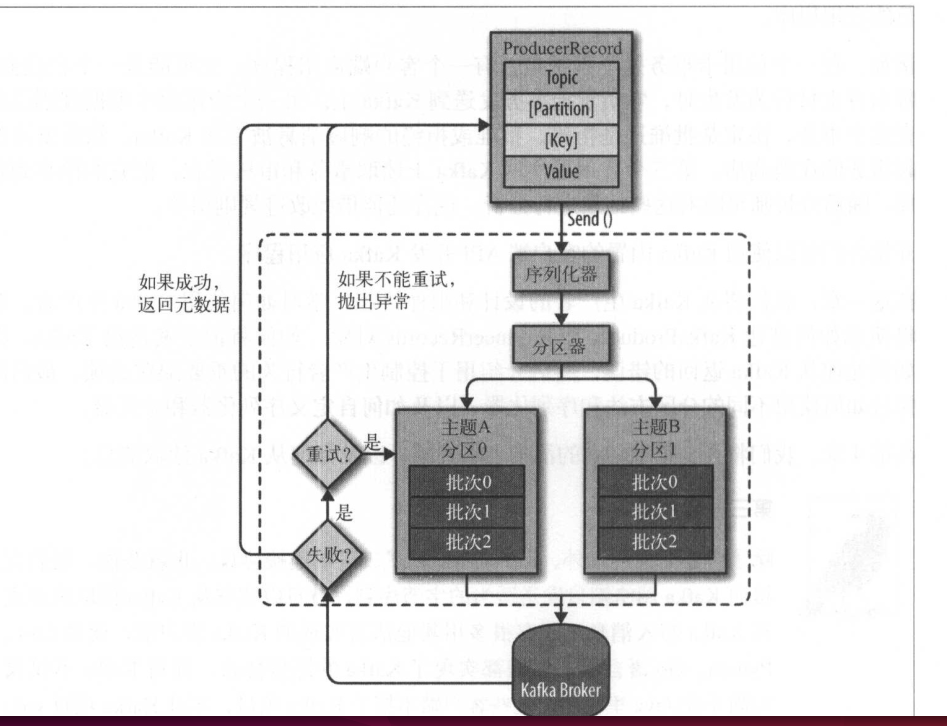

#### Kafka生产者

Kafka发送消息的主要步骤




#### 流程

1. 首先我们创建一个ProducerRecord，这个对象需要指定包含消息的主题(topic)和值(value)，可以指定选择指定一个键值(key)或者分区(partition)。
2. 发送消息时，生产者会对键值和值序列化成字节数组，然后发送到分配器(partitioner)。
3. 如果我们指定了分区，那么分配器返回该分区即可，否则分配器将会基于键值来选择一个分区并返回。
4. 选择完分区后，生产者知道了消息所属主题和分区，它将这条记录添加到相同主题和分区的批量消息中，另外一个线程负责发送这些消息到对应的Kafka broker。
5. 当broker接收到消息后，如果成功写入则返回一个包含消息主题、分区以及位移的RecordMetadata对象，否则返回异常。
6. 生产者接收到结果后，对于异常可能会进行重试。


producer的首要功能就是向某个topic的某个分区发送一条消息，所以它首先需要确认到底要向topic的哪个分区写入消息－这就是分区器(partitioner)要做的事情。Kafka producer提供了一个默认的分区器，对于每天待发送的消息，如果指定了key，那么该partitioner会根据key的哈希值来选择目标分区；若这条消息没有指定key，则partitioner使用轮询的方式确认目标分区，保证了消息均匀的分布到所有分区上。

每个topic分区都由若干个副本组成，其中的一个副本充当leader的角色，也只有leader才能够响应client发送过来的请求，而剩下的副本有一部分副本会与leader 副本保持同步。因此producer 要做的第二件事就是要寻找这个分区对应的leader，producer 也有了多种选择来实现消息发送，比如不等任何副本的响应便返回成功，或者只等待leader 副本响应写入操作后再返回成功等。

#### 生成者配置

1. acks

acks 参数指定了必须有多少个分区副本收到消息，生产者才会认为消息写入成功。

* acks=0，生产者在成功写入消息之前不会等待任何来自服务器的响应。也就是说如果当中出现了问题导致服务器没有收到消息，那么生产者也就无从得知，消息也就丢失了。
* acks=1，只要集群的首领节点收到消息，生产者就会收到一个来自服务器的成功响应。
* acks=all，只有当所有的参与复制的节点全部收到消息时，生产者才会收到一个来自服务器的成功响应。

2. buffer.memory

该参数用来设置生产者内存缓冲区的大小，生产者用它来缓冲要发送到服务器的消息。单位是字节，默认值是33554432，即32MB。如果应用程序发送的消息的速度超过发送到服务器的速度，会导致生产者空间不足。这个时候send方法调用要么被阻塞，要么抛出异常。

3. compression.type

默认值是none，即消息发送不会被压缩。该参数可以设置为snappy,gzip,lz4。snappy算法在占用较少的CPU的情况下，可以提供较好的性能和可观的压缩比，如果比较关注性能和网络带宽，可以使用这种算法。gzip压缩算法一般会占用较多的CPU，但会提供较高的压缩比，所以网络带宽比较有限，可以使用这种算法。

4. retries

生产者可能从服务器收到临时性错误，如：分区找不到首领，在这种情况下，retries参数的值决定了生产者可以重发消息的次数。如果次数达到了，生产者会放弃重试并返回错误。默认情况下生产者会在每次重试之间等待100ms，所以建议设置重试次数和重试时间间隔之前，先测试一下恢复一个奔溃的节点需要多少时间（比如所有分区选出首领需要多少时间），让总的重试时间比kafka集群从崩溃中恢复的时间长，否则生产者会过早的放弃重试。在实际生产环境，我们只需要处理那些不可重试的错误（如：消息太大）或者重试次数超过上限的情况。

5. batch.size

当有多个消息需要被发送到同一个分区时，生产者会它们放在同一个批次里。该参数指定了一个批次可以使用的内存大小。当批次被填满，批次里的所有的消息被发送出去，不过生产者不一定会等到批次被填满才发送，半满、甚至一个消息的批次也有可能被发送。

通常来说，一个小的batch中含有的消息数很少，因而一次发送请求能够写入的消息数很少，所以producer的吞吐量会很低；若一个batch非常巨大，那么会给内存使用带来极大的压力，因为不管是否能够填满，producer 都会为该batch分配固定大小的内存。

batch.size参数默认值是12384，即16kb。在实际使用过程中合理使用该参数值，通常都会发现producer的吞吐量得到了相应的增加。


6. linger.ms

该参数指定生产者在发送批次之前等待更多消息加入批次的时间。默认情况下，只要有可用的线程，生产者就会把消息发送出去，就算批次里只有一个消息。

7. client.id

该参数可以是任何的字符串，服务器会用它来识别消息的来源，还可以用在日志和配额指标里。

8. max.in.flight.request.per.connection

指定生产者在收到服务器响应之前可以发送多少个消息，把它设置为1可以保证消息是按照发送的顺序写入到服务器的，即使发生了重试。

9. timeout.ms、request.timeout.ms和metadata.fetch.timeout.ms

request.timeout.ms指定了生产者在发送数据时等待服务器返回响应的时间

metadata.fetch.timeout.ms 指定了生产者在获取元数据（比如目标分区的首领是谁）时等待服务器返回的响应时间。

timeout.ms 指定了broker等待同步副本返回消息确认的时间与asks的配置相匹配。

10. max.block.ms 

指定在调用send()方法或者使用partitionsFor()方法获取元数据时生产者的阻塞时间。当生产者的发送缓存区已经满了，或者没有可以用的元数据时，这些方法会阻塞。在阻塞时间达到max.block.ms时，生产者会抛出异常。

11. max.request.size

用来控制生产者发送的请求大小。它可以指定能发送的单个消息的最大值，也可以指单个请求里所有消息总的大小。例如：假设这个值为1M，那么可以发送单个最大消息为1M,或者生产者可以在单个请求里发送一个批次，该批次包含了1000个消息，每个消息的大小为1K。另外broker也有自己可以接收消息的限制，所以最好两边的配置可以匹配。

12. receive.buffer.bytes和send.buffer.bytes

这两个参数分别指定了TCP socket接收和发送数据包的缓冲区大小，如果它们被设置为-1，就使用槽系统的默认值。

#### Java API 调用

```java
public static void main(String[] args){

        Properties properties = new Properties();

        properties.put("bootstrap.servers","localhost:9092");
        properties.put("key.serializer","org.apache.kafka.common.serialization.StringSerializer");
        properties.put("value.serializer","org.apache.kafka.common.serialization.StringSerializer");
        properties.put("acks","-1");
        properties.put("retries",3);
        properties.put("batch.size",323840);
        properties.put("linger.ms",10);
        properties.put("buffer.memory",33554432);
        properties.put("max.block.ms",3000);
        Producer<String,String> producer = new KafkaProducer<String, String>(properties);
        for(int i = 0; i < 100;i++){
            producer.send(new ProducerRecord<>("my-topic",Integer.toString(i),Integer.toString(i)));
        }
        producer.close();

    }
```

1. 构造Properties 对象

首先要构造一个Properties对象，然后指定producer的参数，其中如下三个参数是生产者必须的：

* bootstrap.servers

该参数指定了一组host:port对，用于创建向Kafka broker服务器的连接，如果Kafka集群数很多，那么只需要指定部分broker即可，producer都会通过该参数找到并发现集群中所有的broker。该参数指定多台机器只是为了故障转移使用。

* key.serializer

被发送到broker端的任何消息的格式都必须是字节数组，因此消息的各个组件必须先做序列化，然后才能发送到 broker。该参数是为消息的key做序列化。org.apache.kafka.common.serialization.StringSerializer该类会将字符串转化成字节数组。

* value.serializer

和key.serializer类似，只是它用来对消息体部分做序列化，将消息value转成字节数组。

2. 构建KafkaProducer对象

KafkaProducer是producer的主入口，所有的功能基本都是由KafkaProducer来提供。

```java
Producer<String,String> producer = new KafkaProducer<String, String>(properties);
```

3. 构建ProducerRecord对象

构造好KafkaProducer实例后，下一步就是构造消息实例。

```java
new ProducerRecord<>("my-topic",Integer.toString(i),Integer.toString(i))
```

4. 发送消息

本节开始的代码清单中调用的方式是发送后就不再理会发送结果，这种方式在实际中是不推荐使用的，因为对发送结果producer程序完全不知，所以在真实使用场景中，同步和异步的发送方式还是最常见的两种方式：

* 异步发送：

Java版本producer的send方法会返回一个Java Future对象供用户稍后获取发送结果：

```java
 producer.send(producerRecord, new Callback() {
 	@Override
    public void onCompletion(RecordMetadata recordMetadata, Exception e) {

    	if (e == null){

                     //发送消息成功

       	}else {
                        //发送消息失败
              }

        }
   });
```

上面代码中的Callback就是发送消息后的回调类，回调后的处理逻辑在onCompletion方法中处理。若消息发送成功，exception是null；反之，若消息发送失败，metadata 就是null。

* 同步发送

同步发送和异步发送其实就是通过Java的Future来区分的，Future.get()无限等待结果返回：

```java
producer.send(producerRecord).get();
```


不管同步发送还是异步发送，发送都有可能失败，导致返回异常错误。Kafka的错误包含两类：可重试和不可重试异常：

* LeaderNotAvailableException：分区的leader副本不可用，这通常出现在leader换届选举期间，通常是瞬时的异常，重试之后可以自行恢复。
* NotControllerException：controller当前不可用，这通常表明controller在经历新一轮的选举，可以通过重试机制自行恢复。
* NetworkException：网络瞬时故障导致的异常。

对于可重试的异常，如果在producer程序中配置了重试次数，那么只要在规定的重试次数内自行恢复了，便不会出现在onCompletion 的 exception中。

所有可重试异常都继承自org.apache.kafka.common.errors.RetriableException，理论上所有未继承自RetriableException类的其他异常都属于不可重试异常，这类异常表明一些非常严重或者Kafka无法处理的问题，如与producer相关的：

* RecordTooLargeException：发送的消息尺寸过大，超过了规定的大小上限。
* SerializationException：序列化失败异常。
* KafkaException：其他类型异常。

所以我们可以在producer 程序端判断异常是可重复与不可重复，然后再进行区分处理：

```java
if(e instanceof RetriableException){
	//可重复异常
 }else{
     //不可重复异常                      
 }
```

5. 关闭 producer

不管消息发送成功还是失败，只要producer程序完成了既定的工作，就应该被关闭。

#### 分区

构建一个生产者对象（ProducerRecord）包含主题、键和值。Kafka的消息是一个个键值对。键的作用决定消息被写到主题的哪个区，拥有相同的键的消息将被写到同一个分区。

如果键的值为null，并且使用了默认的分区器，那么记录将被随机地发送到主题内各个可用的分区上。分区器使用轮询算法将消息均匀的分布到各个分区上。

如果键不为空，并且使用了默认的分区器，那么kafka会对键进行散列，然后根据散列值把消息映射到特定的分区上。同一个key会一直映射到同一个分区上，所以如果这个分区不可用。那么就会发生错误。

#### 自定义分区机制

Java版本自带的partitioner会根据murmur2算法计算消息key的哈希值，然后对总分区数求模得到要被发送到目标分区号。

自定义分区主要完成两件事情：

1）在producer程序中创建一个类，实现org.apache.kafka.clients.producer.Partitioner接口，主要分区逻辑在partition中实现。

2）在用于构造KafkaProducer的Properties对象中设置partitioner.class参数。

```java
public interface Partitioner extends Configurable, Closeable {

    public int partition(String topic, Object key, byte[] keyBytes, Object value, byte[] valueBytes, Cluster cluster);

    public void close();

}
```

如上Partitioner接口中，partition方法接收topic、key、value，还有集群的元数据信息，一起来确定目标分区；close方法用于关闭partitioner的，主要是为了关闭那些创建partitioner时初始化的系统资源。

```java
public class AuditPartitioner implements Partitioner {

    private Random random;

    @Override
    public int partition(String topic, Object objectKey, byte[] keyBytes, Object value, byte[] valueBytes, Cluster cluster) {
        String key = (String) objectKey;
        //获取topic可用的分区
        List<PartitionInfo> partitionInfos = cluster.availablePartitionsForTopic(topic);
        return key == null || key.isEmpty() || !key.contains("audit")
                ? random.nextInt(partitionInfos.size() -1):partitionInfos.size() -1;
    }

    @Override
    public void close() {

        //该方法实现必要资源的清理工作

    }

    @Override
    public void configure(Map<String, ?> configs) {

        //该方法实现必要资源的初始化工作
        random = new Random();
    }
}
```

创建了一个自定义分区策略类后，我们还需要在配制对象中指定完整类路径：

```
properties.put(ProducerConfig,PARTITIONER_CLASS_CONFIG,"com.xx.Producer.AuditPartitioner");
```


#### 序列化

和分区策略类似，Kafka支持用户自定义消息序列化：

1）自定义数据对象格式

2）创建自定义序列化类，实现Serializer接口，在serializer方法中实现序列化逻辑。

3）在用于构造KafkaProducer的Properties对象中设置key.serializer或者value.serializer（取决于为消息key还是value做自定义序列化）。


#### producer 拦截器

对producer而言，interceptor使得用户在消息发送前以及producer回调逻辑前有机会对消息做一些定制化需求。producer允许用户指定多个interceptor，并按照顺序作用于同一条消息从而形成拦截链。

* onSend(ProducerRecord)：该方法封装进KafkaProducer.send方法中，它运行在用户主线程中。producer确保在消息被序列化以计算分区前调用该方法。
* onAcknowledgement(RecordMetadata,Exception)：该方法会在消息被应答之前或消息发送失败时调用，并且通常都是在producer回调逻辑触发之前。onAcknowledgement运行在producer的I/O线程中，因此不要在该方法中放入很重的逻辑，否则会拖慢producer的消息发送效率。
* close：关闭interceptor，主要执行一些资源清理工作。

```java
public class TimeStampPrependerInterceptor implements ProducerInterceptor<String,String> {

    @Override
    public ProducerRecord<String, String> onSend(ProducerRecord<String, String> record) {

        return new ProducerRecord<>(record.topic(),record.partition(),record.timestamp()
        ,record.key(),System.currentTimeMillis()+","+record.value().toString());
    }

    @Override
    public void onAcknowledgement(RecordMetadata metadata, Exception exception) {

    }

    @Override
    public void close() {

    }

    @Override
    public void configure(Map<String, ?> configs) {

    }
}
```

```java
public class CounterInterceptor implements ProducerInterceptor<String,String> {

    private int errorCounter = 0;

    private int successCounter = 0;

    @Override
    public ProducerRecord<String, String> onSend(ProducerRecord<String, String> record) {
        return record;
    }

    @Override
    public void onAcknowledgement(RecordMetadata metadata, Exception exception) {

        if (exception == null){
            successCounter ++;
        }else {
            errorCounter ++;
        }

    }

    @Override
    public void close() {

        System.out.println("Successful send" + successCounter);
        System.out.println("Failed send :" + errorCounter);

    }

    @Override
    public void configure(Map<String, ?> configs) {

    }
}
```

定义好interceptor之后，需要在producer主程序中指定它们：

```java
 List<String> interceptors = new ArrayList<>();
        interceptors.add("com.yy.kafka.kafkaservice.producer.TimeStampPrependerInterceptor");
        interceptors.add("com.yy.kafka.kafkaservice.producer.CounterInterceptor");
        properties.put(ProducerConfig.INTERCEPTOR_CLASSES_CONFIG,interceptors);
```


#### 无消息丢失配置

Java版本producer用户采用异步发送机制。KafkaProducer.send方法仅仅把消息放入缓冲区中，由一个专属I/O线程负责从缓冲区中提取消息并封装进消息batch中，然后发送出去。这个过程存在着数据丢失：若I/O线程发送之前producer崩溃，则存储缓冲区中的消息全部丢失。

另一个问题是消息的乱序：

```java
producer.send(record1);
producer.send(record2);
```

producer依次发送record1和record2，若此时由于某些原因导致record1未发送成功，同时Kafka又配置了重试机制，那么重试record1成功后，record1在日志中的位置反而位于record2之后，这样就造成了消息的乱序。

鉴于这两个问题，可以考虑把异步发送改成同步，但是这样性能会很差，并不推荐在实际场景中使用。

**producer 端配置**

* block.on.buffer.full = true

这个参数在Kafka 0.9.0.0版本已经被标记为"deprecated"，并使用max.block.ms 参数替代，但是这里还是推荐设置它为true,使得内存缓冲区被填满时，producer处于阻塞状态并停止接收新的消息而部署抛出异常；否则producer生产速度过快回耗尽缓冲区。

* acks = all

即必须等待所有follower都响应来发送消息才能认为提交成功，这是producer端最强程度的持久化保证。

* retries=Integer.MAX_VALUE

设置成MAX_VALUE纵然有些极端，但其实想表达的是producer要开启无限重试，所以设置一个比较大的值通常能很好地保证消息不丢失。

* max.in.flight.requests.per.connection=1

该参数为1主要是为了防止topic同分区下的消息乱序问题。这个参数的实际效果其实限制了producer在单个broker连接上能够发送的未响应请求的数量，因此如果设置为1，则producer在某个broker发送响应之前将无法再给该broker发送PRODUCER请求。

**broker配置**

* unclean.leader.election.enable=false

关闭unclean leader 选举，即不允许非 isr中的副本被选举为leader，从而避免broker端因日志水位截断而造成的消息丢失。

* replication.factor >= 3

使用多个副本来保存分区的消息。

* min.insync.replicas > 1

用于控制某条消息至少被写入到ISR中多少个副本才算成功，设置成大于1是为了提升producer端发送语义的持久性。只要在producer端acks被设置为all或者-1时才有意义。