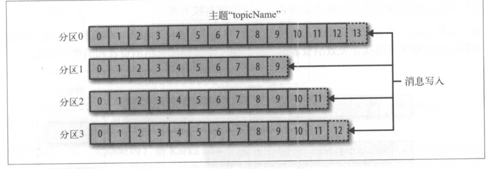
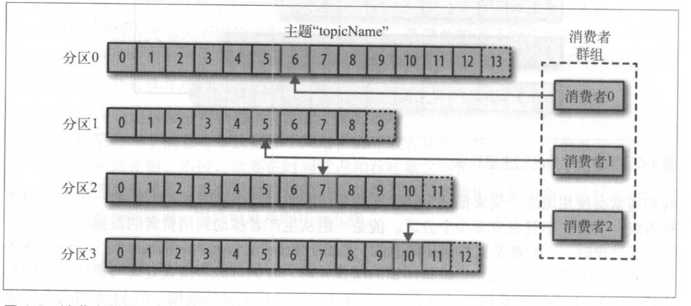
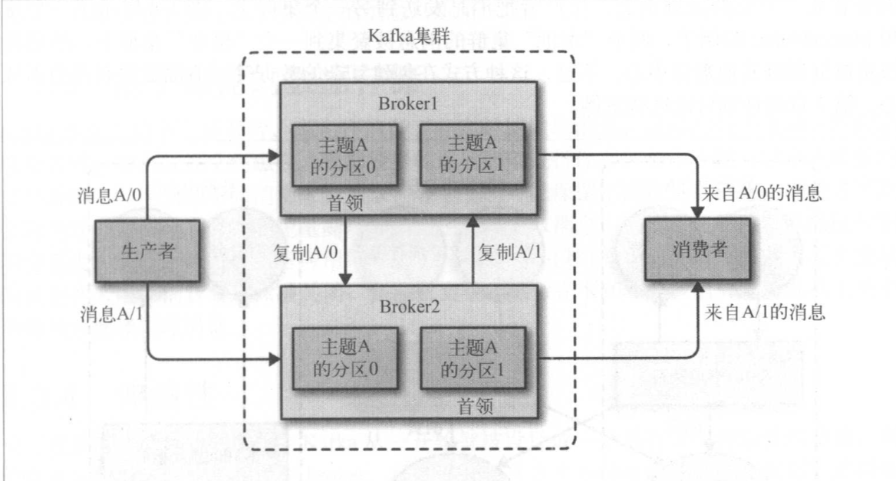

### 初识kafka

1. 消息和批次

Kafka的数据单元称为消息，可以把消息看成数据库里的一个“数据行”或一条记录。消息没有特别的格式或含义。但是它有一个可选的元数据，也就是键，当消息以一种可控的方式写入不同的分区时，会用到键。最简单的方式就是为键生成一个一致性散列值，然后使用散列值对主题分区数进行取模，为消息选取分区。

批次就是一组消息，这些消息同属于一个主题和分区，如果一个消息都单独穿行于网络，会导致大量的网络开销，把消息分成批次传递可以减少网络开销。但是批次越大，单位时间内处理的消息就越多，单个消息的传输时间就越长。

2. 模式


对于Kafka来说，消息不过是字节数组，所以有人建议用一些额外的结构来定义消息内容，让它们更容易理解。根据应用程序的需求，消息模式有许多可用选项。像JSON和XML，不仅易用，而且可读性好。

3. 主题和分区

Kafka消息通过主题进行分类，主题就好比数据库的表。主题可以分为若干个分区，一个分区就是一个提交日志。消息以追加的方式写入分区，然后以先入先出的顺序读取。要注意一个主题一般包含几个分区，因此无法在整个主题范围内保证消息的顺序，但可以保证消息在单个分区内的顺序。



4. 生成者和消费者

* 生产者

生产者创建消息。默认情况下，消息被均衡地分布到主题的所有的分区上。不过在某些情况下，生产者通过消息键和分区器来将消息写到指定的分区。

* 消费者

消费者读取消息。消费者可以订阅一个或者多个主题，然后通过消息偏移量来区分已经读取过的消息。偏移量是一个不断递增的整数值，在创建消息时，Kafka会把它添加到消息里。在给定的分区里，每个消息的偏移量都是唯一的。

消费者是消费者群组的一部分，也就是说会有一个或者多个消费者共同读取一个主题。群组保证每个分区只能被一个消费者使用。而且，如果一个消费者失效，群组里的其它消费者可以接管失效消费者的工作。



5. broker和集群

一个独立的kafka服务器被称为broker。broker接收来自生产者的消息，为消息设置偏移量，并提交消息到磁盘保存。broker为消费者提供服务，对读区分区的请求作出响应，返回已经提交到磁盘上的消息。

broker是集群的组成部分。每个集群都有一个broker同时充当了集群控制器的角色，控制器负责管理工作，包括将分区分配给broker和监控broker。

一个分区从属于一个broker，该broker被称为分区的首领。一个分区可以分配给多个broker，这个时候会发生复制。这种机制为分区提供消息冗余，如果有一个broker失效，其它broker可以接管领导权。




#### 安装Kafka

1. 安装 Java
2. 安装Zookeeper

Kafka使用Zookeeper保存集群的元数据信息和消费者信息(老版本)。

* 下载Zookeeper压缩包，并解压。
* 编辑conf目录下的zoo.cfg文件

```
tickTime=2000
dataDir=/Users/user/Documents/ProgramFile/zk-data/
clientPort=2181
```

* 在dir目录下面创建一个myid文件，myid文件中只要一个数字。注意：确保每个服务器的myid文件中的数字不同。
* 启动Zookeeper服务器

```
bin/kafka-server.sh start config/server.properties
```

**安装多节点Zookeeper**

既然是多节点，那么最好使用奇数个服务器，即2n+1个服务器，比如5台Zookeeper服务器构建集群，倘若2台服务器宕机，剩下的3台服务器占了半数以上，故而Zookeeper服务正常工作；但加入使用了4台服务器，若2台服务器宕机，剩下的2台服务器不满足“半数以上服务器存活”的条件，因此集群将停止服务。

zoo1.cfg配置文件

```
tickTime=2000
dataDir=/Users/user/Documents/ProgramFile/zk-data/zk1/
clientPort=2181
initLimit=5
syncLimit=2
server.1=127.0.0.1:2888:3888
server.2=127.0.0.1:2889:3889
server.3=127.0.0.1:2890:3890
```

zoo2.cfg配置文件

```
tickTime=2000
dataDir=/Users/user/Documents/ProgramFile/zk-data/zk2/
clientPort=2182
initLimit=5
syncLimit=2
server.1=127.0.0.1:2888:3888
server.2=127.0.0.1:2889:3889
server.3=127.0.0.1:2890:3890
```

zoo3.cfg配置文件

````
tickTime=2000
dataDir=/Users/user/Documents/ProgramFile/zk-data/zk1/
clientPort=2183
initLimit=5
syncLimit=2
server.1=127.0.0.1:2888:3888
server.2=127.0.0.1:2889:3889
server.3=127.0.0.1:2890:3890
````

启动：

```
zkServer.sh  start  ../conf/zoo1.cfg 
zkServer.sh  start  ../conf/zoo2.cfg 
zkServer.sh  start  ../conf/zoo3.cfg 
```

查看运行状态：

```
zkServer.sh status ../conf/zoo1.cfg 
```


3. 安装Kafka Broker

修改配置文件中日志保存路径

```
log.dirs=/Users/user/Documents/ProgramFile/kafka-data
```

启动：

```
kafka-server-start.sh -daemon ../config/server.properties 
```

往测试主题上发布消息：

```
kafka-console-producer.sh --broker-list localhost:9092 --topic test
>Test Message1
```

从测试主题上读取消息：

```
kafka-console-consumer.sh --zookeeper localhost:2181 --topic test --from-beginning
test message1
```


**多节点部署Kafka**

* 修改配置文件

```
broker.id=0
listeners=PLAINTEXT://localhost:9092
log.dirs=/Users/user/Documents/ProgramFile/kafka-data/kafka1
zookeeper.connect=localhost:2181,localhost:2182,localhost:2183
```

```
broker.id=1
listeners=PLAINTEXT://localhost:9093
log.dirs=/Users/user/Documents/ProgramFile/kafka-data/kafka2
zookeeper.connect=localhost:2181,localhost:2182,localhost:2183
```

```
broker.id=2
listeners=PLAINTEXT://localhost:9094
log.dirs=/Users/user/Documents/ProgramFile/kafka-data/kafka3
zookeeper.connect=localhost:2181,localhost:2182,localhost:2183
```

* 启动

```
kafka-server-start.sh -daemon ../config/server1.properties
kafka-server-start.sh -daemon ../config/server2.properties
kafka-server-start.sh -daemon ../config/server3.properties
```

* 确认broker进程启动成功

可以查看kafka log文件或者通过如下命令查看：

```
jps |grep Kafka
```

* 验证部署

测试topic创建与删除

```
kafka-topics.sh --zookeeper localhost:2181,localhost:2182,localhost:2183 --create --topic test-topic --partitions 3 --replication-factor 3

Created topic "test-topic".
```

上面的输出表明topic已经被创建成功，我们还可以运行一些命令来做详细验证：

```
kafka-topics.sh --zookeeper localhost:2181,localhost:2182,localhost:2183 --describe --topic test-topic

Topic:test-topic	PartitionCount:3	ReplicationFactor:3	Configs:
	Topic: test-topic	Partition: 0	Leader: 2	Replicas: 2,0,1Isr: 2,0,1
	Topic: test-topic	Partition: 1	Leader: 0	Replicas: 0,1,2Isr: 0,1,2
	Topic: test-topic	Partition: 2	Leader: 1	Replicas: 1,2,0Isr: 1,2,0
```

如上显示，该topic下有3个分区，每个分区有三个副本。每个分区的leader分别是0、1、2，表明Kafka将该 topic的这三个分区均匀地在三台broker上进行了分配。

测试删除topic：

```
kafka-topics.sh --zookeeper localhost:2181,localhost:2182,localhost:2183 --delete --topic test-topic

Topic test-topic is marked for deletion.
Note: This will have no impact if delete.topic.enable is not set to true.
```

上面的输出仅仅表示该topic被成功标记为“待删除”，至于是否会被真正删除取决于broker 端参数delete.topic.enable。

通过如下命令查看当前topic列表：

```
kafka-topics.sh --zookeeper localhost:2181,localhost:2182,localhost:2183 --list
```

测试消息发送和消费

kafka默认提供了kafka-console-producer和kafka-console-consumer脚本，这对脚本可以很方便的用来测试消息的发送和读取。

生产者：

```
kafka-console-producer.sh --broker-list localhost92,localhost:9093,localhost:9094 --topic test-topic1
```

消费者：

```
kafka-console-consumer.sh --bootstrap-server localhost:9092,localhost:9093,localhost:9094 --topic test-topic1 --from-beginning
```


生产者吞吐量测试

```
kafka-producer-perf-test.sh --topic test-topic --num-records 500000 --record-size 200 --throughput -1 --producer-props bootstrap.servers=localhost:9092,localhost:9093,localhost:9094 acks=1

500000 records sent, 112258.643916 records/sec (21.41 MB/sec), 852.30 ms avg latency, 1249.00 ms max latency, 1063 ms 50th, 1235 ms 95th, 1245 ms 99th, 1248 ms 99.9th.
```

如上测试结果：Kafka producer 的平均吞吐量是21.41MB/s，即占用171.28Mb(21.41*8)/s左右的带宽，平均每秒能发送112258条消息，平均延时0.8秒，最大延时是1.24秒，50%的消息发送需要发费1.06秒，95%的消息需要发费1.23秒，99%的消息需要发费1.24秒发送。

消费者吞吐量测试：

```
kafka-consumer-perf-test.sh --broker-list localhost:9092,localhost:9093,localhost:9094 --fetch-size 200 --messages 500000 --topic test-topic 

start.time, end.time, data.consumed.in.MB, MB.sec, data.consumed.in.nMsg, nMsg.sec, rebalance.time.ms, fetch.time.ms, fetch.MB.sec, fetch.nMsg.sec
2019-03-01 16:41:18:929, 2019-03-01 16:41:25:027, 95.3802, 15.6412, 500070, 82005.5756, 80, 6018, 15.8492, 83095.7129
```

上面的测试消费50万条消息的consumer的吞吐量，在该环境中consumer在总共消费了95MB的消息，吞吐量大约为 15MB/s


#### broker 配置

1. broker.id

每个borker 都需要一个标识符，使用broker.id来表示。它的默认值是0，也可以设置成任意整数。

2. port

如果使用配置样本来启动Kafka，它会监听9092端口。修改port配置参数可以将它设置成其他任意可用的端口。如果使用1024以下的端口，需要使用root权限启动Kafka。

3. zookeeper.connect

用于保存broker元数据的Zookeeper地址通过zookeeper.connect来指定.

4. log.dirs

kafka把所有消息都保存在磁盘上，存放这些日志片段的目录是通过log.dirs指定。如果指定了多个路径，那么broker会根据“最少使用”原则，把同一个分区的日志片段保存到同一个路径下。

5. num.recovery.threads.per.data.dir

对于如下3种情况，kafka会使用可配置的线程池来处理日志片段：

* 服务器正常启动，用于打开每个分区的日志片段。
* 服务器崩溃后重启，用于检查和截断每个分区的日志片段。
* 服务器正常关闭，用于关闭日志片段。

默认情况下，每个日志目录只使用一个线程。因为这些线程只是在服务器启动和关闭时会用到，所以完全可以设置大量的线程来达到并行操作的目的。特别对于包含大量分区的服务器来说，一旦发生崩溃，在进行恢复时使用并行操作可能会省下数小时的时间。设置此参数时需要注意，所配置的数字对应的是log.dirs指定的单个日志目录。也就是说，如果num.recovery.threads.per.data.dir被设置为8，并且log.dir设定了3个目录，那么总共需要24个线程。

6. auto.create.topics.enable

默认情况下，Kafka会在如下几种情形下自动创建主题：

* 当一个生产者开始往主题写入消息时
* 当一个消费者开始从主题读取消息时
* 当任意一个客户端向主题发送元数据时。

7. listeners

broker 监听起CSV列表，该参数主要用于客户端连接broker使用，可认为是broker 端开发给clients的监听端口。如果不指定主机名，则表示绑定默认网卡；如果主机名是0.0.0.0，则表示绑定所有网卡。Kafka当前支持的协议类型包括PLAINTEXT,SSL及SASL_SSL等。

#### 主题的默认配置

1. num.partitions

num.partitions参数指定了新创建的主题包含多少个分区。该参数的默认值是1。要注意，我们增加主题分区的个数，但不能减少分区的个数。

2. log.retention.ms

Kafka通常根据时间来决定数据可以被保留多久。默认使用log.retention.hours参数来配置时间，默认值为168小时，也就是一周。除此以外，还有其他两个参数log.retention.minutes和log.retention.ms。这三个参数的作用是一样的，都是决定消息多久以后会被删除，如果指定连不止一个参数，Kafka会优先使用最小值的那个参数。

3. log.retention.bytes

通过保留的消息字节数来判段消息是否过期。它作用在每一个分区上，即如果有一个包含8个分区的主题，并且log.retention.bytes被设置为1GB，那么这个主题最多可以保留8GB的数据。

如果同时指定了log.retention.bytes和log.retention.ms，只要任意一个条件得到满足，消息就会被删除。例如：log.retention.bytes被设置为86 400 000（一天）,log.retention.bytes设置为100 000 000 (1GB)，如果消息字节总数在不到一天的时间就超过了1GB，那么多出来的部分也会被删除。相反，如果消息字节总数小于1GB，那么一天之后这些消息也会被删除，尽管分区的数据总量小于1GB。

4. log.segment.bytes

当消息到达broker时，它们被追加到分区的当前日志片段上，当日志片段大小达到log.segment.bytes指定的上限（默认是1G）时，当前日志片段就会被关闭，一个新的日志片段被打开。如果一个日志片段被关闭，就开始等待过期。这个参数的值愈小，就会越频繁地关闭和分配新文件，从而降低磁盘写入的整体效率。  例如：如果一个主题每天只接收100MB的消息，而log.segment.bytes使用默认设置，那么需要10天时间才能填满一个日志片段，因为在片段被关闭之前消息是不会过期的，所以如果log.retention.ms被设置为604800000(1周)，那么日志片段最多需要17天才会过期。

5. log.segment.ms

另一个可以控制日志片段关闭时间的参数是log.segment.ms，它指定了多长时间之后日志片段会被关闭。日志片段会在大小和时间达到上限时被关闭，就看哪个条件先得到满足。

6. message.max.bytes

broker通过设置message.max.bytes参数来限制单个消息的大小，默认值是1000000，也就是1MB。如果生产者发送的消息超过这个大小，不仅消息不会被接收，还会收到broker返回的错误信息。跟其他与字节相关的配置参数一样，该参数指的是压缩后的消息大小，也就是说，只要压缩后的消息小于message.max.bytes指定的值，消息的实际大小可以远大于这个值。

