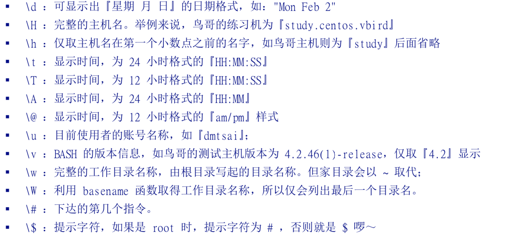

### Bash命令

检查linux支持的shell：

```
cat /etc/shells 

/bin/sh
/bin/bash
/usr/bin/sh
/usr/bin/bash
/bin/tcsh
/bin/csh
```


#### 指令换行

当我们在控制台输入的指令过长时，需要进行换行，可以通过 ‘\’+空格来让指令在下一行输入。

当输入了一串错误的指令时，可以通过以下命令在进行删除：

```
[ctrl]+u 从光标处向前删除
[ctrl]+k 从光标处向后删除
[ctrl]+a 将光标移动到整个字符串的最前面
[ctrl]+e 将光标移动到最后面
```

#### 设置变量

```
myname=VBird
echo ${myname}
```

**变量设置规则**

1. 变量与变量内容以一个等号(=)来连接。

```
[yongyan@localhost ~]$ name=bird
```

2. 等号两边不能直接接空格。

```
[yongyan@localhost ~]$ name = vbird
bash: name: 未找到命令
```

3. 变量名称只能是英文字母和字母，但是开头不能是数字。

```
[yongyan@localhost ~]$ 12name=vbird
bash: 12name=vbird: 未找到命令...
```

4. 变量内容若有空格，可使用双引号或者单引号将变量内容结合起来。双引号内的特殊字符如：$等，可以保有原本的特性。单引号内的特殊字符则仅为一般字符（纯文本）。

```
[yongyan@localhost ~]$ name="bird's name"
##单引号与双引号的区别
[yongyan@localhost ~]$ myname='${name}its me'
[yongyan@localhost ~]$ echo ${myname} 
${name}its me

[yongyan@localhost ~]$ myname="${name}its me"
[yongyan@localhost ~]$ echo ${myname} 
bird's nameits me
```

5. 反斜杠\可以将特殊字符转译成一般字符。

```
[yongyan@localhost ~]$ name=bird\'s\ name
```

6. 若变量是扩增变量内容时，可用'$变量名'或者${变量}累加内容

```
PATH=${PATH}:/home/dmtsai/bin
```

7. 若该变量需要在其它子程序执行，则需要以export来使变量变成环境变量。

```
##先设定一个值
[yongyan@localhost ~]$ name=bird
[yongyan@localhost ~]$ echo ${name} 
bird
## 新开shell
[yongyan@localhost ~]$ bash
##下面的命令没有值
[yongyan@localhost ~]$ echo ${name}
## 退出
[yongyan@localhost ~]$ exit
## 将变量变成环境变量
[yongyan@localhost ~]$ export name
[yongyan@localhost ~]$ bash
[yongyan@localhost ~]$ echo ${name} 
bird

```

8. 在一串指令的执行中，还需要藉由其它额外的指令所提供的信息时，可以使用反单引号(`)或者($())。

```
[yongyan@localhost ~]$ cd /lib/modules/$(uname -r)/kernel
```

9. 取消变量的方法为使用unset

#### 环境变量

* env命令：

```
ngyan@localhost ~]$ env

## 主机名
HOSTNAME=localhost.localdomain
## 当前环境下，使用的Shell是哪一种
SHELL=/bin/bash
## 记录指令的笔数
HISTSIZE=1000
## 上一个工作目录的所在
OLDPWD=/lib/modules/3.10.0-957.el7.x86_64/kernel
## 使用者
USER=yongyan
##当前用户所使用的mail位置，当我们使用mail指令收信时，系统会去读取邮件信箱文件(mailbox)
MAIL=/var/spool/mail/yongyan
PATH=/usr/local/bin
## 目前用户所在的工作目录
PWD=/home/yongyan
## 语系
LANG=zh_CN.UTF-8
## 当前登录用户的家目录
HOME=/home/yongyan
##登录者用来登录的账号名称
LOGNAME=yongyan
## 上一次使用的指令的最后一个参数
_=/usr/bin/env


```

* set命令：含环境变量和自定义变量

```
userdeMacBook-Pro:doc user$ set

## bash 主程序放置的路径
BASH=/bin/bash

##bash 的版本
BASH_VERSINFO=([0]="3" [1]="2" [2]="57" [3]="1" [4]="release" [5]="x86_64-apple-darwin18")
BASH_VERSION='3.2.57(1)-release'

## 在目前的终端机环节下，使用的字段有几个字符长度
COLUMNS=80

## 历史命令记录的放置文件，隐藏目录
HISTFILE=/Users/user/.bash_sessions/02A8425A-7562-462D-921C-C5B795263B68.history
## HISTFILE 文件存储的指令最大数目
HISTFILESIZE=500
## 当前环境下，内存中记录的历史命令最大笔数
HISTSIZE=500
## 按照的机器类型
MACHTYPE=x86_64-apple-darwin18
## 操作系统类型
OSTYPE=darwin18
## 命令提示符
PS1='\h:\W \u\$ '
```

1. PS1

在控制台当按下enter按键去执行某个命令，最后会出现提示符时，就会去读取这个变量，然后根据这个变量格式来显示提示符。



比如，在osx环境下我的PS1的值是PS1='\h:\W \u\$ '，它代表的意思分别是："主机名称：+工作目录+当前登录用户的账户名称\$"，即：userdeMacBook-Pro:doc user$。

2. $ 

代表的是目前这个Shell的线程代号，也就是PID。

3. ?

问号也是一个变量。它代表的是上一个执行的指令所返回的值。如果执行成功，一般会回传一个0值。

```
userdeMacBook-Pro:doc user$ echo $SHELL
/bin/bash
userdeMacBook-Pro:doc user$ echo $?
0
```

#### 变量键盘读取

```
read [-pt] variable
```

* -p : 后面接提示字符。

* -t : 接等待的秒数。

```
[yongyan@localhost ~]$ read -p "Please keyin your name:" -t 30 named 
Please keyin your name:yan
[yongyan@localhost ~]$ echo ${named} 
yan
```

#### 变量的宣告

```
declare/typeset [-aixr] variable
```

* -a : 将后面名为variable的变量定义为数组类型
* -i : 将后面名为variable的变量定义为整数数字类型
* -x : 用法与export一样，就是将后面的variable 变成环境变量
* -r : 将变量设定为readonly类型，该变量不可更改内容，也不能unset。

```
[yongyan@localhost ~]$ sum=100+300+50
## 变量默认是字符串，所以如果不指定，则100+300+50是字符串
[yongyan@localhost ~]$ echo ${sum}
100+300+50
## 将类型设置为整数类型
[yongyan@localhost ~]$ declare -i sum=100+300+50
[yongyan@localhost ~]$ echo ${sum}
450
## -x 将变量变成环境变量
[yongyan@localhost ~]$ declare -x sum
[yongyan@localhost ~]$ export | grep sum
declare -ix sum="450"
## -r 将变量变成只读
[yongyan@localhost ~]$ declare -r sum
[yongyan@localhost ~]$ sum=tes
bash: sum: 只读变量
## +x取消全局环境变量
[yongyan@localhost ~]$ declare +x sum
## -p 单独列出变量的类型
[yongyan@localhost ~]$ declare -p sum
declare -ir sum="450"
```

**数组变量类型**

```
## var 数组名称 index 数组下标  content 数组内容
var[index]=content

[yongyan@localhost ~]$ var[1]="small min"
[yongyan@localhost ~]$ var[2]="big min"
[yongyan@localhost ~]$ var[3]="nice min"
[yongyan@localhost ~]$ echo "${var[1]},${var[2]}"
small min,big min
```


