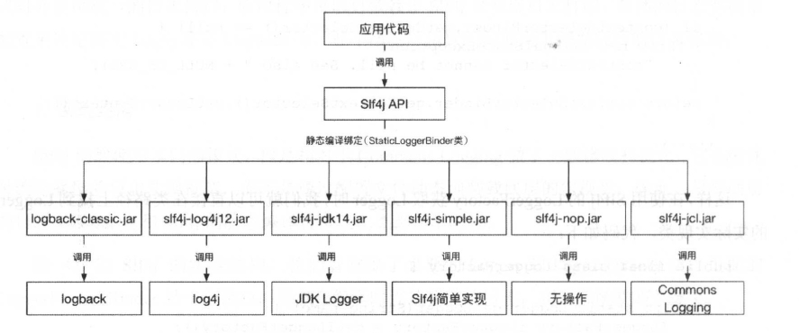

### 日志系统构建

日志用来记录系统中的硬件、软件、系统、进程和应用运行时的信息，用来监控系统中发生的各种事件以及检查错误发生的原因。

日志输出问题，对于计数器日志、响应时间日志、异常日志、方法入参和返回值等有规律可循的通用日志，我们可以使用aop技术的切面编程来打印，这样可以不用侵入业务代码，保持代码的整洁性和可维护性。

日志的存储问题，在一个有海量请求的服务化系统中，需要对大量的日志如何进行保存是一个很大的问题。

### 1. 开源日志框架介绍

JDK最初的版本中并不包含日志记录功能和API，直到JDK的1.4版本后才包含JDK Logger。但是相比其它开源日志框架，JDK自带的Logger日志框架在易用性、功能以及扩展性方面都要稍逊一筹，比较鸡肋。

在开源框架中名气最大、用的最广泛的是Apache Commons Logging和Apache Log4j，Apache Commons Logging是通用的日志接口，Log4j就是对应的日志实现。后来Slf4j和Logback逐渐取代了Apache Commons Logging和Apache Log4j。


#### 1.1.  JDK logger

JDK从1.4版本起开始自带一套日志系统JDK Logger，它最大的有点就是不需要集成任何类库，只要有JVM的运行环境，就可以直接使用。

JDK Logger将日志分为9个级别：FINESET、FINER、FINE、CONFIG、INFO、WARNING、SEVERE、OFF，级别依次升高。这里的命名与主流的开源框架有一些区别，例如：主流框架的错误日志使用error命名，而这里使用severe命名。

使用示例：

```java
public class JDKLoggerDemo {
	private static Logger logger = Logger.getLogger(JDKLoggerDemo.class.toGenericString());
	static {
		Handler consoleHandler = new ConsoleHandler();
		consoleHandler.setLevel(Level.SEVERE);
		logger.addHandler(consoleHandler);
	}
	@Test
	public void testPrint() {
		logger.setLevel(Level.SEVERE);
		logger.finest("finest log ...");
		logger.finer("finer log ...");
		logger.fine("fine log ...");
		logger.config("config log ...");
		logger.info("info log ...");
		logger.warning("warning log");
		logger.severe("severe log ...");
		
	}
}
```

执行结果：

```java
一月 08, 2019 3:29:57 下午 com.seaever.logdemo.jdklog.JDKLoggerDemo testPrint
严重: severe log ...
一月 08, 2019 3:29:57 下午 com.seaever.logdemo.jdklog.JDKLoggerDemo testPrint
严重: severe log ...
```


#### 1.2. Apache Common Logging 

在Java领域最早得到广泛使用的是Log4j，许多应用程序的日志记录功能都由Log4j来实现。不过作为开发者，我们希望自己的组件不依赖于某个日志工具，比如如果某个工具存在性能或者其它问题，需要在日志实现框架中进行切换。因此如果直接使用Log4j，就把应用程序与Log4j绑定在一起了，在切换时会带来大量的修改工作。为了解决这个问题，Apache Commons Logging只提供了日志接口，具体的实现则在运行时根据配置规则动态查找日志的实现框架。它的出现避免了和具体的日志实现框架直接耦合。

传统的系统基本上使用Commons Logging 和Apache Log4j的组合，Commons Loggin 使用门面设计模式，门面后面可以转接Apache Log4j等其它日志框架。后来Log4j的作者看到这套实现在一些细节上存在缺陷，于是又开发 了Slf4j和Logback。Slf4j用来取代Commons Logging ，Logback则用来取代Log4j。

使用方式：

首先导入pom.xml包

```
<dependency>
            <groupId>commons-logging</groupId>
            <artifactId>commons-logging</artifactId>
            <version>1.2</version>
        </dependency>
```

测试代码：

```java
public void print(){

        System.out.println(log);
        log.debug("debug log ....");
        log.info("info log ...");
        log.warn("warn log ...");
        log.error("error log ...");
        log.fatal("fatal log ...");

    }
```


#### 1.4. Apache Log4j

Log4j主要的实现类：Logger、Layout、Appender和LogManager

1. Logger：日志对象，负责捕捉日志记录的信息。

logger对象用来取代JDK自带的System.out或者System.error的日志输出器，负责日志信息的输出；它提供了trace、debug、 info、 warn、 error等API供开发者使用。这些方法对应日志的一个级别：

* all： 打开所有日志
* debug：适用于代码运行期间打印调试信息
* info：适用于代码运行期间打印逻辑信息
* warn：适用于代码有潜在错误事件时打印相关信息
* error：适用于代码产生错误事件时打印错误信息和环境
* fatal：适用于代码存在严重错误事件时打印错误信息
* off：关闭所有日志

2. Appender：日志输出目的地。Log4j有以下Appender对象可供选择：

* ConsoleAppender：把日志输出到控制台
* FileAppender：把日志输出到磁盘文件
* DailyRollingFileAppender：每天产生一个日志磁盘文件，日志文件按天滚动生成
* RollingFileAppender：日志磁盘文件的大小达到指定尺寸时会产生一个新的文件。

3. Layout ：对日志进行格式化，负责生成不同格式的日志信息

Appender 对象负责将日志信息输出到指定的文件中，Layout对象负责把日志信息输出到指定的文件中，Layout对象则负责把日志信息按照格式化的要求展示出来。

* HTMLLayout：以HTML表格形式布局展示
* PatternLayout：自定义指定的格式
* SimpleLayout：只包含日志信息的级别和信息字符串。
* TTCCLayout：包含日志产生的时间、线程、类别等信息。

使用方式：

```xml
<dependency>
    <groupId>log4j</groupId>
    <artifactId>log4j</artifactId>
    <version>1.2.17</version>
</dependency>
```

测试代码：

```java
public class Log4jDemo {

    Logger logger = Logger.getLogger(Log4jDemo.class);

    @Test
    public void test(){

        logger.trace("trace log ...");
        logger.debug("debug log ..");
        logger.info("info log ...");
        logger.warn("warn log ...");
        logger.error("error log ...");
        logger.fatal("fatal log ");

    }

}
```

最后在类路径下声明配置文件log4j.properties

```properties
log4j.rootLogger=CONSOLE,FILE

#输出到控制台
log4j.appender.CONSOLE=org.apache.log4j.ConsoleAppender
#设置输出样式
log4j.appender.CONSOLE.layout=org.apache.log4j.PatternLayout
#日志输出信息格式为，%-d：输出日志时间，%t：产生日志事件的线程名称，%p：输出日志信息的优先级 %c：产生日志所属的类目，%M：产生日志信息的方法名称，%L：产生日志的行号 %m：输出代码中指定的具体日志信息，%n：输出一个换行符
log4j.appender.CONSOLE.layout.ConversionPattern=[%-d{yyyy-MM-dd HH:mm:ss}]-[%t-%5p]-[%C-%M(%L)]: %m%n
#输出字符串编码
log4j.appender.CONSOLE.encoding=UTF-8
#替代System.out
log4j.appender.CONSOLE.Target=System.out
#表示所有的消息都会被立即输出，默认是true
log4j.appender.CONSOLE.ImmediateFlush=true
#指定日志信息的最低输出级别,DEBUG、INFO、WARN、ERROR和FATAL。这五个级别是有顺序的，DEBUG < INFO < WARN < ERROR < FATAL
log4j.appender.CONSOLE.Threshold=ERROR


#输出日志到文件
log4j.appender.FILE=org.apache.log4j.FileAppender
#指定消息输出到指定文件
log4j.appender.FILE.File=/home/yanyong/worksapce/log/log4j1.log
#表示所有的消息都会被立即输出，默认是true
log4j.appender.FILE.ImmediateFlush=true
#指定日志信息的最低输出级别
log4j.appender.FILE.Threshold=WARN
#消息追加到文件中，默认true
log4j.appender.FILE.Append=true
#设置输出样式
log4j.appender.FILE.layout=org.apache.log4j.PatternLayout
#日志输出信息格式为
log4j.appender.FILE.layout.ConversionPattern=[%-d{yyyy-M-dd HH:mm:ss}]-[%t-%5p]-[%C-%M(%L)]: %m%n
#输出字符串编码
log4j.appender.FILE.encoding=UTF-8
```

#### 1.5. Slf4j

Slf4j(Simple Logging Facade for Java)与Apache Commons Logging一样，都是使用门面模式对外提供统一的日志接口，应用程序可以只依赖Sl4j来实现日志打印，具体的日志实现由配置来决定使用Log4j还是Logback。



使用方式：

```xml
 <!--slf4j-->
 <dependency>
 	<groupId>org.slf4j</groupId>
 	<artifactId>slf4j-api</artifactId>
 	<version>1.7.25</version>
  </dependency>
<!---slfj log4j-->
  <dependency>
      <groupId>org.slf4j</groupId>
      <artifactId>slf4j-log4j12</artifactId>
      <version>1.7.25</version>
  </dependency>
  <!--log4j-->
  <dependency>
      <groupId>log4j</groupId>
      <artifactId>log4j</artifactId>
      <version>1.2.17</version>
  </dependency>
```

```java
public class Slf4jDemo {

    Logger logger = LoggerFactory.getLogger(Slf4jDemo.class);
    @Test
    public void test(){
        System.out.println(logger);
        logger.trace("trace log ...");
        logger.debug("debug log ..");
        logger.info("info log ...");
        logger.warn("warn log ...");
        logger.error("error log ...");
    }
}
```

#### 1.6. Logback

Logback分为三个部分：logback-core、logback-classic和logback-access

* logback-core是后面两个模块的基础模块，包含日志框架实现的所有基础类
* logback-classic 是Log4j的一个改良版本，在性能优化上有较大的提高
* logback-access与Servlet容器集成，提供了HTTP访问日志功能。

使用方式

```xml
<dependency>
	<groupId>org.slf4j</groupId>
    <artifactId>slf4j-api</artifactId>
    <version>1.7.25</version>
</dependency> 
<dependency>
     <groupId>ch.qos.logback</groupId>
     <artifactId>logback-classic</artifactId>
     <version>1.2.3</version>
 </dependency>

  <dependency>
  	<groupId>ch.qos.logback</groupId>
    <artifactId>logback-core</artifactId>
    <version>1.2.3</version>
  </dependency>
```

```
public class Slf4jDemo {
    Logger logger = LoggerFactory.getLogger(Slf4jDemo.class);
    @Test
    public void test(){
        System.out.println(logger);
        logger.trace("trace log ...");
        logger.debug("debug log ..");
        logger.info("info log ...");
        logger.warn("warn log ...");
        logger.error("error log ...");

    }
}
```


### 2. 日志系统最佳实践

#### 2.1 开发人员的日志意识

* 开发代码时要有意识地设想代码出现问题时的场景，针对出问题的场景记录关键的程序运行信息，这样在代码出现问题时才能通过日志恢复程序运行的过程，才容易定位问题。
* 打印日志时必须包含环境信息，环境信息是打印的日志可获得的帮助开发人员定位问题的信息，例如：用户ID、角色、参数、返回值、逻辑判断结果、循环次数、异常信息等。
* 对异常等错误信息必须打印错误级别及以上的日志，对线上日志要定期检查，没有异常日志产生的服务才是健康的服务
* 对关键业务步骤打点记录耗时和结果等信息

#### 2.2 日志级别的设置

* 刚刚上线的应用还没有到稳定期，使用debug级别的日志
* 上线后稳定的应用，使用info级别的日志。
* 长年不出现问题的应用使用error级别的日志

对于不同的情况应该使用的日志级别如下：

* 使用trace级别的日志输出最详细的信息事件，通过这些信息可以追踪程序程序执行的任一步骤
* 使用debug级别的日志输出细粒度的信息事件，这些信息对调试应用程序非常有用
* 使用warn级别的日志输出可能出现的错误，或者输出潜在发生错误的环境信息，或者打印用户输入的非法信息
* 使用error级别的输出错误信息，但仍然不影响系统的继续运行，在Java程序中发生异常一定要记录error日志，并且打印异常堆栈。
* fatal 级别代表严重的错误事件，将会导致应用程序的退出


#### 2.3 日志的数量和大小

我们一定要控制日志的输出量，避免由于业务上量而导致服务器占满并大量地输出无用日志，这不利于系统性能的提升，也不利于快速定位错误点。

另外我们对单条日志要有所限制，如要求每个项目的单条日志不能超过1KB，日志太大会导致批量处理时占满内存。


#### 2.4 实践

