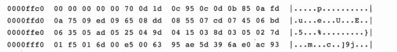

### MYSQL表

#### InnoDB逻辑存储结构

mysql所有的数据都存放在一个空间中，我们称之为表空间，表空间由段(segment)、区(extent)、页(page)组成，如图所示：


表空间存放的只是数据、索引和插入缓冲，其它如撤销信息，系统事物信息、二次写缓冲等还是放在共享表空间中。如果我们启用参数```innodb_file_per_table```,则每张表内的数据可以单独放在一个表空间内。

表空间中常见的段有数据段、索引段、回滚段等。在InnoDB存储引擎中，数据段就是B+树的页节点，索引段就是B+树的非索引节点。

区由64个连续的页组成，每个页的大小为16K，对于大的数据段，最多可以申请4个区。

页是InnoDB磁盘管理的最小单位，常见的页类型有：

* 数据页(B-tree NODE)
* Undo页(Undo log Page)
* 系统页(System Page)
* 事务数据页
* 插入缓冲位图页
* 插入缓冲空闲列表页
* 未压缩的二进制大对象页
* 压缩的二进制大对象页

行，InnoDB是面向行的，也就是数据按照行进行存放，最多允许存放16kb/2 ~ 200行记录，即7992行记录。

#### InnoDB物理存储结构

InnoDB由共享表空间，日志文件组（Redo文件组）、表结构定义文件组成。如果讲```innodb_file_per_table```设置为on，则每个表将独立产生一个表空间。以ibd结尾，数据、索引、表的内部数据字典信息都在这个单独的表空间文件中。表结构定义文件以frm结尾。


#### InnoDB 行

**Compact 行记录格式** 


* 变长字段长度：当列的长度小于255字节，用1字节表示，若大于255字节，用2个字节表示，变长字段的长度不能超过2个字节（这个也解释了mysql中varchar最大长度为65535即2^16=65535）
* NULL标志位：指示该行是否有NULL值，用1表示。
* 记录头信息


每行数据除了用户自定义的列外，还有两个隐藏的列，事务ID和回滚指针列，分别为6个字节和7个字节的大小。如果InnoDB没有定义Primary Key，每行还会增加一个6字节的RowId列。

示例：

```
create mytest ( t1 varchar(10),t2 varchar(10),t3 char(10),t4 varchar(10)) charset=latin1 row_format=compact;
```

插入数据

```
insert into mytest value('a','bb','bb','ccc');
insert into mytest value('d','ee','ee','fff');
insert into mytest value('d',NULL,NULL,'fff');
```

在linux系统下将表数据存储文件转成16进制txt文件

```
 hexdump -C -v mytest.ibd>mytest.txt
```

打开mytest文件，找到如下内容：

```
0000c060  02 00 1e 69 6e 66 69 6d  75 6d 00 04 00 0b 00 00  |...infimum......|
0000c070  73 75 70 72 65 6d 75 6d  03 02 01 00 00 00 10 00  |supremum........|
0000c080  2c 00 00 00 00 2c 10 00  00 3e 56 85 2a b4 00 00  |,....,...>V.*...|
0000c090  01 6b 01 10 61 62 62 62  62 20 20 20 20 20 20 20  |.k..abbbb       |
0000c0a0  20 63 63 63 03 02 01 00  00 00 18 00 2b 00 00 00  | ccc........+...|
0000c0b0  00 2c 11 00 00 3e 56 85  2b b5 00 00 01 c5 01 10  |.,...>V.+.......|
0000c0c0  64 65 65 65 65 20 20 20  20 20 20 20 20 66 66 66  |deeee        fff|
0000c0d0  03 01 06 00 00 20 ff 98  00 00 00 00 2c 12 00 00  |..... ......,...|
0000c0e0  3e 56 85 34 ba 00 00 02  35 01 10 64 66 66 66 00  |>V.4....5..dfff.|
```

该行数据是从0000c078开始，即从03 02 01开始。

```
03 02 01 //变长字段,03表示第4列字段长度，02表示第2列长度，01表示第一列长度，第3列是固定长度
00 //NULL标志位，第一行没有null值，所以是0
00 00 10 00 2c //记录头信息，固定5字节长度
00 00 00 00 2c 10 //由于我们没有创建主键，索引数据库生成了一个rowid
00 00 3e 56 85 2a事务id
b4 00 00 01 6b 01 10 //回滚指针列
61 //列1数据‘a’(对照assic码表，61对应a)
62 62 //列2数据 'bb'
62 62 20 20 20 20 20 20 20 20 //列3数据'bb'
63 63 63//列4数据'ccc'
```

固定长度char字段在未填充满长度时，会用0x20来进行填充。

头信息的最后2个字节记录了下一条记录的相对位置，如:002c转换成十进制是44，当前记录的开始位置是0000c078,转换成十进制后是49272，相对位置与当前位置相加就是下一条数据的位置，相加结果是49316，转换成十六进制后是：0000c0a4，参照上面的十六进制代码，找到0000c0a4位置，03 02 01 就是第二条记录的变长字段长度列表。

我们再看看有NULL值的第三行，

```
03 01 //变长字段长度，03 第4列长度，01 第1列长度
06 //null标志位，0000 0110 为1的值即代表第2列和第3列的数据为NULL
00 00 20 ff 98 //记录头信息
00 00 00 00 2c 12 //rowid
00 00 3e 56 85 34 //transactionId
ba 00 00 02  35 01 10 //roll pointer
64 //列1数据 'd' 
66 66 66 //列4数据
```


#### InnoDB数据页结构

InnoDB数据页由以下七个部分组成：

* File Header(文件头)
* Page Header(页头)
* Infimun+Supremum Records
* User Records(用户记录，即行记录)
* Free Space(空闲空间)
* File Trailer(文件结尾信息)


#### File Header

File Header 用来记录页的一些头信息，由以下8个部分组成，一共占38个字节。


* FIL_PAGE_OFFSER 表空间页的偏移值。
* FIL_PAGE_PREV FIL_PAGE_NEXT :当前页的上一个页以及下一页。B+Tree 特效决定了叶子节点必须是双向列表。
* FIL_PAGE_TYPE：页的类型，如下：


#### Page Header

接着File Header是Page Header,用来记录数据页的状态信息。


* Page_N_DIR_SLOTS：在Page Directory中的Slot数。
* PAGE_HEAP_TOP：堆中第一个记录的指针。
* PAGE_N_HEAP：堆中的记录数
* PAGE_FREE：指向空闲列表的首指针。
* PAGE_GARBAGE：已删除记录的字节数。
* PAGE_LAST_INSERT:最后插入的记录的位置。
* PAGE_N_RECSA:该页中的记录的数量
* PAGE_LEVEL：当前页在索引树中的位置,0x00代表叶节点。


#### Infinum和Supremum记录

在InnoDB存储引擎中，每个数据页中有两个虚拟的行记录，用来限定记录的边界。Infimum记录是比该页中任何主键值要小的值，Supremum指比任何可能大的值还要大的值。


#### User Records与FreeSpace

User Records 即实际存储行记录，Free Space指空闲空间，当一条数据被删除后，该空间会被加入到空闲链表中。

#### Page Directory

存放记录的相对位置，这些记录指针称为Slots(槽)，InnoDB并不是每个记录拥有一个槽，即一个槽中可能存放多个记录。Page Directory槽中的数据都是按照主键的顺序存放的。假如我们有('i','d','c','d','e','g','a','i')，则slots中的记录可能是('a','e','i')。

二叉查找是一个粗略的结果，所以InnoDB必须通过recorder header的next_record来继续查找相关记录。

示例：下图是一个数据页的16进制数据


先来解析File Header(38个字节)

* 52 1b 24 00 表示页的checksum值
* 00 00 00 03 页的偏移量，偏移量是从0开始，说明当前页是第4个页。
* ff ff ff ff 前一个页 ，此时说明只有一个数据页
* ff ff ff ff 下一个页，此时说明只有一个数据页
* 00 00 00 0a 6a e0 ac 93  页的LSN
* 45 BF 页的类型，即数据页
* 00 00 00  00 00 00 00 
* 00 00 00 dc 表空间的space id


接下来是Page Header (56个字节)


PAGE_N_DIR_SLOTS=0x001a代表Page Directory有26个槽，每个槽占用两个字节，我们可以从0x0000ffc4到0x000fff7找到如下内容：



PAGE_HEAP_TOP = 0x0dc0，堆中第一条记录的指针，也是空闲空间的开始位置，即0xc000+0x0dc0=0xcdc0

PAGE_N_HEAP=0X8066，当行记录格式是Compact时，初始值是0x0802，0x8066 -0x8002=0x64，代表页中国实际有100条记录。

PAGE_GARBAGE=0X0000，代表删除的记录为0。

PAGE_LAST_INSERT=0Xda5，表示页最后插入的位置的偏移量，即最后的插入位置是0xc000+0x0da5=0xcda5

PAGE_direction=0x0002 插入方向，向右

PAGE_N_DIRECTION=0x0063,表示一个方向连续插入记录的数量，此时表示连续插入了100条记录。


