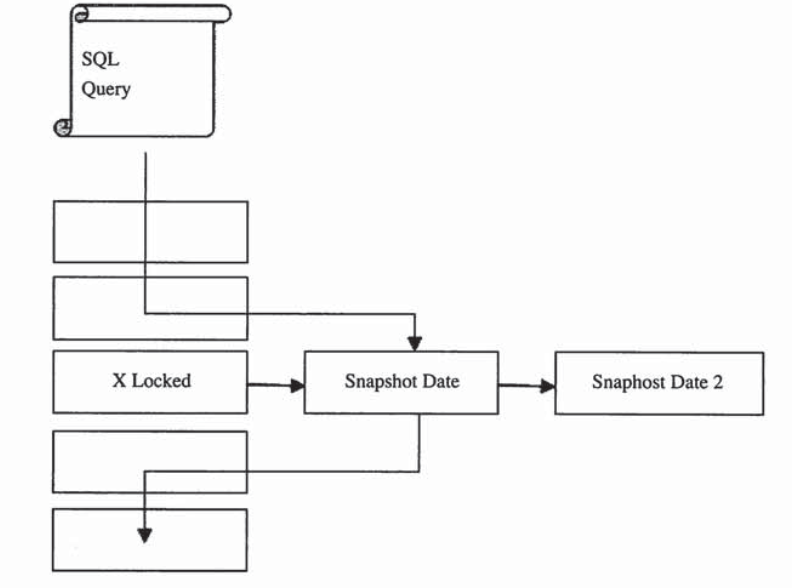

### Mysql 锁（InnoDB引擎）

InnoDB存储引擎会在行级别上对表数据上锁(MyISAM引擎是表锁，并发读没有问题，并发插入性能要差一些)，不过InnoDB存储引擎也会在数据库内部其他多个地方使用锁，从而允许对多种不同资源提供并发访问。例如，操作缓冲池中的LRU列表，删除、添加、移动LRU列表中的元素，为了保证一致性，必须有锁的介入。

#### 锁的类型

* 共享锁(S Lock)，允许事务读一行数据
* 排他锁(X Lock)，允许事务删除或者更新一行数据

当一个事务已经获得了行r的共享锁，那么另外的事务可以立即获得行r的共享锁，因为读取并没有改变行r的数据，我们称这种情况为锁兼容。如果有事务获得了行r的排他锁，则必须等待事务放行r上的共享锁即锁不兼容。

|      | x    | s    |
| ---- | ---- | ---- |
| x    | 冲突 | 冲突 |
| s    | 冲突 | 兼容 |

InnoDB存储引擎支持一种额外的锁方式，我们称之为意向锁。意向锁是表级别的锁，其设计的主要目的主要是为了在一个事务中揭示下一行将被请求的锁的类型。

* 意向共享锁(IS Lock)，事务想要获得一个表中某几行的共享锁。
* 意向排他锁(IX Lock)，事务想要获得一个表中某几行的排他锁。

表级别锁的兼容性如下：

|      | X    | IX   | S    | IS   |
| ---- | ---- | ---- | ---- | ---- |
| X    | 冲突 | 冲突 | 冲突 | 冲突 |
| IX   | 冲突 | 兼容 | 冲突 | 兼容 |
| S    | 冲突 | 冲突 | 兼容 | 兼容 |
| IS   | 冲突 | 兼容 | 兼容 | 兼容 |

注：S 、X是表级别的独占锁和共享锁。

意向锁不会阻塞除却全表请求(lock table t write)以外的任何请求。如lock table write 是请求获取一个表级别的排它锁，这会被IS或者IX阻塞。使用意向锁来支持多粒度锁。

```sql
# session A
begin;
select * from t where a = 1 for update;//给请求的行加一个x锁

# session B
begin;
lock table t write; //session A释放锁之前，SessionB会一直阻塞
```

如是，当session A 需要获取a=1行的X锁，但是session A在获取行锁前，它必须获取t表的IX锁，不存在冲突。session B获取t的全表x锁，但是session B发现t表已经被设置了IX锁，因此session B被阻塞。假设不存在意向锁，session B需要遍历t中的所有行来确保没有被锁住的行，显然这种效率会非常低。

在InnoDB Plugin之前，我们只能通过SHOW FULL PROCESSLIST、SHOW ENGINE INNODB STATUS等命令来查看当前数据库的请求，然后再判断当前事务中锁的情况。

新版本InnoDB Plugin中，在INFORMATION_SCHEMA架构下添加了INNODB_TRX 、INNODB_LOCKS、INNODB_WAITS。通过这三张表，可以简单的监控当前的事务并分析可能存在的锁问题。

1）INNODB_TRX表

* trx_id：InnoDB存储引擎内部唯一的事务ID.
* trx_state：当前事务的状态。
* trx_started：事务的开始时间
* trx_request_lock_id：等待事务的锁ID，如trx_state的状态为LOCK WAIT ，那么该值代表当前的事务等待之前事务占用锁资源的ID。若trx_state不是LOCK WAIT，该值为null。
* trx_wait_started：事务等待开始的时间
* trx_weight：事务的权重，反应了一个事务修改和锁住的行数。在InnoDB中，当发生死锁需要回滚时，InnoDB会选择最小的进行回滚。
* trx_mysql_thread_id ：Mysql中的线程ID。
* trx_query：事务运行的SQL语句。

 如下例子：

```
mysql> select * from INNODB_TRX\G;
*************************** 1. row ***************************
                    trx_id: 11833
                 trx_state: LOCK WAIT
               trx_started: 2019-02-21 22:51:36
     trx_requested_lock_id: 11833:83:3:6
          trx_wait_started: 2019-02-21 22:51:36
                trx_weight: 2
       trx_mysql_thread_id: 367
                 trx_query: select * from user where id = 8 lock in share mode
     
*************************** 2. row ***************************
                    trx_id: 11832
                 trx_state: RUNNING
               trx_started: 2019-02-21 22:51:34
     trx_requested_lock_id: NULL
          trx_wait_started: NULL
                trx_weight: 3
       trx_mysql_thread_id: 366
                 trx_query: NULL
       trx_operation_state: NULL
        
```

可以看到，事务11833目前处于"LOCK WAIT"状态，运行的sql语句是select * from user where id = 8 lock in share mode。

2）INNODB_LOCKS表

* lock_id：锁的ID。
* lock_trx_id：事务ID。
* lock_mode：锁的模式
* lock_type：锁的类型，表锁还是行锁。
* lock_table：要加锁的表。
* lock_index：锁的索引 。
* lock_space：InnoDB存储引擎表空间ID 号。
* lock_page：被锁住的页的数量，若是表锁，则该值为NULL。
* lock_rec：被锁住的行的数量，若是表锁，则该值为NULL。
* lock_data：被锁住的行的主键值，若是表锁，该值为NULL。

如下例子：

```
mysql> select * from INNODB_LOCKS\G;
*************************** 1. row ***************************
    lock_id: 11836:83:3:6
lock_trx_id: 11836
  lock_mode: S
  lock_type: RECORD
 lock_table: `test`.`user`
 lock_index: GEN_CLUST_INDEX
 lock_space: 83
  lock_page: 3
   lock_rec: 6
  lock_data: 0x000000000203
*************************** 2. row ***************************
    lock_id: 11835:83:3:6
lock_trx_id: 11835
  lock_mode: X
  lock_type: RECORD
 lock_table: `test`.`user`
 lock_index: GEN_CLUST_INDEX
 lock_space: 83
  lock_page: 3
   lock_rec: 6
  lock_data: 0x000000000203
```

从上可以看到 id为11815的事务向表11836加了一个s的行锁，ID为11835的事务向表user申请一个X的行锁。lock_data都是0x000000000203,申请相同的资源，因此会有等待。

需要注意，lock_data这个值并非是可信的，例如我们执行一个范围查找时，lock_data可能返回第一行的主见值。

3）INNODB_LOCK_WAITS

* requesting_trx_id：申请资源的事务ID。
* requesting_lock_id：申请的事务ID .
* blocking_trx_id：阻塞的事务ID 。
* blocking_trx_id：阻塞的锁的 ID。

```
mysql> select * from INNODB_LOCK_WAITS\G;
*************************** 1. row ***************************
requesting_trx_id: 11839
requested_lock_id: 11839:83:3:6
  blocking_trx_id: 11838
 blocking_lock_id: 11838:83:3:6
```

#### 一致性的非锁定操作

一致性的非锁定是指InnoDB存储通过行多版本控制的方式来读取当前执行时间数据库中行的数据。如果读取的行正在执行DELETE、UPDATE操作，这时读取操作不会因此而等待行上锁的释放，相反、InnoDB存储引擎会去读取行的快照数据。



 快照数据是指该行之前版本的数据，该实现是通过Undo段来实现。Undo用来在事务中回滚数据，因此快照数据本身是没有额外的开销。

在InnoDB存储默认设置下，这是默认的读取方式，即读取不会占用和等待表上的锁。但是在不同事务隔离级别下，读取的方式不同，并不是每个事务隔离级别下读取的都是一致性。

在Read Committed和Repeatable Read（InnoDB 存储引擎的默认事务隔离级别）下，InnoDB存储引擎使用非锁定的一致性读。但是对于快照数据的定义却不相同。在Read Committed事务隔离级别下，对于快照数据，非一致性读总是读取被锁定行的最新一份快照数据。在Repeatable Read事务隔离级别下，对于快照数据，非一致性读总是读取事务开始时的行数据版本。

如下例子：

默认情况下，mysql的隔离级别是REPEATABLE-READ 

```
mysql> select @@tx_isolation;
+-----------------+
| @@tx_isolation  |
+-----------------+
| REPEATABLE-READ |
+-----------------+
```

```
# Session A
mysql> begin;
mysql> select * from user where id = 8;
+------+------+------+------+
| id   | name | age  | sex  |
+------+------+------+------+
|    8 | yan7 |   20 | NULL |
+------+------+------+------+
```

如上会话A中，开启事务(begin)，然后读取了id = 8的数据，但是没有执行提交事务。这时我们再开启另一个会话：

```
＃ Session B
mysql> begin;
update user set id = 1 where id = 8;
```

同样会话B中将id 改成1后并没有提交事务，这样id=8的行加了一个X锁，这时如果再在会话A中查询id=8的数据时，上述两种隔离仍然可以查询到数据

```
ysql> select * from user where id = 8;
+------+------+------+------+
| id   | name | age  | sex  |
+------+------+------+------+
|    8 | yan7 |   20 | NULL |
+------+------+------+------+
```

接着我们提交会话B的事务，这时两种隔离级别的查询结果就不同了。对于Read Commit 的事务隔离级别，它总是读取行的最新数据，如果该行被加了锁，则读取该版本的最新一个快照。

```
#设置会话的隔离级别为 read committed
set session transaction isolation level read committed;

#然后再重新执行上面的流程，发现查询结果为空
mysql> select * from user where id = 1;
Empty set (0.00 sec)
```

对于Repeatable的事务隔离级别，总是读取事务开始时的行数据。

#### SELECT … FOR UPDATE &SELECT …LOCK IN SHARE MODE

* SELECT .. FRO UPDATE 读取的行记录加一个X锁。其它事务想在这些行上加锁都会被阻塞。
* SELECT …LOCK IN SHARE：对读取的行记录加一个S锁。其它事务可以向锁定的记录加S锁，但是对于加X锁，则会被阻塞。

对于一致性非锁定读，即使读取的行已被使用SELECT …FOR UPDATE,也是可以进行读取的。另外这两个查询语句必须在事务中执行，当事务提交了，锁也就释放连。


#### 自增长和锁

在InnoDB存储引擎的内存结构中，对每个含有自增长值的表都有一个自增长计数器(auto-increment counter)。当对含有自增长计数器的表进行插入操作时，这个计数器会被初始化，执行如下的语句来得到计数器值：

```
select max(auto_inc_col) from t for update
```

插入操作会依据这个自增长的计数器值加1赋予自增长列。这个实现方式称为AUTO-INC Locking。这种锁其实是采用一种特殊的表锁机制，并且为了提高插入的性能，锁不是在一个事务完成后才释放，而是在完成对自增长值插入的SQL语句后立即释放。

对于有自增长值列的并发插入性能比较差，因为必须等待前一个插入的完成（虽然不用等待事务的完成）。

从5.1.22版本开始，InnoDB存储引擎提供了一种轻量级的自增长实现机制，该存储引擎提供了一个参数innodb_autoinc_lock_mode,默认值为1。

* innodb_autoinc_lock_mode=0 即通过表锁的AUTO-INC Locking方式。
* innodb_autoinc_lock_mode＝1 这是该参数的默认值。对于"Simple insert"(插入前就确定插入行数的语句，如：insert，replace)，该值会用互斥量（mutex）去对内存中的计数器进行累加。对于"Bulk inserts"(插入前不确定插入行数的语句，如：insert ...select,load data)还是使用传统表锁的AUTO-INC Locking方式。并且如果已经使用了AUTO-INC Locing的方式产生增长的值，而这时再进行"Simple inserts"的操作时，还是需要等待AUTO-INC Locking的释放。
* innodb_autoinc_lock_mode＝2 对于所有的自增长都是通过互斥量(mutex)，而不是AUTO-INC Locking的方式。这是最高性能的方式，但是因为并发插入的存在，自增长的值可能不是连续的。此外基于Statement-Base Replication 会出现问题。


#### 外键和锁

对于外键列，如果没有显式地对这个列加索引，InnoDB存储引擎自动对其加一个索引，因为这样可以避免表锁。

对于外键值的插入或者更新，首先需要查询父表中的记录，即SELECT 父表。但是对于父表的SELECT操作，不是使用一致性非锁定读方式，因为这样会发生数据不一致的问题。因此这时使用的是SELECT …LOCK IN SHARE MODE方式，主动对父表加一个S锁。如果这时父表上已经加了X锁，那么子表上的操作会被阻塞。


#### 锁的算法

InnoDB存储引擎中有3种行锁的算法设计，分别是：

* Record Lock ：单行记录上的锁。
* Gap Lock：间隙锁，锁定一个范围，但不包括记录本身。
* Next-Key Lock :Gap Lock+Record Lock，锁定一个范围，并且锁定记录本身。

Record Lock总是会去锁住索引记录。如果InnoDB存储引擎表建立的时候没有设置任何一个索引，这时InnoDB 存储引擎会使用隐式的主键来进行锁定。

间隙锁保证某个间隙内的数据在锁定情况下不会发生任何变化，比如mysql默认隔离级别下的可重复读。

当使用唯一索引来搜索唯一行时，不需要间隙锁定，如下：

```sql
select * from t where a = 3 for update;//a 是表t的主键，不会使用间隙锁
```

如果上面的a没有建立索引或者非唯一索引，则会产生间隙锁。如下我们创建了一个表：

```sql
create table g (name varchar(10),i int,primary key(name),index idx_i(i)) engine=InnoDB;

insert into g (name,i) values ('a',5);
insert into g (name,i) values ('b',8);
insert into g (name,i) values ('c',10);
insert into g (name,i) values ('d',10);
insert into g (name,i) values ('e',11);
insert into g (name,i) values ('f',15);

# session A
begin;
update g set i=i+100 where i = 10;

#session B
insert into g(name,i) values("z",8);
```

mysql中的数据是按照 B+树来排列的，所以它是有序的，我们大概列出它的顺序：

```('a',5)、('b',8)、('c',10)、('d',10)、('e',11)、('f',15);```

我们在session A 中执行update方法，由于i是非唯一索引，并且索引在mysql中是有序的，所以它会锁定(8,10)和(10,11)。然后我们在session B中插入("z",8)时，由于和(8,10)重叠了，所以会话B会进入阻塞。

间隙的范围是向下寻找最靠近检索条件的记录值A作为坐区间，向上寻找最靠近检索条件的记录值B作为右区间，即锁定的间隙为(A,B)。

需要注意的是当列上没有索引时，sql会进行全表扫描过滤，因此每条记录都会被加上X锁。但是为了效率考虑，对于不满足条件的记录，会在判断后放锁，最终持有的是满足条件的记录上的锁。

InnoDB对于行的查询都是采用Next-Key Lock这种锁定算法，对于不同的查询语句，可能设置共享和排他的 Next-Key Lock。

如下演示Next-Key Lock的锁定算法：

```
#创建表
mysql> create table t(a int,primary key(a))engine=InnoDB;
#插入1、2、3、4、7、8数据
mysql> insert into t select 8;
...
mysql> select * from t;
+---+
| a |
+---+
| 1 |
| 2 |
| 3 |
| 4 |
| 7 |
| 8 |
+---+

```

接着开启两个会话，会话A在一个事务中执行如下sql语句：

```
mysql> begin;
mysql> select * from t where a < 6 lock in share mode;
```

执行会话A后没有提交事务，接着开启会话B：

```
mysql> begin;
mysql> insert into t select 5;
```

在会话A中，无论插入5还是6，都会被锁定。因为在Next-Key Lock算法下，锁定的是(-%,6)这个区间的所有数值。但是插入9这个数值是可以的，因为该记录不在锁定的范围内。

Next-Key Lock算法是默认的行记录锁定算法。

#### 锁问题

1. 丢失更新

简单来说出现下面的情况时，就会出现丢失更新：

1）事务T1查询一行数据，放入本地内存，并显示给一个终端用户User1.

2）事务T2也查询这行数据，并将取得的数据显示给终端用户User2。

3）User1修改这行数据，更新数据到数据库。

4）User2修改这行数据，更新数据到数据库。

显然上面过程中User1的修改更新操作“丢失”了。这可能会发生一个恐怖的结果，比如：一个用户账户中有10000元人民币，他用两个网上银行的客户端转账，第一次转9000人民币，因为网络和数据的关系，这时需要等待。但是如果这时用户可以操作另一个网上银行客户端，转账1元。如果最终两笔操作都成功了，用户的账户余额是9999人民币，第一次转的9000人民币没有得到更新。要避免丢失更新，需要将这种情况下的事务变成串行操作，而不是并发的操作。

2. 脏读

脏数据和脏页有所不同。脏页指的是在缓冲池中已经被修改的页，但是还没有刷新到磁盘，即数据库实例内存中的页和磁盘的页中的数据是不一致的，当然在刷新到磁盘之前，日志都已经被写入了重做日志文件中。

而所谓脏数据，是指在缓冲池中被修改的数据，并且还没有被提交。如果读到了脏数据，即一个事务可以读到另一个事务中未提交的数据，则显然违反了数据库的隔离性。

脏读发生的条件是需要事务隔离级别为READ UNCOMMITTED，如下示例：

```
#session A
#将会话A的事务隔离级别设置为 read uncommited
mysql> set session transaction isolation level read uncommitted;
mysql> select @@tx_isolation;
+------------------+
| @@tx_isolation   |
+------------------+
| READ-UNCOMMITTED |
+------------------+
mysql> begin;
mysql> select * from t;
+---+
| a |
+---+
| 1 |
| 2 |
| 3 |
+---+


#session B
mysql> begin;
mysql> insert into t select 3;

```

如上，session A可以读到session B中未提交的数据，即产生来脏读，违反了事务的隔离性。目前大部分数据库的隔离级别至少设置成READ COMMITTED。InnoDB存储引擎默认的事务隔离级别为READ REPEATABLE。

3. 不可重复读(虚读)

不可重复读是指在一个事务内多次读同一数据，在这个事务还没有结束时，另一个事务也访问同一数据，那么在第一个事务的两次读取数据之间，由于第二个事务的修改，导致第一个事务两次读到的数据可能是不一样的。这样就发生了在一个事务内两次读到的数据是不一样的，因此称为不可重复读。

不可重复读和脏读的区别是：脏读是读到未提交的数据；而不可重复读读到是已经提交的数据。

一般来说，不可重复读的问题是可以接受的，因为其读到的是已经提交的数据，本身并不会带来很大的问题。因此很多数据库厂商(Oracle、SQL Server)将其数据库事务的默认级别设置为READ COMMMITTED，这种隔离级别下允许不可重复读。

在InnoDB存储引擎中，通过使用Next-Key Lock算法来避免不可重复读的问题。在Next-Key Lock 算法下，对于索引的扫描，不仅仅是锁住扫描到的索引，而且还锁住这些索引覆盖的范围。因此对于这个范围内的插入都是不允许的，这样就避免另外的事务在这个范围内插入数据导致的不可重复读的问题。

指事务A读取与搜索条件相匹配的若干行

#### 阻塞

在InnoDB存储引擎的源代码中，用Mutex数据结构来实现锁。在访问资源前需要用mutex_enter函数进行申请，在资源访问或修改完毕后立即执行mutex_exit函数。

当一个资源已被一个事务占用时，另一个事务执行mutex_enter函数会发生等待，这就是阻塞。

在InnoDB存储引擎中，参数innodb_lock_wait_timeout用来控制等待时间（默认是50秒），innodb_rollback_on_timeout用来设定是否等待超时时对进行的事务进行回滚操作（默认是off，代表不回滚）。innodb_lock_wait_timeout可以修改，innodb_rollback_on_timeout是静态的，不可在启动时进行修改。

```
mysql> select @@innodb_lock_wait_timeout;
+----------------------------+
| @@innodb_lock_wait_timeout |
+----------------------------+
|                         50 |
+----------------------------+
```

但是在实际操作时没有触发行锁，直接表锁，没有测试成功，如下：

 ```
# session A
mysql> begin;
mysql> select a from t where a < 4 for update;
+---+
| a |
+---+
| 1 |
+---+
# session B ,直接超时报异常。
mysql> begin;
mysql> insert into t select 6;
ERROR 1205 (HY000): Lock wait timeout exceeded; try restarting transaction
 ```


#### 死锁

死锁只发生于并非的情况，数据库就是一个并发进行着的程序，因此可能会发生死锁。InnoDB 存储引擎有一个后台的锁监控线程，该线程负责查看可能的死锁问题，并自动告知用户。

```
#sessionA
mysql> begin;
mysql> select * from t where a = 1 for update;

#sessionB
mysql> begin;
mysql> select * from t where a = 2 for update;

#session A  进入阻塞
mysql> select * from t where a = 2 for update;

# session B 抛出死锁异常，然后sessionB就可以查到数据
mysql> select * from t where a = 1 for update;
ERROR 1213 (40001): Deadlock found when trying to get lock; try restarting transaction

```

死锁的原因是会话A和 B的资源互相等待。大多数的死锁InnoDB自己可以侦测到，上面的例子，会话B中的事务抛出死锁异常后，会话A中马上得到来记录为2的这个资源，这是因为会话B中的事务发生了回滚。

InnoDB 存储引擎并不会回滚大部分的错误异常，但是死锁除外。发现死锁后，InnoDB 存储引擎会马上会回滚一个事务。


#### 锁升级
