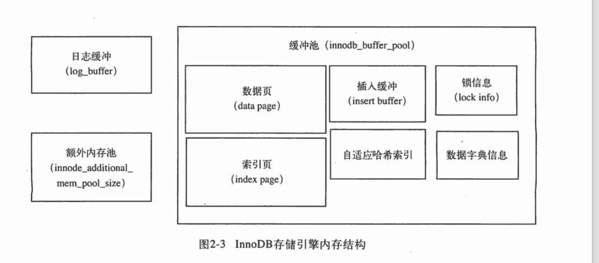
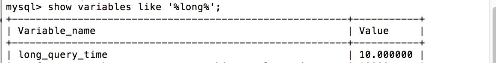
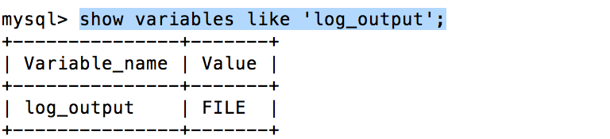
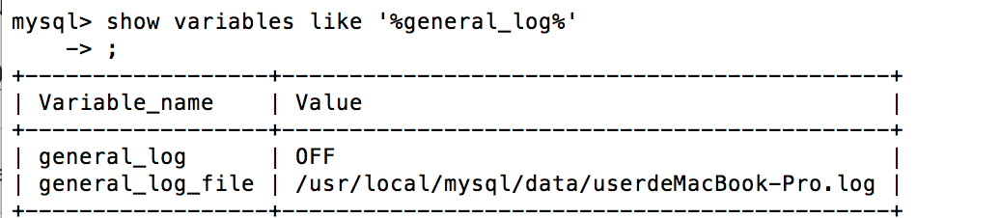
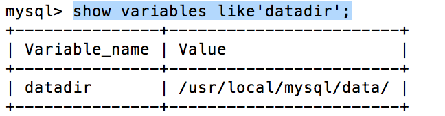
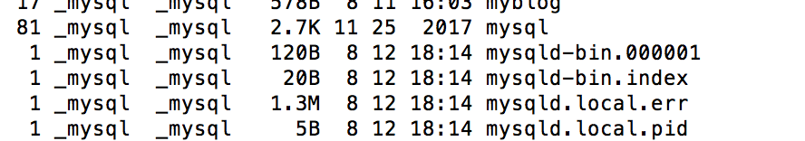
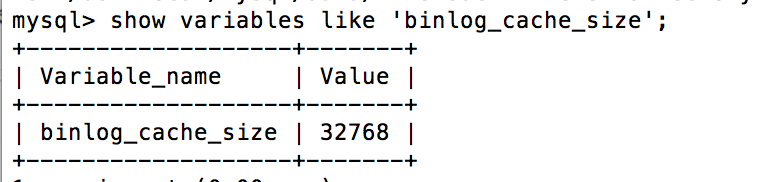
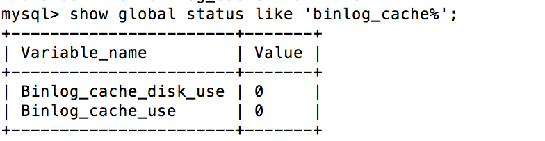

### mysql文档

**登陆mysql**

``mysql -h 120.0.0.1 -u root -p ``

**查看mysql使用了哪些配置文件**

进入到mysql的安装bin目录下面，执行下面的命令 

``` 
./mysql --help|grep my.cnf
```

**查看mysql的数据存放在哪个目录下面**

首先登陆mysql,然后执行下面的命令

```show variables like 'datadir'\G```

接着查看目录下存放着什么数据

```system ls -lh /usr/local/mysql/data```

**查看mysql缓存池的大小**

```
show variables like 'innodb_buffer_pool_size'\G
```

**查看重做日志缓冲池大小**

```
show variables like 'innodb_log_buffer_size'\G
```

**查看额外的内存池大小**

```
show variables like 'innodb_additional_mem_pool_size'\G
```

缓冲池是用来存放各种数据的缓存，InnoDB的存储引擎的工作方式总是将数据库的文件按照页（每页16k）读取到缓冲池，然后将LRU算法保留缓冲池中的数据，如果数据库文件需要修改，总是首先修改缓存池中的页，然后将缓冲池中的脏页刷新到文件。

**查看缓冲池的使用情况**

```
show engine innodb status\G
```

执行命令结果

```
Buffer pool size   8192
Free buffers       7817
Database pages     375
Old database pages 0
Modified db pages  0
```

buffer pool size代表有多少个缓冲帧（每个缓存帧16k），Free buffers表示当前空闲的缓冲帧，Database pages表示已经使用的缓冲帧，Modified db pages 表示脏页的数量。

**mysql内存结构图**



**定位mysql错误日志位置**

```
show variables like 'log_error';
```

**查看是否开启慢查询**

```
show variables like 'slow_query%';
```

查看慢查询的默认设置时间

```
show variables like '%long%';
```



查看是否开启记录没有使用索引的开关

```
show variables like 'log_queries_not_using_indexes';
```

如果运行的sql语句没有使用索引，同样会将这条sql语句纪录到慢查询日志文件中。

随着运行时间的增加，越来越多的sql查询被记录到慢查询日志文件中，这时分析该文件就显得不是很容易，MYSQL提供mysqldumpslow命令来分析该日志文件。

从MYSQL 5.1开始可以将慢查询的日志记录到一张表中，表的名称是：slow_log

```
show create table mysql.slow_log;
```

MYSQL的慢查询输出格式默认是FILE,伱可以将它设置为TABLE，

```
show variables like 'log_output';
```



将输出格式设置为TABLE

```
 set global log_output='TABLE';
```

测试示例：

```
select sleep(11);
```

上面的sql查询沉睡了11秒，会记录到慢查询表中，接着查询慢查询表：

```
select * from mysql.slow_log\G;
```

查询结果：

```
*************************** 1. row ***************************
    start_time: 2018-08-12 13:55:17
     user_host: root[root] @ localhost []
    query_time: 00:00:11
     lock_time: 00:00:00
     rows_sent: 1
 rows_examined: 0
            db: 
last_insert_id: 0
     insert_id: 0
     server_id: 0
      sql_text: select sleep(11)
     thread_id: 1
```

**MYSQL查询日志**

检查MYSQL是否开启了查询日志

```
show variables like '%general_log%'
```



设置开启查询日志

```
set global general_log = 'ON';
```

**MYSQL二进制日志**

查看二进制日志在数据库的目录:

```
show variables like'datadir';
```

mysql默认是没有启动二进制日志，通过配置log-bin可以启动二进制日志,然后重启mysql服务。

查看data目录下的文件

```
ls -lh /usr/local/mysql/data/
```



mysqld-bin.00001即为二进制日志文件，mysqld-bin.index为二进制索引文件，用来存储过往产生的二进制日志序号

关于配置文件的一些参数：

```max_binlog_size```:指定单个二进制日志文件的最大值，如果超过该值，则产生新的二进制文件，后缀名＋1，并记录到.index文件。

当使用事务的表存储引擎时，所有未提交的二进制日志会记录到一个缓存中，等到事务提交的时候，将缓存中的二进制日志写入到二进制日志中。该缓存的大小由```binlog_cache_size```决定，默认大小是32K。

```
show variables like 'binlog_cache_size';
```



```binlog_cache_size```的大小不能太大，因为它是基于会话的，当一个线程开启一个事务时，MYSQL就会自动分配一个缓存；当一个事务的记录大于设定的```binlog_cache_size```,会把日志写入一个临时文件中，因此该值又不能太小。通过```binlog_cache_use```和```binlog_cache_disk_use```分别可以查看使用缓冲写二进制日志的次数和使用临时文件写二进制日志的次数。

```
show global status like 'binlog_cache%';
```



默认情况下，不是在每次缓存写入到二进制日志时MYSQL会把二进制日志同步到磁盘上。当数据库所在的操作系统发生宕机时，可能会有最后一部分数据没有写入二进制日志（虽然事务已经提交了）。参数sync_binlog＝［n］，表示每写huanc多少次就同步到磁盘。当将N设置为1时，不使用缓存来写二进制日志，直接采用同步写磁盘的方式来写二进制。它的默认值时0，表示将二进制日志同步到磁盘有系统决定。

```binlog_format```：指定记录二进制日志的格式:

* statement：记录的是日志的逻辑sql语句.
* Row：记录的是表的行更改情况。

