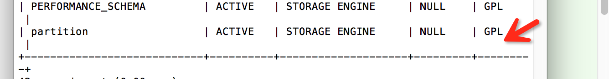

### 分区表

表分区是将一个表或者索引物分解为多哥更小、更可管理的部分。就访问数据库而言，从逻辑上只有一个表或者一个索引，但是在物理上这个表或者索引可能由数十个物理分区组成。每个分区都是独立的对象，可以独自处理，也可以作为一个更大对象的一部分进行处理。

**查看是否开启了分区功能**

```
show plugins
```



**分区类型**

* RANGE分区：行数据基于一个给定连续区间的列值放入分区。
* LIST分区：和RANGE分区类似，只是LIST分区面向的是离散的值。
* HASH分区：根据用户自定义的表达式的返回值来进行分区，返回值不能为负数。
* 根据MYSQL数据库提供的哈希函数来进行分区

不论创建何种类型的分区，如果表中存在主键或者是唯一索引，分区列必须是唯一索引的一个组成部分。

例如：创建t1表时，指定col3为分区列，col3不是唯一列的一部分，会报错。

```
create table t1(col1 int not null,
    col2 DATE not null,
    col3 int not null,
    col4 int not null,
    unique key(col1,col2))
    partition by hash(col3)
    partitions 4;
```

```
ERROR 1503 (HY000): A PRIMARY KEY must include all columns in the table's partitioning function

```

但是如果指定col1为分区列时，程序可以执行成功。

```
create table t1(col1 int not null,
    col2 DATE not null,
    col3 int not null,
    col4 int not null,
    unique key(col1,col2))
    partition by hash(col1)
    partitions 4;
```

```
Query OK, 0 rows affected (0.92 sec)
```

当没有指定主键、唯一索引时，可以指定任何一个分区。

#### RANGE分区

创建一个分区，当id<10是数据插入到p0分区，当id <20数据插入到p1分区。

```
create table t1(id int)
	partition by range (id)(
	partition p0 values less than (10),
	partition p1 values less than (20));
```

创建分区成功后，会在mysql数据存储目录下出现如下目录：


执行如下sql

```
insert into t1 select 9;
insert into t1 select 10;
insert into t1 select 15;
```

通过information_schema架构下的PARTITIONS表来查询每个分区的具体信息

```
select * from information_schema.PARTITIONS where table_schema=database() and table_name='t1'\G;
```

查询结果

```
*************************** 1. row ***************************
                TABLE_CATALOG: def
                 TABLE_SCHEMA: testmysql
                   TABLE_NAME: t1
               PARTITION_NAME: p0
            SUBPARTITION_NAME: NULL
   PARTITION_ORDINAL_POSITION: 1
SUBPARTITION_ORDINAL_POSITION: NULL
             PARTITION_METHOD: RANGE
          SUBPARTITION_METHOD: NULL
         PARTITION_EXPRESSION: id
      SUBPARTITION_EXPRESSION: NULL
        PARTITION_DESCRIPTION: 10
                   TABLE_ROWS: 1
               AVG_ROW_LENGTH: 16384
                  DATA_LENGTH: 16384
              MAX_DATA_LENGTH: NULL
                 INDEX_LENGTH: 0
                    DATA_FREE: 0
                  CREATE_TIME: 2018-08-15 19:22:12
                  UPDATE_TIME: NULL
                   CHECK_TIME: NULL
                     CHECKSUM: NULL
            PARTITION_COMMENT: 
                    NODEGROUP: default
              TABLESPACE_NAME: NULL
*************************** 2. row ***************************
                TABLE_CATALOG: def
                 TABLE_SCHEMA: testmysql
                   TABLE_NAME: t1
               PARTITION_NAME: p1
            SUBPARTITION_NAME: NULL
   PARTITION_ORDINAL_POSITION: 2
SUBPARTITION_ORDINAL_POSITION: NULL
             PARTITION_METHOD: RANGE
          SUBPARTITION_METHOD: NULL
         PARTITION_EXPRESSION: id
      SUBPARTITION_EXPRESSION: NULL
        PARTITION_DESCRIPTION: 20
                   TABLE_ROWS: 2
               AVG_ROW_LENGTH: 8192
                  DATA_LENGTH: 16384
              MAX_DATA_LENGTH: NULL
                 INDEX_LENGTH: 0
                    DATA_FREE: 0
                  CREATE_TIME: 2018-08-15 19:22:12
                  UPDATE_TIME: NULL
                   CHECK_TIME: NULL
                     CHECKSUM: NULL
            PARTITION_COMMENT: 
                    NODEGROUP: default
              TABLESPACE_NAME: NULL

```

从查询结果可以看出，p0分区有一条数据，p2分区有2条，这跟我们插入的数据是一致的，9被插入到p0分区，10和15被插入到p1分区。

当我们插入一条不在分区中定义的值时，数据库会报出一个异常。

```
 insert into t1 select 30;
```

执行结果

```
Table has no partition for value 30
```

对于上述问题，我们可以添加一个分区，如所有大于等于20的值都放入p2分区。

```
alter table t1 add partition (partition p2 values less than maxvalue);
```

然后再执行之前执行失败的sql语句，就可以执行成功了。

RANGE分区主要用于日期列的分区，如下示例：

```
create table sales( money int unsigned not null, date datetime ) partition by range (YEAR(date))( partition p2008 values less than(2009), partition p2009 values less than(2010), partition p2010 values less than(2011) );
```

执行如下sql

```
insert into sales select 100,'2008-01-01';
insert into sales select 100,'2008-02-01';
insert into sales select 100,'2008-03-01';
insert into sales select 100,'2009-03-01';
insert into sales select 100,'20010-03-01';
```

当我们用分区来对这张表管理时，如果要删除2008年的数据，只需要删除2008年所在的分区即可：

```
alter table sales drop partition p2008;
```

并且查询查询数据时，会根据日期去所在的区间查询数据，可以加快查询速率。

```
explain partitions select * from sales where date > '2008-01-01'and  date <='2008-12-31'\G;
```

查询结果：

```
*************************** 1. row ***************************
           id: 1
  select_type: SIMPLE
        table: sales
   partitions: p2008
         type: ALL
possible_keys: NULL
          key: NULL
      key_len: NULL
          ref: NULL
         rows: 3
        Extra: Using where
```

可以看到SQL优化器只去搜索p2008这个分区，而不去搜索所有的分区，因此大大提高了执行的速度。

#### LIST分区

LIST分区与RANGE分区非常相似，只是分区列的值是离散的，而非连续的。

```
create table t(
    a int,
    b int)
    partition by list(b)(
    partition p0 values in(1,3,5,7,9),
    partition p1 values in(0,2,4,6,8)
    );
```

向表中插入数据

```
insert into t select 1,1;
insert into t select 1,2;
insert into t select 1,3;
insert into t select 1,4;
```

```
select table_name,partition_name,table_rows from information_schema.Partitions where table_name='t' and table_schema=database()\G;
```

查询结果

```
*************************** 1. row ***************************
    table_name: t
partition_name: p0
    table_rows: 2
*************************** 2. row ***************************
    table_name: t
partition_name: p1
    table_rows: 2
2 rows in set (0.00 sec)
```

如果插入的值不在分区的定义中，MYSQL数据库回同样抛出异常：

```
insert into t select 1,10;
```

执行结果

```
Table has no partition for value 10
```

#### HASH分区

```
create table t_hash(
    a int,
    b datetime)
    partition by hash(YEAR(B))
    partitions 4;
```

创建hash分区表，需要在CREATE TABLE语句后面加PARTITION BY HASH(expr)子句，expr是一个返回整数的表达式。此外，还需要再添加一个PARTITIONS num子句，其中num是一个非负的整数，它表示将要分隔成分区的数量，如果没有包括PARTITIONS子句，那么分区的数量默认是1。

```
insert into t_hash select 1,'2010-04-01';
```

```
select table_name,partition_name,table_rows from information_schema.PARTITIONS where table_schema=database() and table_name='t_hash'\G;
```

```
*************************** 1. row ***************************
    table_name: t_hash
partition_name: p0
    table_rows: 0
*************************** 2. row ***************************
    table_name: t_hash
partition_name: p1
    table_rows: 0
*************************** 3. row ***************************
    table_name: t_hash
partition_name: p2
    table_rows: 1
*************************** 4. row ***************************
    table_name: t_hash
partition_name: p3
    table_rows: 0
```


