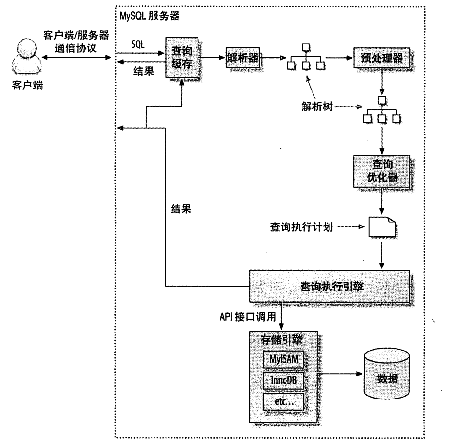

### 查询性能优化

#### 查询执行的基础

当我们发送一个sql请求时，MySQL做了如下操作：



1. 客户端发送一条查询给服务器
2. 服务器先检查查询缓存，如果命中了缓存，则立刻返回存储在缓存中的结果。否则进入下一个阶段。
3. 服务器端进行sql解析、预处理，再由优化器生成对应的执行计划。
4. MySQL根据优化器生成的执行计划，调用存储引擎的API来执行查询。
5. 将结果返回给客户端。

#### MySQL通信协议

MySQL客户端与服务端之间的通信协议是“半双工”的，即要么由服务器向客户端发送数据，要么由客户端向服务端发送数据，这两个动作不能同时发生，一旦一端开始发送消息，另一端要接收完整消息才能响应它。

当我们连接MySQL的库函数从MySQL获取数据时，从结果看起来像从MySQL服务器获取数据，但实际上都是从这个库函数的缓存获取数据。所以如果需要返回一个很大的结果集的时候，库函数会花很多的时间和内存来存储所有的结果集。

#### 查询优化处理

* 语法解析器和预处理

MYSQL通过关键字将SQL语句进行解析，并生成一颗对应的“解析树”。**MYSQL解析器**将使用MYSQL语法规则验证和解析查询。验证是否使用错误的关键字、关键字的顺序是否正确，或者引号是否前后正确匹配。

**预处理器** 则根据MySQL规则进一步检查解析树是否合法，如：检查数据表和数据列是否存在，还会解析名字和别名，看看它们是否有歧义。

* 查询优化器

一条查询可以有多种执行方式,并且最后都返回相同的结果。优化器的作用就是找到这其中最好的执行计划。它将尝试预测一个查询使用某种执行计划时的成本，并选择成本最小的一个。可以通过查询当前会话Last_query_cost的值来得知MySQL计算的当前查询成本。

```
select sql_no_cache count(*) from film_actor;
```

```
+----------+
| count(*) |
+----------+
|     5462 |
+----------+
```

```
show status like 'last_query_cost';
```

```
+-----------------+-------------+
| Variable_name   | Value       |
+-----------------+-------------+
| Last_query_cost | 1104.399000 |
+-----------------+-------------+
```


