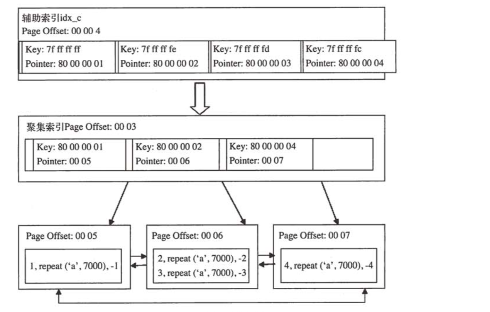

### 索引

B+树索引本身并不能找到具体的一条记录，B+树索引能找到只是该记录所在的页。数据库把页载入内存，然后通过Page Directory(页目录)再进行二叉查找，只是二叉查找时间复杂度很低，同时内存中查找很快，因此通常我们忽略这部分查找所用的时间。

Page Directory 存放了记录的相对位置，有些时候这些记录指针称为Slots(槽)。InnoDB的一个槽中可能有多条记录（最少4条，最多8条）。Slots中的记录按照顺序存放，这样可以通过二叉查找迅速找到记录的指针。

#### B+树索引

在数据库中，B+树的高度一般都在2~3层，对于查找某一键值的行记录，最多只需要2到3次IO。

B+树索引分为聚集索引和辅助聚集索引。

**聚集索引**

InnoDB存储引擎表是索引组织表，即表中的数据按照主键的顺序存放。聚集索引就是按照每张表的主键构造一颗B+树，叶节点存放着整张表的行记录数据，因此聚集索引的叶节点成为数据页，每个数据页通过一个双向链表来进行链接。

在许多情况下，查询优化器更倾向于采用聚集索引，因为聚集索引能够让我们在索引的叶子上直接找到数据。聚集索引能够特别快的访问针对范围值的查询。

在B+树索引中，数据页（叶子节点）上存放的是完整的行记录，而在非数据页的索引页中，存放的仅仅是键值（主键）以及指向数据页的偏移量，而不是一个完整的行记录。如下图：


如上：Pointer指向了数据存储在哪个页中，mysql将数据页记载到内存中，然后根据key去Page Directory槽中查找（槽中数据是按照主键顺序排列）获取到记录的相对位置，然后去相对位置获取数据。

聚集索引对于主键的排序查找和范围查找速度非常快，叶节点的数据就是我们要查询的数据，如：我们要查询一张用户表，查询最后注册的10位用户，由于B+树索引是双向链表，我们可以快速的找到最后一个数据页，并取出10条数据。

**辅助索引**

辅助索引叶节点不包含行的全部数据，除了包含键值以外，每个叶节点中的索引行还包含一个书签，该书签告诉 InnoDB存储引擎，哪里可以找到与索引相对应的行数据。



如上图辅助索引：key是被加辅助索引那列数据的值，pointer是包含了主键的值。辅助索引通过Pointer找到具体的聚集索引，然后聚集索引通过查找到它的叶子节点，就可以获取到具体的数据行。

**创建索引**

```
CREATE INDEX index_name ON table_name(column_name);
```

创建唯一索引

```
CREATE UNIQUE INDEX index_name ON table_name(column_name);
```

**删除索引**

```
DROP INDEX index_name ON table_name;
```


