### LDA 主题模型

#### 什么是主题

因为LDA是一种主题模型，那么首先必须明确知道LDA是怎么看待主题的。对于一篇新闻报道，假如它是讲关于NBA篮球比赛，那么很直接都知道它的主题是关于体育的，因为里面出现了“科比”、“湖人”等等关键词直观理解，那么好了，我们可以定义主题是一种关键词集合，如果一篇文章出现某些关键词，我们可以直接判断他属于某种主题，比如：文章中出现，科比、篮球，足球之类的词，那么可以把它划分为体育类的文章。但是按照这种划分有一个弊端：一旦文章中出现了一个体育球星的名字，我们是不是可以将这篇文章的主题划分为体育？显然不行，因为这篇文章可能讲球星的丑闻，和体育没半毛钱关系，此时主题是娱乐还差不多。

一个词不能硬性地扣一个主题的帽子，如果说一篇文章出现了某个球星的名字，我们只能说有很大概率他属于体育的主题，但也有小概率属于娱乐的主题。同一个词，在不同的主题背景下，它出现的概率是不同的。

面对这种情况，LDA是怎么来确定主题的呢？

LDA认为天下所有文章都是用基本的词汇组合而成，此时假设有词库*V*={*v*1,*v*2,....,*v**n*}，那么如何表达主题呢？**LDA通过词汇的概率分布(二项分布)**来反映主题：

假设一篇文章的词库：``{科比，篮球，足球，奥巴马，希拉里，克林顿}``

假设有两个主题：``{体育，政治}``

LDA说体育这个主题就是(数字代表某个词的出现概率)：

``{科比:0.3，篮球:0.3，足球:0.3，奥巴马:0.03，希拉里:0.03，克林顿:0.04}``

而政治这个主题就是：

``{科比:0.03，篮球:0.03，足球:0.04，奥巴马:0.3，希拉里:0.3，克林顿:0.3}``


#### 文章在讲什么

给你一篇文章读，然后请你简要概括文章在讲什么，你可能会这样回答：80%在讲政治的话题，剩下15%在讲娱乐，其余都是废话。这里大概可以提炼出三种主题：政治，娱乐，废话。也就是说，对于某一篇文章，很有可能里面不止在讲一种主题，而是几种主题混在一起的。

LDA认为，文章和主题之间并不一定是一一对应的，也就是说，文章可以有多个主题，一个主题可以在多篇文章之中。**同一个主题，在不同的文章中，它出现的比例(概率)是不同的**。

看到这里，可以发现，**文档和主题之间的关系和主题和词汇的关系是多么惊人的类似**！LDA巧妙地用词汇的分布来表达主题，那么这一次也不例外，我们巧妙地用主题的分布来表达文章。

假设现在有两篇文章：```《体育快讯》，《娱乐周报》```

有三个主题：```体育，娱乐，废话```

那么《体育快讯》是这样的：```[废话,体育,体育,体育,体育,....,娱乐,娱乐]```

《娱乐周报》是这样的:[废话,废话,娱乐,娱乐,娱乐,....,娱乐,体育]


#### 文章是如何生成的

LDA认为，每个主题会对应一个词汇分布，而每个文档会对应一个主题分布，那么LDA反推一篇文章是如何被写出来的呢？文章的生产过程是这样的:

1. 确定主题和词汇的分布

2. 确定文章和主题的分布

3. 随机确定该文章的词汇个数*N*

4. 如果当前生成的词汇个数小于*N*执行第5步，否则执行第6步

5. 由文档和主题分布随机生成一个主题，通过该主题由主题和词汇分布随机生成一个词，继续执行第4步

6. 文章生成结束

只要确定好两个分布(主题与词汇分布，文章与主题分布)，然后随机生成文章各个主题比例，
再根据各个主题随机生成词，词与词之间的顺序关系被彻底忽略了，这就是LDA眼中世间所有文章的生成过程！


#### LDA贝叶斯模型

LDA是基于贝叶斯模型的，涉及到贝叶斯模型离不开“先验分布”，“数据（似然）”和"后验分布"三块。

```先验分布 + 数据（似然）= 后验分布```

这点其实很好理解，因为这符合我们人的思维方式，比如你对好人和坏人的认知，先验分布为：100个好人和100个的坏人，即你认为好人坏人各占一半，现在你被2个好人（数据）帮助了和1个坏人骗了，于是你得到了新的后验分布为：102个好人和101个的坏人。现在你的后验分布里面认为好人比坏人多了。这个后验分布接着又变成你的新的先验分布，当你被1个好人（数据）帮助了和3个坏人（数据）骗了后，你又更新了你的后验分布为：103个好人和104个的坏人。依次继续更新下去


**伯努利分布(0-1分布)** 

伯努利试验是只有两种结果的单次随机试验，假设事件A出现的概率为p，则不出现的概率为q=1-p。以*β*记事件A出现的次数，则*β*仅取0，1两值，相应的概率分布为：

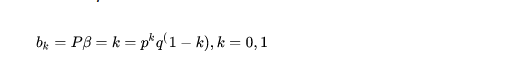

**二项分布**

指在只有两个结果的n次独立的伯努利试验中，所期望的结果出现**次数的概率**。在单次试验中，结果A出现的概率为p，结果B出现的概率为q，p+q=1。


其中p我们可以理解为好人的概率，x为好人的个数，n为好人坏人的总数。

组合表示在n次试验中出现x次结果的可能的次数。如10次试验，出现0次正面的次数有1次，出现1次正面的次数有10次，……，出现5次正面的次数有252次

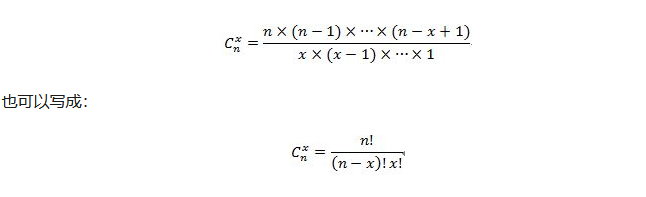

显然，对于我们的数据（似然），用一个二项分布就可以搞定。

#### Beta分布

>  https://blog.csdn.net/github_36299736/article/details/52954038

虽然数据(似然)很好理解，但是对于先验分布，我们就要费一番脑筋了，为什么呢？因为我们希望这个先验分布和数据（似然）对应的二项分布集合后，得到的后验分布在后面还可以作为先验分布！就像上面例子里的“102个好人和101个的坏人”，它是前面一次贝叶斯推荐的后验分布，又是后一次贝叶斯推荐的先验分布。也即是说，我们希望先验分布和后验分布的形式应该是一样的，这样的分布我们一般叫共轭分布。

我们知道数据是二项分布，那么和二项分布共轭的分布其实就是Beta分布(分布的分布)。Beta分布的表达式为：

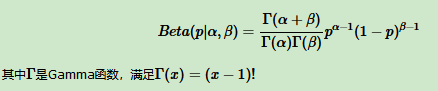

仔细观察Beta分布和二项分布，可以发现两者的密度函数很相似，区别仅仅在前面的归一化的阶乘项。那么它如何做到先验分布和后验分布的形式一样呢？后验分布*P*(*p*|*n*,*k*,*α*,*β*)推导如下:

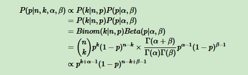

将上面最后的式子归一化以后，得到我们的后验概率为：

> 归一化：把数据变成(０，１)或者（1,1）之间的小数。主要是为了数据处理方便提出来的，把数据映射到0～1范围之内处理，更加便捷快速

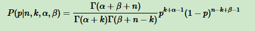

可见我们的后验分布的确是Beta分布，而且我们发现：

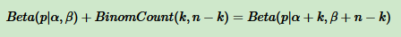

这个式子完全符合我们在上一节好人坏人例子里的情况，我们的认知会把数据里的好人坏人数分别加到我们的先验分布上，得到后验分布。　


#### 多项分布与Dirichlet 分布

现在我们回到上面好人坏人的问题，假如我们发现有第三类人，不好不坏的人，这时候我们如何用贝叶斯来表达这个模型分布呢？之前我们是二维分布，现在是三维分布。由于二维我们使用了Beta分布和二项分布来表达这个模型，则在三维时，以此类推，我们可以用三维的Beta分布来表达先验后验分布，三项的多项分布来表达数据（似然）。

三项的多项分布好表达，我们假设数据中的第一类有*m*1个好人，第二类有*m*2个坏人，第三类为*m*3=*n*−*m*1−*m*2个不好不坏的人,对应的概率分别为*p*1,*p*2,*p*3=1−*p*1−*p*2，则对应的多项分布为

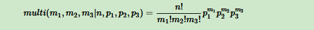

那三维的Beta分布呢？超过二维的Beta分布我们一般称之为狄利克雷(以下称为Dirichlet )分布。也可以说Beta分布是Dirichlet 分布在二维时的特殊形式。从二维的Beta分布表达式，我们很容易写出三维的Dirichlet分布如下:

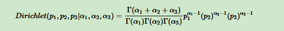

同样的方法，我们可以写出4维，5维，。。。以及更高维的Dirichlet 分布的概率密度函数。为了简化表达式，我们用向量来表示概率和计数,这样多项bate分布可以表示为：*D**i**r**i**c**h**l**e**t*(*p*⃗ |*α*⃗ )，而多项分布可以表示为：*m**u**l**t**i*(*m*⃗ |*n*,*p*⃗ )。一般意义上的K维Dirichlet 分布表达式为：

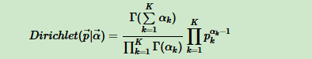

而多项分布和Dirichlet 分布也满足共轭关系，这样我们可以得到和上一节类似的结论:

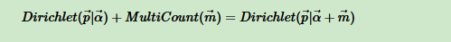

对于Dirichlet 分布的期望，也有和Beta分布类似的性质：

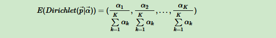


前面做了这么多的铺垫，我们终于可以开始LDA主题模型了。我们的问题是这样的，我们有*M*篇文档，对应第d个文档中有有个词。即输入为如下图

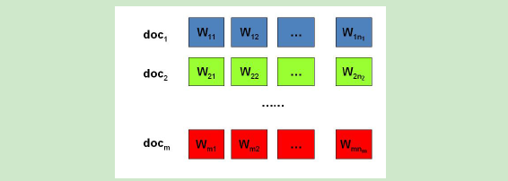

> P(词 | 文档)=P（词 | 主题）P（主题 | 文档）
>
> P（主题 | 文档)(后验分布) = p(主题在文档中的先验分布) + p(主题的多项分布) 
>
> P（词 | 主题) 后验分布= p(词在主题中的先验分布) + p(词的多项分布)


我们的目标是找到每一篇文档的主题分布和每一个主题中词的分布。在LDA模型中，我们需要先假定一个主题数目**K**，这样所有的分布就都基于**K**个主题展开。那么具体LDA模型是怎么样的呢？具体如下图:

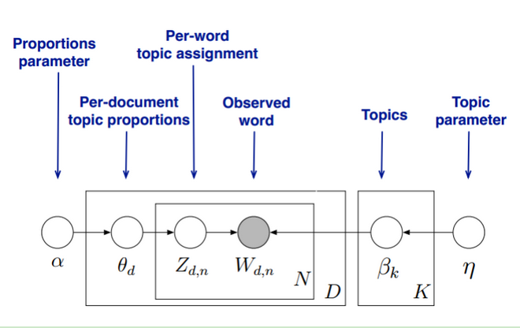

LDA假设文档主题的先验分布是Dirichlet分布，即对于任一文档D, 其主题分布θd为：

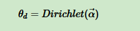


其中，α为分布的超参数，是一个K维向量。θd也是k维向量，表示文档D中K个主题的概率：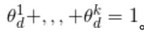

> 超参数的定义：在机器学习的上下文中，超参数是在开始学习过程之前设置值的参数，而不是通过训练得到的参数数据。通常情况下，需要对超参数进行优化，给学习机选择一组最优超参数，以提高学习的性能和效果

LDA假设主题中所有词的先验分布(历史记录)是Dirichlet分布，即对于任一主题k, 其词分布βk为：

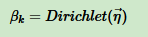

其中，η为分布的超参数，是一个V维向量。V代表词汇表里所有词的个数。

对于数据中任一 一篇文档d中的第n个词(似然数据)，我们可以从主题分布*θ*d中得到它的主题编号Zdn的分布是：

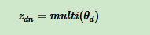

而对于该主题编号，得到我们看到的词*W**d**n*的概率分布为:

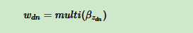

理解LDA主题模型的主要任务就是理解上面的这个模型。这个模型里，我们有*M*个文档主题的Dirichlet分布，而对应的数据有*M*个主题编号的多项分布，这样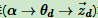就组成了Dirichlet-multi共轭，可以使用前面提到的贝叶斯推断的方法得到基于Dirichlet分布的文档主题后验分布。

如果在第d个文档中，第k个主题的词的个数为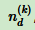, 则对应的多项分布的计数可以表示为 :

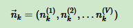

利用Dirichlet-multi共轭，得到*θ*d的后验分布为

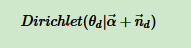

同样的道理，对于主题与词的分布，我们有*K*个主题与词的Dirichlet分布，而对应的数据有*K*个主题编号的多项分布，这样(*η*→*βk*→*w*⃗ (*k*))就组成了Dirichlet-multi共轭，可以使用前面提到的贝叶斯推断的方法得到基于Dirichlet分布的主题词的后验分布。

如果在第k个主题中，第v个词的个数为：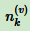, 则对应的多项分布的计数可以表示为

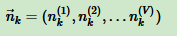

利用Dirichlet-multi共轭，得到*βk*的后验分布为:𝐷𝑖𝑟𝑖𝑐ℎ𝑙𝑒𝑡(𝛽𝑘|𝜂⃗ +𝑛⃗ 𝑘)

由于主题产生词不依赖具体某一个文档，因此文档主题分布和主题词分布是独立的。理解了上面这组Dirichlet-multi共轭，就理解了LDA的基本原理了。
