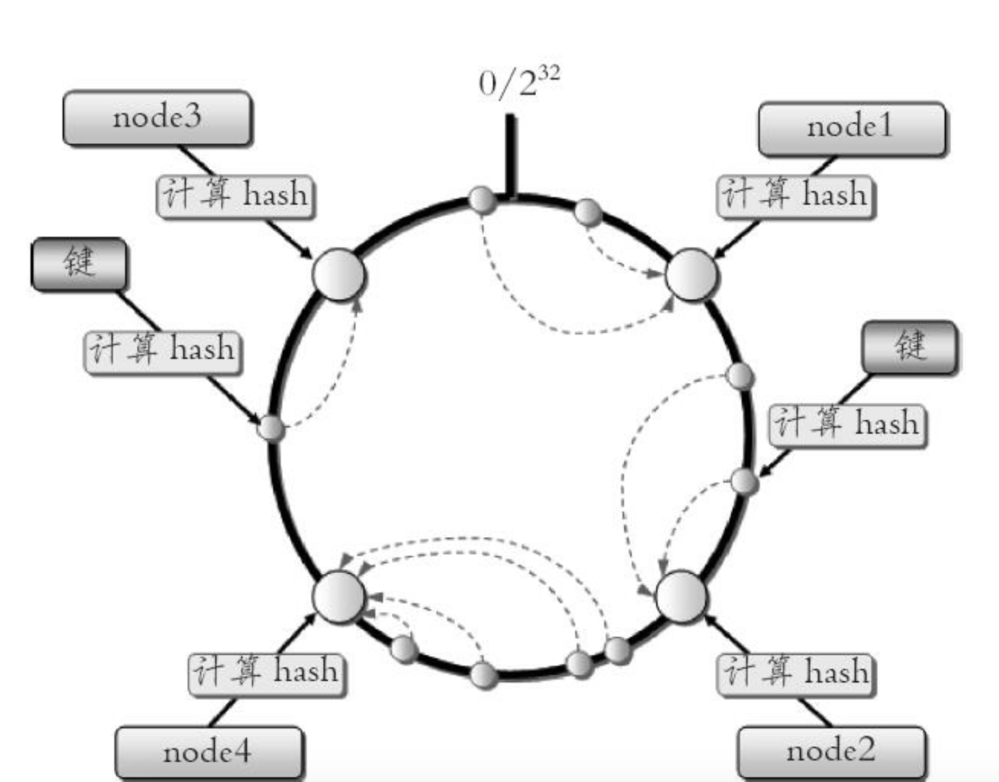
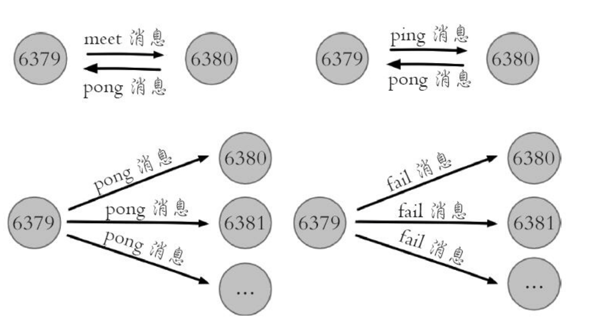
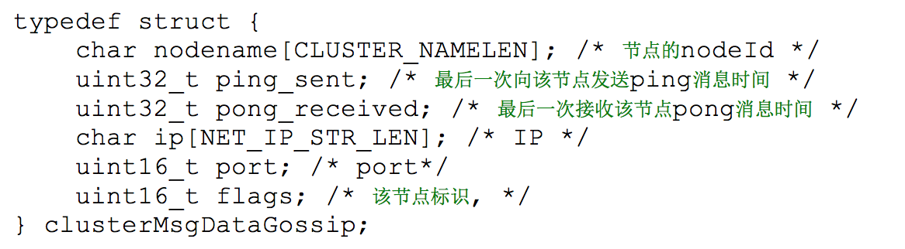
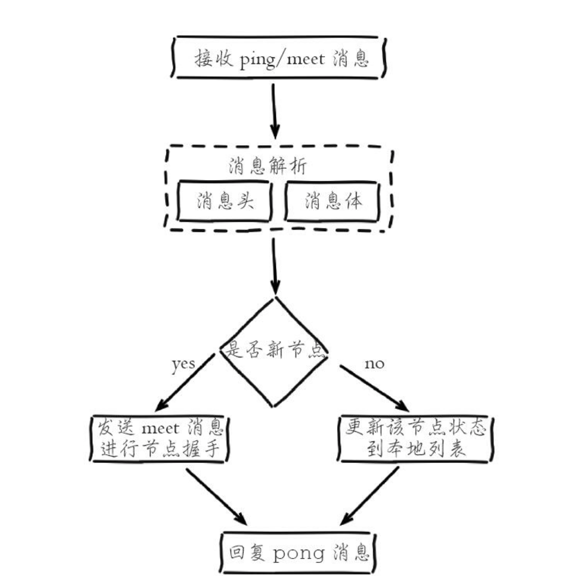
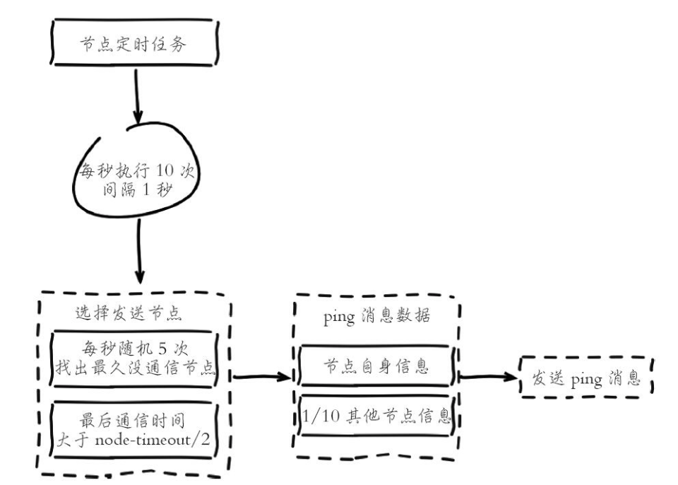

### Redis 集群

#### 数据分布理论

分布式数据库首先要解决把整个数据集按照分区规则映射到多个节点的问题，即把数据集划分到多个节点上，每个节点负责整体数据集的一个子集。

常见的分区规则有哈希分区和顺序分区两种：

| 分区规则 | 特点                                       | 代表产品      |
| -------- | ------------------------------------------ | ------------- |
| 哈希分区 | 离散度好；数据分布业务无关；无法顺序访问   | Redis Cluster |
| 顺序分区 | 离散度易倾斜；数据分布业务无关；可顺序访问 | Bigtable      |

常见的哈希分区规则如下：

1. 节点取余分区

使用特定的数据，如Redis的键或者用户ID，再根据节点数量N使用公式： hash(key)%N计算出哈希值，用来决定数据映射到哪一个节点上。这种方式存在一个问题：当节点数量变化时，如扩容或者收缩节点，数据节点映射关系需要重新计算会导致数据的重新迁移。

这种方式的突出优点是简单，一般采用预分区的方式，提前根据数据量规划好分区数，比如：划分为512或1024张表，保证可支撑未来一段时间的数据量。扩容时通常采用翻倍扩容，避免数据映射全部被打乱导致全量迁移。

2. 一致性哈希分区

实现思路是为系统中每个节点分配一个token，范围一般在0~2^32，这些token构成一个哈希环。数据读写执行节点查找操作时，先根据key计算hash值，然后顺时针找到第一个大于等于该值的token节点，



这种方式相比节点取余最大的好处在于加入和删除节点只影响哈希环中的相邻节点，对其它节点无影响。

但是一致性哈希分区也有几个问题：

* 加减节点会造成哈希环中部分数据无法命中，需要手动处理或者忽略这部分数据。
* 当使用少量节点时，节点变化将大范围影响哈希环中数据映射，因此这种方式不适合少量数据节点的分布式方案。
* 普通的一致性哈希分区在增减节点时需要增加一倍或减去一半节点才能保证数据和负载的均衡。

3. 虚拟槽分区

虚拟槽分区使用了哈希分区，使用分散度良好的哈希函数所有数据映射到一个固定范围的整数集合中，整数定义为槽。槽是集群内数据 管理和迁移的基本单位。采用大范围槽的主要目的是为了方便数据拆分和集群扩展。

比如Redis Cluster 槽范围是0~16383,当集群有5个节点时，每个节点平均大约负责3276个槽。每个槽所映射的数据通常比较均匀，将数据平均划分到5个节点进行数据分区。


#### Redis 数据分区

Redis Cluser采用虚拟槽分区，所有的键根据哈希数映射到0~16383整数槽内，计算公式：slot = CRC16(key)&16383。每一个节点负责维护一部分槽以及槽所映射的键值数据。

Redis 虚拟槽分区特点：

* 解耦数据和节点之间的关系，简化了节点扩容和收缩难度。
* 节点自身维护槽的映射关系，不需要客户端或者代理服务维护槽分区。
* 支持节点、槽、键之间的映射查询，用于数据路由、在线伸缩等场景。


#### 集群功能限制

1）批量操作支持有限。如mget、mset，目前只支持具有相同slot值的key执行批量操作。

2）key 事务操作支持有限。同里只支持多key在同一节点上的事务操作。

3）key 作为数据分区的最小粒度，不能将一个大的键值对象如hash、list 等映射到不同的节点。

4）复制结构只支持一层，从节点只能复制主节点，不支持嵌套树状复制结构。

#### 搭建集群

Redis 集群一般由多个节点组成，节点数量至少为6个才能保证完整高可用的集群。每个节点需要开启配置cluster-enabled yes，让Redis 运行在集群模式下。

```properties
#节点端口
port 6380
#开启集群模式
cluster-enabled yes
# 节点超时时间 单位毫秒
cluster-node-timeout 15000
# 集群内部配置文件
cluster-config-file "nodes-6379.conf"
#以后台运行
daemonize yes
#pid目录，以后台模式运行，需要创建该目录
pidfile /Users/user/Documents/ProgramFile/redis-data/cluster/6380/redis_6380.pid
# 日志存放目录
logfile /Users/user/Documents/ProgramFile/redis-data/cluster/6380/log/redis.log
#持久化目录
dir /Users/user/Documents/ProgramFile/redis-data/cluster/6380/db/
```

其它配置和单机模式一致。

第一次启动时，如果没有集群配置文件，它会自动创建一份，文件名称采用cluster-config-file参数项控制，建议采用node{port}.conf格式定义，通过使用端口号区分不同节点，防止同一个机器多个节点彼此覆盖，造成集群信息异常。

Redis 自动维护集群配置文件，不要手动修改，防止节点重启时产生集群信息错乱。

```
f27ad08b03e92d6f811b22d82b179fa03009aff6 :0 myself,master - 0 0 0 connected
vars currentEpoch 0 lastVoteEpoch 0
```

文件中记录了集群初始状态，它是一个40位16进制字符串即节点ID，用于唯一标识集群内一个节点，之后很多集群都要借助于节点ID来完成。节点ID不同于运行ID，节点ID在集群初始化时只创建一次，节点重启时会加载集群配置文件进行重用，而Redis的运行ID每次重启都会变化。

Redis启动后，只能识别出自己的节点信息，但每个节点彼此并不知道对方的存在。


#### 节点握手

节点握手是集群彼此通信的第一步，由客户端发起命令：cluster meet{ip}{port}。


命令：cluster meet 127.0.0.1 6380 让节点6379 和6380节点进行握手通信。cluster meet 命令是一个异步命令，执行之后立刻返回：

1）节点6379本地创建6380节点信息对象，发送meet消息。

2）节点6380接受到meet消息后，保存6379节点信息并回复pong消息。

3）之后节点6379和6380彼此定期通过ping和pong消息进行正常的节点通信。

通过cluster meet 命令将其它节点加入进来后，可以通过cluster nodes 命令查看集群信息：

```
127.0.0.1:6380> cluster nodes
31d7ae027dd114ec4ff1785fb72d08b188b7a9a9 127.0.0.1:6385 master - 0 1551006215438 5 connected
0677afa780b594b7b803522886e7251356bb73cd 127.0.0.1:6382 master - 0 1551006220994 2 connected
4f452e7ac2757e96ad3267be593e902f399d069b 127.0.0.1:6384 master - 0 1551006219984 4 connected
0f8b5cb309ce99d81282b68db31532e7e6b7f8dd 127.0.0.1:6381 master - 0 1551006217965 1 connected
866645619b317579b976faecc58806a74b6f5b74 127.0.0.1:6383 master - 0 1551006218974 3 connected
f27ad08b03e92d6f811b22d82b179fa03009aff6 127.0.0.1:6380 myself,master - 0 0 0 connected
```

节点建立握手之后集群还不能正常工作，这时聚群处于下线状态，所有的数据读写都被禁止：

```
127.0.0.1:6380> set hello ya
(error) CLUSTERDOWN Hash slot not served
```

可以通过cluster info 查看集群当前状态：

```
127.0.0.1:6380> cluster info
cluster_state:fail
cluster_slots_assigned:0
cluster_slots_ok:0
cluster_slots_pfail:0
cluster_slots_fail:0
cluster_known_nodes:6
cluster_size:0
cluster_current_epoch:5
cluster_my_epoch:0
cluster_stats_messages_sent:1024
cluster_stats_messages_received:1024
```

可以看到集群被分配的槽(cluster_slots_assigned)是0，由于目前所有的槽没有分配到节点，因此集群无法完成槽到节点的映射。只有当16384个槽全部分配给节点后，集群才进入在线状态。

#### 分配槽

Redis 集群把所有的数据映射到16384 个槽中。每个key会映射为一个固定的槽，只有当节点分配了槽，才能响应和这些槽关联的键命令。通过cluster addslots 命令为节点分配槽。

```
userdeMacBook-Pro:~ user$ redis-cli -p 6380 cluster addslots {0..5461}
userdeMacBook-Pro:~ user$ redis-cli -p 6381 cluster addslots {5462..10922}
userdeMacBook-Pro:~ user$ redis-cli -p 6382 cluster addslots {10923..16383}
```

如上把16384个slot平均分配给6380、6381、6382三个节点，执行cluster info 查看集群状态：

```
127.0.0.1:6380> CLUSTER info
cluster_state:ok
cluster_slots_assigned:16384
cluster_slots_ok:16384
cluster_slots_pfail:0
cluster_slots_fail:0
cluster_known_nodes:6
cluster_size:3
cluster_current_epoch:5
cluster_my_epoch:0
cluster_stats_messages_sent:11081
cluster_stats_messages_received:11081
```

当前集群状态是ok，集群进入在线状态，所有的槽都已经分配给节点，执行cluster nodes命令可以看到节点和槽的分配关系：

```
127.0.0.1:6380> cluster nodes
31d7ae027dd114ec4ff1785fb72d08b188b7a9a9 127.0.0.1:6385 master - 0 1551014662630 5 connected
0677afa780b594b7b803522886e7251356bb73cd 127.0.0.1:6382 master - 0 1551014664652 2 connected 10923-16383
4f452e7ac2757e96ad3267be593e902f399d069b 127.0.0.1:6384 master - 0 1551014661619 4 connected
0f8b5cb309ce99d81282b68db31532e7e6b7f8dd 127.0.0.1:6381 master - 0 1551014663641 1 connected 5462-10922
866645619b317579b976faecc58806a74b6f5b74 127.0.0.1:6383 master - 0 1551014665158 3 connected
f27ad08b03e92d6f811b22d82b179fa03009aff6 127.0.0.1:6380 myself,master - 0 0 0 connected 0-5461

```

集群模式下，Redis节点角色分为主节点和从节点，首次启动的节点和被分配槽的节点都是主节点，从节点负责复制主节点槽信息和相关的数据。使用cluster replicate{nodeId}命令让一个节点成为从节点。

命令必须在从对应的从节点上执行，nodeId是要复制主节点的节点ID：

```
userdeMacBook-Pro:~ user$ redis-cli -p 6383
127.0.0.1:6383> CLUSTER REPLICATE f27ad08b03e92d6f811b22d82b179fa03009aff6
userdeMacBook-Pro:~ user$ redis-cli -p 6384
127.0.0.1:6384> CLUSTER REPLICATE 0f8b5cb309ce99d81282b68db31532e7e6b7f8dd
userdeMacBook-Pro:~ user$ redis-cli -p 6385
127.0.0.1:6385> CLUSTER REPLICATE 0677afa780b594b7b803522886e7251356bb73cd
```


### 节点通信

所谓元数据是指：节点负责哪些数据，是否出现故障等状态信息。常见的元数据维护方式分为：集中式和p2p方式。Redis集群采用p2p的Gossip（流言）协议，Gossip协议工作原理就是节点彼此不断通信交换信息，一段时间后所有的节点都会知道集群完整的信息，这种方式类似流言传播。

通信过程说明：

1）集群中每个节点都会单独开辟一个TCP通道，用于节点之间彼此通信，通信端口号在基础端口上加10000。

2）每个节点在固定周期内通过特定规则选择几个节点发送ping消息。

3）接收到ping消息的节点用pong消息作为响应。

每个节点可能知道全部节点，也可能仅知道部分节点，只要这些节点彼此可以正常通行，最终它会达到一致的状态。


#### Gossip 消息

Gossip 协议的主要职责就是信息交换，信息交换的载体就是节点彼此发送的Gossip消息。

常用的 Gossip消息可分为：ping消息、pong消息、meet消息、fail消息等。



* meet消息：用于通知新节点加入。消息发送者通知接收者加入到当前集群，meet消息通信正常完成后，接收节点会加入到集群中进行周期性的ping、pong消息交换。
* ping消息：集群内交换最频繁的消息，集群内每个节点每秒向多个其它节点发送ping消息，用于检测节点是否在线和交换彼此状态信息。ping消息发送封装了自身节点和部分其它节点的状态数据。
* pong消息：当接收到ping、meet消息时，作为响应消息回复给发送方确认消息正常通信。pong消息内部封装了自身状态数据。节点也可以向集群内广播自身的pong消息来通知整个集群对自身状态进行更新。
* fail消息：当节点判定集群内另一个节点下线时，会向集群内广播一个fail消息，其它节点接收到fail消息之后把对应节点更新为下线状态。

消息格式分为：消息头和消息体。消息头 包含发送节点自身状态数据，集群内所有的消息都采用相同的消息结构clusterMsg：


消息体在Redis内部采用clusterMsgData结构声明，其中ping、meet、pong都采用cluster MsgDataGossip数组作为消息体数据，它的实际消息类型使用消息头的type属性区分：



当接收到ping、meet消息时，接收节点会解析消息内容并根据自身的识别情况做出相应处理：



* 解析消息头过程：消息头包含了发送节点的消息，如果发送节点是新节点且消息是meet类型，则加入到本地节点列表；如果是已知节点，则尝试更新发送节点的状态，如槽映射关系、主从角色等状态。
* 解析消息体过程：如果消息体的clusterMsgDataGossip数组包含的节点是新节点，则尝试发起与新节点的meet握手流程；如果是已知节点，则根据cluster MsgDataGossip中的flag字段判断该节点是否下线，用于故障转移。

消息处理完后回复pong消息，内容同样包含消息头和消息头，发送节点接收到回复的pong消息后，采用类似的流程解析处理消息并更新与接收节点最后的通信时间，完成一次消息通信。


#### 节点选择

由于内部需要频繁地进行节点信息交换，而ping/pong消息会携带当前节点和部分其他节点的状态数据，势必会加重带宽和计算的负担。Redis集群内部节点通信采用固定频率（定时任务每秒执行10次）。因此节点每次选择需要通信的节点列表变得非常重要。通信节点选择过多虽然可以做到信息及时交换但成本过高。节点选择过少会降低集群内所有节点彼此信息交换频率，从而影响故障判定、新节点发现等需求的速度。




1. 选择发送消息的节点数量

集群内每个节点维护定时任务默认每秒执行10次，每秒会随机选取5个节点找出最久没有通信的节点发送ping命令，用于保证Gossip信息交换的随机性。每100毫秒都会扫描本地节点列表，如果发现节点最近一次接受pong消息的时间大于cluster_node_timeout/2，则立即发送ping消息，防止该节点信息太长时间未更新。

根据以上规则得出每个节点每秒需要发送ping消息的数量＝1+10*num(node.pong_reveived>cluster_node_timeout/2)，因此cluster_node_timeout参数对消息发送的节点数量影响非常大。当我们带宽资源紧张时，可以适当调大这个参数，如从默认15秒改为30秒来降低带宽占用率。过度调大cluster_node_timeout会影响消息交换的频率从而影响故障转移、槽信息更新、新节点发现的速度。

2. 消息数据量

每个ping消息的数据量体现在消息头和消息体中，其中消息头主要占用空间的字段是myslots，占用2KB，这块空间占用相对固定。消息体会携带一定数量的其他节点信息用于信息交换。


### 集群伸缩

#### 伸缩原理

Redis 集群提供了灵魂的节点扩容和收缩方案。在不影响集群对外服务的情况下，可以为集群添加节点进行扩容也可以下线部分节点进行缩容。其原理可以抽象为槽和对应数据在不同节点之间灵活移动。


#### 扩容集群

1. 准备新节点

提前准备好新节点并运行在集群模式下，新节点建议跟集群内的节点配置保持一致。

2. 加入集群

新节点依然采用cluster meet命令加入到现有集群中，在集群内任意节点执行cluster meet命令将新节点加入进来。

```
127.0.0.1:6380> CLUSTER MEET 127.0.0.1 6386
127.0.0.1:6380> CLUSTER MEET 127.0.0.1 6387
```

集群内新旧节点经过一段时间的ping/pong消息通信之后，所有节点会发现新节点并将它们的状态保存到本地。

```
127.0.0.1:6380> cluster nodes
bca165a9f313b7ca2a4baffa39a7162806142d32 127.0.0.1:6386 master - 0 1551086050935 6 connected
344f755d3a39dfb09270e35ef323bec05a3fb477 127.0.0.1:6387 master - 0 1551086053464 7 connected
```

新节点刚开始都是主节点，但是由于没有负责的槽，所以不能接受任何读写操作。 


