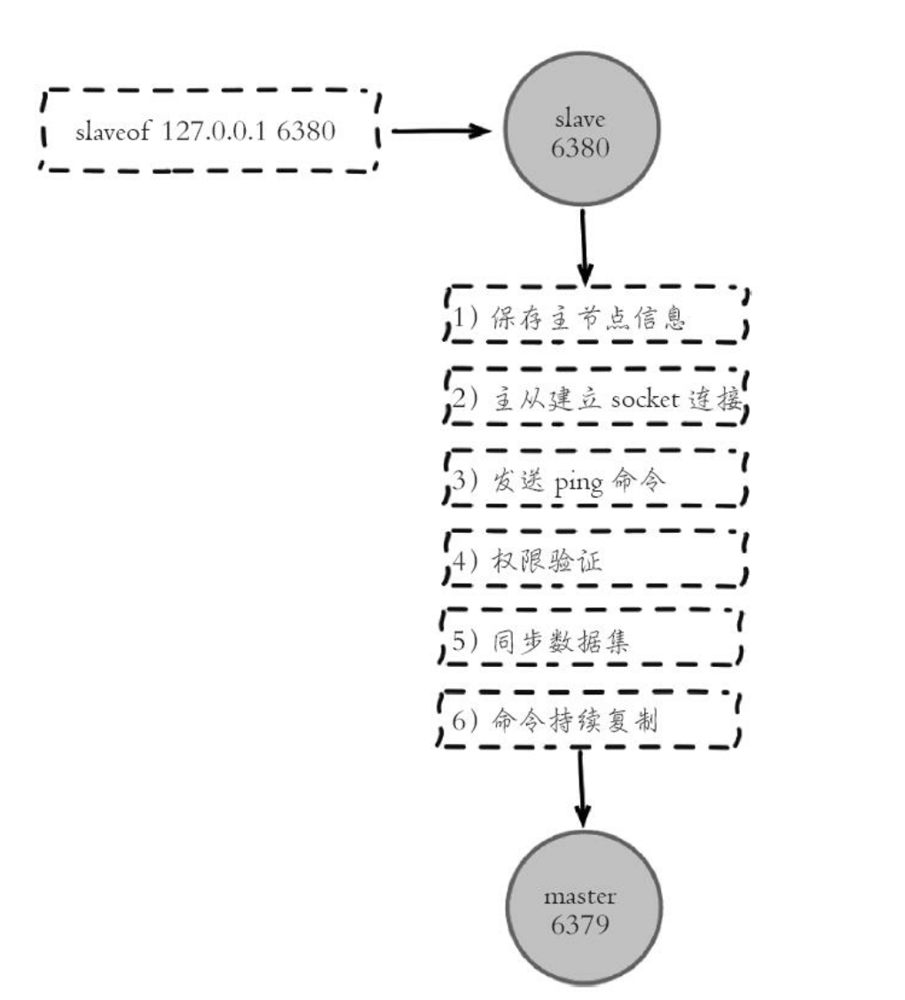
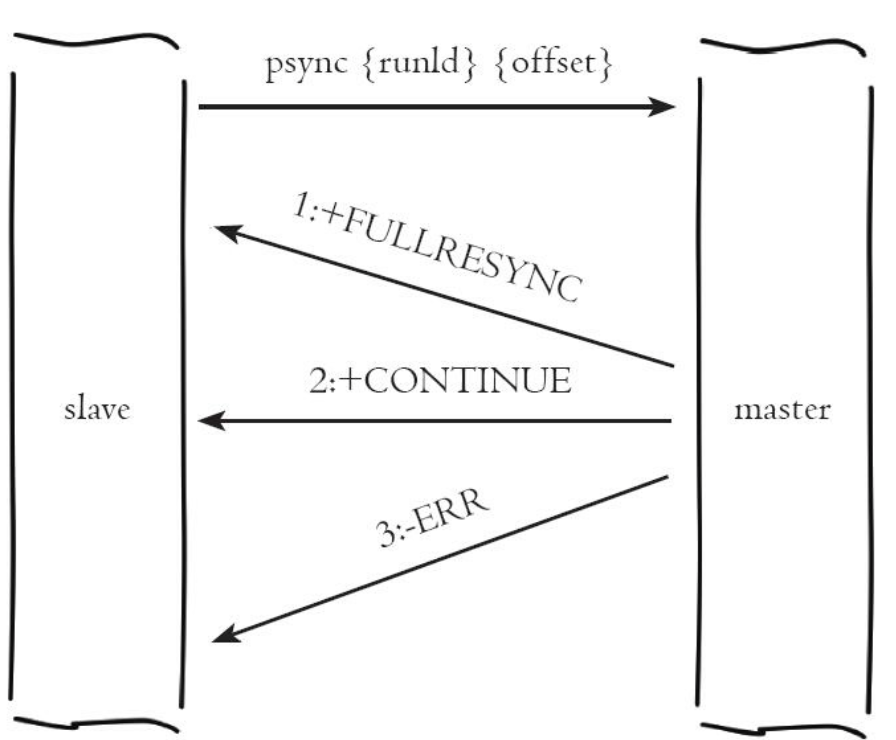
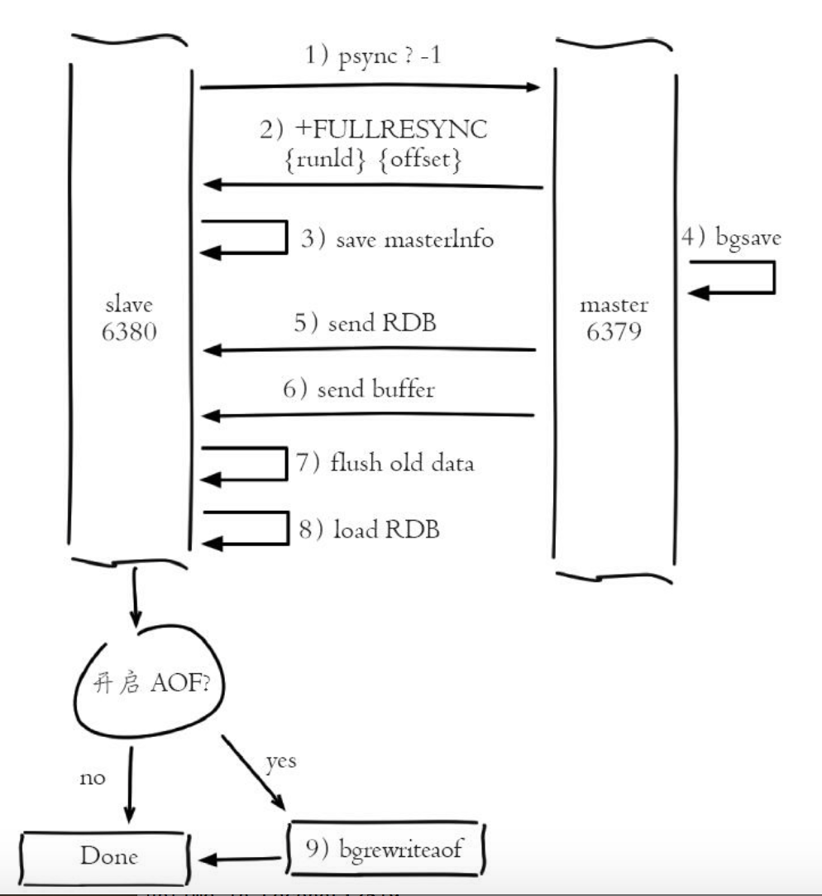
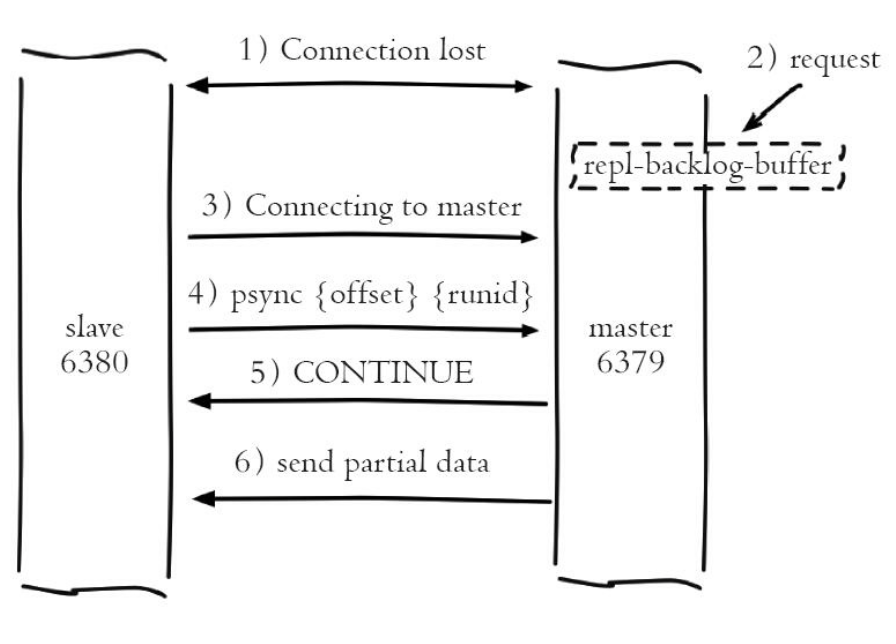

### Redis 复制

在分布式系统中为了解决单点问题，通常会把数据复制多个副本部署到其他机器，满足故障恢复和负载均衡等需求。

#### 建立复制

每个从节点只能有一个主节点，而主节点可以同时具有多个从节点。复制的数据流是单向的，即只能从主节点复制到从节点。配置复制的方式有以下三种：

1）在从节点的配置文件中加入slaveof{masterHost}{masterPort}随Redis启动生成。

2）在redis-server启动命令后加入 --slaveof{masterHost}{masterPort}生效

3）直接使用命令：slaveof{masterHost}{masterPort}生效。

例如：假如本地启动了两个端口为6380和6381的Redis 节点，然后在127.0.0.1:6381节点上执行如下命令：

```
SLAVEOF 127.0.0.1 6380
```

SLAVEOF 是在从节点发起的，这时6380作为主节点，6381作为从节点。当复制关系建立之后执行如下测试：

```
127.0.0.1:6380> set hello slaveoftest

127.0.0.1:6381> get hello
"slaveoftest"
```

从运行结果可以看到复制已经工作了，我们针对6380的任何修改都可以同步到从节点6381中。

我们可以通过info replication命令查看复制相关状态：

1）从节点的复制状态：

```
127.0.0.1:6381> info replication
# Replication
role:slave
master_host:127.0.0.1
master_port:6380
master_link_status:up
master_last_io_seconds_ago:8
master_sync_in_progress:0
slave_repl_offset:603
slave_priority:100
slave_read_only:1
connected_slaves:0
master_repl_offset:0
repl_backlog_active:0
repl_backlog_size:1048576
repl_backlog_first_byte_offset:0
repl_backlog_histlen:0
```

2）主节点的复制状态：

```
127.0.0.1:6380> info replication
# Replication
role:master
connected_slaves:1
slave0:ip=127.0.0.1,port=6381,state=online,offset=1079,lag=1
master_repl_offset:1079
repl_backlog_active:1
repl_backlog_size:1048576
repl_backlog_first_byte_offset:2
repl_backlog_histlen:1078
```


#### 断开复制

slaveof no one 来断开与主节点的复制关系。

它的主要流程是：断开与主节点的复制关系，从节点晋升为主节点。

从节点断开复制后并不会抛弃原有的数据，只是无法再获取主节点上的数据变化。

slaveof 命令还可以实现切主操作，执行slaveof{newMasterHost}{newMasterPort}命令即可。它的主要流程如下：

1）断开与旧主节点复制关系

2）与新主节点建立复制关系

3）删除从节点当前所有数据

4）对新主节点进行复制操作

如上在进行切主操作时会清空之前所有的数据，因此线上操作slaveof命令时需要小心，防止在错误的节点上执行（如主节点），导致数据丢失。

#### 安全性

对于数据比较重要的节点，主节点会通过设置requirepass参数进行密码验证，这个时候从节点需要配置masterauth参数与主节点密码保持一致，这样从节点才可以正确的连接到主节点并发起复制流程。

#### 只读

默认情况下，从节点使用slave-read-only=yes配置为只读模式。由于复制只能从主节点到从节点，对于从节点的任何修改，主节点都无法感知，修改从节点会造成主从数据不一致。因此建议线上不要修改从节点的只读模式。

#### 传输延迟

主从节点一般部署在不同的机器上，复制时的网络延迟就成为了需要考虑的问题。Redis为我们提供了repl-disable-tcp-nodelay参数用于控制是否关闭TCP_NODELAY，默认关闭：

1）当关闭时，主节点产生的命令数据无论大小都会及时的发送给从节点，这样主从之间延迟会变小，但增加了网络带宽的消耗。适用于主从之间的网络环境良好的场景。

2）当开启时，主节点会合并较小的TCP数据包从而节省带宽。默认发送时间间隔取决于Linux的内核，一般默认为40毫秒。这种配置节省了带宽但增大了主从之间的延迟。适用于主从网络环境复杂或者带宽紧张的场景。

#### 拓扑

1. 一主一从结构

一主一从用于主节点出现宕机时从节点提供故障转移支持。当应用写命令并发量较高且需要持久化时，可以只在从节点开启AOF，这样即保证数据安全性同时也避免了持久化对主节点的性能干扰。

需要注意当主节点关闭持久化功能时，如果主节点脱机要避免自动重启操作。因为主节点之前没有开启持久化功能，自动重启后数据为空，这时从节点如果继续复制主节点会导致从节点数据也被清空。安全的做法是在从节点上执行slaveof no one，断开与主节点的复制关系。

2. 一主多从

对于读占比比较大的场景，可以把读命令发送到从节点来分担主节点压力。同时日常一些比较耗时的读命令，如：keys、sort等可以在其中一台从节点上执行，防止慢查询对主节点造成阻塞而影响线上服务的稳定性。对于写并发量较高的场景，多个从节点会导致主节点写命令的多次发送从而过度消耗网络带宽，同时也加重了主节点的负载。

3. 树状主从结构

当主节点需要挂载多个从节点时，为了避免对主节点的性能干扰，可以采用树状主从结构降低主节点的压力。即数据写入A节点后会同步到B和C节点，B节点再把数据同步到D和E节点，数据实现了一层一层的向下复制。


#### 复制过程



1）保存主节点信息

执行slaveof后，从节点只保存主节点的地址信息便返回，这时建立复制流程还没有开始。

2）从节点内部通过每秒运行的定时任务维护复制相关逻辑，当定时任务发现存在新的主节点后，会尝试与该节点建立网络连接。如果从节点无法建立连接，定时任务会无限重试直到成功或者执行slaveof no one取消复制。

3）发送ping命令

连接成功后从节点发送ping请求进行首次通信，ping请求主要目的如下：

* 检测主从之间网络套接字是否可用
* 检测主节点当前是否可接受处理命令

如果发送ping命令后，从节点没有收到主节点的pong回复或者超时，从节点会断开复制连接，下次定时任务发起重连。

4）权限验证。

如果主节点设置了requirepass参数，则需要密码验证，从节点必须配置masterauth参数保证与主节点相同的密码才能通过验证。如果验证失败复制将终止，从节点重新发起复制流程。

5）同步数据集

主从复制连接正常后，对于首次建立复制的场景，主节点会把持有的数据全部发送给从节点，这部分操作是耗时最长的步骤。新版本同步划分为两种情况：全量同步和部分同步。

6）命令持续复制。

当主节点把当前的数据同步给从节点后，便完成了复制的建立流程。接下来主节点会持续把命令发送给从节点，保证主从数据一致性。


#### 数据同步

Redis在2.8以上版本使用psync命令完成主从数据同步，同步过程分为：全量复制和部分复制。

* 全量复制：一般用于初次复制场景，Redis早期支持的复制功能只有全量复制，它会把主节点全部数据一次性发送给从节点，当数据量较大时，会对主从节点和网络造成很大的开销。
* 部分复制：用于处理主从复制中由于网络闪断等原因造成的数据丢失场景，当从节点再次连上主节点后，如果条件允许，主节点会补发丢失数据给从节点。因为补发的数据远远小于全量数据，可以有效避免全量复制的过高开销。


1. 复制偏移量

参与复制的主从节点都会维护自身复制偏移量。主节点在处理完写入命令后，会把命令的字节长度做累加记录，通过info replication可以查看：

```
127.0.0.1:6380> info replication
master_repl_offset:239
```

从节点每秒钟上报自身的复制偏移量给主节点，因此主节点也会保存从节点的复制偏移量：

```
127.0.0.1:6380> info replication

slave0:ip=127.0.0.1,port=6381,state=online,offset=239,lag=0
```

从节点在接收到主节点发送的命令后，也会累加记录自身的偏移量。

```
127.0.0.1:6381> INFO replication
slave_repl_offset:197
```

通过对比主从节点的复制偏移量，可以判断主从节点数据是否一致。

2. 复制积压缓冲

复制积压缓冲区是保存在主节点上的一个固定长度队列，默认大小为1M，当主节点有连接的从节点被创建，这时主节点响应写命令，不但会把命令发送给从节点，还会写入复制积压缓冲区。

由于缓冲区本质上是先进先出的定长队列，所以能实现保存最近已复制数据的功能，可以用于部分复制和复制命令丢失的数据补救。

```properties
127.0.0.1:6380> info replication
#开启复制缓冲区
repl_backlog_active:1 
# 缓冲区最大长度
repl_backlog_size:1048576
# 起始偏移量
repl_backlog_first_byte_offset:2
# 以保存的有效长度
repl_backlog_histlen:1462
```

3. 主节点运行ID

每个Redis节点启动后都会动态分配一个40 位的十六进制字符串作为运行ID。运行ID的主要作用是用来唯一识别Redis节点，比如从节点用来识别自己正在复制哪个主节点，如果只使用ip+port的方式识别主节点，那么当主节点更换了数据集后（RDB/AOF)，再从偏移量处复制数据是不安全的。但是运行ID随着Redis的重启会发生改变，从而导致从节点误认为是新的主节点，执行全量复制。

```
127.0.0.1:6380> info server
run_id:c342fc6ca231cff33d45d6586ce070ef510fa975
```

4. psync 命令

从节点使用psync命令完成部分复制和全量复制，命令格式：psync{runId}{offset}

* runId：从节点所复制主节点的运行id
* offset ：当前从节点已经复制的数据偏移量



1）从节点发送psync命令给主节点，参数runId是当前从节点保存的主节点运行ID,参数offset，如果是第一次参与复制则默认值是-1，否则是当前从节点保存的复制偏移量。

2）如果主节点回复+FULLRESYNC{runId}{offset}，则从节点触发全量复制，如果主节点回复+CONTINUE,从节点将触发部分复制，回复+ERR说明主节点版本太低，无法识别命令。


#### 全量复制



Redis 2.8 之前，使用sync命令进行全量复制，2.8之后使用psync命令。

流程说明：

1）发送psync命令进行数据同步，由于是第一次进行复制，从节点没有复制偏移量和主节点的运行 ID，所以发送psync-1。

2）主节点根据psync-1解析出当前为全量复制，回复+FULLRESYNC响应。

3）从节点接收到主节点的响应数据保存运行ID和偏移量offset。

```
570:S 18 Feb 08:52:24.083 * Full resync from master:
c342fc6ca231cff33d45d6586ce070ef510fa975:1
```

4）主节点执行bgsave保存RDB文件到本地。

```
568:M 18 Feb 08:52:24.081 * Starting BGSAVE for SYNC with target: disk
568:M 18 Feb 08:52:24.082 * Background saving started by pid 576
576:C 18 Feb 08:52:24.083 * DB saved on disk
568:M 18 Feb 08:52:24.089 * Background saving terminated with success
```

日志开头M、S、C的意义：M＝当前为主节点的日志，S＝当前为从节点的日志，C＝子进程的日志。

5）主节点发送RDB文件给从节点，从节点把接收到的RDB文件保存在本地并直接作为从节点的数据文件。

```
570:S 18 Feb 08:52:24.090 * MASTER <-> SLAVE sync: receiving 101 bytes from master
```

如果RDB文件非常大(超过6GB)，传输文件这一步骤将非常耗时，如果总时间超过repl-timeout所配置的值(默认是60秒)，从节点将放弃接受RDB文件并清理已经下载的临时文件，导致全量复制失败。

关于无盘复制：Redis可以将生成的RDB文件直接通过网络发送给从节点，通过repl-diskless-sync参数控制，默认关闭。无盘复制适合网络带宽好的那时机械磁盘性能差的场景（无盘复制目前还不成熟）。

6）对于从节点开始接收RDB快照到接收完成期间，主节点仍然需要响应读写命令，因此主节点会把这期间的写命令数据保存在复制客户端缓冲区内，当节点加载完RDB文件后，主节点再把缓冲区内的数据发送给从节点，保证主从之间数据一致性。

如果主节点创建和传输 RDB的时间过长，对于高流量的写入场景非常容易造成主节点客户端缓冲区溢出。默认配置client-output-buffer-limit slave 256mb 64mb 60,如果60秒内缓冲区消耗持续大于64MB或者直接超过256MB时，主节点将直接关闭客户端连接。

主节点如果将所有的RDB数据发送给从节点后，会打印如下日志：

```
568:M 18 Feb 08:52:24.090 * Synchronization with slave 127.0.0.1:6381 succeeded
```

7）从节点接收完主节点传送来的全部数据后会清空自身旧数据：

```
570:S 18 Feb 08:52:24.091 * MASTER <-> SLAVE sync: Flushing old data
```

8）从节点清空数据后开始加载RDB文件，对于较大的RDB文件还是比较耗时。

```
570:S 18 Feb 08:52:24.091 * MASTER <-> SLAVE sync: Loading DB in memory
570:S 18 Feb 08:52:24.091 * MASTER <-> SLAVE sync: Finished with success
```

对于线上做读写分离的场景，如果此时从节点正处于全量复制或者复制中断，那么从节点响应读命令可能拿到过期或者错误的数据。对于这种情况，Redis复制提供了slave-serve-stale-data参数，默认开启。如果开启则从节点依然响应所有命令，对于无法容忍不一致的应用场景可以设置no来关闭。

9）从节点成功加载完RDB后，如果当前节点开启了AOF持久化功能，它会立刻做bgrewriteof操作，保证全量复制后AOF持久化文件立刻可用。


#### 部分复制

部分复制使用psync{runId}{offset}命令实现。当从节点复制主节点时，如果出现网络闪断或者命令丢失等异常情况，从节点会向主节点要求补发丢失的命令数据，如果主节点的复制积压缓冲区内存在这部分数据则直接发送给从节点，这样就保证连主从节点复制的一致性。



1）当主从节点之间网络出现中断，如果超过repl_timeout时间，主节点会认为从节点故障并中断复制连接。

2）主从连接中断期间，主节点依然响应读写命令，但因为复制连接中断命令无法发送给从节点，不过主节点内部存在复制积压缓冲区，可以保存最近一段时间的写命令数据，默认最大缓存1M.

3）当主从节点网络恢复后，从节点会再次连上主节点。

4）当主从连接恢复后，由于从节点之前保存了自身复制的偏移量和主节点的运行id。从节点会把它们当做psync参数发送给主节点，要求进行部分复制操作。

5）主节点接到psync命令后，首先核对参数runId是否与自身一致，如果一致说明之前复制的是当前主节点；之后根据参数offset在自身复制积压缓冲区查找，如果存在，则对从节点发送+CONTINUE响应，表示可以进行部分复制。

6）主节点根据偏移量将复制积压缓冲区中的数据发送给从节点，保证主从复制进入正常状态。


#### 心跳

主从心跳判断机制：

1）主从节点模仿成对方的客户端进行通信，通过client list命令查看复制相关客户端信息。主节点的连接状态为flags=M，从节点连接状态为flag=S。

2）主节点默认每隔10秒对从节点发送ping命令，判断从节点的存活性和连接状态。可以通过参数repl-ping-slave-period控制发送频率。

3）从节点在主线程中每隔1秒发送replconf ack{offset}命令，给主节点上报自身当前的复制偏移量：

* 实时监测主从节点网络状态
* 上报自身复制偏移量，检查数据是否丢失，如果从节点数据丢失，再从主节点的复制缓冲区中拉去丢失数据。
* 实现保证从节点的数量和延迟性功能。通过min-slaves-to-write、min-slaves-max-lag参数配置定义。

主节点根据info relication中的lag来判断从节点是否超时，正常情况下延迟应该在0和1之间。如果超过repl-timeout配置的值（默认60秒），则判断从节点下线。


#### 开发、运维问题

1. 数据延迟

Redis 由于复制是异步的，数据的延迟是无法避免的，如果业务无法容忍大量的延迟，可以编写外部监控程序监听主从节点的复制偏移量。

说明如下：

1）监控程序定时检查主从节点的偏移量，主节点偏移量在info replicaton的master_repl_offset指标记录，从节点的偏移量可以查询主节点的slave0字段的 offset指标，它们的差值就是延迟的字节。

2）当延迟字节量过高时，监控程序触发警报告知客户端从节点延迟过可以采用Zookeeper的监听回调机制实现客户端通知。

3）客户端接到具体的从节点高延迟通知后，修改读命令路由到其他从节点或主节点上。


2. 读到过期的数据

当主节点存储大量设置超时的数据时，删除的策略有2种：

* 惰性删除：主节点接收到查询的指令时，会检查数据是否过期，如果过期，则执行del指令删除数据，之后主节点再将del命令异步给从节点。需要注意从节点不会主动删除过期数据。
* 定时删除：Redis主节点内部定时任务采样一定数量的键，如果发现键过期，就执行del命令。但是需要注意如果数据大量超时或者主节点没有读取键的操作，那么从节点将无法收到del命令。这时从节点可以读取到已经超时的数据。redis3.2以上会在从节点上读取键之前先检查键是否过期，如果过期，就不返回数据。

3. 从节点故障

对于从节点的故障问题，需要在客户端维护可用的从节点列表，当从节点故障时立刻切换到其他从节点或主节点上。


4. 主从配置不一致

对于有些配置主从之间是可以不一致的，比如：主节点关闭aof在从节点开启。但是对于内存相关的配置必须一致，比如maxmemory，hash-max-ziplist-entries等参数。当配置的maxmemory从节点小于主节点，如果复制的数据量超过从节点maxmemory，它根据maxmemory-policy策略进行内存溢出控制，此时从节点数据已经丢失，但主从复制流程依然正常进行。


5. 规避全量复制

* 第一次建立复制：由于是第一次建立复制，从节点不包含任何主节点数据，因此必须进行全量复制才能完成数据同步。如果数据大而流量高的主节点添加从节点，建议在低峰时操作，或者尽量避免规避大数据量的redis节点。
* 节点运行ID不匹配：当主从关系建立之后，如果此时主节点因故障发生重启，它的运行ID会发生改变，将导致从节点全量复制。因此当主节点发生故障后，手动提升从节点为主节点或者采取支持自动故障转移的哨兵。
* 复制积压缓冲区不足：当主从节点网络中断后，从节点再次连上主节点时会发送psync{offset}{runId}命令请求部分复制，如果偏移量不在主节点的积压缓冲区内，则无法提供给从节点数据，将导致从节点全量复制。积压缓冲区默认为1MB，对于大流量场景显然不够，需要增大积压缓冲区。


#### 复制风暴

复制风暴是指大量的从节点对同一主节点或者同一台机器的多个主节点短时间内发起全量复制。复制风暴会大量消耗机器的cpu、内存、带宽。

1. 单主节点复制风暴

单主节点风暴一般发生在主节点挂载多个从节点的场景。当主节点有故障到重启恢复后，从节点会发起全量复制流程。虽然主节点创建的RDB快照能够被从节点共有，但是同时向多个从节点发送RDB快照，可能使主节点带宽消耗严重，造成主节点的延迟变大。

解决方案首先减少主节点挂载从节点的数量，或者采用树状复制结构，加入中间层来保护主节点。

2. 单机器复制风暴

由于Redis的单线程架构，通常单台机器会部署多个Redis实例。当一台机器上同时部署多个主节点时，如果这台机器出现故障或者网络长时间中断，当它重启恢复后，会有大量从节点针对主节点进行全量复制，造成网络带宽耗尽。

如何避免？

1）应该把主节点尽量分散在多台机器上，避免在单台机器上部署过多的主节点。

2）当主节点所在的机器故障后，提供故障转移机制，避免机器恢复后进行密集的全量复制。