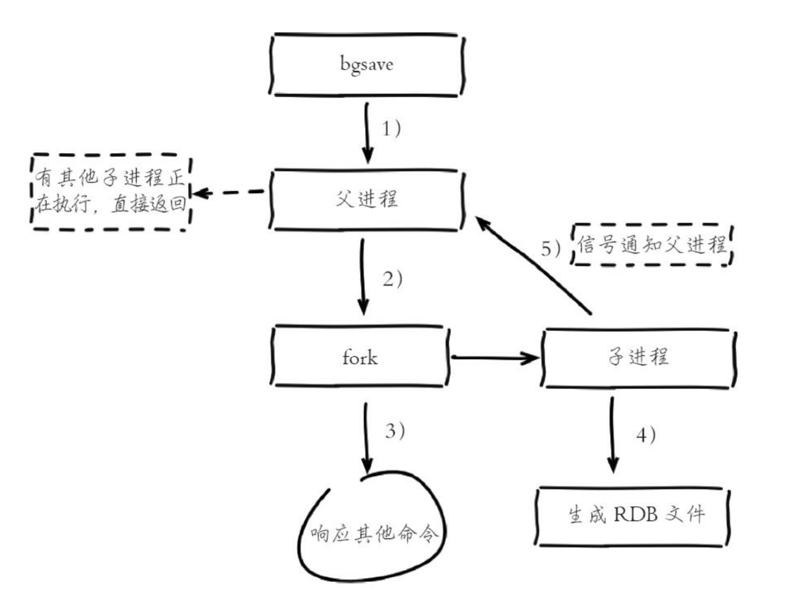
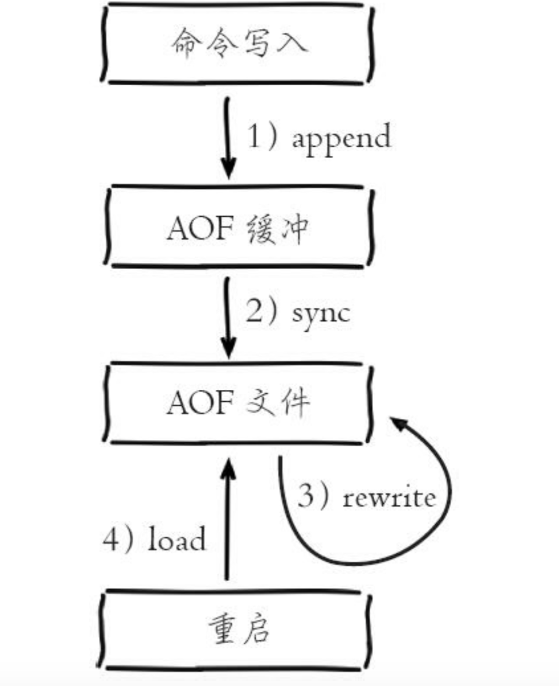
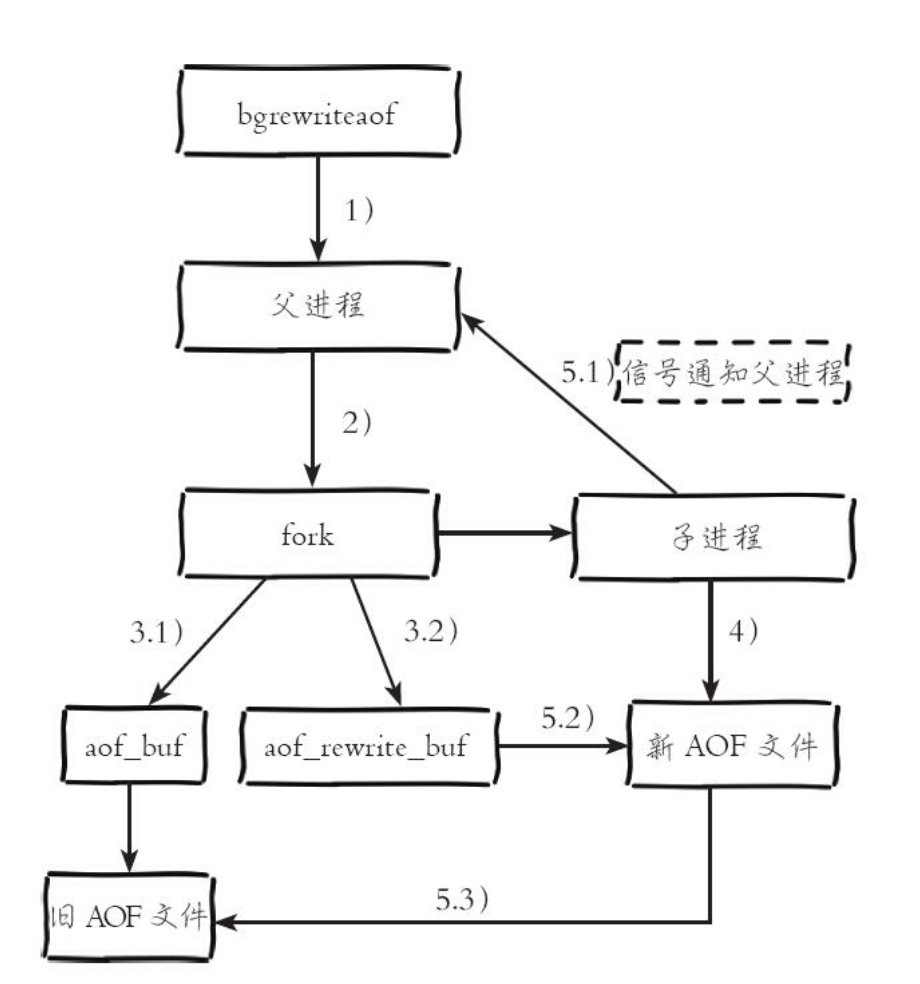
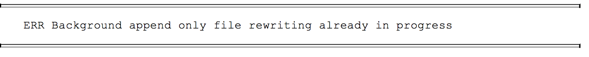
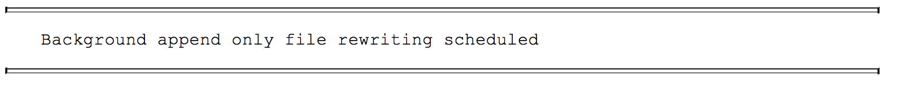
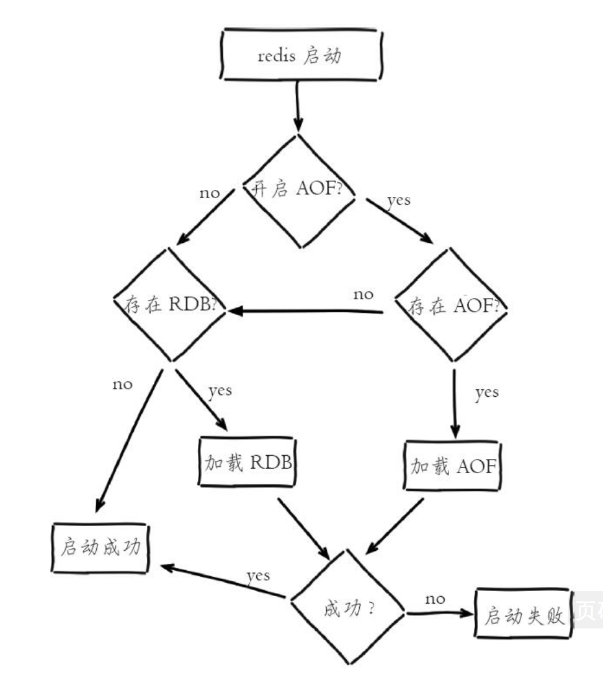
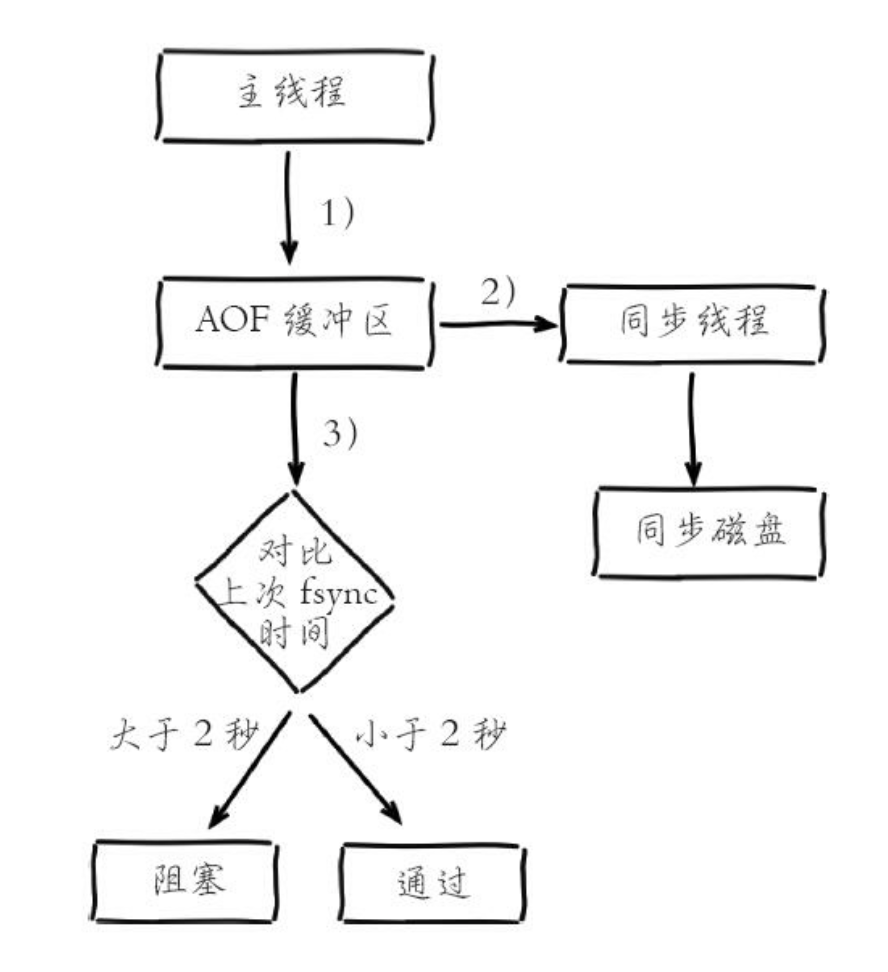

### Redis 持久化

Redis 支持RDB和AOF两种持久化机制，持久化功能有效的避免因进程退出造成的数据丢失。

#### RDB

RDF持久化是把当前进程数据生成快照保存到硬盘的过程，触发RDB持久化过程分为手动触发和自动触发。

1. 触发机制

触发分为手动触发和自动触发，手动触发对应save和bgsave命令：

* save 命令：阻塞当前redis服务器，直到RDB过程完成为止，对于内存比较大的实例会造成长时间的阻塞，所以线上已经不建议使用。
* bgsave命令：redis进程执行fork操作创建子线程，RDB持久化过程由子线程负责，完成后自动结束。阻塞只发生在fork阶段，一般时间很短。


**手动触发** 

两种方式都是直接在客户端执行save或者bgsave命令，如果命令执行成功，就会在redis启动目录下生成dump.rdb文件(默认)。

**根据条件自动触发**

* 使用save相关配置，如"save m n"。表示m秒内数据集存在n次修改，自动触发bgsave。
* 如果从节点执行全量复制，主节点自动执行bgsave生成RDB文件并发送给从节点。
* 执行debug reload命令重新加载redis时，也会自动触发save操作。
* 默认情况下，执行shutdown命令时，如果没有开启AOF 持久化功能则自动执行bgsave。


2. bgsave 持久化运作流程




1）执行bgsave命令，Redis父进程判断当前是否存在执行的子进程，如：RDB/AOF子进程，如果存在，bgsave命令之间返回。

2）父进程执行fork操作创建子进程，fork操作过程中父进程会阻塞，通过info stats命令查看latest_fork_usec选项，可以查看最近一次fork操作的耗时，单位为微秒。

```properties
info stats
#查询结果如下

total_connections_received:1
total_commands_processed:8
instantaneous_ops_per_sec:0
total_net_input_bytes:203
total_net_output_bytes:10261
instantaneous_input_kbps:0.00
instantaneous_output_kbps:0.00
rejected_connections:0
sync_full:0
sync_partial_ok:0
sync_partial_err:0
expired_keys:0
evicted_keys:0
keyspace_hits:1
keyspace_misses:1
pubsub_channels:0
pubsub_patterns:0
latest_fork_usec:357
migrate_cached_sockets:0
```

3）父进程fork完成后，bgsave命令返回"Background saving started"信息，并不再阻塞父进程，可以继续响应其他命令。

4）子进程创建RBD文件，根据父进程内存生成临时快照文件，完成后对原有文件进行原子替换。执行lastsave命令可以获取最后一次生成RDB的时间，对应info 统计的rdb_last_save_time选项。

5）进程发送信息给父进程表示完成，父进程更新统计信息。


3. RDB文件的处理

RDB文件保存在dir配置指定的目录下，文件名称通过dbfilename配置指定。也可以通过执行 config set dir {new dir} 和config set dbfilename {newFileName}运行期冬天执行(config get dir 获取目录)，当下次运行时RDB文件会保存到新目录。

Redis 默认采用LZF算法对生成的RDB 文件做压缩处理，压缩后的文件远远小于内存大小，默认开启，可以通过参数config set rdbcompression {yes/no}动态修改。虽然压缩RDB会消耗CPU，但可以大幅度降低文件的体积，方便保存到硬盘或者通过网络发送给从节点，因此建议开启。

#### RDB的优点和缺点

优点：

* 非常适合备份，全量复制等场景。
* Redis加载RDB恢复数据远远快于AOF的方式

缺点：

* 没法做到实时持久化。每次bgsave都需要fork创建子线程，属于重量级操作，频繁执行成本过高
* 存在老版本Redis服务无法兼容新版本RDB格式问题

1. ​


### AOF

以独立日志的方式记录每次写命令，重启时再重新执行AOF文件中的命令达到恢复数据的目的。AOF的主要作用时解决了数据持久化的实时性，目前已经是redis持久化的主流方式。

1. 使用AOF

开启AOF功能需要设置配置：appendonly yes ，默认不开启。AOF文件名称通过appendfilename配置设置，默认文件名是appendonly.aof。保存路径同RDB持久化方式一致，通过dir配置指定。



1）所有的写入命令会追加到aof_buf(缓冲区)中

* AOF命令写入的内容直接是文本协议格式
* AOF将命令追加到aof_buf是因为每次写AOF文件命令都追加到硬盘，那么性能完全取决于当前硬盘负载。写入缓冲区aof_buf还有一个好处，Redis可以提供多种缓冲区同步硬盘的策略，在性能和安全性方面做出平衡。

Redis提供了多种AOF缓冲区同步文件策略，由参数appebdfsync控制：

| 可配置值 | 说明                                                         |
| -------- | ------------------------------------------------------------ |
| always   | 命令写入aof_buf后调用系统fsync操作同步到AOF文件，fsync写完后线程返回 |
| everysec | 命令写入aof_buf后调用系统write操作，write写完后线程返回。fsync同步文件操作由专门线程每秒调用一次。 |
| no       | 命令写入aof_buf后调用系统write操作,不对AOF文件做fsync同步，同步硬盘操作由操作系统负责，通常同步周期最长30秒 |

系统调用write和fsync说明：

* write操作会触发延迟写(delayed write)机制。Linux在内核提供页缓冲区来提高硬盘IO性能。write操作在写入系统缓冲区后直接返回。同步硬盘操作依赖于系统调度性能，例如：缓冲区页空间写满或达到特定时间周期。同步文件之前，如果此时系统故障宕机，缓冲区内数据将丢失。
* fsync针对单个文件操作（如AOF文件），做强制硬盘同步，fsync将阻塞直到写入硬盘完成后返回，保证数据持久化。

配置为always时，每次写入都要同步AOF文件，在一般的SATA硬盘上Redis只能支持大约几百TPS写入，显然跟Redis高性能特性背道而驰，步建议配置

配置为no，由于操作系统每次同步AOF文件的周期不可控，而且会加大每次同步硬盘的数据量，虽然提高了性能，但是数据安全性不能保证。

配置为everysec，是建议的同步策略，也是默认策略。理论上系统突然宕机的情况下丢失1秒的数据。

2. 重写机制

随着命令不断写入AOF，文件会越来越大，为了解决这个问题，Redis引入AOF重写机制压缩文件体积。AOF文件重写是把Redis进程内的数据转化为写命令同步到新AOF文件的过程。重写降低了文件占用空间，Redis可以跟快的加载文件。

重写AOF主要是做以下内容：

1）进程内已经超时的数据不再写入文件

2）旧的AOF文件含有无效的命令，如：del key1。重写使用进程内数据直接生成这样新的AOF文件只保留最终数据的写入命令。

3）多条写命令可以合成一个。如：lpush list a 、lpush list b可以转化成:lpush list a,b


2. 触发机制：手动触发和自动触发

* 手动触发：直接使用bgrewriteaof
* 根据auto-aof-rewrite-min-size和auto-aof-rewrite-percentage参数确定自动触发时机。

auto-aof-rewrite-min-size：表示运行AOF重写时文件最小体积，默认为64MB。

auto-aof-rewrite-percentage：代表当前AOF文件空间（aof_current_size）和上一次重写后AOF文件空间（aof_base_size）的比值。

自动触发时机＝aof_current_size > auto-aof-rewrite-min-size &&(aof_current_size-aof_base_size)/aof_base_size >= auto-aof-rewrite-percentage



1）执行AOF重写请求。

如果当前线程在执行AOF重写，请求不执行并返回如下响应：



如果当前线程正在进行bgsave操作，重写命令延迟到bgsave完成之后再执行，并返回如下响应：



2）父进程执行fork创建子进程，开销等同于bgsave过程。

3.1）主进程fork操作完成之后，继续响应其他命令。所有修改命令依然写入AOF缓冲区并根据appendfsync策略同步到硬盘，保证原有AOF机制正确性。

3.2）fork创建的子线程只能共享fork操作时的内部数据。由于父线程依然响应命令，Redis使用"AOF重写缓冲区"保存这部分新的数据，防止新AOF文件生成期间丢失这部分数据。

4）子线程根据内存快照，按照命令合并规则写入到新的AOF文件。每次批量写入硬盘数据量由配置aof-rewrite-incremental-fsync控制，默认为32MB。

5.1）新AOF文件写入完成后，子进程发送信号给父进程，父进程更新统计信息，具体见info persistence 下的aof_*相关统计。

5.2）父进程把AOF重写缓冲区的数据写入到新的AOF文件。

5.3）使用新AOF文件替换老文件，完成AOF 重写。


#### 重启加载

AOF和RDB文件都可以用于服务器重启时的数据恢复。



1）AOF持久化开启且存在AOF文件时，优先加载AOF文件

2）AOF关闭或者AOF文件不存在时，加载RDB文件

3）加载AOF或者RDB文件成功后，Redis启动成功

4）AOF／RDB文件存在错误时，Redis启动失败并打印错误信息


#### 问题定位与优化

1. fork耗时问题定位

fork操作耗时跟进程总内存息息相关，fork创建的子进程不需要拷贝父进程的物理内存空间，但是会复制父进程的空间内存页表，例如：10G的redis进程，需要复制大约20m的内存页表。

我们可以在info stats统计中查latest_fork_usec指标获取最近一次fork操作耗时，单位微秒。改善fork操作耗时主要有以下步骤：

1）优先使用物理机或者高效支持fork操作的虚拟化技术，避免Xen。

2）控制Redis实例最大可用内存，fork耗时跟内存量成正比，线上建议每个Redis实例内存控制在10G以内。

3）合理配置Linux内存分配策略，避免物理内存不足导致fork失败。

4）降低fork操作的频率，如适度放宽AOF自动触发时机，避免不不要的全量复制。


2. 子进程开销监控有优化

1）CPU开销分析

子进程负责把进程内的数据分批写入文件，这个过程属于CPU密集操作，通常子进程对单核CPU利用率接近90%

2）CPU消耗优化

Redis 是CPU密集型服务，不要做绑定单核CPU操作。由于子进程非常消耗CPU，会和父进程产生单核资源竞争。不要和其他CPU密集型服务部署在一起，尽量保证同一时刻只有一个子进程执行重写工作。

3）内存消耗分析

子进程通过fork产生，占用内存大小等同于父进程，理论上需要两倍内存来完成持久化操作。但Linux有写时复制机制（copy-on-write），父子进程会共享相同的物理页内存，当父进程处理写请求时会把要修改的页创建副本，而子进程在 fork操作过程中共享整个父进程的内存快照。

4）内存消耗优化

同CPU优化一样，如果部署多个Redis实例，尽量保证同一时刻只有一个子进程在工作。避免在大量写入时，子进程重写操作，这样将导致父进程维护大量页副本，造成内存消耗。


4. 硬盘

1）硬盘开销分析

子进程主要职责是把AOF或者RDB文件写入硬盘持久化，这样势必造成硬盘写入压力。

2）硬盘开销优化

* 不要和其他高硬盘负载的服务器部署在一起。如：存储服务、消息队列服务。
* AOF重写会消耗大量硬盘IO，可以开启配置no-appendfsync-on-rewrite，默认关闭。表示在AOF重写期间不做fsync操作。
* 如果使用普通机械磁盘，写入吞吐一般在100M/s左右，这时Redis实例的瓶颈主要在AOF同步硬盘上。


#### AOF追加阻塞

当开启AOF持久化时，使用everysec策略时，Redis使用另一条线程每秒执行fsync同步硬盘。当系统硬盘资源繁忙时，会造成Redis主线程的阻塞。



1）主线程负责写入AOF缓冲区

2）AOF线程负责每秒执行一次同步磁盘操作，并记录最近一次同步时间

3）主现场负责对比上次AOF同步时间：

如果距离上次同步成功时间在2秒内，主线程直接返回。

如果距离上次同步成功时间超过2秒，主线程会阻塞，直到同步操作完成

因此：everysec配置最多可能丢失2秒数据，不是一秒；如果系统fsync缓慢，将会导致Redis主线程阻塞影响效率。

AOF阻塞问题定位：

* 每当发生AOF追加阻塞事件发生时，在info Persistence统计中,aof_delayed_fsync指标会累加，查看这个指标方便定位AOF阻塞问题。
* 当延迟发生时说明硬盘存在高负载问题，可以通过监控工具iotop，定位消耗硬盘io资源的进程。


* ​


