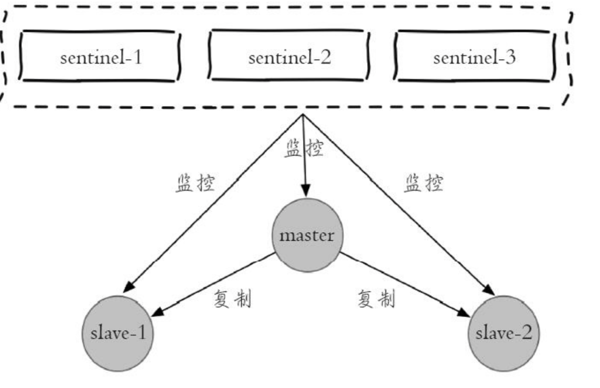
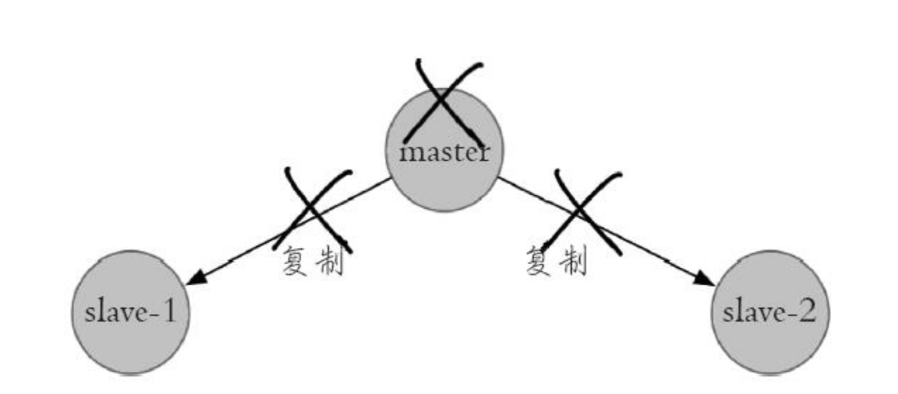
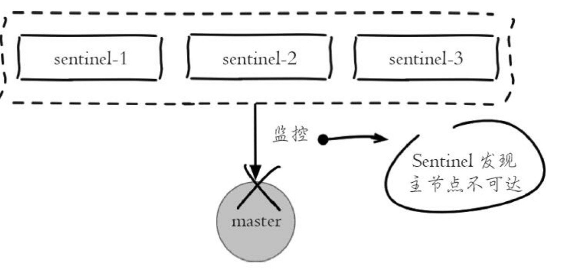
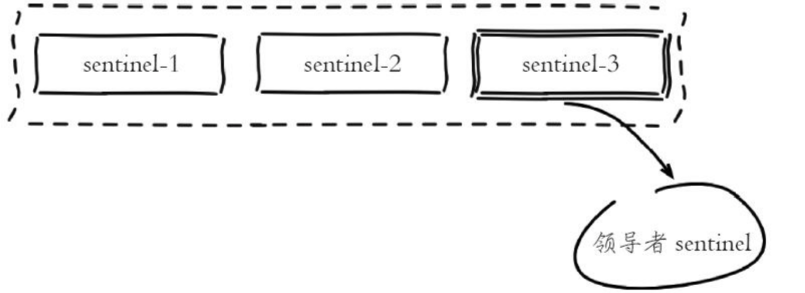
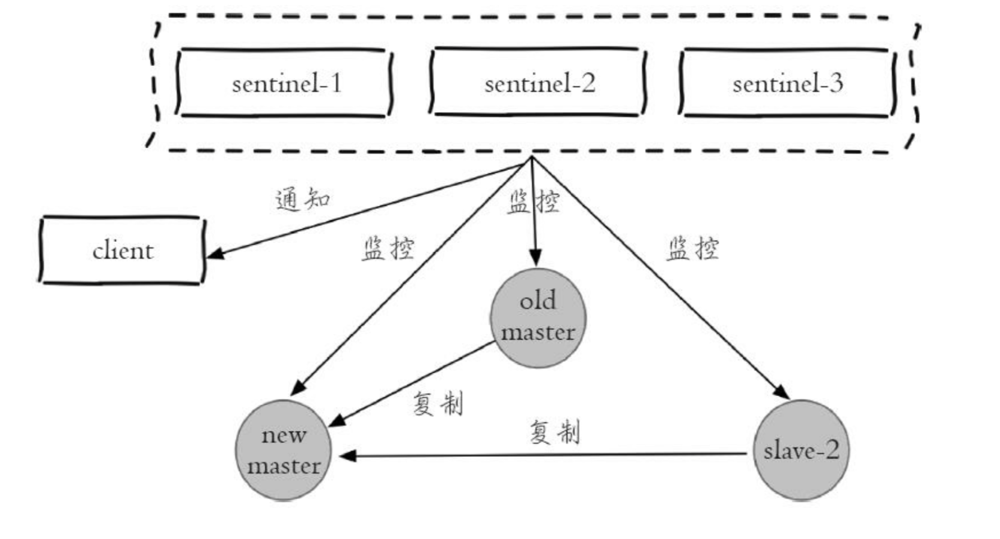
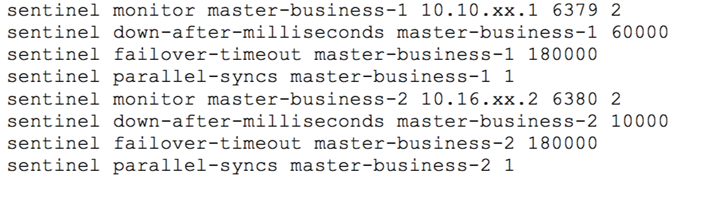
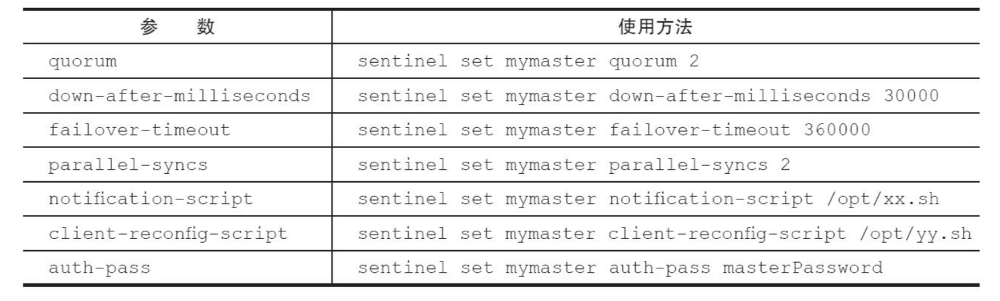

### Redis 哨兵

Redis的主从复制模式下，一旦主节点由于故障不能提供服务，需要人工将从节点晋升为主节点，同时还要通知应用方更新主节点地址，对于很多应用场景这种故障处理的方式是无法接受的。从Redis2.8开始正式提供Redis Sentinel架构来解决这个问题。

#### 主从复制的问题

Redis主从复制主要起到两个作用：一个是作为主节点的备份，当一旦主节点出现故障，从节点顶上去；另一个就是从节点分担主节点的读能力。

但是使用主从复制也带来了以下问题：

* 一旦主节点出现故障，需要手动将一个从节点晋升为主节点，同时需要修改应用方的主节点地址，还需要命令其他从节点去复制新的主节点。
* 主节点的存储能力受到单机的限制。
* 主节点的存储能力受到单机的限制。

#### 高可用

Redis主从复制模式下，一旦主节点出现了故障不可达，需要人工进行故障转移，假设一个主2从的Redis主从复制模式下的主节点出现故障后，它的故障转移流程如下：

1）主节点发生故障后，客户端连接主节点失败，两个从节点与主节点连接失败造成复制中断。

2）如果主节点无法正常启动，需要选出一个从节点，对其执行slaveof no one命令使其成为新的主节点。

3）原来的从节点成为新的主节点后，更新应用方的主节点信息，重新启动应用方。

4）客户端命令另一个从节点去复制新的主节点。

5）待原来的主节点恢复后，让它去复制新的主节点。

上述的整个服务或者架构设计不是高可用的，因为整个故障转移的过程需要人介入。


#### Redis Sentinel的高可用

当主节点出现故障时，Redis Sentinel能自动完成故障发现和故障转移，并通知应用方，从而实现真正的高可用。

Redis Sentinel是一个分布式架构，其中包括若干个Sentinel节点和Redis数据节点，每个Sentinel节点会对数据节点和其余Sentinel节点进行监控，当它发现节点不可达时，会对节点做下线标识。如果被标识的是主节点，它还会和其他Sentinel节点进行协商，当大多数Sentinel节点都认为节点不可达时，它们会选举出一个Sentinel节点来完成自动故障转移的工作，同时会将这个变化实时通知给Redis应用方。



整个故障转移的处理逻辑如下：

1）主节点出现故障，此时两个从节点与主节点失去联系，主从复制失败。



2）每个Sentinel节点通过定期监控发现主节点出现了故障。



3）多个Sentinel节点对主节点的故障达成一致，选举出sentinel-3节点作为领导者负责故障转移。



4）Sentinel领导者节点执行了故障转移，整个过程和前面介绍的手动故障转移一致，只不过是自动化完成的。故障转移后，整个RedisSentinel的拓扑结构如下：



Redis Sentinel具有以下几个功能：

* Sentinel节点会定期检测Redis数据节点，其余Sentinel节点是否可达。
* Sentinel节点会将故障转移结果通知给应用方。
* 主节点故障转移：实现从节点晋升为主节点并维护后续正确的主从关系。
* 配置提供者：客户端在初始化的时候连接的是Sentinel节点集合，从中获取主节点信息。

因为Redis Sentinel包含了如干个Sentinel节点，这样即使个别Sentinel节点不可用，整个Sentinel节点集合依然是健壮的，同时由多个Sentinel节点对节点的故障判断，可以有效的防止误判。

Sentinel节点本身就是独立的Redis节点，只不过它们有一些特殊，它们不存储数据，只支持部分命令。


#### 安装和部署

#### 部署Redis

见“Redis多实例部署”

#### 部署Sentinel节点

1. 配置文件

3个Sentinel节点的部署方法是完全一致的（端口不同），如下一个例子：

```properties
#端口号
port 26380
#以后台方式运行
daemonize yes
# redis 日志存储路径
logfile /Users/user/Documents/ProgramFile/redis-data/26380/log/redis.log
#持久化路径
dir /Users/user/Documents/ProgramFile/redis-data/26380/db/

sentinel monitor mymaster 127.0.0.1 6380 2
sentinel down-after-milliseconds mymaster 30000
sentinel parallel-syncs mymaster 1
sentinel failover-timeout mymaster 1800000
```

sentinel monitor mymaster 127.0.0.1 6380 2 代表sentinel节点需要监控127.0.0.1:6380这个主节点，2代表判断主节点失败至少需要2个Sentinel节点的同意，mymater是主节点的别名。

2. 启动Sentinel节点

```
redis-sentinel /Users/user/Documents/ProgramFile/redis-data/26380/conf/redis.conf 
```

3. 确认

Sentinel节点本质是一个特殊的Redis节点，所以也可以通过info命令查询它的相关信息：

```properties
127.0.0.1:26380> info Sentinel
# Sentinel
sentinel_masters:1
sentinel_tilt:0
sentinel_running_scripts:0
sentinel_scripts_queue_length:0
sentinel_simulate_failure_flags:0
master0:name=mymaster,status=ok,address=127.0.0.1:6380,slaves=2,sentinels=3
```

由上面可以看到，Sentinel节点找到了一个127.0.0.1:6379主节点，发现了它的两个从节点，同时发现Redis Sentinel一共有3个Sentinel节点。

3. 配置优化

1）sentinel monitor

```
sentinel monitor <master-name> <ip> <port> <quorum>
```

如上：Sentinel节点要监控的是一个名字叫做<master-name>，ip地址和端口为<ip><port>的主节点。<quorum>代表要判定主节点最终不可达所需要的票数。

在Sentinel节点的配置中没有看到有关从节点和其余Sentinel节点的配置，但实际上Sentinel节点会对所有节点进行监控。

<quorum>参数用于故障发现和判定，例如讲quorum配置为2，代表至少有2个Sentinel节点认为主节点不可达，那么这个不可达的判定才是客观的。对于<quorum>设置的值越小，那么达到下线的条件越宽松，反之越严格。一般建议将其设置为Sentinel节点的一半加1。

同时<quorum>还与Sentinel节点的领导者选举有关，至少要有max(quorum,num(sentiels)/2+1)个Sentinel节点参与选举，才能选出领导者Sentinel，从而完成故障转移。

2. sentinel down-after-milliseconds

```
sentinel down-after-milliseconds <master-name> <time>
```

每个Sentinel节点都要通过定期发送ping命令来判断Redis数据节点和其余Sentinel节点是否可达，如果超过down-after-milliseconds配置的时间且没有有效的回复，则判定节点不可达。<times>（单位为毫秒）就是超时时间。

优化说明：down-after-milliseconds越大，代表Sentinel节点对于不可达的条件越宽松，反之越严格。条件宽松意味着应用方故障时间可能越长；条件严格虽然可以及时发现故障完成故障转移，但是也存在一定的误判率。

3. sentinel parallel-syncs

```
sentinel parallel-syncs <master-name> <nums>
```

parallel-syncs用来限制在一次故障转移之后，每次向新的主节点发起复制操作的从节点个数。如果这个参数配置的比较大，那么多个从节点会向新的主节点发起复制操作，尽管复制操作通常不会阻塞主节点，但是同时向主节点发起复制，必然会对主节点所在的机器造成一定的网络和磁盘IO开销。

4. sentinel failover-timeout

```
sentinel failover-timeout <master-name> <times>
```

failover-timeout 通常被解释成故障转移超时时间，但实际上它作用于故障转移的各个阶段：

a）选出合适从节点

b）晋升选出的从节点为主节点

c）命令其余从节点复制新的主节点

d）等待原主节点恢复后命令它去复制新的主节点。

failover-timeout的作用具体体现在四个方面：

1）如果Redis Sentinel对一个主节点故障转移失败，那么下次再对主节点做故障转移的起始时间是failover-timeout的2倍。

2）在b阶段，如果Sentinel 节点向a阶段选出来的从节点执行slaveof no one 一直失败，当此过程超过failover-timeout时，则故障转移失败。

3）在b阶段如果执行成功，Sentinel节点还会执行info命令来确认a阶段选出来的节点确实晋升为主节点，如果此过程执行时间超过failover-timeout时，则故障转移失败。

4）如果c阶段执行时间超过了failover-timeout，则故障转移失败。注意即使超过了这个时间，Sentinel节点也会最终配置从节点去同步最新的主节点。


5. sentinel auth-pass

```
sentinel auth-pass <master-name> <password>
```

如果Sentinel监控的主节点配置了密码，sentinel auth-pass配置通过添加主节点的密码，防止Sentinel节点对主节点无法监控。

6. Sentinel notification-script

```
sentinel notification-script <master-name> <script-path>
```

notification-script 的作用是在故障转移期间，当一些警告级别的Sentinel事件发生时，会触发对应路径的脚本，并向脚本发送相应的事件参数。

7. sentinel client-reconfig-script

```
sentinel client-reconfig-script <master-name> <script-path>
```

sentinel client-reconfig-script 的作用是才故障转移结束后，触发对应路径的脚本，并向脚本发送故障转移结果的相关参数。


#### 监控多个主节点

Redis Sentinel 可以同时监控多个主节点，配置方法也比较简单，只需要指定多个master Name 来区分不同的主节点即可。



#### 调整配置

和普通的Redis数据节点一样，Sentinel节点也支持动态设置参数，但是并不是支持所有的参数。

```
sentinel set <param> <value>
```



1）sentinel set命令只对当前Sentinel节点有效。

2）sentinel set命令如果执行成功会立即刷新配置文件，这个和普通数据节点需要执行config rewrite 刷新到配置文件不同。

3）建议所有Sentinel节点的配置尽可能一致，这样在故障发现和转移时比较达成一致。

4）Sentinel 对外不支持config命令。


#### 部署技巧

1）Sentinel 节点不应该部署在同一台物理机器上。

部署在同一台物理机意味着这台机器有什么硬件故障，所有的虚拟机都会受到影响。

2）部署至少三个且奇数个的Sentinel节点。

领导者选举至少需要一半加1个节点，奇数个节点可以满足该条件的基础上节省一个节点。

3）Sentinel节点集合可以只监控一个主节点，也可以监控多个主节点。

如果只监控一个主节点，每个Redis主节点都有自己的Sentinel节点集合，会造成资源浪费，但是每套Redis Sentinel都是彼此隔离的。

监控多个主节点，降低了维护成本，但是如果Sentinel节点集合出现异常，可能会对多个Redis数据节点造成影响。还有如果监控的Redis数据节点较多，会造成Sentinel 节点过多的网络连接。


#### API

Sentinel 节点是特殊的Redis节点，它有自己的API.

1. sentinel master

展示所有被监控的主节点状态以及相关的统计信息。

```
127.0.0.1:26380> sentinel masters
 1) "name"
    2) "mymaster"
    3) "ip"
    4) "127.0.0.1"
    5) "port"
    6) "6380"
    7) "runid"
    8) "d95db9f5637801a3278ef43387f10a55a82ab026"
    9) "flags"
   10) "master"
   ....
```

2. sentinel master<master name>

展示指定<master name>的主节点状态以及相关的统计信息。

3. sentinel slaves <master name>

展示指定<master name>的从节点状态以及相关的统计信息。

4. sentinel sentinels <master name>

展示指定<master name>的Sentinel节点集合（不包含当前Sentinel节点）

5. sentinel get-master-addr-by-name<master name>

返回指定<master name>主节点的 IP地址和端口

```
127.0.0.1:26380> sentinel get-master-addr-by-name mymaster
1) "127.0.0.1"
2) "6380"
```

6. sentinel reset<pattern>

当前Sentinel节点对符合<pattern>（通配符）主节点的配置进行重置，包含清楚主节点的相关状态，重新发现从节点和 Sentinel节点

```
sentinel reset mymaster
```

7. sentinel failover<master name>

对指定<master name>主节点进行强制故障转移，当故障转移完成后，其他Sentinel节点按照故障转移的结果更新自身配置。

执行命令之前，mymaster 是127.0.0.1:6380

```
# Sentinel
sentinel_masters:1
sentinel_tilt:0
sentinel_running_scripts:0
sentinel_scripts_queue_length:0
sentinel_simulate_failure_flags:0
master0:name=mymaster,status=ok,address=127.0.0.1:6380,slaves=2,sentinels=3
```

执行命令之后，mymaster变成了127.0.0.1:6382

```
127.0.0.1:26380> info sentinel
# Sentinel
sentinel_masters:1
sentinel_tilt:0
sentinel_running_scripts:0
sentinel_scripts_queue_length:0
sentinel_simulate_failure_flags:0
master0:name=mymaster,status=ok,address=127.0.0.1:6382,slaves=2,sentinels=3
```

8. sentinel ckquorum<master name>

检查当前可达的Sentinel节点总数是否达到<quorum>的个数。例如quorum=3，而当前可达的Sentinel节点个数为2个，那么将无法进行故障转移, Redis Sentinel的高可用特效也将失去。

```
127.0.0.1:26380> sentinel ckquorum mymaster
OK 3 usable Sentinels. Quorum and failover authorization can be reached
```

9. sentinel flushconfig

将Sentinel节点的配置强制刷新到磁盘上。对于开发和运维人员只有当外部原因造成配置文件损坏或者丢失时，这个命令是很有用的。

10. sentinel remove<master name>

取消当前Sentinel节点对于指定<master name>主节点的监控。注意这个命令只对当前Sentinel节点有效。

11. sentinel monitor <master name> <ip> <port><quorum>

通过命令的形式完成Sentinel 节点对主节点的监控

12. sentinel set <master name>

动态修改Sentinel节点配置选项。

13. sentinel is-master-dwon-by-addr

Sentinel 节点之间用来交换对主节点是否下线的判定，根据参数的不同，还可以作为Sentinel领导者选举的通信方式。


#### 客户端连接

略。

#### 实现原理


1. 一套合理的监控机制是Sentinel节点判定节点不可达的重要保证，Redis Sentinel通过三个定时监控任务完成对各个节点的发现和监控：

1）每隔10秒，每个Sentinel节点会向主节点和从节点发送info命令获取最新的拓扑结构。这个定时任务的作用具体可以表现在三个方面：

* 通过向主节点执行info命令，轰炸主节点的信息。
* 当有新的从节点加入时都可以感知出来。
* 节点不可达或者故障转移后，可以通过info命令实时更新拓扑信息。

2）每隔2秒，每个Sentinel节点会向Redis数据节点的 _sentinel_:hello频道上发送该Sentinel节点对于主节点的判断以及当前Setinel节点的信息，同时每个Sentinel节点也会订阅该频道，来了解其他Sentinel节点以及它们对主节点的判断，所以这个定时任务可以完成以下两个工作：

* 发现新的Sentinel节点：通过订阅主节点的_sentinel_:hello了解其他Sentinel节点信息，如果是新加入的Sentinel节点，该Sentinel节点信息保存起来，并与该Sentinel节点创建连接。
* Sentinel节点之间交换节点的状态，最为后面客观下线以及领导者选举的依据。

3）每隔1秒，每个Sentinel节点会向主节点、从节点、其余Sentinel节点发送一条ping命令做一次心跳检测，来确认这些节点是否可达。


2. 主观下线和客观下线

1）主观下线

每个Sentinel节点会每隔一秒对主节点、从节点、其他Sentinel节点发送ping命令做心跳检测，当这些节点超过down-after-milliseconds没有进行有效回复，Sentinel节点就会对该节点做失败判定，这个行为叫做主观下线。

2）客观下线当Sentinel主观下线的节点是主节点时，该Sentinel节点会通过Sentinel is-master-down-by-addr命令向其它Sentinel节点询问主节点的判断，当超过<quorum>个数,Sentinel节点认为主节点确实有问题。

从节点、Sentinel节点在主观下线后，没有后续的故障转移操作。

```
Sentinel is-master-down-by-addr <ip> <port> <current_epoch> <runid>
```

* ip ：主节点ip
* port ：主节点端口
* runid：当runid 等于*时，作用是Sentinel节点直接交换对主节点下线的判定，当runid 等于Sentinel节点的runid时，作用是当前Sentinel节点希望目标Sentinel节点同意自己成为领导者的请求。

返回的结果包含三个参数：

* down_state：目标Sentinel节点对于主节点的下线判断，1下线，0是在线。
* leader_runid：当leader_runid等于*时，代表返回结果是用来做主节点是否不可达，当leader_runid等于具体的runid，代表目标节点同意runid成为领导者。
* leader_epoch：领导者纪元


3. 领导者Sentinel节点选举

Sentinel节点对主节点做了客观下线，需要选出一个节点来完成故障转移，所以Sentinel节点之间会做一个领导者选举的工作，选出一个Sentinel节点作为领导者进行故障转移。Redis使用Raft算法实现领导者选举：

1）每个在线的Sentinel节点都有资格称为领导者，当它确认主节点主观下线的时候，会向其它Sentinel节点发送sentinel is-master-down-by-addr命令，要求将自己设置为领导者。

2）收到命令的Sentinel节点，如果没有同意过其它Sentinel节点的sentinel is-master-down-by-addr命令，将同意该请求，否则拒绝。

3）如果该Sentinel节点发现自己的票数已经大于等于max(quorum,num(sentinel)/2+1)，那么它将成为领导者。

4）如果此过程没有选举出领导者，将进入下一次选举。


4. 故障转移

领导者选举的Sentinel节点负责故障转移，具体步骤如下：

1）在从节点列表中选出一个节点作为新的主节点：

a）过滤：“不健康”（主观下性、断线）、5秒内没有回复过Sentinel节点的ping响应、与主节点失联超过down-after-milliseconds*10秒

b）选择slave-priority(从节点优先级)最高的从节点列表，如果存在则返回，不存在则返回。

c）选择复制偏移量最大的从节点（复制的最完整），如果存在则返回，不存在则继续。

d）选择runid最小的从节点。

2）Sentinel领导者节点会对第一步选出来的从节点执行slaveof no one 命令让其成为主节点。

3）Sentinel 领导者节点会向剩余的从节点发送命令，让它们成为新主节点的从节点，复制规则和parallel-syncs参数有关。

4）Sentinel节点集合会将原来的主节点更新为从节点，并保持着对其关注，但其恢复后命令它去复制新的主节点。
