#### 使用缓存的优缺点

优点：使用缓存可以加快计算机读取数据的速度，并减少底层关键组件如数据库的压力。

缺点：牺牲了数据的一致性。

####使用场景

 适合使用缓存的场景如下：

* 读密集型的应用
* 对响应时效要求高
* 对一致性要求不严格

不适合使用缓存的场景：

* 读少
* 更新频繁
* 对一致性要求高

#### 分布式缓存架构

分布式缓存架构我们主要关注两个问题，高并发和高可用。

1. 缓存高可用

一般的缓存方案都是基于分片的**主从**来实现的。通过分片来分割大数据的查询，主负责写，并把更新同步到副本，再通过多个副本来缓解查询带来的压力。

在互联网中基本使用异步复制的主从模型，如果对高可用性要求较高，则可用通过强一致性来完成，即写事务从主节点开始，主节点发送事务给从节点，所有从节点都返回到数据的信息给主节点，然后主节点返回成功。

2. 缓存高并发

我们将缓存的高并发需求看做纯网络IO问题，毕竟仅仅是内存和网络I/O问题。

#### 应用访问缓存的模式

1. 双读双写

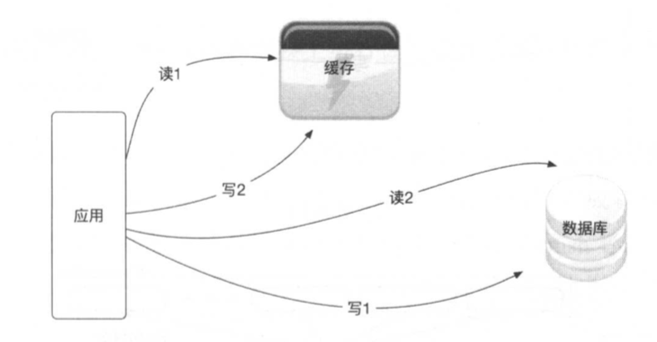

对于读操作，我们先读缓存，如果缓存不存在，则再读数据库，读取数据库后再回写缓存；对于写操作，我们先写数据库，再写缓存。

2. 异步更新

在异步更新的方式中，应用层只读缓存，全量数据会被保存在缓存中，并且不设置缓存系统的过期时间，由异步的更新服务将数据库里变更的或者新增的数据更新到缓存中。

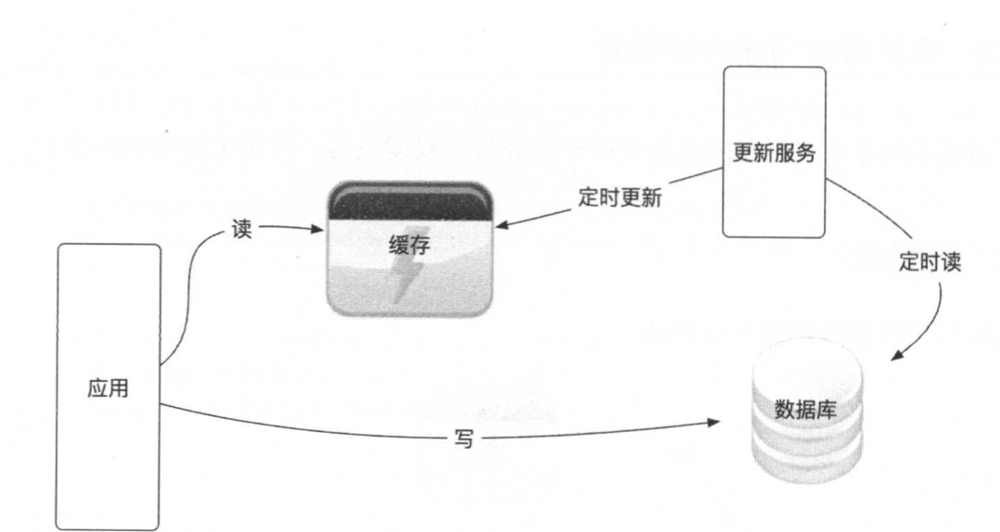

3. 串联模式

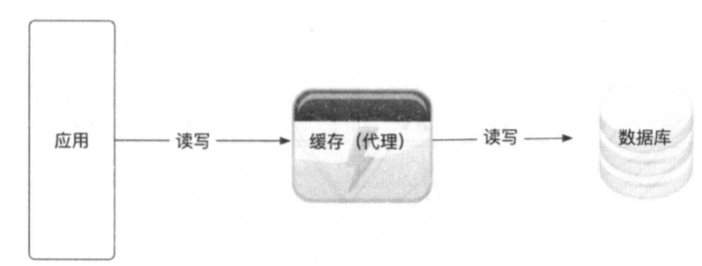

在串联的模式下，应用直接在缓存上进行读写操作，缓存作为代理层，根据需要和配置与数据库进行读写操作。

#### 分布式缓存分片模式

面对海量数据缓存的需求，在通用的解决方案中，我们会对这些大数据量进行切片，数据将分成大小相等的分片，然后一个缓存节点负责存储其中的多个分片。

1. 客户端分片

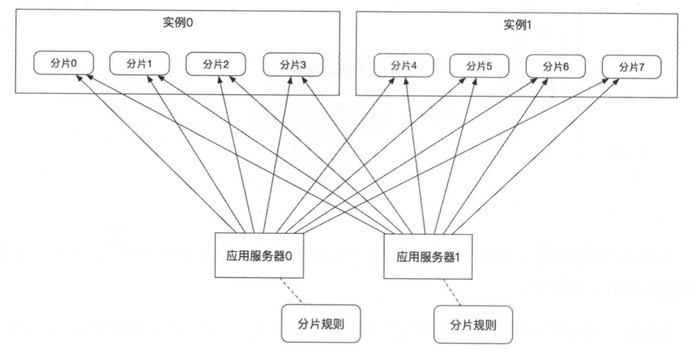

客户端分片通过应用层直接操作分片逻辑，每个应用层都嵌入一个操作切片的逻辑实现，一般通过依赖Jar包来实现。

这种方案的性能很好，实现起来比较简单，适合快速上线，而且逻辑是自己开发的，如果在生产上出了问题，则比较容易解决；但是它侵入了业务逻辑的实现，会让缓存服务器保持的应用程序连接比较多。

2. 代理分片

代理分片就是在应用层和缓存服务器中间增加一个代理层，把分片的路由规则配置在代理层，代理层对外提供与缓存服务器兼容的接口给应用层，应用层的开发人员不用关心分片规则，只需要关心业务逻辑的实现。

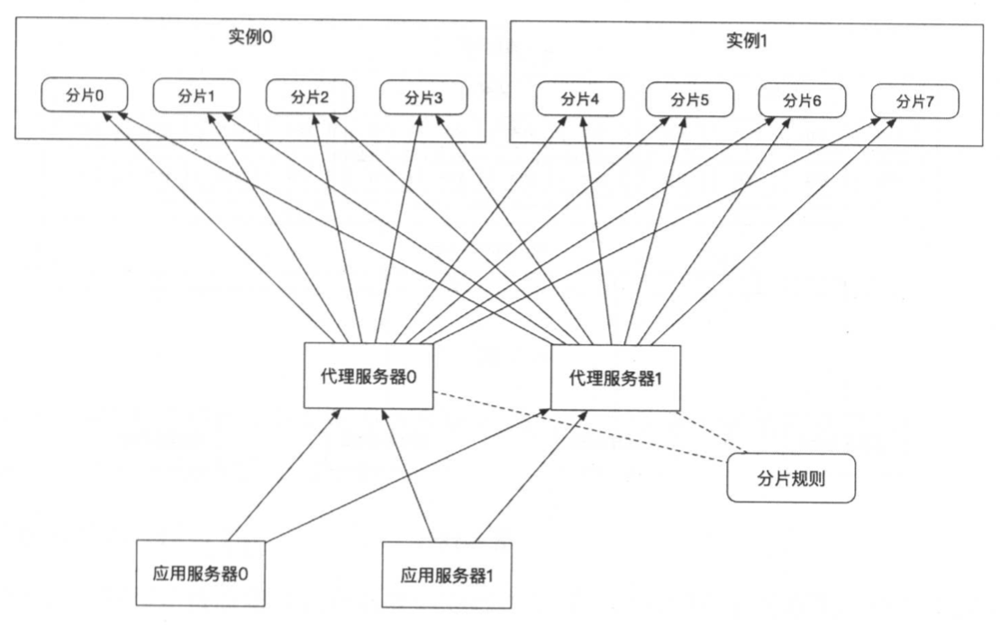

3. 集群分片

有的缓存自身提供了集群功能，集群可以实现分片和高可用，我们只需要把它们当成一个由多个缓存服务器节点组成的大缓存机器来使用即可。如redis 3.0 提供的Cluster。

#### 分布式缓存的迁移方案

1. 平滑迁移

平滑迁移使用的是双写方案，方案分成4个步骤：双写、迁移历史数据、切读、下双写。

这种方式有一个变种，就是不需要迁移老数据，在第一步双写之后，在一定的时间里通过新规则对新缓存进行写入，新缓存有了足够的数据，就不用再迁移旧数据，直接进入第3步。

如下，假如我们的应用现在有两个分片的缓存集群，通过关键字哈希的方式进行路由：

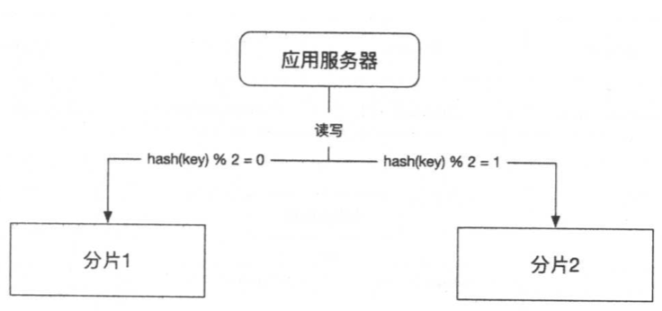

假设现在要将分片扩容到4个分片，迁移的具体过程如下：

第1步，双写。按照新规则和旧规则同时往新缓存和旧缓存中写数据，

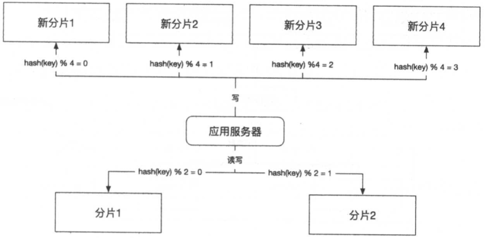

这个步骤有优化的空间，新规则中，前两个分片的数据，其实是旧规则中两个分片数据的子集，并且规则一致，所以我们可以重用前两个分片，也就是说，只需要两个新的分片，用来处理关键字哈希取余后为2和3的情况；使用旧的缓存分片来处理关键字哈希取余后0和1的情况即可。

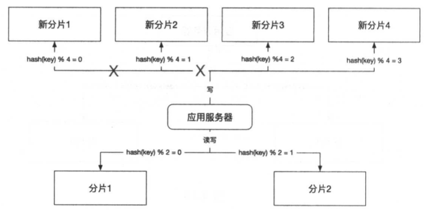

第2步，迁移历史数据，把旧缓存集群中的历史数据读出来，按照新的规则写到新的缓存集群中。

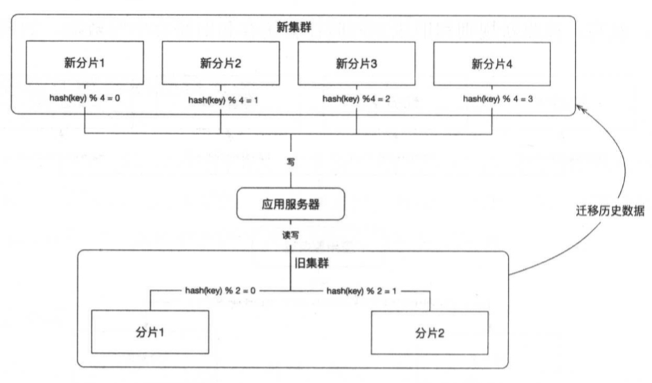

在迁移后，我们还需要对迁移的数据进行验证，表明我们数据迁移成功。

在某些场景下，数据缓存并不是强依赖的，在缓存里获取不到数据，可以回溯到数据库获取，只要数据库可以承受回溯导致的压力，这样可以避免迁移旧数据。另一方面，缓存数据一般具有时效性，在双写的期间，历史数据会逐渐过时，也就不用再迁移历史数据了。

第3步，切读。把应用层所有的读操作路由到新的缓存集群上。这一步把应用的读写操作已经完全发生在新的数据库集群上了。

第4步，下线双写。把写入旧的集群的逻辑下线。这一步通常是在双写和切读后验证没任何问题，并保证数据一致性的情况下，才把这部分代码下线。如何是扩容的场景，并且重用了旧的分片1和分片2，则还可以清理分片1和分片2中的冗余数据。

2. 停机迁移

停机迁移的方法比较简单，通常分为停止应用、迁移历史数据、更改应用的数据源、启动应用这4个步骤，

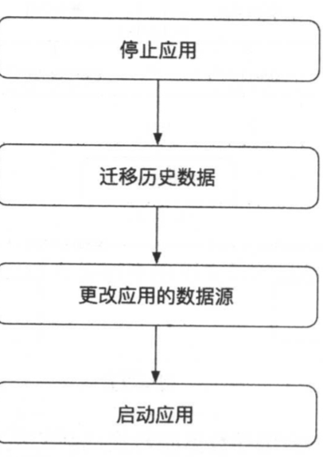

具体的迁移步骤：

（1）停机应用，先将应用停止服务。

（2）迁移历史数据，按照新的规则把历史数据迁移到新的缓存服务器集群中。

（3）更改应用的数据源配置，指向新的缓存集群。

（4）重新启动应用。

3. 一致性哈希

实际上，Redis的客户端Jedis本身实现了基于一致性哈希的客户端路由框架，这种框架的好处就是便于动态扩容。

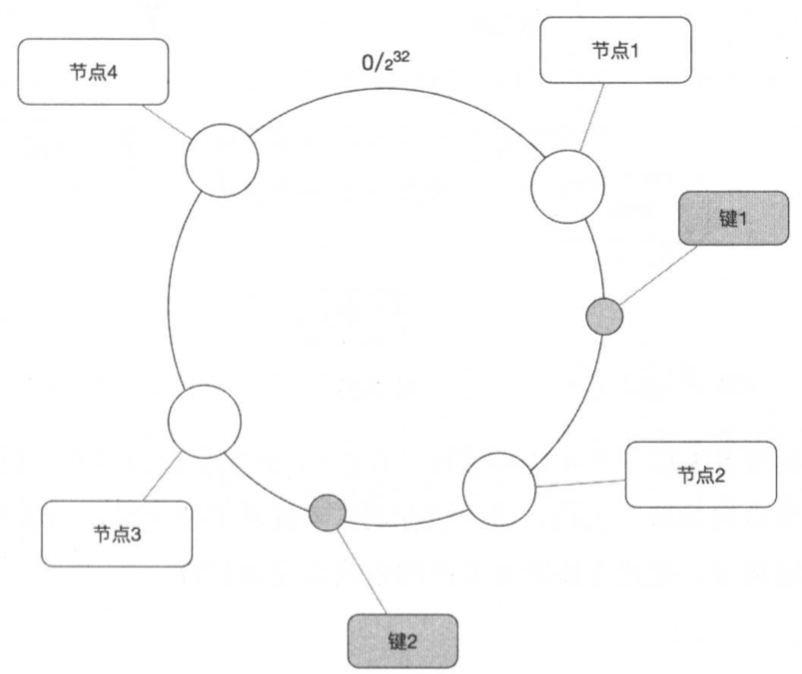

在收到访问一个主键的请求后，可通过下面的流程寻找这个主键的的存储节点：

（1）求出Redis服务器（节点）的哈希值，并将其配置到0-2$^{32}$,的圆上。

（2）采用同样的方法求出存储数据的键的哈希值，并映射到相同的圆上。

（3）从数据映射到的位置开始顺时针查找，找到的第一台服务器就是将数据保存的位置。

（4）如果在寻找的过程中超过2$^{32}$仍然找不到节点，就会保存到第一台服务器上。

在扩容的场景下添加一台服务器节点5时，只有在圆上增加服务器的位置到逆时针方向的第一台服务器上的键会受到影响。

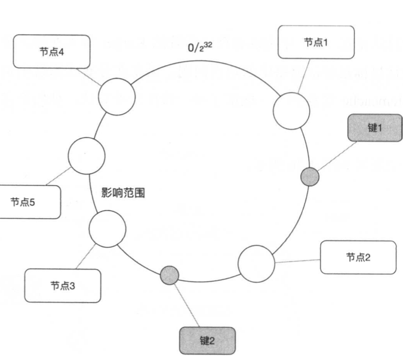

我们看到，节点3和节点4之间增加了节点5，影响范围就是节点3到节点5之间的数据，而不影响其他节点之间的数据。

#### 缓存穿透、并发和雪崩

缓存穿透通常是由恶意攻击或者无意造成的；缓存并发是由设计不足造成的；缓存雪崩是由缓存同时失效造成的。

1. 缓存穿透

缓存穿透指使用不存在的key进行大量的高并发查询，导致缓存无法命中，每次请求都要穿透到后端数据库进行查询，使数据库压力过大，甚至数据库服务被压死。

通常我们将空值缓存起来，再次接收到同样的查询请求时，若命中缓存并且值为空，就会直接返回，不会透传到数据库，避免缓存穿透。同时我们也需要对参数进行过滤，防止他每次都会使用不同的参数来查询，例如，如果我们使用ID进行查询，则可以对ID的格式进行分析，如果不符合产生的ID规则，就直接拒绝。同时我们也可以对服务进行限流、熔断等设计，保证服务的健壮性和可用性。

2. 缓存并发

当一个key过期时，因为访问这个缓存key的请求量比较大，多个请求同时发现缓存过期，因此多个请求会同时访问数据库来查询最新的数据，这样会造成应用和数据库的负载增加。

我们通常有3种方式来解决这个问题：

1）分布式锁

​	使用分布式锁，保证对于每个key同时只有一个线程去查询后端服务，其他线程没有获得分布式锁的权限。

2）本地锁

​	与分布式锁类似，我们通过本地锁的方式来限制只有一个线程去数据库查询数据，而其他线程只需要等待，等前面的线程查询到数据后再访问缓存。

3）软过期

​	由业务程序去判断是否过期并更新，在发现数据即将过期时，将缓存的时效延长，程序可以派遣一个线程去数据库中获取最新的数据，其他线程这时看到延长了的过期时间，就会继续使用旧数据。

3. 缓存雪崩

缓存雪崩指服务器重启或大量缓存在某一个数据段内失效，给后端数据库造成瞬间的负载升高的压力，甚至压垮数据库的情况。通常的解决方法是对不同的数据使用不同的失效时间。

#### 缓存设计

（1）容量规划

* 缓存内容的大小、数量
* 每秒的读峰值
* 每秒的写峰值
* 淘汰策略
* 缓存的数据结构

（2）性能优化

* 线程模型
* 预热方法
* 冷热数据的比例

（3）高可用

* 复制模型
* 失效转移
* 持久策略
* 缓存重建

（4）缓存监控

* 缓存服务监控
* 缓存容量监控
* 缓存请求监控
* 缓存响应时间监控

（5）注意

* 是否有可能发生缓存穿透
* 是否有大对象

