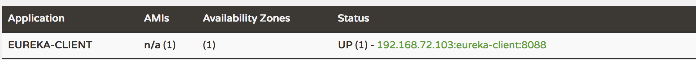
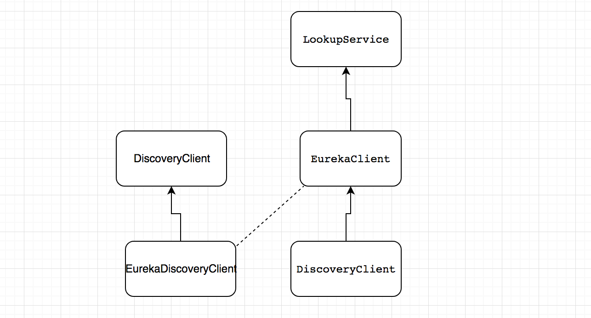

### Eureka

#### 客户端

1. 配置Eureka客户端

   1.1 引入MAVEN依赖

   ```
    <dependency>
      <groupId>org.springframework.cloud</groupId>
      <artifactId>spring-cloud-starter-netflix-eureka-server</artifactId>
    </dependency>
   ```

   1.2 . 在启动类上添加@EnableDiscoveryClient注解，激活Eureka中的DiscoveryClient实现。

   ```java
   @SpringBootApplication
   @EnableDiscoveryClient
   @RestController
   public class EurekaClientApplication {
       public static void main(String[] args) {
           SpringApplication.run(EurekaClientApplication.class, args);
       }
   }
   ```

   1.3. 配置服务注册中心

   ```
   eureka:
     client:
       service-url:
         defaultZone: http://localhost:1111/eureka/
   ```

   服务启动后，在浏览器中输入```http://localhost:1111/```可以发现服务已经注册上去了

   

   ​

   Eureka Client向服务端注册服务时，会提供默认的实例ID，格式如下：

   ```
   ${spring.cloud.client.hostname}:${spring.application.name}:${spring.application.instance_id
   ```

   ```
   192.168.72.103:eureka-server:1111
   ```

   我们可以通过如下来自定义实例ID

   ```
   eureka:instance:instance-id:xxxxx
   ```

   其它参数

   ```
   eureka:
     instance:
       lease-renewal-interval-in-seconds: 30
       lease-expiration-duration-in-seconds: 90
   ```

   ```lease-renewal-interval-in-seconds```定义服务续约任务的调用间隔时间，默认是30秒，```lease-expiration-duration-in-seconds```参数用来定义服务失效的时间，默认是90秒。

   1.4. 获取服务

   当我们启动服务消费者的时候，它会发一个REST请求给服务注册中心，来获取上面注册的服务清单。获取服务是消费的基础，所以必须要确保```eureka.client.register-with-eureka```参数没有被修改成false，该值默认是true，如果希望修改服务清单缓存更新的时间，可以通过```eureka.client.registry-fetch-interval-seconds```来修改，默认值是30秒。

   1.5. 服务调用

   在Ribbon中，会默认采用轮询的方式进行调用，从而实现客户端的负载均衡，对于访问实例的选择，Eureka中有Region和Zone的概念，一个Region中有可以包含多个Zone，每个服务客户端都需要被注册到一个Zone中，所以每个客户端都会对应一个Region和Zone，在进行服务调用时，优先访问同处同一个Zone的服务提供方。

   ​

   #### 服务端

   引入MAVEN依赖

   ```xml
   <dependency>
      <groupId>org.springframework.cloud</groupId>
      <artifactId>spring-cloud-starter-netflix-eureka-server</artifactId>
   </dependency>
   ```

   在启动类上加```@EnableEurekaServer```注解

   ```java
   @EnableEurekaServer
   @SpringBootApplication
   public class EurekaServerApplication {

       public static void main(String[] args) {
           SpringApplication.run(EurekaServerApplication.class, args);
       }
   }

   ```

   单机模式配置

   ```xml
   server.port=8761
   eureka.instance.hostname=localhost
   eureka.client.register-with-eureka=false
   eureka.client.fetch-registry=false
   eureka.client.service-url.defaultZone=http://${eureka.instance.hostname}:${server.port}/eureka/
   ```

   ​

### 源码分析

我们通过在启动类上加一个```@EnableDiscoveryClient```注解来开启服务注册，查看```EnableDiscoveryClient```源码

```java
/**
 * Annotation to enable a DiscoveryClient implementation.
 * @author Spencer Gibb
 */
@Target(ElementType.TYPE)
@Retention(RetentionPolicy.RUNTIME)
@Documented
@Inherited
@Import(EnableDiscoveryClientImportSelector.class)
public @interface EnableDiscoveryClient {

	/**
	 * If true, the ServiceRegistry will automatically register the local server.
	 */
	boolean autoRegister() default true;
}
```

从上面的注解的注释中可以看出，它主要用来开启```DiscoveryClient```的实现类，所以我们通过搜索```DiscoveryClient```，整理出如下结构：

  

* 左边的```DiscoveryClient```是SpringCloud定义的服务发现通用接口，它定义了发现服务的常用抽象方法，通过该接口可以有效的屏蔽服务治理的实现细节。因此使用SpringCloud构建微服务应用可以方便的切换不同的服务治理框架，而不用改动程序代码。
* ```EurekaDiscoveryClient```是```DiscoveryClient```的实现类，同时也是实现对Eureka发现服务的封装，我们可以看到它构造一个对象时，会通过构造函数传入一个```EurekaClient```对象。

```java
public EurekaDiscoveryClient(EurekaInstanceConfig config, EurekaClient eurekaClient) {
		this.config = config;
		this.eurekaClient = eurekaClient;
	}
```

* ```EurekaClient ```继承```LookupService```接口，它们都是Netflix开源包中的内容，主要定义了针对Eureka的发现服务的抽象方法。
* 右下角的DiscoveryClient是Netflix真正发现服务的类，它在```com.netflix.discovery```包下面。


