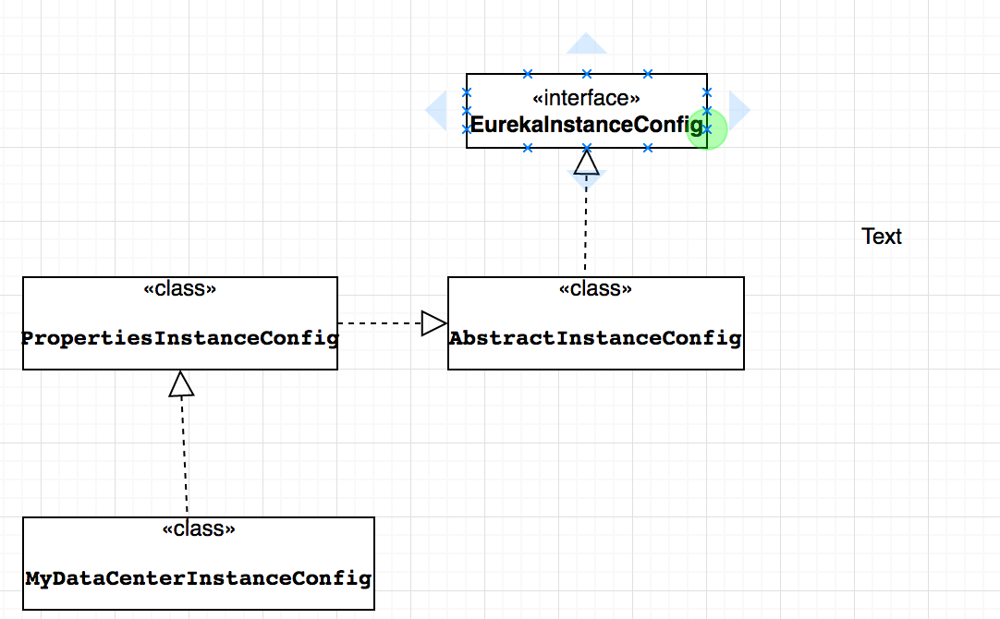
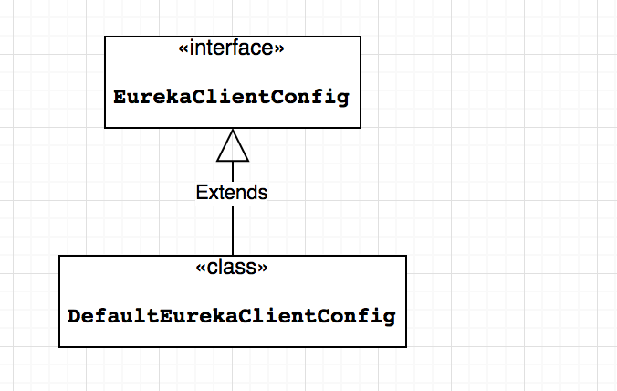
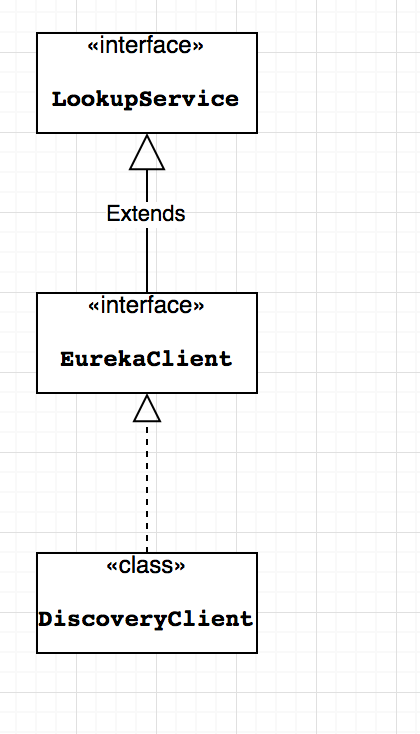

首先我们先来看看Eureka中相关主要的几个配置类的结构，

1. EurekaInstanceConfig

官方的文档对这个接口的注释是：

```java
/**
 * Configuration information required by the instance to register with Eureka
 * server. Once registered, users can look up information from
 * {@link com.netflix.discovery.EurekaClient} based on virtual hostname (also called VIPAddress),
 *
 */
```

用来配置实例注册到Eereka server所需要的信息，一旦客户端注册成功，用户可以根据虚拟主机获取注册的信息。即该接口定义了客户端注册到服务端的所需要的信息。

该接口在Eureka中的实现：




2. EurekaClientConfig

官方文档中是这样描述的

```java
/**
 * Configuration information required by the eureka clients to register an
 * instance with <em>Eureka</em> server.
 */
```

乍一看似乎与```EurekaInstanceConfig```的描述是一样的，的确它们都是用来配置```Eureka server ```注册到Eureka server 所需要的信息，但是两者还是有区别的：```EurekaInstanceConfig```主要是服务实例相关的配置，如：实例的名称、ip地址、端口号、健康检查路径等。```EurekaClientConfig```主要是服务注册的相关配置，如：服务注册中心的地址、服务获取的间隔时间、可用区域等。

EurekaClientConfig接口在Eureka中的实现：




3. LookupService

根据名字也可以推测出来，即它是用来查找存活的实例。在Eureka中的实现如下：




上面就是```Eureka```的客户端相关配置实现，在```SpringCloud```中并没有原用```Eureka```的相关实现，而是自己定义了一套：

* EurekaInstanceConfigBean，它是```EurekaInstanceConfig```在```SpringCloud```中的实现，该类是一个配置类，默认会加载类路径下以```eureka.instance```开头的配置信息。
* EurekaClientConfigBean，它是```EurekaClientConfig```在SpringCloud中的实现，它也一个配置类，默认加载类路径下面的以```eureka.client```开头的配置信息
* DiscoveryClient，在```SpringCloud```中也定义了一套与```Eureka```一样的接口，但是实际调用的是```Eureka```里面的接口。

前面已经讲了在SpringCloud中如何加载类路径下面的配置信息，现在我在来看看SpringCloud是如何初始化这些配置，并且将它们发送到注册中心。

客户端初始化：客户端在

```org.springframework.cloud.netflix.eureka.EurekaClientAutoConfiguration```，中进行初始化：

* EurekaInstanceConfig初始化(部分代码)

```java
@Bean
@ConditionalOnMissingBean(value = EurekaInstanceConfig.class, search = SearchStrategy.CURRENT)
public EurekaInstanceConfigBean eurekaInstanceConfigBean(InetUtils inetUtils,														 ManagementMetadataProvider managementMetadataProvider) {
    //虚拟主机名称
	String hostname = getProperty("eureka.instance.hostname");
    //是否使用ip
	boolean preferIpAddress = 			   		      		Boolean.parseBoolean(getProperty("eureka.instance.prefer-ip-address"));
    //ip地址
	String ipAddress = getProperty("eureka.instance.ip-address");
    ／／是否开启https端口
	boolean isSecurePortEnabled = 		Boolean.parseBoolean(getProperty("eureka.instance.secure-port-enabled"));
	EurekaInstanceConfigBean instance = new  EurekaInstanceConfigBean(inetUtils);
		instance.setNonSecurePort(serverPort);
		instance.setInstanceId(getDefaultInstanceId(env));
		instance.setPreferIpAddress(preferIpAddress);
		instance.setSecurePortEnabled(isSecurePortEnabled);
		if (StringUtils.hasText(ipAddress)) {
			instance.setIpAddress(ipAddress);
		}
		if(isSecurePortEnabled) {
			instance.setSecurePort(serverPort);
		}
		if (StringUtils.hasText(hostname)) {
			instance.setHostname(hostname);
		}
		String statusPageUrlPath = getProperty("eureka.instance.status-page-url-path");
		String healthCheckUrlPath = getProperty("eureka.instance.health-check-url-path");

		if (StringUtils.hasText(statusPageUrlPath)) {
			instance.setStatusPageUrlPath(statusPageUrlPath);
		}
		if (StringUtils.hasText(healthCheckUrlPath)) {
			instance.setHealthCheckUrlPath(healthCheckUrlPath);
		}
		return instance;
	}
```

* EurekaClientConfig初始化

```java
@Bean
@ConditionalOnMissingBean(value = EurekaClientConfig.class, search = SearchStrategy.CURRENT)
public EurekaClientConfigBean eurekaClientConfigBean(ConfigurableEnvironment env) {
	EurekaClientConfigBean client = new EurekaClientConfigBean();
	if ("bootstrap".equals(this.env.getProperty("spring.config.name"))) {
			// We don't register during bootstrap by default, but there will be another
			// chance later.
		client.setRegisterWithEureka(false);
	}
	return client;
}
```

* DiscoveryClient初始化

```java
@Bean(destroyMethod = "shutdown")
@ConditionalOnMissingBean(value = EurekaClient.class, search = SearchStrategy.CURRENT)
@org.springframework.cloud.context.config.annotation.RefreshScope
@Lazy
public EurekaClient eurekaClient(ApplicationInfoManager manager, EurekaClientConfig config, EurekaInstanceConfig instance) {
	manager.getInfo(); // force initialization
	return new CloudEurekaClient(manager, config, this.optionalArgs,
					this.context);
		}
```

可以看到DiscoveryClient初始化时，传入了ApplicationInfoManager和EurekaClientConfig，前面已经讲过，在SpringCloud中中用EurekaClientConfigBean来代替Eureka中的EurekaClientConfig，它会自动加载以eureka.client开头的配置信息。另一个参数：ApplicationInfoManager，它由EurekaInstanceConfig和InstanceInfo组成，在SpringCloud中EurekaInstanceConfig由EurekaInstanceConfigBean代替，而InstanceInfo，实际上Eureka client注册到Eureka server 时，携带的参数就是由InstanceInfo保存，而它所携带的参数来自EurekaInstanceConfigBean。下面是创建ApplicationInfoManager的代码：

```java
@Bean
@ConditionalOnMissingBean(value = ApplicationInfoManager.class, search = SearchStrategy.CURRENT)
public ApplicationInfoManager eurekaApplicationInfoManager(
	EurekaInstanceConfig config) {
	InstanceInfo instanceInfo = new InstanceInfoFactory().create(config);
	return new ApplicationInfoManager(config, instanceInfo);
}
```

从中，可以看到该方法中调用了```new InstanceInfoFactory().create(config)```方法，跟进create方法，可以看到以下的代码：

```java
public InstanceInfo create(EurekaInstanceConfig config) {
	LeaseInfo.Builder leaseInfoBuilder = LeaseInfo.Builder.newBuilder()
		.setRenewalIntervalInSecs(config.getLeaseRenewalIntervalInSeconds())
		.setDurationInSecs(config.getLeaseExpirationDurationInSeconds());
		// Builder the instance information to be registered with eureka
		// server
		InstanceInfo.Builder builder = InstanceInfo.Builder.newBuilder();

		String namespace = config.getNamespace();
		if (!namespace.endsWith(".")) {
			namespace = namespace + ".";
		}
		builder.setNamespace(namespace).setAppName(config.getAppname())
				.setInstanceId(config.getInstanceId())
				.setAppGroupName(config.getAppGroupName())
				.setDataCenterInfo(config.getDataCenterInfo())
				.setIPAddr(config.getIpAddress()).setHostName(config.getHostName(false))
				.setPort(config.getNonSecurePort())
				.enablePort(InstanceInfo.PortType.UNSECURE,
						config.isNonSecurePortEnabled())
				.setSecurePort(config.getSecurePort())
				.enablePort(InstanceInfo.PortType.SECURE, config.getSecurePortEnabled())
				.setVIPAddress(config.getVirtualHostName())
				.setSecureVIPAddress(config.getSecureVirtualHostName())
				.setHomePageUrl(config.getHomePageUrlPath(), config.getHomePageUrl())
				.setStatusPageUrl(config.getStatusPageUrlPath(),
						config.getStatusPageUrl())
				.setHealthCheckUrls(config.getHealthCheckUrlPath(),
						config.getHealthCheckUrl(), config.getSecureHealthCheckUrl())
				.setASGName(config.getASGName());
		....去掉部分代码
		InstanceInfo instanceInfo = builder.build();
		instanceInfo.setLeaseInfo(leaseInfoBuilder.build());
		return instanceInfo;
	}
```

如上代码，其实它就是在构建一个InstanceInfo,它是用来存储Eureka client 注册到Eureka server信息的，这个方法注入一个EurekaInstanceConfig类型对象，它是用来自动加载根目录下的配置文件中以```eureka.instance```开头的配置信息,具体内容见：```org.springframework.cloud.netflix.eureka```，所以我们通常在```application.yml```配置文件中配置```eureka:instancelease-renewal-interval-in-seconds: 30```等配置参数时，就会在客户端生效。

但是有一个例外，比如我们有一个应用叫做```eureka-client```，然后我们配置```spring:  application:   name: eureka-client```，时，当该应用成功注册到Eureka server时，它的appname是 ```EUREKA-CLIENT```


我们可以看到setAppName()方法：

```java
public Builder setAppName(String appName) {
    result.appName = intern.apply(appName.toUpperCase(Locale.ROOT));
    return this;
 }
```

它会将```EurekaInstanceConfig```中配置的appName转成大写，但是事实上我没有在配置文件中配置```eureka.instance.appname```，我们可以看在```EurekaInstanceConfig```中有如下一段代码：

```java
public void setEnvironment(Environment environment) {
	this.environment = environment;
	// set some defaults from the environment, but allow the defaults to	 use relaxed binding
	String springAppName = 			 this.environment.getProperty("spring.application.name", "");
	if(StringUtils.hasText(springAppName)) {
		setAppname(springAppName);
		setVirtualHostName(springAppName);
		setSecureVirtualHostName(springAppName);
	}
}
```

从上可以看到在会从环境中读取```spring.application.name```，并设置到appname上面。

综上Eureka client的初始化过程：

EurekaInstanceConfig 生成InstanceInfo，然后InstanceInfo与EurekaInstanceConfig生成ApplicationInfoManager;ApplicationInfoManager与EurekaClientConfig生成EurekaClient。