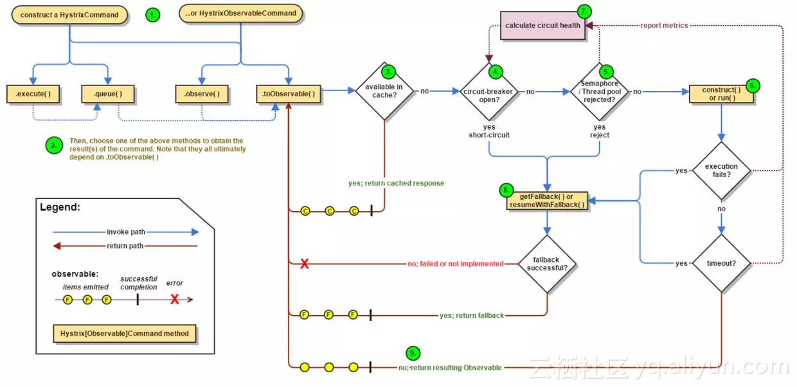
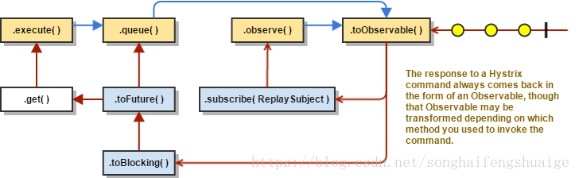

#### Hystrix源码解析

**工作流程**



1. 创建HystrixCommand或HystrixObservableCommand对象

首先创建一个HystrixCommand或者HystrixObservableCommand对象，用来表示对依赖服务的操作请求，同时传递所有需要的参数。

* HystrixCommand：用在依赖服务返回单个操作结果的时候
* HystrixObservableCommand：用在依赖的服务返回多个操作结果的时候。

2. 命令执行

* execute()：同步执行，从依赖的服务返回一个单一的结果对象，或是在发生错误时抛出异常。
* queue()：异步执行，返回一个Future对象，其中包括了服务执行结束时要返回的单一结果对象。

HystrixObservableCommand实现了另外两种执行方式

* observe()：返回Observable对象，它代表了操作的多个结果，它是一个Hot Observable。
* toObservable()：同样返回一个Observabled对象，也代表了操作的多个结果，它是一个Cold Observable。

在Hystrix的底层实现中大量的使用了RxJava，上面提到的Observabled对象就是RxJava的核心内容，可以把它理解为“事件源”或者“被观察者”，与其对应的就是Subscriber，“订阅者”或“观察者”

上面提到的Hot Observable，它不论“事件源”是否有“订阅者”，都会在创建后对事件进行发布，所以对于Hot Observable的“订阅者”都有可能从“事件源”的中途开始，可能看到整个操作的局部过程。Cold Observable则会等待有“订阅者”之后再发布事件。

3. 结果是否被缓存

如果当前命令的请求缓存功能是被开启的，并且该命令被缓存命中，那么缓存的结果会立即以Observable对象的形式返回回来。

4. 断路器是否打开

在命令结果没有缓存命中的时候，Hystrix在执行命令前会检查断路器是否为打开状态：

* 如果断路器是打开的，那么Hystrix不会执行命令，而是转到fallback处理逻辑
* 如果断路器是关闭的，那么Hystrix会跳到第5步，检查是否有可用的资源来执行命令。

5. 线程池／请求队列／信号量是否占满

如果命令相关的线程池和请求队列，或者信号量已经被占满，那么Hystrix不会执行命令，而是转到fallback处理逻辑。

6. HystrixObservableCommand.construct()或者HystrixCommand.run()

Hystrix会根据我们编写的方法来决定采取什么样的方式去请求依赖服务。

* HystrixCommand.run()：返回单一的结果，或者抛出异常
* HystrixObservableCommand.construct()：返回一个Observable对象来发射多个结果，或通过onError发送错误通知。

如果run()或者construct()方法的执行时间超过了命令设置的超时阀值，当前处理线程会抛出一个TimeoutException。在这种情况下，Hystrix会转接到fallback处理逻辑。

如果命令没有抛出异常并返回了结果，那么Hystrix会在记录一些日志并采集监控报告之后将该结果返回。在使用run的的情况下，Hystrix会返回一个Observable对象，它发射单个结果并产生onCompleted的结束通知；而construct()则直接返回Observable对象。

7. 计算断路器的健康程度

Hystrix会将“成功”、“失败”、“拒绝”、“超时”等信息报告给断路器，而断路器会维护一组计数器来统计这些数据。

熔断器会使用这些数据来决定是否要将断路器打开，来对某个依赖服务进的请求进行“熔断／短路”，直到恢复期结束。如果恢复期结束后，根据统计数据判断如果还是未达到健康指标，就再次“熔断／短路”。

8. fallback处理

当命令执行失败的时候，Hystrix会进入fallback尝试回退处理，我们通常也称该操作为“服务降级”。能够引起服务降级的情况有以下几种：

* 第4步，当前命令处于“熔断／短路”的状态，断路器是打开的时候。
* 第5步，当前命令的线程池、请求队列或者信号量被占满的时候。
* 第6步，HystrixObservableCommand.construct()或HystrixCommand.run()抛出异常

9. 返回成功的响应

当Hystrix命令执行成功后，它会将处理的结果直接返回或以Observable的形式返回。而具体以哪种方式返回，取决于第2步中我们提到的对命令的4种不同执行方式。



* toObservavle()：返回最原始的Observable，必须通过订阅它才会真正触发命令的执行流程。
* observe()：在toObservable()产生Observable之后立即订阅它，让命令能够马上开始异步执行，并返回一个Observable对象，当调用它的 subscribe时，将重新产生结果和通知给订阅者
* queue()方法：将toObservable()产生的原始Observable通过toBlocking()方法转换成BlockingObservable对象，并调用toFuture()方法返回异步的Future对象。
* execute()方法：在queue()方法产生异步结果Future对象后，通过调用get()方法阻塞并等待结果返回。

**断路器原理**

```java
public interface HystrixCircuitBreaker {
    boolean allowRequest();
    boolean isOpen();
    void markSuccess();
	static class NoOpCircuitBreaker implements HystrixCircuitBreaker{...}
    class Factory { ...}
    class HystrixCircuitBreakerImpl implements HystrixCircuitBreaker {...}
}    
```

* allowRequest()：每个Hystrix命令的请求都通过它判断是否被执行。
* isOpen()：当前断路器是否打开了。
* markSuccess()：用来关闭断路器
* NoOpCircuitBreaker：定义了一个什么什么都不做的断路器，它允许所有的请求，断路器始终关闭。
* 内部类Factory：在它内部维护了一个ConcurrentHashMap,其中String型key通过HystrixCommandKey定义，每一个Hystrix命令都需要一个key来标识，同时每一个Hystrix命令都在这个集合中找到它的HystrixCircuitBreaker实例
* HystrixCircuitBreakerImpl：它是HystrixCircuitBreaker的实现类，在这个类中定义了断路器的4个核心对象：

1. HystrixCommandProperties properties ：断路器HystrixCommand实例的属性对象。
2. HystrixCommandMetrics metrics：用来让HystrixCommand记录各类度量指标的对象。
3. AtomicLong circuitOpened：断路器打开或上一次打开时间
4. AtomicReference<Status> status :断路器是否打开，默认是关闭

HystrixCircuitBreakerImpl对HystrixCircuitBreaker接口各个方法的实现：

* isOpen()方法：判断断路器是否打开。首先根据配置对象properties中断路器的是否强制打开或关闭。如果强制打开，返回false，拒绝请求。如果强制关闭，返回true,允许所有的请求。最后如果断路器的打开的时间大于0，则返回true。

```
 public boolean isOpen() {
 	if (properties.circuitBreakerForceOpen().get()) {
        return true;
     }
     if (properties.circuitBreakerForceClosed().get()) {
         return false;
     }
     return circuitOpened.get() >= 0;
 }
```

* allowRequest：表示请求是否被允许。首先根据配置对象properties中断路器的是否强制打开或关闭。如果强制打开，返回false，拒绝请求。如果强制关闭，返回true,允许所有的请求。然后根据circuitOpened判断，如果它大于0，说明断路器已经打开了，返回true。最后先根据断路器的状态来判断，如果它的状态是HALF_OPEN返回false，然后如果当前时间大于断路时间＋休眠时间，则允许访问。

```java
 public boolean allowRequest() {
 	if (properties.circuitBreakerForceOpen().get()) {
        return false;
    }
    if (properties.circuitBreakerForceClosed().get()) {
        return true;
    }
    if (circuitOpened.get() == -1) {
        return true;
    } else {
        if (status.get().equals(Status.HALF_OPEN)) {
            return false;
         } else {
             return isAfterSleepWindow();
         }
    }
}

 private boolean isAfterSleepWindow() {
    //断路器打开时间
 	final long circuitOpenTime = circuitOpened.get();
     //当前系统时间
    final long currentTime = System.currentTimeMillis();
     //断路器休眠时间
    final long sleepWindowTime = properties.circuitBreakerSleepWindowInMilliseconds().get();
     //如果当前时间大于断路时间＋休眠时间，则允许访问
    return currentTime > circuitOpenTime + sleepWindowTime;
 }
```

* markSuccess()方法：该函数在“半开路”状态下使用。将打开的断路器关闭，并重置度量指标对象。

 ```java
public void markSuccess() {
    //设置断路器状态
	if (status.compareAndSet(Status.HALF_OPEN, Status.CLOSED)) {
        metrics.resetStream();
        Subscription previousSubscription = activeSubscription.get();
        if (previousSubscription != null) {
            previousSubscription.unsubscribe();
        }
        Subscription newSubscription = subscribeToStream();
        activeSubscription.set(newSubscription);
        circuitOpened.set(-1L);//将断路器的打开时间设置为－1
    }
}
 ```

