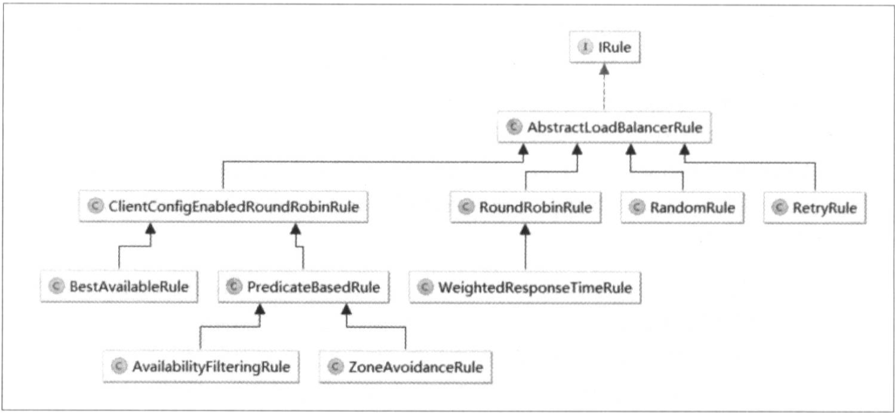

### 负载均衡策略

IRule接口的各个实现如下：



#### AbstractLoadBalancerRule

负载均衡策略的抽象类，在该抽象类中定义了负载均衡器ILoadBalancer对象，该对象能够在具体实现选择服务策略时，获取到一些负载均衡器中维护的信息来作为分配依据，并以此设计一些算法来实现针对特定场景的高效策略。

```java
public abstract class AbstractLoadBalancerRule implements IRule, IClientConfigAware {

    private ILoadBalancer lb;
        
    @Override
    public void setLoadBalancer(ILoadBalancer lb){
        this.lb = lb;
    }
    
    @Override
    public ILoadBalancer getLoadBalancer(){
        return lb;
    }      
}
```

### RandomRule

该策略实现了从服务实例清单中随机选择一个服务实例的功能。

```java
public Server choose(ILoadBalancer lb, Object key) {
        if (lb == null) {
            return null;
        }
        Server server = null;

        while (server == null) {
            //如果线程被中断，返回null
            if (Thread.interrupted()) {
                return null;
            }
            //可用的服务
            List<Server> upList = lb.getReachableServers();
            //所有的服务
            List<Server> allList = lb.getAllServers();
			//所有实例服务的数量
            int serverCount = allList.size();
            //没有服务，则返回空
            if (serverCount == 0) {
                return null;
            }
			//获取一个随机数
            int index = rand.nextInt(serverCount);
            //根据下标获取服务
            server = upList.get(index);

            if (server == null) {
               
                Thread.yield();
                continue;
            }

            if (server.isAlive()) {
                return (server);
            }

            // Shouldn't actually happen.. but must be transient or a bug.
            server = null;
            Thread.yield();
        }

        return server;

    }
```

#### RoundRobinRule

该策略实现了按照线性轮询的方式依次选择每个服务实例的功能。

```java
public Server choose(ILoadBalancer lb, Object key) {
        if (lb == null) {
            log.warn("no load balancer");
            return null;
        }
	
        Server server = null;
    	//该变量会在每次循环之后累计，如果一直选择不到server超过10次，那么就会结束尝试。
        int count = 0;
        while (server == null && count++ < 10) {
            //可用的服务
            List<Server> reachableServers = lb.getReachableServers();
            //所有的服务
            List<Server> allServers = lb.getAllServers();
            int upCount = reachableServers.size();
            int serverCount = allServers.size();

            if ((upCount == 0) || (serverCount == 0)) {
                log.warn("No up servers available from load balancer: " + lb);
                return null;
            }
			//获取服务下标，并设置下一次服务下标(累加)
            int nextServerIndex = incrementAndGetModulo(serverCount);
            server = allServers.get(nextServerIndex);

            if (server == null) {
                /* Transient. */
                Thread.yield();
                continue;
            }

            if (server.isAlive() && (server.isReadyToServe())) {
                return (server);
            }

            // Next.
            server = null;
        }

        if (count >= 10) {
            log.warn("No available alive servers after 10 tries from load balancer: "
                    + lb);
        }
        return server;
    }


//获取当前服务的下标，并设置获取下一次服务的下标
private int incrementAndGetModulo(int modulo) {
        for (;;) {
            int current = nextServerCyclicCounter.get();
            int next = (current + 1) % modulo;
            if (nextServerCyclicCounter.compareAndSet(current, next))
                return next;
        }
    }
```

#### RetryRule

该策略实现了一个具备重试机制的实例选择功能。在其内部定义了一个IRule对象，默认使用了RoundRobinRule实例。而在choose方法中则实现了对内部定义的策略进行反复尝试饿策略。若期间能够选择到具体的服务实例就返回，若选择不到就根据设置的尝试结束时间为阀值(maxRetryMillis参数定义的值＋choose方法开始执行的时间戳)，当超过该阀值就返回null。

```java
public Server choose(ILoadBalancer lb, Object key) {
    	//请求开始时间
		long requestTime = System.currentTimeMillis();
    	//重试截止时间
		long deadline = requestTime + maxRetryMillis;

		Server answer = null;
		//subRule默认是RoundRobinRule，线性获取服务
		answer = subRule.choose(key);
		//如果获取服务实例失败
		if (((answer == null) || (!answer.isAlive()))
				&& (System.currentTimeMillis() < deadline)) {
			//InterruptTask继承TimeTask，并且它里面有一个定时器Timer，时间一到，就会执行run方法，run方法里面执行线程中断，然后中断while循环
			InterruptTask task = new InterruptTask(deadline
					- System.currentTimeMillis());

			while (!Thread.interrupted()) {
                //不断重试获取服务实例
				answer = subRule.choose(key);

				if (((answer == null) || (!answer.isAlive()))
						&& (System.currentTimeMillis() < deadline)) {
					/* pause and retry hoping it's transient */
					Thread.yield();
				} else {
					break;
				}
			}
			//取消定时任务
			task.cancel();
		}

		if ((answer == null) || (!answer.isAlive())) {
			return null;
		} else {
			return answer;
		}
	}


public class InterruptTask extends TimerTask {
		
	static Timer timer = new Timer("InterruptTimer", true); 
		
		protected Thread target = null;

		public InterruptTask(long millis) {
				target = Thread.currentThread();
				timer.schedule(this, millis);
		}

		public void run() {
		if ((target != null) && (target.isAlive())) {
						target.interrupt();
				}
		}
}
```

#### WeightResponseTimeRule

该策略是对RoundRobinRule的扩展，增加了根据实例的运行情况来计算权重，并根据权重来选择实例。

* 定时任务

WeightResponseTimeRule策略在初始化的时候会通过serverWeightTimer.schedule(new DynamicServerWeightTask(), 0,        serverWeightTaskTimerInterval)启动一个定时任务，用来为每个服务实例计算权重，该任务默认30秒执行一次。

```java
class DynamicServerWeightTask extends TimerTask {
        public void run() {
            ServerWeight serverWeight = new ServerWeight();
            try {
                serverWeight.maintainWeights();
            } catch (Exception e) {
                logger.error("Error running DynamicServerWeightTask for {}", name, e);
            }
        }
    }


//权重计算
//存放权重
//private volatile List<Double> accumulatedWeights = new ArrayList<Double>();

class ServerWeight {

        public void maintainWeights() {
            ILoadBalancer lb = getLoadBalancer();
            if (lb == null) {
                return;
            }
          	//设置锁，防止重复计算  
            if (!serverWeightAssignmentInProgress.compareAndSet(false,  true))  {
                return; 
            }
            
            try {
                logger.info("Weight adjusting job started");
                
                AbstractLoadBalancer nlb = (AbstractLoadBalancer) lb;
                //服务实例快照
                LoadBalancerStats stats = nlb.getLoadBalancerStats();
                if (stats == null) {
                    // no statistics, nothing to do
                    return;
                }
                //计算所有实例的平均响应时间的总和
                double totalResponseTime = 0;
                // find maximal 95% response time
                for (Server server : nlb.getAllServers()) {
                    
                    //如果服务实例的状态快照不在缓存中，那么这里会进行自动加载
                    ServerStats ss = stats.getSingleServerStat(server);
                 //累加所有实例的平均响应时间   
                    totalResponseTime += ss.getResponseTimeAvg();
                }
                // weight for each server is (sum of responseTime of all servers - responseTime)
                // so that the longer the response time, the less the weight and the less likely to be chosen
                //逐个计算每个实例的权重：weightSoFar＋totalResponseTime－实例的平均响应时间
                Double weightSoFar = 0.0;
                
                // create new list and hot swap the reference
                List<Double> finalWeights = new ArrayList<Double>();
                for (Server server : nlb.getAllServers()) {
                    ServerStats ss = stats.getSingleServerStat(server);
                    double weight = totalResponseTime - ss.getResponseTimeAvg();
                    weightSoFar += weight;
                    finalWeights.add(weightSoFar);   
                }
                setWeights(finalWeights);
            } catch (Exception e) {
                logger.error("Error calculating server weights", e);
            } finally {
                serverWeightAssignmentInProgress.set(false);
            }

        }
    }
```

这个函数的实现主要分为两个步骤：

1. 根据LoadBalancerStats中记录的每个实例的统计信息，累加所有实例的平均响应时间，得到总平均响应时间totalResponseTime，该值会用于后续的计算。
2. 为负载均衡器中维护的实例清单逐个计算权重（从第一个开始），计算规则为：weightSoFar+totalResponseTime－实例的平均响应时间，其中weightSoFar初始化为零，并且每计算好一个权重就累加到weightSoFar上供下一次计算使用。

如假设有四个实例A、B、C、D，它们的平均响应时间为10，40，80，100，所以总响应时间是10+40+80+100=230，每个实例的权重为总响应时间与自身的平均响应时间的差的累积所得：

* 实例A：230 - 10 = 220
* 实例B：220+（230-40）＝ 410
* 实例C：410+（231-80） ＝ 560
* 实例D：560 ＋（230 －100） ＝ 690

需要注意的是这里的权重值不是代表各个实例权重区间的上限，并非某个实例的优先级，所以不是数值越大被选中的概率就越大。实际上，上面4个实例构建了4个不同的区间，每个实例的区间下限就是上一个实例的区间的上限，而每个实例的区间上限则是我们上面计算并存储于List  accumulatedWeights中的权重值，其中第一个实例的下限默认是零。

* 实例A：［0，220］
* 实例B：（220，410］
* 实例C：（410，560］
* 实例D：（560，690］

不难发现，实际上每个区间的宽度就是：总的平均响应时间－实例的平均响应时间，所以实例的平均响应时间越短，权重区间的宽度越大，而权重区间的宽度越大就被选中的概率就越高。

我们来看看WeightResponseTimeRule如何选择实例的：

```java
public Server choose(ILoadBalancer lb, Object key) {
        if (lb == null) {
            return null;
        }
        Server server = null;

        while (server == null) {
            // get hold of the current reference in case it is changed from the other thread
            //获取权重集合，防止其他线程修改集合
            List<Double> currentWeights = accumulatedWeights;
            if (Thread.interrupted()) {
                return null;
            }
            //获取所有实例
            List<Server> allList = lb.getAllServers();

            int serverCount = allList.size();

            if (serverCount == 0) {
                return null;
            }

            int serverIndex = 0;

            // last one in the list is the sum of all weights
            //获取最后一个权重（最大的权重值）
            double maxTotalWeight = currentWeights.size() == 0 ? 0 : currentWeights.get(currentWeights.size() - 1); 
            // No server has been hit yet and total weight is not initialized
            // fallback to use round robin
            //如果最后一个实例的权重值小于0.0001，则采用父类实现的线性轮询策略
            if (maxTotalWeight < 0.001d || serverCount != currentWeights.size()) {
                server =  super.choose(getLoadBalancer(), key);
                if(server == null) {
                    return server;
                }
            } else {
                // generate a random weight between 0 (inclusive) to maxTotalWeight (exclusive)
                //获取一个随机数
                double randomWeight = random.nextDouble() * maxTotalWeight;
                // pick the server index based on the randomIndex
                int n = 0;
                for (Double d : currentWeights) {
                    if (d >= randomWeight) {
                        serverIndex = n;
                        break;
                    } else {
                        n++;
                    }
                }

                server = allList.get(serverIndex);
            }

            if (server == null) {
                /* Transient. */
                Thread.yield();
                continue;
            }

            if (server.isAlive()) {
                return (server);
            }

            // Next.
            server = null;
        }
        return server;
    }
```

* 生成一个[0,最大权重值]区间内的随机数
* 遍历权重列表，比较权重值与随机数的大小，如果权重值大于等于随机数，就拿当前权重列表的索引值去服务实例列表中获取具体的实例。


#### ClientConfigEnabledRoundRobinRule

该策略比较特殊，我们一般不直接使用它。因为它本身没有什么特别的逻辑，只是在内部定义了一个RoundRobinRule策略，而choose函数的实现也正是使用了RoundRobinRule的线性轮询机制。

虽然我们不会直接使用该策略，但是通过继承该策略，默认的choose就实现来线性轮询策略，在子类中做一些高级策略时，通常有可能会存在一些无法实施的情况，那么就可以用父类的实现作为备选。

```java
RoundRobinRule roundRobinRule = new RoundRobinRule();
public Server choose(Object key) {
        if (roundRobinRule != null) {
            return roundRobinRule.choose(key);
        } else {
            throw new IllegalArgumentException(
                    "This class has not been initialized with the RoundRobinRule class");
        }
    }
```


#### BestAvailableRule

该策略继承自ClientConfigEnabledRoundRobinRule，在实现中它注入了负载均衡器的统计对象LoadBalancerStats，同时在具体的choose算法中利用LoadBalancerStats保存的实例统计信息来选择满足要求的实例。

```java
public Server choose(Object key) {
        if (loadBalancerStats == null) {
            return super.choose(key);
        }
    //获取所有的服务实例
        List<Server> serverList = getLoadBalancer().getAllServers();
    	
        int minimalConcurrentConnections = Integer.MAX_VALUE;
        long currentTime = System.currentTimeMillis();
        Server chosen = null;
        for (Server server: serverList) {
            
            ServerStats serverStats = loadBalancerStats.getSingleServerStat(server);
            if (!serverStats.isCircuitBreakerTripped(currentTime)) {
                //当前请求连接数
                int concurrentConnections = serverStats.getActiveRequestsCount(currentTime);
                //查询连接数最少的服务实例(最空闲的)
                if (concurrentConnections < minimalConcurrentConnections) {
                    minimalConcurrentConnections = concurrentConnections;
                    chosen = server;
                }
            }
        }
        if (chosen == null) {
            return super.choose(key);
        } else {
            return chosen;
        }
    }
```

如上代码，它通过遍历负载均衡器中维护的所有服务实例，会过滤掉故障的实例，并找出并发数最小的一个，所以该策略的特性是选出最空闲的实例。


#### PredicateBasedRule

这是一个抽象策略，它也继承了ClientConfigEnabledRoundRobinRule，从其命名中可以看出这是一个基于Predicate实现的策略。Predicate是Google Guava Collection工具对集合进行过滤的条件接口。

```java
//抽象方法，由子类来实现Predicate逻辑过滤一部分服务
public abstract AbstractServerPredicate getPredicate();
        
    
    @Override
    public Server choose(Object key) {
        ILoadBalancer lb = getLoadBalancer();
        //chooseRoundRobinAfterFiltering，先由子类实现的Predicate逻辑过滤一部分服务，再以线性轮询的方式从过滤后的实例清单中选出一个
        Optional<Server> server = getPredicate().chooseRoundRobinAfterFiltering(lb.getAllServers(), key);
        if (server.isPresent()) {
            return server.get();
        } else {
            return null;
        }       
    }
```

如下是chooseRoundRobinAfterFiltering的逻辑

```java
public Optional<Server> chooseRoundRobinAfterFiltering(List<Server> servers, Object loadBalancerKey) {
        List<Server> eligible = getEligibleServers(servers, loadBalancerKey);
        if (eligible.size() == 0) {
            return Optional.absent();
        }
    //线性轮询获取实例
        return Optional.of(eligible.get(incrementAndGetModulo(eligible.size())));
    }

public List<Server> getEligibleServers(List<Server> servers, Object loadBalancerKey) {
        if (loadBalancerKey == null) {
            return ImmutableList.copyOf(Iterables.filter(servers, this.getServerOnlyPredicate()));            
        } else {
            List<Server> results = Lists.newArrayList();
            for (Server server: servers) {
                //apply方法由子类实现，过滤一部分服务
                if (this.apply(new PredicateKey(loadBalancerKey, server))) {
                    results.add(server);
                }
            }
            return results;            
        }
    }
```


### AvailabilityFilteringRule

该策略继承自上面介绍的抽象策略PredicateBaseRule，所以它也继承了“先过滤清单，再轮询选择”的基本处理逻辑，其中过滤条件使用了AvailabilityPredicate：

```java
public boolean apply(@Nullable PredicateKey input) {
        LoadBalancerStats stats = getLBStats();
        if (stats == null) {
            return true;
        }
        return !shouldSkipServer(stats.getSingleServerStat(input.getServer()));
    }


private boolean shouldSkipServer(ServerStats stats){
    //是否故障，即断路器是否生效已断开
    //实例的并发请求数大于阀值
        if ((CIRCUIT_BREAKER_FILTERING.get() && stats.isCircuitBreakerTripped()) 
                || stats.getActiveRequestsCount() >= activeConnectionsLimit.get()) {
            return true;
        }
        return false;
    }
```

上述代码主要判断服务实例的两项内容：

* 是否故障，即断路器是否生效已经断开
* 实例的并发请求数大于阀值，默认值为2^32-1，该配置可通过参数<clientName>.<nameSpace>.ActiveConnectionsLimit来修改。

这两项内容中只要有一个满足apply就返回false，代表该节点可能存在故障或者负载过高，都不满足就返回true。

在这个策略中，对于choose的策略也做了一些改进，所以父类的实现对于它来说只是一个备用选项：

```java
public Server choose(Object key) {
        int count = 0;
        Server server = roundRobinRule.choose(key);
        while (count++ <= 10) {
            if (predicate.apply(new PredicateKey(server))) {
                return server;
            }
            server = roundRobinRule.choose(key);
        }
        return super.choose(key);
    }
```

从上面代码可以看到，它先以线性的方式选择一个实例，接着用过滤条件来判断该实例是否满足要求，若满足就直接使用该实例，若不满足要求就再选择下一个实例，并检查是否满足要求，如此循环，当这个过程重复里10次还是没有找到符合要求的实例，就采用父类的实现方案。


#### ZoneAvoidanceRule

从下面的ZoneAvoidanceRule的源码片段可以看到，它使用了CompositePredicate来进行服务实例清单的过滤。这是一个组合过滤清单，在其构造函数中，它以ZoneAvoidancePredicate为主过滤条件，AvailabilityPredicate为次过滤条件。

```java
private CompositePredicate compositePredicate;

public ZoneAvoidanceRule() {
        super();
        ZoneAvoidancePredicate zonePredicate = new ZoneAvoidancePredicate(this);
        AvailabilityPredicate availabilityPredicate = new AvailabilityPredicate(this);
        compositePredicate = createCompositePredicate(zonePredicate, availabilityPredicate);
    }
    
private CompositePredicate createCompositePredicate(ZoneAvoidancePredicate p1, AvailabilityPredicate p2) {
        return CompositePredicate.withPredicates(p1, p2)
                             .addFallbackPredicate(p2)                           .addFallbackPredicate(AbstractServerPredicate.alwaysTrue())
                             .build();
        
    }
```

从CompositePredicate的源码片段中，我们可以看到它定义了一个主过滤条件AbstractServerPredicate delegate，以及一组次过滤条件列表List fallbacks，所以它的次过滤条件是可以拥有多个的，并且次过滤条件是按照顺序执行的。

```java
public class CompositePredicate extends AbstractServerPredicate {
	private AbstractServerPredicate delegate;
    
    private List<AbstractServerPredicate> fallbacks = Lists.newArrayList();
        
    private int minimalFilteredServers = 1;
    
    private float minimalFilteredPercentage = 0; 
}
//主过滤
@Override
public boolean apply(@Nullable PredicateKey input) {
        return delegate.apply(input);
}

public List<Server> getEligibleServers(List<Server> servers, Object loadBalancerKey) {
    //调用父类的getEligibleServers方法会间接调用子类的apply方法，对所有实例进行过滤
        List<Server> result = super.getEligibleServers(servers, loadBalancerKey);
        Iterator<AbstractServerPredicate> i = fallbacks.iterator();
        while (!(result.size() >= minimalFilteredServers && result.size() > (int) (servers.size() * minimalFilteredPercentage))
                && i.hasNext()) {
            AbstractServerPredicate predicate = i.next();
            //使用次过滤条件对服务实例进行过滤
            result = predicate.getEligibleServers(servers, loadBalancerKey);
        }
        return result;
    }
```

在getEligibleServers方法中的实现逻辑如下：

* 使用主过滤条件对所有的实例过滤并返回过滤后的实例清单

* 依次使用次过滤条件列表中的过滤条件对主过滤条件的结果进行过滤。

* 每次过滤之后，都需要判断下面两个条件，只要有一个符合就不再进行过滤，将当前结果返回，供线性轮询算法选择：

  1、过滤后的实例总数 >= 最小过滤实例数（minimalFilteredServers,默认是1）

  2、 过滤后的实例比例 > 最小过滤百分比（minimalFilteredPercentage，默认是0）


* ​