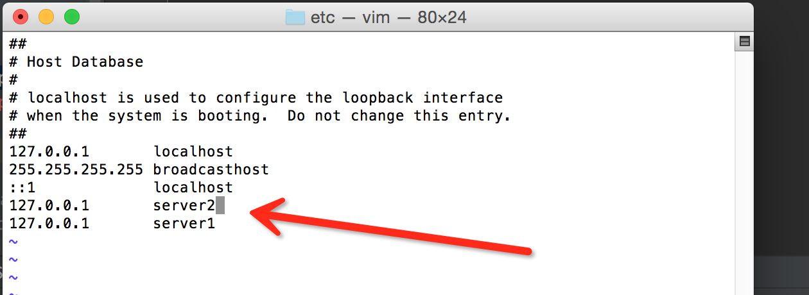
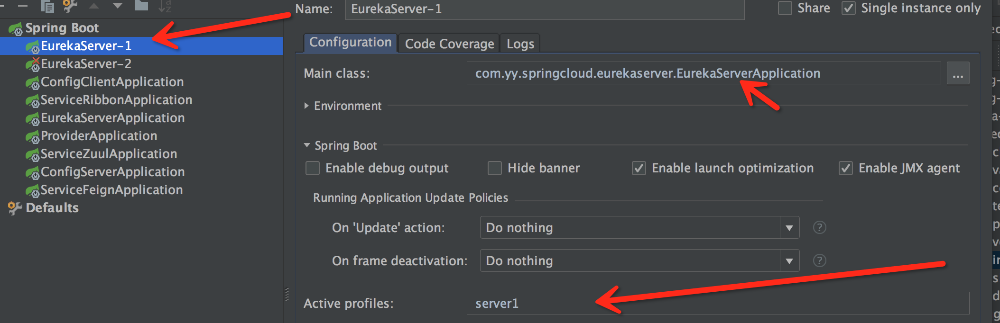
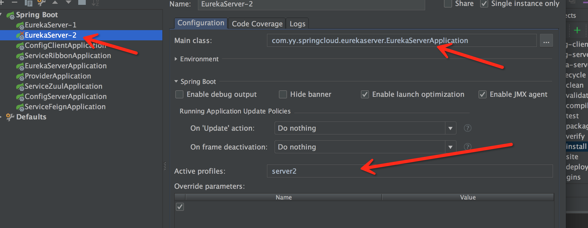
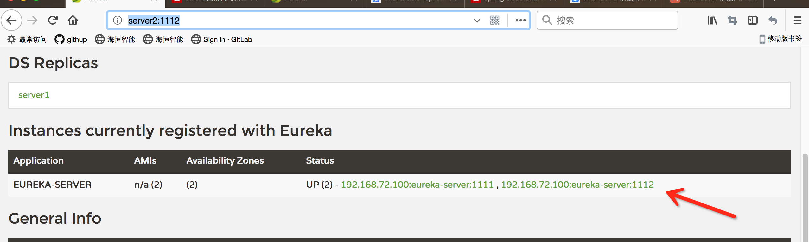

### 配置高可用注册中心

配置高可用注册中心，在[eureka-server](https://github.com/yongyanGit/springclouddemo)基础上进行修改，并且采用一个项目启动两个服务。

1. 在eureka-server项目中添加：application-server1.properties、application-server2.properties两个配置文件。

* application-server1.properties文件内容如下：

```
spring.application.name=eureka-server
server.port=1111
eureka.instance.hostname=server1
eureka.client.service-url.defaultZone=http://server2:1112/eureka/
```

* application-server2.properties文件内容如下：

```
spring.application.name=eureka-server
server.port=1112
eureka.instance.hostname=peer2
eureka.client.service-url.defaultZone=http://server1:1111/eureka/
```


* 在本地文件中的host文件中配置server1、server2ip地址映射




2. 通过idea来启动服务，在项目启动时分别向对方注册服务。Active profiles指定启动服务时，加载哪个配置文件。

* 启动eureka-server1服务，



* 启动eureka-server1服务




3. 正常启动服务后，登陆控制台可以看到两个服务已经成功注册。




**注意：**

如果在application配置文件中配置了禁止向自身注册服务，需要将这些配置信息注释掉，否则应用无法正常注册。

```
＃eureka.client.register-with-eureka=false
＃eureka.client.fetch-registry=false
```
