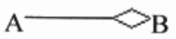

#### 关联关系

关联关系是用一条直线表示：

关联关系描述了某个对象在一段时间内一直知道另一个对象的存在。例如A对象保存了B对象的ID，因此A对象“知道”B对象的存在。

在有些软件中(Rose)，区分了单向和双向，一条直线表示相互"知道"，而用一条带箭头的直线来表示单向“知道”。如：

说明A“知道”B，而B"不知道"A。

#### 依赖关系

依赖关系是用一条带箭头的虚线表示，如A—————>B(A依赖于B)。它描述一个对象的修改会导致一个对象的修改这样的关系。

举例来说，A对象保存了B对象的ID，但A对象对B对象没有操作，这时A仅仅是“知道”B对象，应当用关联关系；如果A对象使用了B对象的属性或者方法，则B的修改会导致A的修改，那么这时A依赖于B。

通常我们应该保存单向依赖，杜绝双向依赖关系的产生。

#### 扩展关系（extends）

拓展关系是用一条带箭头的虚线加版型<<extends>>来表示的，如：

表示A扩展出B。它特别用于在用例模型中说明向基本用例中的某个扩展点插入扩展用例。扩展用例不是必须的，并且必须依赖基本用例。

比如：在打电话时，如果在通话过程中收到另一个呼叫，我们可以将当前通话保留而接听另一个通话。在这个场景中，保留通话用例就是打电话用例的一个扩展用例。我们可以看到，是否需要保留通话取决于打电话人的决定，而不是必需，也不影响打电话的完整性。但是如果没有之前的打电话用例，也就不可能单独启动所谓的保留通话用例了。

#### 包含关系（include）

包含关系是用一条带箭头的虚线加版型<<include>>来表示，如

A包含B。基本用例可控制与包含用例的关系，并可依赖于执行包含用例所得的结果，但基本用例和包含用例都不能访问对方的属性。包含用例是通过分析业务用例场景而抽象出关键的必选的核心业务而形成的，它代表可在各种不同基本用例中复用的行为。

与扩展用例不同的是，包含用例表示的是“必需”而不是“可选”，这意味着如果没有包含用例，基本用例是不完整的，同时没有基本用例，包含用例是不可能单独存在的。

比如，去银行办理业务，不论是取钱、转账还是修改密码，我们都需要先核对账号和密码，因此可以将核对账号作为上述业务用例的共有行为提取出来，行成一个包含用例。我们可以看到这个包含用例带有复用的意义，并且不可缺少的。

#### 实现关系（realize)

实现关系是用一条带空心箭头的虚线表示的，

A实现B。它特别用于在用例模型中连接用例和用例实现，说明基本用例的一个实现方式。基本用例描述了一个业务目标，但是该业务目标有多种可能的实现途径，每个实现途径都实现了基本用例的业务目标。

以缴纳电话费业务作为例子，可以看到，缴纳电话费是一个业务目标，其实现途径可能有营业厅交费、银行交费、预存话费等，每一个用例都是同一业务目标的不同实现过程。

#### 精化关系

精华关系是用一条带箭头的虚线加版型<<refine>>来表示的，

A精化了B。它特别用于用例模型，一个基本用例可以分解出许多更小的关键精化用例，这些更小的精华用例更细致地展示了基本用例的核心业务。精华关系用来连接基本用例和精化用例，说明精化用例是由基本用例精华得来的。

与泛化关系不同的是，精化关系表示由基本对象可以分解更明确、精细的子对象，这些子对象并没有增加、减少、改变基本对象的行为和属性，仅仅是更加细致和明确化了。泛化关系中，基本对象被泛化成子对象后，子对象继承了基本对象的所有特征，并且子对象可以增加、改变基本对象的行为和属性。 

精化仅仅用于建模阶段，在实现语言中是没有精化这一语义。泛化则等同于实现语言中的继承语义。

例子，比如预存话费业务被精化成了开立账户、存入现金、转账、支付划帐四个核心的概念用例，这些概念用例合在一起就满足了实现业务目标的所有关键过程。

#### 泛化关系（generalization)

泛化关系是用一条带空心箭头的直线表示的，

A继承自B。泛化关系可用于建模过程中的任意一个阶段，说明两个对象之间的继承关系。

#### 聚合关系（aggregation)

聚合关系是用一条带空心菱形箭头的直线表示，

A聚合到B上，或B由A组成。聚合关系用于类图，特别用于表示实体对象之间的关系，表达整体由部分构成的语义。例如一个部门由许多人员构成。

与组合关系不同的是，整体和部分不是强依赖的，即使整体不存在了，部分仍然存在，例如部门撤销后，人员不会因此而消失，它们依然存在。

#### 组合关系

组合关系是用一条带实心菱形的直线组成

A组合成B，或者B由A构成。组合关系用于类图，特别用于表示实体对象关系，表达整体拥有部分的语义。例如母公司拥有许多子公司。

组合关系是一种强依赖的特殊聚合关系，如果整体不存在了，则部分也将消亡。例如母公司解体，子公司也将不再存在。

