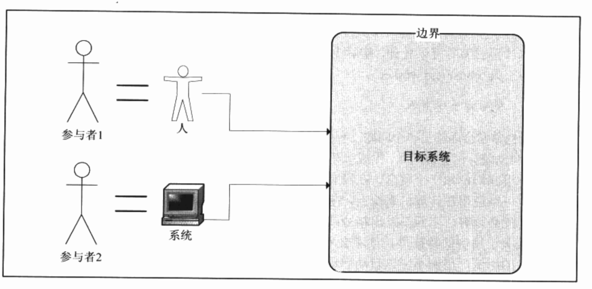
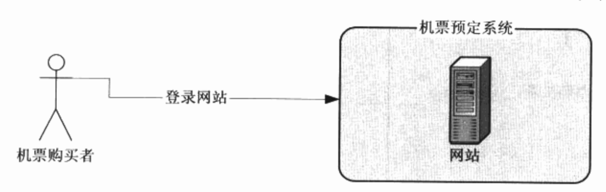
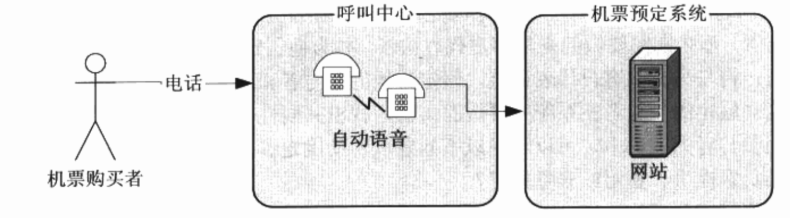
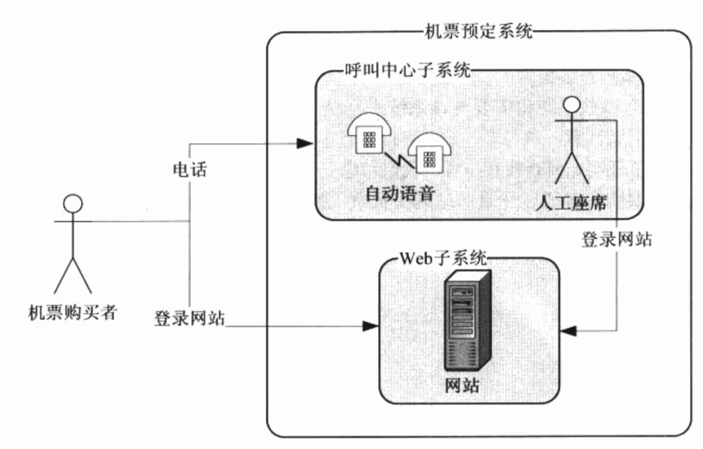

##UML核心元素

版型(类型、构造型)：是对一个UML元素基础定义的扩展，在同一个元素基础定义的基础上赋予别的含义，使得这个元素适合用于特定的场合。如：接口、边界类、控制类等都是类的版型。

### 参与者

参与者在建模过程中是处于核心地位的，是在系统之外与系统交互的某人或某物。系统之外的定义说明在参与者和系统之间有一个明确的边界，参与者只能存在于边界之外，边界之内的所有人和事物都不是参与者。

**如何确定边界**

* 谁对系统有着明确的目标和要求并且主动发出动作。
* 系统为谁服务。

场景：小王到银行取开户，向大厅经理询问了办理手续，填写了表单，交给柜台职员，拿到了银行存折。

在这个场景中，小王是参与者，主动发起了开户请求；而大厅经理和柜台职员所代表的银行是为小王服务的。因此确定了小王在边界外，大厅经理和柜台职员在系统边界内。

**如何发现参与者**

一般是与这个系统相关的且直接对系统发出动作的**人或事**。如果这无法确定参与者，这个时候需要与客户进行访谈，列出要做的事情，找出共性，在与客户进行确定。

场景一：机票购买者通过登录网站购买机票，那么机票购买者就是参与者。

场景二：机票购买者通过呼叫中心的自动语音预定机票，那么呼叫中心是机票预定系统的一个参与者，而机票购买者是呼叫中心的参与者。

场景三：如果扩大系统边界，让呼叫中心成为机票预定系统的一个子系统，那么机票购买者就是参与者。

查找参与者的判断依据：

* 谁负责提供、使用或删除信息。
* 谁将使用此功能。
* 谁对某个功能感兴趣。
* 在组织中的什么地方使用系统。
* 系统有哪些外部资源。
* 其他还有哪些系统将需要与该系统进行交互。

### 用例

