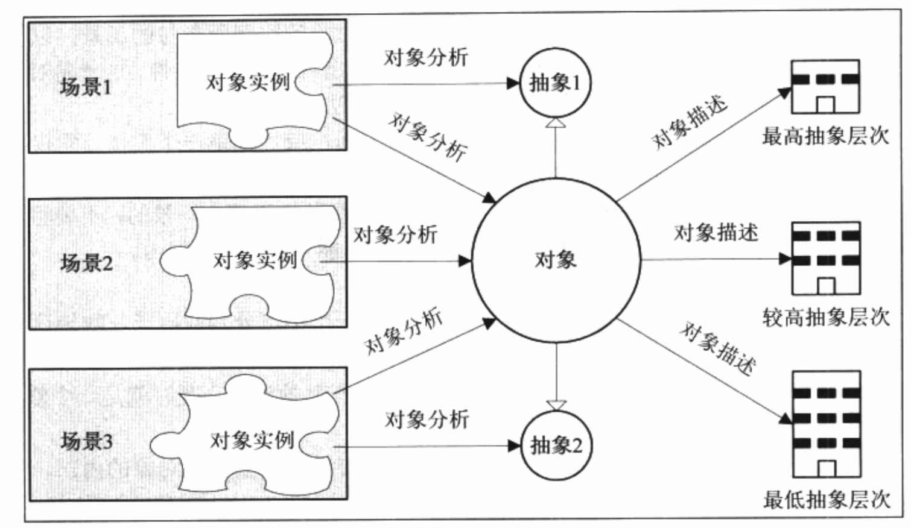

### 建模

简单地说：建模包含两个问题：一个是怎么建？另一个是模是什么？

当你试图为现实世界建模时，首先要决定的是抽象角度，即建立这个模型的目的是什么。一旦抽象角度确定，剩下的事情就变得顺理成章，不再杂乱无章。如下例子：

```
请在30秒内说出尽可能多的筷子、勺子和盘子的相同点不同点。
```

我们拿到上面这个问题，开始就会觉得不知道从哪里回答，也不知道答的是否准确。如果加一个条件，请在30秒内在**使用上**筷子、勺子和盘子有什么相同点和不同点。当我们加上一个**角度**后，这个问题就很简单了，比如相同点：都是用餐工具；不同点：筷子用来夹的、勺子是用来舀的、盘子是用来盛的。或者从使用方式角度来看，相同点都是需要用手来拿，不同点是手的动作不同。

**抽象角度的不同决定了建模方向的不同。在抽象角度确定后，你会在不知不觉中为这三个事物建立模型，并据此来得出相同点和不同点**。

因此做需求的时候，首要目标不是要弄清业务是如何一步一步完成的，而是要弄清楚有多少业务的参与者？每个参与者的目标是什么？参与者的目标就是抽象角度。与分析一个复杂的业务流程相比，单独分析参与者的一个个目的要简单得多。实际上这就是用例。

第二个问题就是：模是什么？

一旦确定了抽象角度，就确定了一个目标。现在，要做的事情就是找出那些能满足这一目标的**事物**。

找出目标事物是面向过程而不是面向对象，因为要达到一个目标，就必须要有**动作**附加在**事物**上，并产生一定的效果。这样一来，我们必须搞清楚**谁**发出了什么**动作**，产生了怎样的**后果**。但是与面向过程方法不同的是，我们描述这个过程化的场景并不是最终目的，而是为了找出场景中贡献于场景目标的那些**事物**，以及这些**事物是如何贡献于**这个场景的。

建模公式：


### 用例驱动

回顾建模公式，容易得出一个结论，要解决问题领域就要归纳出所有必要的抽象角度(用例)，为这些用例描述出可能的特定场景，并找到实现这些场景的事物、规则和行为。换个说法，如果我们找到的那些事物、规则和行为实现了所有必要的用例，那么问题领域就被解决了。这就是用例驱动方法的原理。

### 抽象层次

>  抽象层次越高表达能力越丰富，越容易理解。

越具体的事物容易理解这个说法是一种误解，因为人们所认识的事物概念都是抽象的，具象只是一个相对的概念。

举一个长度的例子：天文学所用的光年相对于米、公里这些常见单位的概念更抽象，但是如果说太阳系距离银河系中心大约有27000光年，就比说这个距离是255439722759681600000米更容易理解，这个是因为这个数字太大超过人们可以通过对比来理解的地步了。

实际上，由于人脑对信息的处理能力是有限度的，如果信息量超过了人脑的处理能力，人就会失去对这个事物的理解能力。因此，越是具体的表达信息量越大，越接近人脑的处理极限，人们的理解能力越是下降。但是如果抽象层次太高，信息量过少，人们实施起来又会产生新的困难—信息量不足。

抽象有两种方法：自顶向下，另一种是自底向上。

* 自顶向下：自顶向下，适用于让人们从头开始认识一个事物。例如介绍汽车原理时，从发动机、发动装置、变速器等较高层次的抽象概念来讲就比较容易明白。如果降一个层次，从发动机原理讲起，一大部分人就开始迷惑了；再降一个层次，从热力学原理和力学原理讲起，那就更没人能搞懂汽车是怎么工作的了。
* 自底向上适用于在实践中改进和提高认识。例如在实践中发现发动机的问题，因而改进发动机结构，甚至采用新的发动机原理。

### 视图

视图是UML建模中另一个非常重要的概念。视图用于组织UML元素，表达出模型某一方面的含义。视图的准确应用是建立好模型的一个重要组成部分。**建模最主要的工作就是为软件绘制那些表达软件含义的视图来完整地表达软件的含义**。

现实生活中事物都有很多种不同的**属性**，每个属性能够表达事物的一部分。人们认识一个事物的时候，只有了解很多这个事物的属性后才能对这个事物真正理解。如：一辆汽车，人们需要了解它的大小、重量、外观、性能、安全等才会决定是否购买它。

每个属性都是这个事物的一个视图，每个视图都向观察者展示了目标对象的一个方面，只有将必要的方面都用视图展示出来，观察者才会真正理解这个事物。

很多时候，仅仅给出所有属性的视图是并不足够的，观察者会抱怨视图表达的信息不是很清晰，希望从更多视角来查看事物的信息—**视角**。

视角是人们观察事物的角度。不同人或者同一个人出于不同的目的会对同一个信息从不同的视角来审视和评估。对于同一个视角，在不同的视角展示了同样信息的不同认知角度以便于理解。例如汽车的外观属性，人们有时候从前面看汽车的前脸长什么样，有时候从侧面看车身流线长什么样，有时候从后面看尾箱长什么样。每一个不同的观察角度都展示了整体信息的一个部分，这个部分也满足了观察者的某一个审视要求。

一方面，从信息的展示角度来说，恰当的视角可以让观察者更容易抓住信息的本质；另一方面，从观察者角度说，观察者只会关心信息中他关心的那一部分视角，其他信息对他没有多少用处。

**因此建模的另一项重要工作就是为不同的干系人展示他们所关心的那部分视角**。

### 对象分析方法

* 一切都是对象。一切有名字的东西都是对象，都应该用对象的观点来看待它、分析它。
* 对象都是独立的。对象与对象之间是独立的，只是在某个特定的场景下，它们的某一个特定的实例才会联系在一起。


* 对象都具有原子性。在分析过程中都应该将对象视为一个不可分割的原子。
* 对象是可以抽象的。对象有着很多不同的属性。一般来说，对象参与一个场景时会展现出某一个方面。
* 对象是具有层次性。对象是有着抽象层次的。层次越高，其描述越策略但适应能力越广；层次越低则描述越精确但适应能力越下降。




