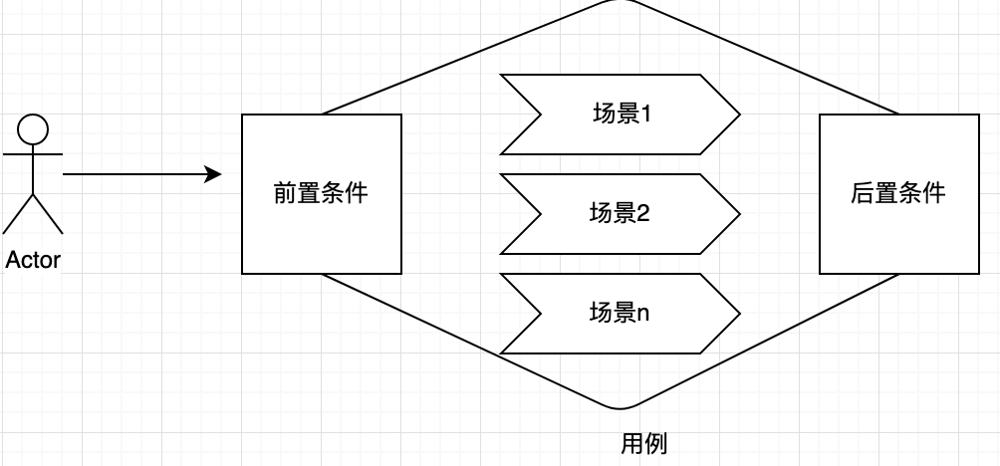
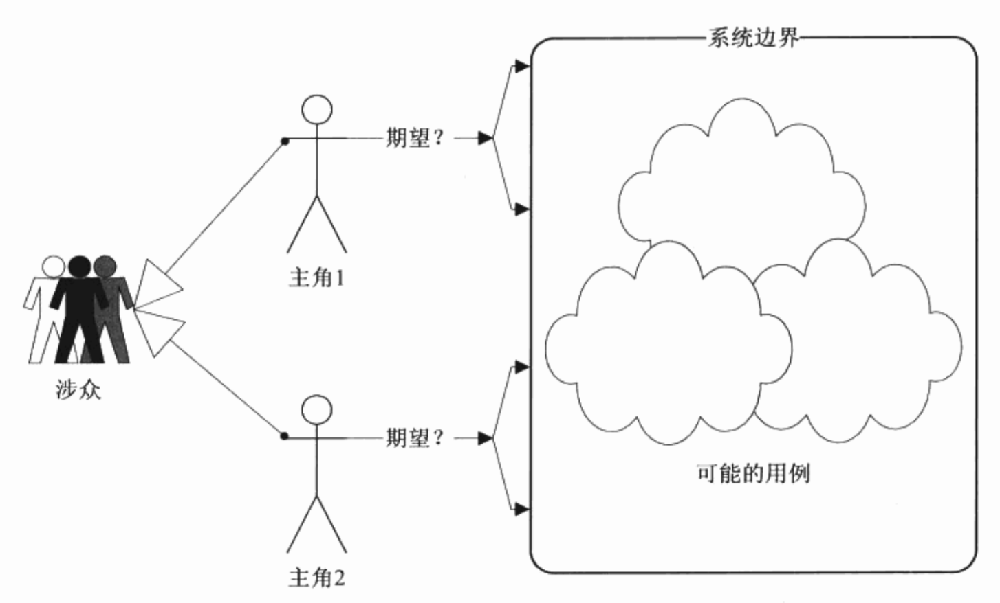

#### 基本概念

**一个用例就是与参与者交互的，并且给参与者提供可观测的有意义的结果的一系列活动的集合**。

所谓的用例就是一件事，要完成这件事情，需要做一系列的活动；而做一件事情可以有很多不同的办法和步骤，也可能会遇到各种各样的意外情况，因此这件事情是由很多不同情况的集合构成的，在UML中称为用例场景。一个场景就是一个**用例的实例**。

例如你想做一顿饭，你需要完成煮饭和炒菜两件事，这两件事情就是两个用例。而煮饭这件事可以 有不同的做法，你可以用电饭煲做，也可以用蒸笼，这就是两种不同的场景，也就是两个实例。

要启动用例是由条件的，要做饭，首先得要有米。这是启动用例的前提，也称为前置条件；用例执行完成，会有一个结果，米变成了饭。这个称为后置条件。

综上，**一个完整的用例定义由参与者、前置条件、场景、后置条件构成**。

一个系统的功能性是由一些对系统有愿望的参与者要做的一些事情构成的，事情完成后就达到了参与者的一个愿望，当全部参与者的所有愿望都能够通过用例来达到，那么这个系统就被确定下来了。捕捉功能性需求，这就是用例的作用。

#### 用例的特征

* 用例是相对独立的。

用例不需要与其他用例交互而独立完成参与者的目的。

* 用例的执行结果对参与者来说是可观测的和有意义的。

例如，一个后台日志功能，虽然它是系统的必须组成部分，但它在需求阶段却不应该作为用例出现，因为后台进程对参与者是不可观测的。还有用户登陆网站，登入系统是一个有效的用例，但是单独输入密码却没有意义的，输入完了有什么结果。

* 这件事必须由一个参与者发起的，参与者的愿望是这个用例存在的原因。例如人从ATM取钱是一个有效的用例。ATM吐钞却不是。
* 用例必然是以动宾短语形式出现的。人喝水是一个有效的用例，而“喝”喝“水”却不是。
* 一个用例就是一个需求单元、分析单元、设计单元、开发单元、测试单元，甚至部署单元。

一旦决定了用例，软件开发工作的其他活动都以这个用例为基础，围绕着它进行。

#### 用例的粒度

在项目过程中根据阶段不同，使用不同的粒度。

在**业务建模阶段**，用例的粒度以每个用例能够说明一件完整的事情为宜。即一个用例可以描述一项完整的业务流程。如，取钱、借书等表达完整业务的用例，而不要细到验证密码、填写申报单、查找书目。

在用例分析阶段，即**概念建模阶段**，用例的粒度以每个用例能描述一个完整的事件流为宜。可以理解为i 一个用例描述一项完整业务中的一个步骤。例如，宽带业务需求中有申请报装和申请迁移地址用例，在用例分析时，可归纳和分解为提供申请资料、受理业务、现场安装等多个概念用例。

在系统建模阶段，用例视角是针对计算机的，因此用例的粒度以一个用例能够描述操作者与计算机的一次完整交互为宜。例如。填写申请单、审核申请单、派发任务单等。可以理解为一个操作界面或一个页面流。一般项目计划要依据系统模型编写，因此另一个可参考的粒度是一个用例的开发工作量在一周左右为宜。

实际上，用例的划分依据最标准的方法是以该用例是否完成了参与者的某个完整目的为依据的。如某人去图书馆，查询了书目，出示了借书证。图书管理员查询了该人以前的借阅记录确保没有未归还的书，最后借到了书。这个例子中有许多步骤，但是它只有一个目的，就是借书。用例分析是以参与者为中心，其他都是为了完成这个目的的过程。

不论粒度如何选择，必须把握的原则是在同一个需求阶段，所有用例的粒度应该是同个量级的。

#### 用例的获得

在准备发现用例之前，我们需要清楚的理解下面几个问题：

* 主角是位于系统边界外的。
* 主角对系统有着明确的期望和明确的回报要求。
* 主角的期望和回报要求在边界之内。

接下来，可以对业务代表进行访谈，让他从自己的本职工作出发来谈谈他的期望：

* 您对系统有什么期望？
* 您打算在这个系统里做些什么事情？
* 您做这件事的目的是什么？
* 您做完这件事希望有一个什么样的结果？

简单地用笔和纸记录下业务代表的访谈结果，从结果中找出用例。

通常客户不会有条理分层次地把他对系统的期望表达出来，或者只是他工作的一个步骤，比如我先做什么...，然后做…，最后做…，你需要从冗长的谈话中为客户总结出他的真实目标。另外客户对系统的期望也不一定是有效的事件，如客户会说我期望界面能漂亮一些，你需要告诉客户他的期望是一件可以做的事情，而不是一个主观愿望。总之，你应当确保：

* 一个明确的有效的目标才是一个用例的来源。
* 一个真实的目标应当完备地表达主观的期望。
* 一个有效的目标应当在系统边界内，由主角发动，并具有明确的后果。

当我们发现业务总是不清楚时，那么应当考虑重新进行访谈，在重新开始访谈前，你应该考虑调整以下策略：

* 调整系统边界和主角。
* 扩大或缩小系统边界。
* 变更主角。
* 然后，重新开始。

